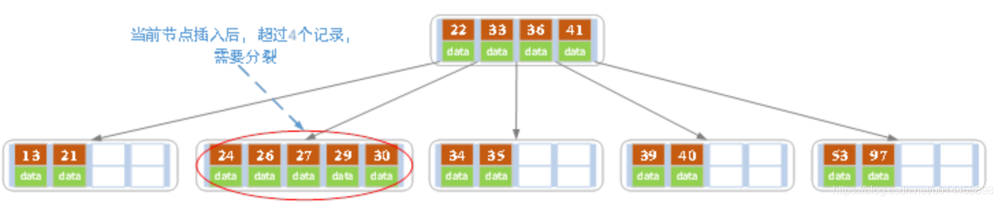

---

* [https://blog.csdn.net/u014453898/article/details/112469113?ops_request_misc=%257B%2522request%255Fid%2522%253A%2522166651727716800186558581%2522%252C%2522scm%2522%253A%252220140713.130102334.pc%255Fall.%2522%257D&amp;request_id=166651727716800186558581&amp;biz_id=0&amp;utm_medium=distribute.pc_search_result.none-task-blog-2](https://blog.csdn.net/u014453898/article/details/112469113?ops_request_misc=%257B%2522request%255Fid%2522%253A%2522166651727716800186558581%2522%252C%2522scm%2522%253A%252220140713.130102334.pc%255Fall.%2522%257D&request_id=166651727716800186558581&biz_id=0&utm_medium=distribute.pc_search_result.none-task-blog-2~all~first_rank_ecpm_v1~rank_v31_ecpm-12-112469113-null-null.142^v59^js_top,201^v3^control_2&utm_term=%E6%A0%91&spm=1018.2226.3001.4187)​[first_rank_ecpm_v1~rank_v31_ecpm-12-112469113-null-null.142](https://blog.csdn.net/u014453898/article/details/112469113?ops_request_misc=%257B%2522request%255Fid%2522%253A%2522166651727716800186558581%2522%252C%2522scm%2522%253A%252220140713.130102334.pc%255Fall.%2522%257D&request_id=166651727716800186558581&biz_id=0&utm_medium=distribute.pc_search_result.none-task-blog-2~all~first_rank_ecpm_v1~rank_v31_ecpm-12-112469113-null-null.142^v59^js_top,201^v3^control_2&utm_term=%E6%A0%91&spm=1018.2226.3001.4187)​[js_top,201](https://blog.csdn.net/u014453898/article/details/112469113?ops_request_misc=%257B%2522request%255Fid%2522%253A%2522166651727716800186558581%2522%252C%2522scm%2522%253A%252220140713.130102334.pc%255Fall.%2522%257D&request_id=166651727716800186558581&biz_id=0&utm_medium=distribute.pc_search_result.none-task-blog-2~all~first_rank_ecpm_v1~rank_v31_ecpm-12-112469113-null-null.142^v59^js_top,201^v3^control_2&utm_term=%E6%A0%91&spm=1018.2226.3001.4187)​[control_2&amp;utm_term=%E6%A0%91&amp;spm=1018.2226.3001.4187](https://blog.csdn.net/u014453898/article/details/112469113?ops_request_misc=%257B%2522request%255Fid%2522%253A%2522166651727716800186558581%2522%252C%2522scm%2522%253A%252220140713.130102334.pc%255Fall.%2522%257D&request_id=166651727716800186558581&biz_id=0&utm_medium=distribute.pc_search_result.none-task-blog-2~all~first_rank_ecpm_v1~rank_v31_ecpm-12-112469113-null-null.142^v59^js_top,201^v3^control_2&utm_term=%E6%A0%91&spm=1018.2226.3001.4187)​~[all](https://blog.csdn.net/u014453898/article/details/112469113?ops_request_misc=%257B%2522request%255Fid%2522%253A%2522166651727716800186558581%2522%252C%2522scm%2522%253A%252220140713.130102334.pc%255Fall.%2522%257D&request_id=166651727716800186558581&biz_id=0&utm_medium=distribute.pc_search_result.none-task-blog-2~all~first_rank_ecpm_v1~rank_v31_ecpm-12-112469113-null-null.142^v59^js_top,201^v3^control_2&utm_term=%E6%A0%91&spm=1018.2226.3001.4187)~​^[v59](https://blog.csdn.net/u014453898/article/details/112469113?ops_request_misc=%257B%2522request%255Fid%2522%253A%2522166651727716800186558581%2522%252C%2522scm%2522%253A%252220140713.130102334.pc%255Fall.%2522%257D&request_id=166651727716800186558581&biz_id=0&utm_medium=distribute.pc_search_result.none-task-blog-2~all~first_rank_ecpm_v1~rank_v31_ecpm-12-112469113-null-null.142^v59^js_top,201^v3^control_2&utm_term=%E6%A0%91&spm=1018.2226.3001.4187)^​^[v3](https://blog.csdn.net/u014453898/article/details/112469113?ops_request_misc=%257B%2522request%255Fid%2522%253A%2522166651727716800186558581%2522%252C%2522scm%2522%253A%252220140713.130102334.pc%255Fall.%2522%257D&request_id=166651727716800186558581&biz_id=0&utm_medium=distribute.pc_search_result.none-task-blog-2~all~first_rank_ecpm_v1~rank_v31_ecpm-12-112469113-null-null.142^v59^js_top,201^v3^control_2&utm_term=%E6%A0%91&spm=1018.2226.3001.4187)^
* 一、BST树到AVL树到B树的简介1.1 BST树 --- 二叉排序树特点：1. 根节点的值大于其左子树中任意一个节点的值2. 根结点的值小于其右节点中任意一节点的值3. 这一规则适用于二叉查找树中的每一个节点。好处：查询的时间复杂度比链表快，链表的查询时间复杂度是O(n)，二叉排序树平均是O(logn)。二叉排序树越平衡，越能模拟二分法，所以越能想二分法的查询的时间复杂度O(logn)。二叉排序树如下图：不足：但是BST树有一个不足的地方，就是如果插.
* 2022-10-23 17:30:40

---

**目录**

    [一、BST树到AVL树到B树的简介](#t0)

  [1.1  BST树 --- 二叉排序树](#t1)

  [1.2 AVL树 --- 平衡二叉树](#t2)

  [1.3  B树 --- 平衡多路查找树](#t3)

  [1.3.1  B树的查找结点过程](#t4)

  [1.3.2  B树的添加结点过程（和结点分裂过程）](#t5)

  [1.3.3 B树的删除结点过程](#t6)

  [二、B+树](#t7)

  [2.1  B树和B+树](#t8)

---

## 一、BST树到[AVL树](https://so.csdn.net/so/search?q=AVL%E6%A0%91&spm=1001.2101.3001.7020)到B树的简介

## 1.1  BST树 --- [二叉排序树](https://so.csdn.net/so/search?q=%E4%BA%8C%E5%8F%89%E6%8E%92%E5%BA%8F%E6%A0%91&spm=1001.2101.3001.7020)

  **特点：**

> 1. 根节点的值大于其左子树中任意一个节点的值
> 2. 根结点的值小于其右节点中任意一节点的值
> 3. 这一规则适用于[二叉查找树](https://so.csdn.net/so/search?q=%E4%BA%8C%E5%8F%89%E6%9F%A5%E6%89%BE%E6%A0%91&spm=1001.2101.3001.7020)中的每一个节点。

  **好处：**

> 查询的[时间复杂度](https://so.csdn.net/so/search?q=%E6%97%B6%E9%97%B4%E5%A4%8D%E6%9D%82%E5%BA%A6&spm=1001.2101.3001.7020)比链表快，链表的查询时间复杂度是O(n)，二叉排序树平均是O(logn)。二叉排序树越平衡，越能模拟二分法，所以越能想二分法的查询的时间复杂度O(logn)。
>
> 二叉排序树如下图：

  ​

  **不足：**

> 但是BST树有一个不足的地方，就是如果插入的结点的值的顺序，是越来越小或者越来越大的，那么BST就会退化为一条[链表](https://so.csdn.net/so/search?q=%E9%93%BE%E8%A1%A8&spm=1001.2101.3001.7020)，那么其查询的时间复杂度就会降为O(n)。
>
> 如下图：

  ​

## 1.2 AVL树 --- 平衡二叉树

  由于BST树存在上述的不足，所以AVL树就出来了。

  **特点：**

> 1. 拥有BST树的特点：根节点的值大于其左子树中任意一个节点的值，小于其右节点中任意一节点的值，这一规则适用于二叉查找树中的每一个节点。
> 2. AVL树上任意结点的左、右子树的高度差最大为1。

  由于AVL树的第二个特点，使得，AVL树的形状肯定不会退化成一条链表的，而是“矮胖”型的树。所以能确保AVL的查找、添加、删除的时间复杂度都是O(logn)。

  ​

## 1.3  [B树](https://so.csdn.net/so/search?q=B%E6%A0%91&spm=1001.2101.3001.7020) --- 平衡多路查找树

  B树和AVL树(平衡二叉树) 的差别就是 B树 属于多叉树，又名平衡多路查找树，即一个结点的查找路径不止左、右两个，而是有多个。数据库索引技术里大量使用者B树和B+树的数据结构。一个结点存储多个值(索引)。

  B树的阶数：M阶表示 一个B树的结最多有多少个查找路径(即这个结点有多少个子节点)。M=M路，M=2是二叉树，M=3则是三叉树。

  一棵**M阶B树**有以下特点。

  **特点：**

> 1. 每个结点的值(索引) 都是按递增次序排列存放的，并遵循左小右大原则。
> 2. **根结点** 的 子节点 个数为 [2，**M**]。
> 3. 除 **根结点** 以外 的 **非叶子结点** 的子节点个数 为[ **Math.ceil(M/2)**，**M**]。 Math.ceil() 为向上取整。
> 4. 每个 **非叶子结点** 的值(索引) 个数 = ​**子节点个数 -1 ​**​。最小为 **Math.ceil(M/2)-1   ​**最大为 **M-1 ​**个。
> 5. B树的所有叶子结点都位于同一层。

  下图是一个 3阶B树：

  ​

  可以看到：

> 1. 除 根结点 外，所有  非叶子结点  都至少有 M/2 = 1.5 取整 = 2 个结点。
> 2. 每个 结点中 的索引值 都是从小到大排序的。
> 3. 所有叶子结点都在同一层中。

### 1.3.1  B树的查找结点过程

  从上述的 3阶B树 中，查找 结点5 的过程：

  ​

  （1） 第一次读IO，把9的结点读到内存，再与目标数5比较，5是小于9的，因此往9的左边走。

  ​

  （2） 第二次读IO，还是把结点读到内存中，然后比较结点中的2和6与目标值5。发现5是大于2小于6的，因此往中间路径走。

  （3）第三次读IO，还是把结点读到内存中，然后发现结点中有5，因此找到目标值。

    **好处：**

> 1. 在数据库查询中，以树存储数据。树有多少层，就意味着要读多少次磁盘IO。
>
> 所以树的高度越矮，就意味着查询数据时，需要读IO的次数就越少。（众所周知，读IO是一件费事的操作）
>
> 当数据量大的时候，用AVL树存的话，就算AVL是平衡树，但是也扛不住数据量大，数据量大，AVL树的树高肯定很高，那么读取数据的IO次数也会多。那么有没有办法能压缩AVL树的树高呢？这时候B树就出来了。B树的一个结点可以装多个值，读取时，是把整个结点读到内存，然后在内存中，对结点的值进行处理，在内存中处理速度肯定比磁盘快。所以只要树的高度低，IO少，就能够提升查询效率，这是B树的好处之一。
>
> 2. B树的每一个结点都包含key(索引值) 和 value(对应数据)，因此方位离根结点近的元素会更快速。（相对于B+树）

    ### 1.3.2  B树的添加结点过程（和结点分裂过程）

  下面以 5阶B树为例：

> （a）在空树中插入39：
>
> ​

  此时根结点只有一个索引值。

> （b）继续插入22，97和41：
>
> ​

  根结点此时有4个索引值。

> （c）继续插入53：
>
> ​
>
> 此时已经超过了最大允许的索引个数4，即4个。所以以其中心（41）分裂。结果如下图所示：
>
> ​

  （d）然后在上图的基础上，再依次插入13，21，40，那么41所在结点的左子结点里的值就为13、21、22、39、40，一共五个，所以会以22为中心进行分裂，结果如下图所示：

> ​
>
> 分裂的中心22会进位到上一层的结点中。

  （e）再在上图的基础上，插入30，27，33，那么其中有一个结点内的值为27、30、33、39、40，那么就会以33为中心引起一次分裂。

  然后再插入36，35，34，那么就又会有一个结点内的值为34、35、36、39、40，那么就会以36为中心分裂。

  然后再插入24、29，如下图所示：

> ​
>
> 此时拥有24、27、29、30的结点只要再插入一个索引值，就又会发生分裂。

  （f） 插入26

> ​
>
> 插入26后，结点以27为中心分裂，并且27进位到上一层父结点中。

  （g）27进位到父节点后，父节点里的索引值也超过了4个，因此也要分裂，分裂后如下：

> 27进位后的B树：
>
> ​
>
> 根结点分裂后的B树：
>
> ​

### 1.3.3 B树的删除结点过程

  （a）原始状态

> ​

  （b）再上图的树中，删除21

> 由于删除21后的结点的索引值个数仍然大于2（Math.ceil( 5/2 ) -1 =2），因此删除结束。
>
> ​

  （c）接着删除27

> 从上图可知，由于27是非叶子结点，所以要删除27的话，需要用27的后继替代它。从上图可以看出，27的后继是28，因此我们用28来替代27，再删除原来的28，如下图：
>
> ​
>
> 删除后发现，当前结点(当前结点如上图所示)的索引值个数小于2个，而它的兄弟结点有3个索引值（当前结点还有一个右兄弟，选择右兄弟的话，会出现合并结点的情况，不论选哪一个都可以，只是最后的B树形态会不一样而已），那么就向左兄弟借一个索引值，注意这里的借并非直接从左兄弟结点处拿一个索引值过来，如果是这样的话，就破坏了B树父节点左子树比根结点小，右子树比根结点大的特性了。借是 把当前结点的父节点的28下移，然后把左兄弟结点的26上移到父节点，删除结束。如下图：
>
> ​

  （d）在上述情况接着删除32：如下图

> ​
>
> 在删除32后，当前结点剩下31，即索引值数目小于2。这时候，它的兄弟结点，也仅仅有2个索引值，所以不能向兄弟结点借。
>
> 那只能够让父结点下移一个值(30)，并和兄弟结合合并成一个新的结点，如下图：
>
> ​
>
> 当前结点的索引值个数不小于2 （Math.ceil( 5/2 ) -1 =2），满足条件，删除结束。

  （e）接着删除 40：

> 删除40后，如下图所示：
>
> ​
>
> 当前结点由于索引值小于2，因此需要像父结点借，父结点下移36到当前结点，然后和兄弟结点合并(选择左兄弟或右兄弟都可以，这里我选择了左兄弟)，如下图：
>
> ​
>
> 但这时候发现，新的当前结点的索引值个数又小于2了，那么只能向其父结点借了，所以其父结点下移33，然后当前结点和其兄弟结点合并，如下图：
>
> ​
>
> 删除结束。

    ## 二、B+树

## 2.1  B树和B+树

  B+树是基于B树的基础提出的。

  下图是一棵 4阶B+树：

  ​

  **B+树和B树最大的不同是：**

1. B+树内部有两种结点，一种是索引结点，一种是叶子结点。
2. B+树的索引结点并不会保存记录，只用于索引，所有的数据都保存在B+树的叶子结点中。而B树则是所有结点都会保存数据。
3. B+树的叶子结点都会被连成一条链表。叶子本身按索引值的大小从小到大进行排序。即这条链表是 从小到大的。多了条链表方便范围查找数据。
4. B树的所有索引值是不会重复的，而B+树 非叶子结点的索引值 最终一定会全部出现在 叶子结点中。

 **为什么要有B+树：**

  要说明这个问题，首先要从B树的好处和不足出发。

> **B树好处：**
>
> B树的每一个结点都包含key(索引值) 和 value(对应数据)，因此方位离根结点近的元素会更快速。（相对于B+树）
>
> **B树的不足：**
>
> 不利于范围查找(区间查找)，如果要找 0~100的索引值，那么B树需要多次从根结点开始逐个查找。
>
> 而B+树由于叶子结点都有链表，且链表是以从小到大的顺序排好序的，因此可以直接通过遍历链表实现范围查找。
