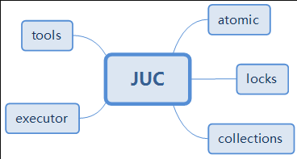
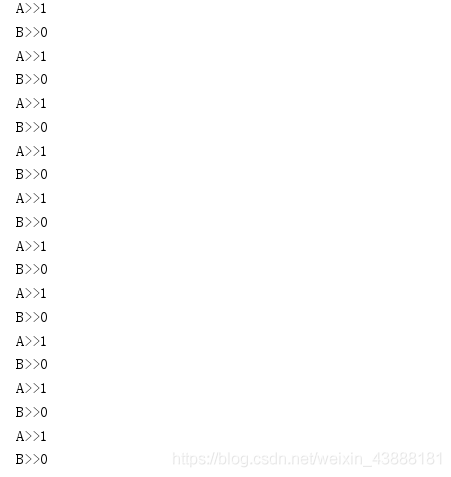

---

* [https://blog.csdn.net/weixin_43888181/article/details/116546374](https://blog.csdn.net/weixin_43888181/article/details/116546374)
* java–JUC快速入门（彻底搞懂JUC）文章目录java--JUC快速入门（彻底搞懂JUC）1、学习多线程之前需要知道的一些概念。2、JUC的结构3、Lock锁(重点)4、集合类不安全5、Callable()6、常用的辅助类7、读写锁8、阻塞队列9、线程池1、学习多线程之前需要知道的一些概念。1.1 JUC是什么？JUC是java.util.concurrent包的简称，在Java5.0添加，目的就是为了更好的支持高并发任务。让开发者进行多线程编程时减少竞争条件和死锁的问题！...
* 2022-10-23 18:26:52

---

## java–JUC快速入门（彻底搞懂JUC）

     ### 文章目录

*  

  * [java--JUC快速入门（彻底搞懂JUC）](#javaJUCJUC_0)
* [1、学习多线程之前需要知道的一些概念。](#1_3)
* [2、JUC的结构](#2JUC_62)
* [3、Lock锁(重点)](#3Lock_140)
* [4、集合类不安全](#4_292)
* [5、Callable()](#5Callable_369)
* [6、常用的辅助类](#6_403)
* [7、读写锁](#7_515)
* [8、阻塞队列](#8_626)
* [9、线程池](#9_750)

## 1、学习[多线程](https://so.csdn.net/so/search?q=%E5%A4%9A%E7%BA%BF%E7%A8%8B&spm=1001.2101.3001.7020)之前需要知道的一些概念。

  **1.1 JUC是什么？**  
 JUC是java.util.concurrent包的简称，在Java5.0添加，目的就是为了更好的支持[高并发](https://so.csdn.net/so/search?q=%E9%AB%98%E5%B9%B6%E5%8F%91&spm=1001.2101.3001.7020)任务。让开发者进行多线程编程时减少竞争条件和死锁的问题！  
 我们在面试过程中也会经常问到这类问题！  
 ​**1.2 进程与线程的区别**​：

  **进程** : 一个运行中的程序的[集合](https://so.csdn.net/so/search?q=%E9%9B%86%E5%90%88&spm=1001.2101.3001.7020); 一个进程往往可以包含多个线程,至少包含一个线程

  java默认有几个线程? 两个 main线程 gc线程

  **线程** : 线程（thread）是操作系统能够进行运算调度的最小单位。

  **1.3 并发与并行的区别：**

  并发(多线程操作同一个资源,交替执行)  
 CPU一核, 模拟出来多条线程,天下武功,唯快不破,快速交替  
 并行(多个人一起行走, 同时进行)  
 CPU多核,多个线程同时进行 ; 使用线程池操作

  **1.4 线程有六个状态：**

```java
public enum State { 
       // 新生
        NEW,

        // 运行
        RUNNABLE,

        // 阻塞
        BLOCKED,

        // 等待
        WAITING,

        //超时等待
        TIMED_WAITING,

        //终止
        TERMINATED;
    }

```

  **1.5 wait/sleep的区别：**  
 1来自不同的类

  ​ wait来自object类, sleep来自线程类

  2、关于锁的释放

  ​ wait会释放锁, sleep不会释放锁

  3、使用的范围不同

  ​ wait必须在同步代码块中

  ​ sleep可以在任何地方睡眠

## 2、JUC的结构

    
 1，tools（工具类）：又叫信号量三组工具类，包含有

  1）CountDownLatch（闭锁） 是一个同步辅助类，在完成一组正在其他线程中执行的操作之前，它允许一个或多个线程一直等待

  2）CyclicBarrier（栅栏） 之所以叫barrier，是因为是一个同步辅助类，允许一组线程互相等待，直到到达某个公共屏障点 ，并且在释放等待线程后可以重用。

  3）Semaphore（信号量） 是一个计数信号量，它的本质是一个“共享锁“。信号量维护了一个信号量许可集。线程可以通过调用 acquire()来获取信号量的许可；当信号量中有可用的许可时，线程能获取该许可；否则线程必须等待，直到有可用的许可为止。 线程可以通过release()来释放它所持有的信号量许可。

  2，executor(执行者)：是Java里面线程池的顶级接口，但它只是一个执行线程的工具，真正的线程池接口是ExecutorService，里面包含的类有：

  1）ScheduledExecutorService 解决那些需要任务重复执行的问题

  2）ScheduledThreadPoolExecutor 周期性任务调度的类实现

  3，atomic(原子性包)：是JDK提供的一组原子操作类，

  包含有AtomicBoolean、AtomicInteger、AtomicIntegerArray等原子变量类，他们的实现原理大多是持有它们各自的对应的类型变量value，而且被volatile关键字修饰了。这样来保证每次一个线程要使用它都会拿到最新的值。

  4，locks（锁包）：是JDK提供的锁机制，相比synchronized关键字来进行同步锁，功能更加强大，它为锁提供了一个框架，该框架允许更灵活地使用锁包含的实现类有：

  1）ReentrantLock 它是独占锁，是指只能被独自占领，即同一个时间点只能被一个线程锁获取到的锁。

  2）ReentrantReadWriteLock 它包括子类ReadLock和WriteLock。ReadLock是共享锁，而WriteLock是独占锁。

  3）LockSupport 它具备阻塞线程和解除阻塞线程的功能，并且不会引发[死锁](https://so.csdn.net/so/search?q=%E6%AD%BB%E9%94%81&spm=1001.2101.3001.7020)。

  5，collections(集合类)：主要是提供线程安全的集合， 比如：

  1）ArrayList对应的高并发类是CopyOnWriteArrayList，

  2）HashSet对应的高并发类是 CopyOnWriteArraySet，

  3）HashMap对应的高并发类是ConcurrentHashMap等等

  下面及具体来是学习一下多线程创建及使用方法：

  普通的线程代码, 之前都是用的thread或者runnable接口；  
 具体实现如下：

```java
public class demo01 { 
    public static void main(String[] args) { 
        ThreadDemo threadDemo = new ThreadDemo();
        threadDemo.start();
        new Thread(new ThreadDemo2()).start();
    }
}

class ThreadDemo extends Thread{ 
    @Override
    public void run() { 
        System.out.println("普通线程已开启（继承Thread）");
    }
}
class ThreadDemo2 implements Runnable{ 

    @Override
    public void run() { 
        System.out.println("普通线程已开启(实现Runnable接口)");
    }
}

```

  程序运行结果：  
 ​

## 3、Lock锁(重点)

  传统**synchronized**  
 synchronized是Java中的关键字，是一种同步锁。它修饰的对象有以下几种：  
 　　1. 修饰一个代码块，被修饰的代码块称为同步语句块，其作用的范围是大括号{}括起来的代码，作用的对象是调用这个代码块的对象；  
 　　2. 修饰一个方法，被修饰的方法称为同步方法，其作用的范围是整个方法，作用的对象是调用这个方法的对象；  
 　　3. 修改一个静态的方法，其作用的范围是整个静态方法，作用的对象是这个类的所有对象；  
 　　4. 修改一个类，其作用的范围是synchronized后面括号括起来的部分，作用主的对象是这个类的所有对象。

  **Lock 接口**  
   
 **实现类**  
   
 **reentrantLock构造器**

```java
  	public ReentrantLock() { 
        sync = new NonfairSync(); //无参默认非公平锁
    }
 	public ReentrantLock(boolean fair) { 
        sync = fair ? new FairSync() : new NonfairSync();//传参为true为公平锁
    }
 
```

  **公平锁: 十分公平: 可以先来后到,一定要排队 非公平锁: 十分不公平,可以插队(默认)**

```java
public class SaleTicketDemo { 

    public static void main(String[] args) { 
        Ticket ticket = new Ticket();

        new Thread(()->{ for(int i = 0; i < 40; i++) ticket.sale();}, "a").start();
        new Thread(()->{ for(int i = 0; i < 40; i++) ticket.sale();}, "b").start();
        new Thread(()->{ for(int i = 0; i < 40; i++) ticket.sale();}, "c").start();

    }
}

class Ticket { 

    private int ticketNum = 30;
    private Lock lock = new ReentrantLock();

    public void sale() { 
        lock.lock();
        try { 
            if (this.ticketNum > 0) { 
                System.out.println(Thread.currentThread().getName() + "购得第" + ticketNum-- + "张票, 剩余" + ticketNum + "张票");
            }
            //增加错误的发生几率
            Thread.sleep(10);
        } catch (Exception e) { 
            e.printStackTrace();
        } finally { 
            lock.unlock();
        }
    }

}

```

  **synchronized和lock锁的区别**

1. synchronized内置的java关键字,Lock是一个java类
2. synchronized无法判断获取锁的状态, Lock可以判断是否获取到了锁
3. synchronized会自动释放锁,Lock必须要手动释放锁!如果不是释放锁,会产生死锁
4. synchronized 线程1(获得锁,阻塞),线程2(等待); Lock锁就不一定会等待下去
5. synchronized 可重入锁,不可以中断的,非公平的; Lock锁,可重入的,可以判断锁,非公平(可自己设置);
6. synchronized 适合锁少量的代码同步问题,Lock 适合锁大量的同步代码

  **Condition 精准的通知和唤醒线程**  
 Condition是个接口，基本的方法就是await()和signal()方法；  
 Condition依赖于Lock接口，生成一个Condition的基本代码是lock.newCondition()  
 调用Condition的await()和signal()方法，都必须在lock保护之内，就是说必须在lock.lock()和lock.unlock之间才可以使用  
 Conditon中的await()对应Object的wait()；

  Condition中的signal()对应Object的notify()；

  Condition中的signalAll()对应Object的notifyAll()。  
 ​

  Condition常见例子（​**生产者消费者模式（完成加一减一各一次操作）**​）：

```java
import java.util.concurrent.locks.Condition;
import java.util.concurrent.locks.Lock;
import java.util.concurrent.locks.ReentrantLock;

public class PC { 
    public static void main(String[] args) { 
        a a = new a();
        new Thread(()->{ 
            for (int i =0;i<10;i++){ 
                a.increment();
            }
        },"A").start();
        new Thread(()->{ 
            for (int i =0;i<10;i++){ 
                a.decrease();
            }
        },"B").start();


    }

}
class  a{ 
    public int nummber=0;
    Lock lock = new ReentrantLock();
    Condition condition = lock.newCondition();
    public   void  increment(){ 
        lock.lock();
        try { 
            while(nummber!=0){ 
                condition.await();
            }
            nummber++;
            System.out.println(Thread.currentThread().getName()+">>"+nummber);
            condition.signalAll();
        }
         catch (InterruptedException e) { 
            e.printStackTrace();
        } finally { 
          lock.unlock();
        }

    }
    public  void decrease(){ 
        lock.lock();
        try { 
            while(nummber!=1){ 
                condition.await();
            }
            nummber--;
            System.out.println(Thread.currentThread().getName()+">>"+nummber);
            condition.signalAll();
        }
        catch (InterruptedException e) { 
            e.printStackTrace();
        } finally { 
            lock.unlock();
        }
    }
}


```

  运行结果：  
 ​

## 4、集合类不安全

  **list 不安全**

```java
//java.util.ConcurrentModificationException 并发修改异常!
public class ListTest { 

    public static void main(String[] args) { 
        //并发下 arrayList 是不安全的
        /**
         * 解决方案
         * 1. 使用vector解决
         * 2. List<String> arrayList = Collections.synchronizedList(new ArrayList<>());
         * 3. List<String> arrayList = new CopyOnWriteArrayList<>();
         */
        //copyOnWrite 写入时复制  COW 计算机程序设计领域的一种优化策略
        //多个线程调用的时候, list, 读取的时候固定的,写入的时候,可能会覆盖
        //在写入的时候避免覆盖造成数据问题
        //CopyOnWriteArrayList 比 vector牛逼在哪里

        //读写分离
        List<String> arrayList = new CopyOnWriteArrayList<>();
        for (int i = 0; i < 100; i++) { 
            new Thread(()->{ 
                arrayList.add(UUID.randomUUID().toString().substring(0,5));
                System.out.println(arrayList);
            },String.valueOf(i)).start();
        }
    }
}


```

  **set 不安全**

```java
/**
 * 同理可证
 */
public class SetTest { 

    public static void main(String[] args) { 

//        Set<String> set = new HashSet<>();
        //如何解决hashSet线程安全问题
        //1. Set<String> set = Collections.synchronizedSet(new HashSet<>());
        Set<String> set = new CopyOnWriteArraySet<>();

        for (int i = 0; i < 100; i++) { 
            new Thread(() -> { 
                set.add(UUID.randomUUID().toString().substring(0, 5));
                System.out.println(set);
            }, String.valueOf(i)).start();
        }
    }
}

```

  **hashSet底层是什么? hashMap**

```java
public HashSet() { 
    map = new HashMap<>();
}

// add 的本质就是 map 的 key key是无法重复的
public boolean add(E e) { 
    return map.put(e, PRESENT)==null;
}
private static final Object PRESENT = new Object();//这是一个不变的值

```

  **HashMap 不安全 map的基本操作**  
 ​

## 5、Callable()

  ​

1. 可以有返回值
2. 可以抛出异常
3. 方法不同, run() => call()  
    ​  
    ​​

```java
public class CallableTest { 

    public static void main(String[] args) throws ExecutionException, InterruptedException { 
        FutureTask<Integer> futureTask = new FutureTask<>(new MyThread());
        new Thread(futureTask,"a").start();
        System.out.println(futureTask.get());

    }
}

class MyThread implements Callable<Integer> { 


    @Override
    public Integer call() throws Exception { 
        System.out.println("call()方法被调用了");
        return 1024;
    }
}


```

## 6、常用的辅助类

  **CountDownLatch**  
 ​

```java
//计数器
public class demo02 { 
    public static void main(String[] args) throws InterruptedException { 
        //相当于计数器
        CountDownLatch countDownLatch = new CountDownLatch(5);
        //计数器总数是5,当减少为0,任务才继续向下执行
        for (int i = 1; i <6 ; i++) { 
            new Thread(()->{ 
                System.out.println(Thread.currentThread().getName()+"==>start");
                countDownLatch.countDown();
            }).start();
        }
        countDownLatch.await();
        System.out.println("main线程继续向下执行");
    }
}

```

  结果：  
 ​

  原理:

  countDownLatch.countDown(); //数量减1

  countDownLatch.await();// 等待计数器归零,然后再向下执行

  每次有线程调用countDown()数量-1,假设计数器变为0,countDownLatch.await();就会被唤醒,继续执行

  **cyclicBarrier**  
   
 加法计数器

```java
public class CyclicBarrierDemo { 

    public static void main(String[] args) { 
        /**
         * 集齐77个龙珠召唤神龙
         */
        // 召唤龙珠的线程
        CyclicBarrier cyclicBarrier = new CyclicBarrier(7, ()->{ 
            System.out.println("召唤神龙成功! ");
        });
        for (int i = 0; i < 7; i++) { 
            int temp = i;
            //lambda 能拿到i吗
            new Thread(()->{ 
                System.out.println(Thread.currentThread().getName() + "收集" + temp + "个龙珠");


                try { 
                    cyclicBarrier.await();
                } catch (InterruptedException e) { 
                    e.printStackTrace();
                } catch (BrokenBarrierException e) { 
                    e.printStackTrace();
                }
            }).start();
        }
    }
}

```

  运行结果：  
 ​

  **Semaphore**  
 ​

```java
public class SemaphoreTest { 

    public static void main(String[] args) { 
        Semaphore semaphore = new Semaphore(3);

        for (int i = 0; i < 6; i++) { 
            int temp = i;
            new Thread(()->{ 
                try { 
                    semaphore.acquire(); //获取
                    System.out.println(temp + "号车抢到车位");
                    TimeUnit.SECONDS.sleep(5);
                } catch (InterruptedException e) { 
                    e.printStackTrace();
                } finally { 
                    semaphore.release(); //释放
                    System.out.println(temp + "号车离开车位");
                }
            }).start();
        }
    }
}

```

  运行结果：  
 ​

  原理:

  semaphore.acquire(); //获取信号量,假设如果已经满了,等待信号量可用时被唤醒

  semaphore.release(); //释放信号量

  作用: 多个共享资源互斥的使用!并发限流,控制最大的线程数

## 7、[读写锁](https://so.csdn.net/so/search?q=%E8%AF%BB%E5%86%99%E9%94%81&spm=1001.2101.3001.7020)

  **ReadWriteLock**

  ​

```java
package com.czp.lock;

import java.util.HashMap;
import java.util.Map;
import java.util.concurrent.TimeUnit;
import java.util.concurrent.locks.ReentrantReadWriteLock;


/**
 * 独占锁(写锁) 一次只能由一个线程占有
 * 共享锁(读锁) 一次可以有多个线程占有
 * readWriteLock
 * 读-读 可以共存
 * 读-写  不能共存
 * 写-写 不能共存
 */
public class ReadWriteLock { 

    public static void main(String[] args) { 
        MyCacheLock myCache = new MyCacheLock();

        //写入操作
        for (int i = 0; i < 6; i++) { 
            int temp = i;
            new Thread(() -> { 
                myCache.put(temp + "", temp + "");
            }, String.valueOf(i)).start();
        }

        //读取操作
        for (int i = 0; i < 6; i++) { 
            int temp = i;
            new Thread(() -> { 
                myCache.get(temp + "");
            }, String.valueOf(i)).start();
        }
    }
}

class MyCacheLock { 

    private volatile Map<String, Object> map = new HashMap<>();
    //读写锁
    private java.util.concurrent.locks.ReadWriteLock lock = new ReentrantReadWriteLock();

    // 存,写入的时候只有一个人操作
    public Object get(String key) { 
        lock.readLock().lock();
        Object o = null;
        try { 
            System.out.println(Thread.currentThread().getName() + "读取");
            try { 
                TimeUnit.SECONDS.sleep(2);
            } catch (InterruptedException e) { 
                e.printStackTrace();
            }
            o = map.get(key);
            System.out.println(Thread.currentThread().getName() + "读取ok" + o);
        } catch (Exception e) { 
            e.printStackTrace();
        } finally { 
            lock.readLock().unlock();
        }
        return o;
    }

    public void put(String key, Object value) { 
        lock.writeLock().lock();
        try { 
            System.out.println(Thread.currentThread().getName() + "写入" + key);
            map.put(key, value);
            System.out.println(Thread.currentThread().getName() + "写入完毕");
        } catch (Exception e) { 
            e.printStackTrace();
        } finally { 
            lock.writeLock().unlock();
        }
    }

}

class MyCache { 

    private volatile Map<String, Object> map = new HashMap<>();

    public Object get(String key) { 
        System.out.println(Thread.currentThread().getName() + "读取");

        Object o = map.get(key);
        System.out.println(Thread.currentThread().getName() + "读取ok" + o);

        return o;
    }

    public void put(String key, Object value) { 
        System.out.println(Thread.currentThread().getName() + "写入" + key);
        map.put(key, value);
        System.out.println(Thread.currentThread().getName() + "写入完毕");
    }

}

```

## 8、阻塞队列

    
   
 Blockqueue  
   
   
 什么情况下我们会使用阻塞队列,多线程并发处理,线程池!  
 如何使用队列？  
 添加 移除  
 四组API  
 ​

```java

   /**
     * 抛出异常
     */
    public static void test1() { 
        //队列的大小
        ArrayBlockingQueue queue = new ArrayBlockingQueue<>(3);
        System.out.println(queue.add("a"));
        System.out.println(queue.add("b"));
        System.out.println(queue.add("c"));
        //java.lang.IllegalStateException: Queue full
        //System.out.println(queue.add("d"));
        System.out.println("----------------------");
        System.out.println(queue.remove());
        System.out.println(queue.remove());
        System.out.println(queue.remove());
        //java.util.NoSuchElementException
        System.out.println(queue.remove());
        //抛出异常

    }

```

```java
   /**
     * 有返回值没有异常
     */
    public static void test2(){ 
        ArrayBlockingQueue queue = new ArrayBlockingQueue(3);

        System.out.println(queue.offer("a"));
        System.out.println(queue.offer("b"));
        System.out.println(queue.offer("c"));
//        System.out.println(queue.offer("d"));       //offer 不抛出异常
        System.out.println(queue.poll());
        System.out.println(queue.poll());
        System.out.println(queue.poll());
//        System.out.println(queue.poll());   //null 不抛出异常
    }

```

```java
    /**
     * 等待阻塞
     */
    public static void test3() throws InterruptedException { 
        ArrayBlockingQueue queue = new ArrayBlockingQueue(3);
        queue.put("a");
        queue.put("b");
        queue.put("c");
//        queue.put("c");  队列没有位置就会阻塞
        System.out.println(queue.take());
        System.out.println(queue.take());
        System.out.println(queue.take());
    }

```

  SynchronizedQueue 同步队列  
 没有容量,  
 进去一个元素,必须等待取出来之后,才能再往里面放一个元素  
 put take

```java

/**
 * 同步队列
 * 和其他的lockQueue 不一样， SynchronousQueue 不存储元素
 */
public class SyncQueue { 

    public static void main(String[] args) { 
        SynchronousQueue<String> synchronousQueue = new SynchronousQueue<>(); //同步队列

        new Thread(()->{ 

            try { 
                System.out.println(Thread.currentThread().getName() + "put 1");
                synchronousQueue.put("1");
                System.out.println(Thread.currentThread().getName() + "put 2");
                synchronousQueue.put("2");
                System.out.println(Thread.currentThread().getName() + "put 3");
                synchronousQueue.put("3");
            } catch (InterruptedException e) { 
                e.printStackTrace();
            }
        },"T1").start();

        new Thread(()->{ 
            try { 
                TimeUnit.SECONDS.sleep(3);
                System.out.println(Thread.currentThread().getName() + "=>" + synchronousQueue.take());
                TimeUnit.SECONDS.sleep(3);
                System.out.println(Thread.currentThread().getName() + "=>" + synchronousQueue.take());
                TimeUnit.SECONDS.sleep(3);
                System.out.println(Thread.currentThread().getName() + "=>" + synchronousQueue.take());
            } catch (InterruptedException e) { 
                e.printStackTrace();
            } finally { 
            }
        },"T2").start();
    }
}

```

## 9、线程池

  因为之前有写过这个文章，可以转到以下链接继续学习：

  https://blog.csdn.net/weixin_43888181/article/details/116518664?spm=1001.2014.3001.5501

  注明：该笔记是通过学习bilibili的狂神说java的视频《JUC并发编程》及个人学习总结所得的笔记。  
 https://www.bilibili.com/video/BV1B7411L7tE?from=search&seid=15216587814524323096&spm_id_from=333.337.0.0
