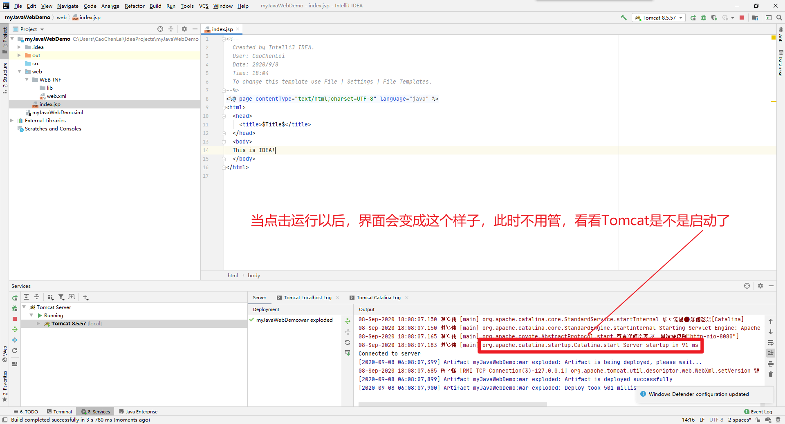
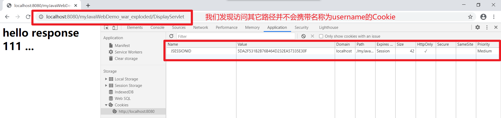
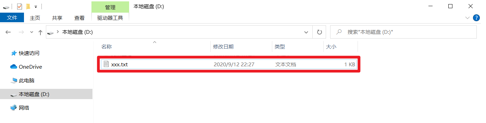
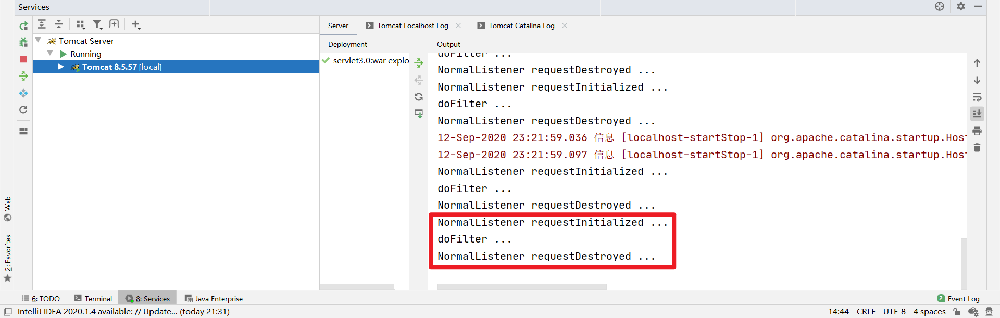
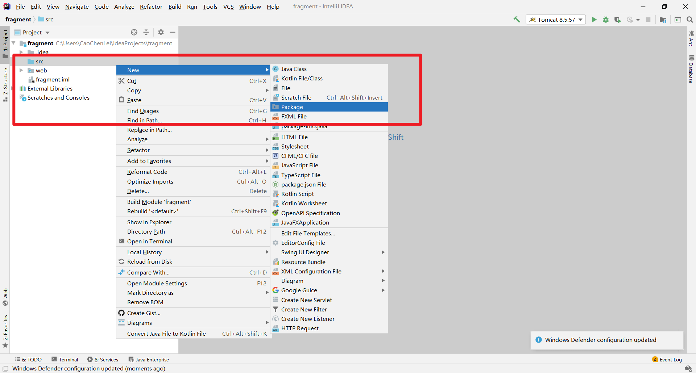
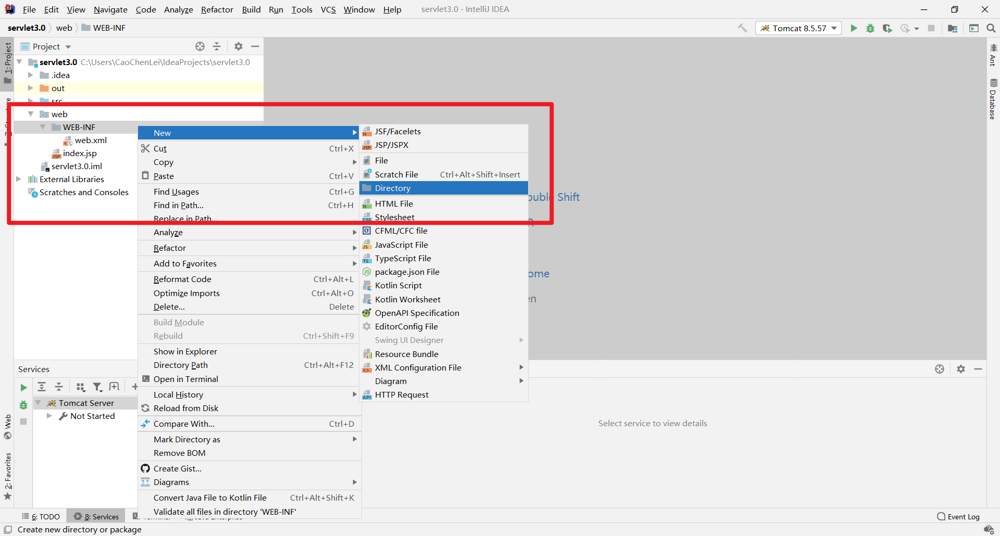
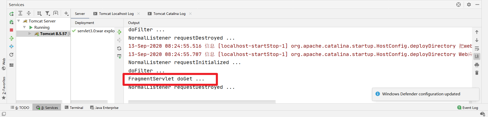

---

* [https://blog.csdn.net/qq_38490457/article/details/108544801#_Servlet_867](https://blog.csdn.net/qq_38490457/article/details/108544801#_Servlet_867)
* 目录第一章 开发工具1.1、JDK安装1.2、Tomcat安装1.3、IDEA安装1.4、IDEA集成Tomcat1.5、IDEA运行JavaWeb第二章 XML2.1、XML的概述2.2、XML的语法2.3、XML的解析第三章 YAML3.1、YAML的概述3.2、YAML的语法3.3、YAML的解析第四章 Servlet4.1、Servlet概述4.2、Servlet语法格式4.3、Servlet执行过程4.4、Servlet生命周期4.5、Servlet继承体系4.6、ServletContext4.
* 2022-10-23 13:48:29

---

### 目录

* [第一章 开发工具](#__8)
*  

  * [1.1、JDK安装](#11JDK_10)
  * [1.2、Tomcat安装](#12Tomcat_49)
  * [1.3、IDEA安装](#13IDEA_94)
  * [1.4、IDEA集成Tomcat](#14IDEATomcat_124)
  * [1.5、IDEA运行JavaWeb](#15IDEAJavaWeb_130)
* [第二章 XML（选学）](#_XML_178)
*  

  * [2.1、XML的概述](#21XML_180)
  * [2.2、XML的语法](#22XML_184)
  * [2.3、XML的解析](#23XML_230)
* [第三章 YAML（选学）](#_YAML_410)
*  

  * [3.1、YAML的概述](#31YAML_412)
  * [3.2、YAML的语法](#32YAML_416)
  * [3.3、YAML的解析](#33YAML_595)
* [第四章 Servlet](#_Servlet_867)
*  

  * [4.1、Servlet概述](#41Servlet_869)
  * [4.2、Servlet语法格式](#42Servlet_873)
  * [4.3、Servlet执行过程](#43Servlet_955)
  * [4.4、Servlet生命周期](#44Servlet_959)
  * [4.5、Servlet继承体系](#45Servlet_972)
  * [4.6、ServletContext](#46ServletContext_1029)
  *  

    * [4.6.1、获取全局配置参数](#461_1037)
    * [4.6.2、获取web工程中的资源](#462web_1073)
    * [4.6.3、在Servlet间共享数据域对象](#463Servlet_1110)
  * [4.7、ServletConfig](#47ServletConfig_1215)
  * [4.8、HttpServletRequest](#48HttpServletRequest_1293)
  * [4.9、HttpServletResponse](#49HttpServletResponse_1434)
  * [4.10、重定向和请求转发](#410_1503)
  * [4.11、Cookie](#411Cookie_1543)
  * [4.12、Session](#412Session_1626)
* [第五章 Listener](#_Listener_1654)
*  

  * [5.1、监听三个作用域创建和销毁](#51_1658)
  *  

    * [5.1.1、ServletContextListener](#511ServletContextListener_1660)
    * [5.1.2、ServletRequestListener](#512ServletRequestListener_1708)
    * [5.1.3、HttpSessionListener](#513HttpSessionListener_1758)
  * [5.2、监听三个作用域属性状态变更](#52_1810)
  *  

    * [5.2.1、ServletContextAttributeListener](#521ServletContextAttributeListener_1812)
    * [5.2.2、ServletRequestAttributeListener](#522ServletRequestAttributeListener_1858)
    * [5.2.3、HttpSessionAttributeListener](#523HttpSessionAttributeListener_1904)
  * [5.3、监听HttpSession存值状态变更](#53HttpSession_1950)
  *  

    * [5.3.1、HttpSessionBindingListener](#531HttpSessionBindingListener_1952)
    * [5.3.2、HttpSessionActivationListener](#532HttpSessionActivationListener_1987)
* [第六章 Filter](#_Filter_2048)
*  

  * [6.1、Filter概述](#61Filter_2050)
  * [6.2、Filter生命周期](#62Filter_2054)
  * [6.3、Filter语法](#63Filter_2059)
  * [6.4、Filter执行顺序](#64Filter_2100)
  * [6.5、Filter匹配规则](#65Filter_2117)
  * [6.6、Filter拦截类型](#66Filter_2123)
  * [6.7、Filter统一编码](#67Filter_2132)
* [第七章 JSP](#_JSP_2248)
*  

  * [7.1、JSP概述](#71JSP_2250)
  * [7.2、JSP生命周期](#72JSP_2258)
  * [7.3、JSP语法](#73JSP_2269)
  *  

    * [7.3.1、JSP脚本程序](#731JSP_2271)
    * [7.3.2、JSP变量声明](#732JSP_2305)
    * [7.3.3、JSP表达式](#733JSP_2340)
    * [7.3.4、JSP注释](#734JSP_2380)
    * [7.3.5、JSP指令元素](#735JSP_2393)
    *  

      * [7.3.5.1、page指令](#7351page_2411)
      * [7.3.5.2、include指令](#7352include_2445)
      * [7.3.5.3、taglib指令](#7353taglib_2461)
    * [7.3.6、JSP动作元素](#736JSP_2477)
    *  

      * [7.3.6.1、jsp:include动作](#7361jspinclude_2504)
      * [7.3.6.2、jsp:useBean动作](#7362jspuseBean_2529)
      * [7.3.6.3、jsp:setProperty动作](#7363jspsetProperty_2553)
      * [7.3.6.4、jsp:getProperty动作](#7364jspgetProperty_2602)
      * [7.3.6.5、jsp:forward动作](#7365jspforward_2625)
    * [7.3.7、JSP隐含对象](#737JSP_2647)
    * [7.3.8、JSP常见控制](#738JSP_2683)
  * [7.4、EL表达式](#74EL_2706)
  *  

    * [7.4.1、EL概述](#741EL_2708)
    * [7.4.2、EL语法](#742EL_2712)
    * [7.4.3、EL隐含对象](#743EL_2720)
    * [7.4.4、EL案例演示](#744EL_2740)
  * [7.5、JSTL表达式](#75JSTL_2852)
  *  

    * [7.5.1、JSTL概述](#751JSTL_2854)
    * [7.5.2、JSTL依赖](#752JSTL_2858)
    * [7.5.3、JSTL常用标签](#753JSTL_2863)
* [第八章 Servlet3.0](#_Servlet30_2920)
*  

  * [8.1、注解开发](#81_2930)
  *  

    * [8.1.1、servlet注解](#811servlet_2932)
    * [8.1.2、filter注解](#812filter_2988)
    * [8.1.3、listener注解](#813listener_3045)
    * [8.1.4、两种配置同时存在](#814_3078)
    * [8.1.5、如何禁用注解组件](#815_3088)
  * [8.2、文件上传](#82_3105)
  * [8.3、异步处理](#83_3162)
  * [8.4、动态注册](#84_3257)
  *  

    * [8.4.1、servlet动态注册](#841servlet_3289)
    * [8.4.2、filter动态注册](#842filter_3333)
    * [8.4.3、listener动态注册](#843listener_3378)
  * [8.5、可插性支持](#85_3416)

  ---

  **配套资料，免费下载**  
  链接：https://pan.baidu.com/s/1DNouClLLp4OB8mniUJGmBg  
  提取码：dq2w  
  复制这段内容后打开百度网盘手机App，操作更方便哦

  ## 第一章 开发工具

  ## 1.1、JDK安装

  ​**第一步：打开官网进行下载**​（https://www.oracle.com/java/technologies/javase/javase-jdk8-downloads.html）

  ​

  **第二步：运行程序进行安装**

  全部默认下一步即可，不用管路径是不是存在中文和空格，无碍！

  > 注意：如果自己会配置JDK，可以更改它的安装路径，那相应的环境变量也需要修改！
  >

  **第三步：系统环境变量配置**

  此电脑 》 =右键= 》 属性 》 高级系统设置 》 环境变量 》 系统变量 》 新建（需要新建两个，然后修改一个）

  新建两个：JAVA_HOME代表Java的安装目录、CLASSPATH代表程序运行的时候，优先加载当前目录中的类，然后再加载指定的类库

  |变量名|变量值|
  | -----------| -----------------------------------------------------|
  |JAVA_HOME|C:\Program Files\Java\jdk1.8.0_261|
  |CLASSPATH|.;%JAVA_HOME%\lib\dt.jar;%JAVA_HOME%\lib\tools.jar;|

 修改一个：编辑PATH环境变量，它会打开一个窗口，新添两条路径，如下图所示

* %JAVA_HOME%\bin
* %JAVA_HOME%\jre\bin

  ​

  **第四步：测试JDK是否安装成功**

  打开一个cmd命令行窗口，输入以下两个命令查看，如果有内容输出则证明已经配置成功！

  * java -version
* javac -version

  ​

  ## 1.2、Tomcat安装

  ​**第一步：打开官网进行下载和安装**​（http://tomcat.apache.org/）

  ​

  ​

  **第二步：系统环境变量配置**

  此电脑 》 =右键= 》 属性 》 高级系统设置 》 环境变量 》 系统变量 》 新建（需要新建两个，然后修改三个）

  新建两个：CATALINA_BASE和CATALINA_HOME均代表Tomcat的安装目录

  |变量名|变量值|
  | ---------------| -----------------------------------------------------------------------------|
  |CATALINA_BASE|C:\DevTools\apache-tomcat-8.5.57 （输入自己解压的Tomcat目录，不要照抄我的）|
  |CATALINA_HOME|C:\DevTools\apache-tomcat-8.5.57 （输入自己解压的Tomcat目录，不要照抄我的）|

 修改一个：编辑CLASSPATH环境变量，它会打开一个窗口，具体修改，如下所示

* 未修改前：.;%JAVA_HOME%\lib\dt.jar;%JAVA_HOME%\lib\tools.jar;
* 修改以后：.;%JAVA_HOME%\lib\dt.jar;%JAVA_HOME%\lib\tools.jar;%CATALINA_HOME%\lib\servlet-api.jar;

  修改两个：编辑PATH环境变量，它会打开一个窗口，新添两条路径，如下所示

  * %CATALINA_HOME%\bin
* %CATALINA_HOME%\lib

  ​

  **第三步：测试Tomcat是否安装成功**

  打开一个cmd命令行窗口，输入以下一个命令查看，如果有内容输出则证明已经配置成功！

  * catalina run

  ​

  * 打开浏览器，输入：http://localhost:8080/

  ​

  如果看到上边这个界面了，就把刚才打开的cmd窗口关掉，否则可能会影响后边IDEA集成Tomcat。

  ## 1.3、IDEA安装

  > 注意：官网的版本会隔一段时间更新一次，我这里只是告诉大家怎么下载，不一定要用最新的，我这套课程使用的是IdeaIU-2020.1.2，如果你不是这个版本，那么我建议你改为这个版本，否则后边可能会出现一些问题。
  >

  ​**第一步：打开官网进行下载和安装**​（https://www.jetbrains.com/idea/）

  ​

  ​

  **第二步：运行程序进行安装**

  全部默认下一步即可，如果遇到需要一页打勾的很多，就把有 64 的那个勾上，它代表在桌面创建一个64位的快捷方式，没勾选也没事，可以在开始菜单打开IDEA！

  **第三步：关于激活的问题**

  由于IDEA是收费软件，请大家自行购买激活码，然后激活，不激活也可以试用30天！

  **第四步：常见的设置页面**

  ​

  ​

  ​

  **第五步：最终的效果图**

  ​

  ## 1.4、IDEA集成Tomcat

  ​

  ​

  ## 1.5、IDEA运行JavaWeb

  ​

  ​

  ​

  > 注意：这个弹窗意思是你需不需要每天都让我提示你一些小技巧，我们选择关闭，不用搭理他！
  >

  ​

  > 注意：如果你有依赖的JAR包，就放到lib文件夹中，然后添加到工程中，方便项目移动的时候，不会丢失JAR包。
  >

> 至于classes是否需要创建，在这里我个人认为是不需要创建的，因为编译器会自动创建，如果你创建了，还必须要修改配置信息，很麻烦，所以我建议就不要创建了，一般我们也不会创建。

  ​

  ​

> 注意：Fix并不是所有电脑都需要点击的，如果它弹出了这个窗口你就点击，没弹出来就不用管了！

  ​

> 注意：只有上边点击了Fix才会出来这个页面，没有点击Fix，这一步忽略即可，不用纠结！

  ​

  ​

  ​

  ​

  ​

  ​

  ​

  ​

  一般浏览器也会正常显示刚才JSP中的文件内容

  ​

  ​

## 第二章 [XML](https://so.csdn.net/so/search?q=XML&spm=1001.2101.3001.7020)（选学）

## 2.1、XML的概述

  XML是可扩展标记语言（e**X**tensible **M**arkup **L**anguage），它被设计用来传输和存储数据，我们一般使用XML文件来做应用程序的配置文件。

## 2.2、XML的语法

  **案例演示：**

```xml
<?xml version="1.0" encoding="UTF-8"?>
<bookstore>
	<book category="COOKING">
		<title lang="en">Everyday Italian</title>
		<author>Giada De Laurentiis</author>
		<year>2005</year>
		<price>30.00</price>
	</book>
	<book category="CHILDREN">
		<title lang="en">Harry Potter</title>
		<author>J K. Rowling</author>
		<year>2005</year>
		<price>29.99</price>
	</book>
	<book category="WEB">
		<title lang="en">Learning XML</title>
		<author>Erik T. Ray</author>
		<year>2003</year>
		<price>39.95</price>
	</book>
</bookstore>
```

  **树状结构：**

  ​

  **支持语法：**

* 嵌套标签
* 单级标签
* 内含属性

  > 注意：根节点只能有一个
  >

  **注释语法：**

```shell
<!-- comment -->
```

## 2.3、XML的解析

  **解析方式：**

* DOM（Document Object Model）：在解析的时候，它会把整个XML文档读入内存中，形成一个树状结构。整个文档称之为Document对象，所有元素节点对应Element对象，属性对应Attribute对象，文本对应Text对象，以上所有对象都可以称之为Node节点。如果XML特别大，可能会造成内存溢出。这种解析方式可以对XML文档进行增删改查操作。
* SAX（Simple API For XML）：它是基于事件驱动的一种解析方式，也就是读取一行，解析一行。在读取较大的XML文件的时候，也不会造成内存溢出，但是这种解析方式只能进行查询，不能进行增删改操作。

  **案例演示：**

  工程名称：XMLDemo

  包的名称：com.caochenlei.xml.parse

  依赖文件：dom4j-1.6.1.jar、jaxen-1.1-beta-6.jar、JUnit 4

  测试文件：bookstore.xml（全路径：/XMLDemo/bookstore.xml）

```shell
<?xml version="1.0" encoding="UTF-8"?>
<bookstore>
	<book category="COOKING">
		<title lang="en">Everyday Italian</title>
		<author>Giada De Laurentiis</author>
		<year>2005</year>
		<price>30.00</price>
	</book>
	<book category="CHILDREN">
		<title lang="en">Harry Potter</title>
		<author>J K. Rowling</author>
		<year>2005</year>
		<price>29.99</price>
	</book>
	<book category="WEB">
		<title lang="en">Learning XML</title>
		<author>Erik T. Ray</author>
		<year>2003</year>
		<price>39.95</price>
	</book>
</bookstore>
```

  代码名称：XMLParse.java（全路径：/XMLDemo/src/com/caochenlei/xml/parse/XMLParse.java）

```java
package com.caochenlei.xml.parse;

import java.io.File;
import java.io.FileNotFoundException;
import java.io.FileOutputStream;
import java.io.IOException;
import java.io.UnsupportedEncodingException;
import java.util.Arrays;
import java.util.List;

import org.dom4j.Attribute;
import org.dom4j.Document;
import org.dom4j.DocumentException;
import org.dom4j.Element;
import org.dom4j.Node;
import org.dom4j.io.OutputFormat;
import org.dom4j.io.SAXReader;
import org.dom4j.io.XMLWriter;
import org.junit.Test;

public class XMLParse { 

	/**
	 * 读取全部
	 */
	@Test
	public void test1() { 
		try { 
			SAXReader domReader = new SAXReader();
			Document document = domReader.read(new File("bookstore.xml"));
			Element rootElement = document.getRootElement();
			List<Element> bookElements = rootElement.elements("book");
			for (Element bookElement : bookElements) { 
				Attribute category = bookElement.attribute("category");
				String title = bookElement.element("title").getText();
				String author = bookElement.element("author").getText();
				String year = bookElement.element("year").getText();
				String price = bookElement.element("price").getText();
				System.out.println(Arrays.asList(category.getText(), title, author, year, price));
			}
		} catch (DocumentException e) { 
			e.printStackTrace();
		}
	}

	/**
	 * 新增一行
	 */
	@Test
	public void test2() { 
		try { 
			SAXReader domReader = new SAXReader();
			Document document = domReader.read(new File("bookstore.xml"));
			Element rootElement = document.getRootElement();

			Element bookElement = rootElement.addElement("book");
			bookElement.addAttribute("category", "Hibernate");
			bookElement.addElement("title").addText("Learing Hibernate");
			bookElement.addElement("author").addText("caochenlei");
			bookElement.addElement("year").addText("1997");
			bookElement.addElement("price").addText("99.99");

			XMLWriter xmlWriter = new XMLWriter(new FileOutputStream("bookstore.xml"), OutputFormat.createPrettyPrint());
			xmlWriter.write(document);
			xmlWriter.close();
		} catch (DocumentException e) { 
			e.printStackTrace();
		} catch (UnsupportedEncodingException e) { 
			e.printStackTrace();
		} catch (FileNotFoundException e) { 
			e.printStackTrace();
		} catch (IOException e) { 
			e.printStackTrace();
		}
	}

	/**
	 * 删除一行
	 */
	@Test
	public void test3() { 
		try { 
			SAXReader domReader = new SAXReader();
			Document document = domReader.read(new File("bookstore.xml"));
			Element rootElement = document.getRootElement();

			Node singleNode = rootElement.selectSingleNode("//book[@category='Hibernate']");
			rootElement.remove(singleNode);

			XMLWriter xmlWriter = new XMLWriter(new FileOutputStream("bookstore.xml"), OutputFormat.createPrettyPrint());
			xmlWriter.write(document);
			xmlWriter.close();
		} catch (DocumentException e) { 
			e.printStackTrace();
		} catch (UnsupportedEncodingException e) { 
			e.printStackTrace();
		} catch (FileNotFoundException e) { 
			e.printStackTrace();
		} catch (IOException e) { 
			e.printStackTrace();
		}
	}

	/**
	 * 修改一行
	 */
	@Test
	public void test4() { 
		try { 
			SAXReader domReader = new SAXReader();
			Document document = domReader.read(new File("bookstore.xml"));
			Element rootElement = document.getRootElement();

			Node singleNode = rootElement.selectSingleNode("//book[@category='WEB']");
			singleNode.selectSingleNode("title").setText("Learning JavaWeb");
			singleNode.selectSingleNode("author").setText("张三");
			singleNode.selectSingleNode("year").setText("2020");
			singleNode.selectSingleNode("price").setText("09.09");

			XMLWriter xmlWriter = new XMLWriter(new FileOutputStream("bookstore.xml"), OutputFormat.createPrettyPrint());
			xmlWriter.write(document);
			xmlWriter.close();
		} catch (DocumentException e) { 
			e.printStackTrace();
		} catch (UnsupportedEncodingException e) { 
			e.printStackTrace();
		} catch (FileNotFoundException e) { 
			e.printStackTrace();
		} catch (IOException e) { 
			e.printStackTrace();
		}
	}

}
```

## 第三章 [YAML](https://so.csdn.net/so/search?q=YAML&spm=1001.2101.3001.7020)（选学）

## 3.1、YAML的概述

  YAML（**Y**AML **A**in’t **M**arkup **L**anguage）是一种可读性高并且容易被人类阅读，容易和脚本语言交互，用来表达资料序列的编程语言，类似于XML但比XML更简洁。

## 3.2、YAML的语法

  **YAML语法：**

* 大小写敏感
* 使用空格缩进表示层级关系
* 缩进不允许使用tab，只允许空格
* 缩进的空格数不重要，只要相同层级的元素左对齐即可
* '#'表示注释
* 相同层级的键不能重复

  **YAML对象：**

  对象键值对使用冒号结构表示 key: value，冒号后面要加一个空格，也可以使用 key:{key1: value1, key2: value2, …}，还可以使用缩进表示层级关系。

```yaml
key: 
  child-key1: value1
  child-key2: value2
```

  较为复杂的对象格式，可以使用问号加一个空格代表一个复杂的 key，配合一个冒号加一个空格代表一个 value：

```yaml
? 
  - complexkey1
  - complexkey2
: 
  - complexvalue1
  - complexvalue2
```

  意思即对象的属性是一个数组 [complexkey1,complexkey2]，对应的值也是一个数组 [complexvalue1,complexvalue2]

  **YAML数组：**

  以 - 开头的行表示构成一个数组：

```yaml
- A
- B
- C
```

  YAML 支持多维数组，可以使用行内表示：

```yaml
key: [value1, value2, ...]
```

  数据结构的子成员是一个数组，则可以在该项下面缩进一个空格：

```yaml
-
 - A
 - B
 - C
```

  一个相对复杂的例子：意思是 companies 属性是一个数组，每一个数组元素又是由 id、name、price 三个属性构成。

```yaml
companies:
 -
  id: 1
  name: company1
  price: 200W
 -
  id: 2
  name: company2
  price: 500W
```

  数组也可以使用流式(flow)的方式表示：

```yaml
companies: [{ id: 1,name: company1,price: 200W},{ id: 2,name: company2,price: 500W}]
```

  **YAML纯量：**

  纯量是最基本的，不可再分的值，包括：

* 字符串
* 布尔值
* 整数
* 浮点数
* Null
* 时间
* 日期

  使用一个例子来快速了解纯量的基本使用：

```yaml
boolean: 
  - TRUE                          #true,True都可以
  - FALSE                         #false，False都可以
float:
  - 3.14                          #可以直接写浮点小数
  - 6.8523015e+5                  #可以使用科学计数法
int:
  - 123                           #十进制表示
  - 0b1010_0111_0100_1010_1110    #二进制表示
null:
  nodeName: 'node'
  parent: ~                       #使用~表示null
string:
  - 哈哈
  - 'Hello World'                 #可以使用双引号或者单引号包裹特殊字符               
  - comment1:                     #字符串可以拆成多行，每一行会被转化成一个空格   
      newline1
      newline2
  - comment2: >                   #它会在注释的最后一行加上\n            
      newline3
      newline4
  - comment3: |                   #它会在注释的每一行尾加上\n            
      newline3
      newline4
date:
  - 2018-02-17 15:02:31           #日期必须使用ISO 8601格式，即yyyy-MM-dd hh-mm-ss
datetime: 
  - 2018-02-17T15:02:31+08:00     #时间使用ISO 8601格式，时间和日期之间使用T连接，最后使用+代表时区
```

  **YAML引用：**

  & 锚点和 * 别名，可以用来引用：

```yaml
defaults: &defaults
  adapter: postgres
  host: localhost

development:
  database: myapp_development
  <<: *defaults

test:
  database: myapp_test
  <<: *defaults
```

  上边的代码相当于：

```yaml
defaults:
  adapter: postgres
  host: localhost

development:
  database: myapp_development
  adapter: postgres
  host: localhost

test:
  database: myapp_test
  adapter: postgres
  host: localhost
```

  **类型指定：**

  YAML虽然有类型自动解析，但是有时候我们写了一个数字，但是我们想让它是字符串类型，就用到了类型指定，只要在值的前边写上相对应的类型标识就行了，常见的类型标识有以下几个：

```yaml
!!null ''                   # null
!!bool 'yes'                # bool
!!int '3...'                # number
!!float '3.14...'           # number
!!binary '...base64...'     # buffer
!!timestamp 'YYYY-...'      # date
!!omap [ ... ]              # array of key-value pairs
!!pairs [ ... ]             # array or array pairs
!!set {  ... }               # array of objects with given keys and null values
!!str '...'                 # string
!!seq [ ... ]               # array
!!map {  ... }               # object
```

## 3.3、YAML的解析

  工程名称：YAMLDemo

  包的名称：com.caochenlei.yaml.parse

  依赖文件：snakeyaml-1.17.jar、JUnit 4

  测试文件：user.yaml（全路径：/YAMLDemo/user.yaml）、users.yaml（全路径：/YAMLDemo/users.yaml）

  参考网站：https://bitbucket.org/asomov/snakeyaml/wiki/Home

  User.java（全路径：/YAMLDemo/src/com/caochenlei/yaml/parse/User.java）

```java
package com.caochenlei.yaml.parse;

import java.math.BigDecimal;
import java.util.List;
import java.util.Map;

public class User { 
	private long id;
	private String name;
	private String phone;
	private List<String> hobby;
	private Map<String, BigDecimal> balance;
	private Address address;

	public long getId() { 
		return id;
	}

	public void setId(long id) { 
		this.id = id;
	}

	public String getName() { 
		return name;
	}

	public void setName(String name) { 
		this.name = name;
	}

	public String getPhone() { 
		return phone;
	}

	public void setPhone(String phone) { 
		this.phone = phone;
	}

	public List<String> getHobby() { 
		return hobby;
	}

	public void setHobby(List<String> hobby) { 
		this.hobby = hobby;
	}

	public Map<String, BigDecimal> getBalance() { 
		return balance;
	}

	public void setBalance(Map<String, BigDecimal> balance) { 
		this.balance = balance;
	}

	public Address getAddress() { 
		return address;
	}

	public void setAddress(Address address) { 
		this.address = address;
	}

	@Override
	public String toString() { 
		return "User [id=" + id + ", name=" + name + ", phone=" + phone + ", hobby=" + hobby + ", balance=" + balance + ", address=" + address + "]";
	}
}
```

  Address.java（全路径：/YAMLDemo/src/com/caochenlei/yaml/parse/Address.java）

```java
package com.caochenlei.yaml.parse;

public class Address { 
	private String county;
	private String province;
	private String city;

	public String getCounty() { 
		return county;
	}

	public void setCounty(String county) { 
		this.county = county;
	}

	public String getProvince() { 
		return province;
	}

	public void setProvince(String province) { 
		this.province = province;
	}

	public String getCity() { 
		return city;
	}

	public void setCity(String city) { 
		this.city = city;
	}

	@Override
	public String toString() { 
		return "Address [county=" + county + ", province=" + province + ", city=" + city + "]";
	}
}
```

  YAMLDemo.java（全路径：/YAMLDemo/src/com/caochenlei/yaml/parse/YAMLDemo.java）

```java
package com.caochenlei.yaml.parse;

import java.io.File;
import java.io.FileInputStream;
import java.io.FileNotFoundException;
import java.io.FileWriter;
import java.io.IOException;
import java.io.Writer;
import java.math.BigDecimal;
import java.util.Arrays;
import java.util.HashMap;
import java.util.Map;

import org.junit.Test;
import org.yaml.snakeyaml.Yaml;

public class YAMLDemo { 

	/**
	 * 读取全部：读取为字符串
	 */
	@Test
	public void test1() { 
		try { 
			Yaml yaml = new Yaml();
			Object user = yaml.load(new FileInputStream(new File("user.yaml")));
			System.out.println(user);
		} catch (FileNotFoundException e) { 
			e.printStackTrace();
		}
	}

	/**
	 * 读取全部：读取为对象
	 */
	@Test
	public void test2() { 
		try { 
			Yaml yaml = new Yaml();
			User user = yaml.loadAs(new FileInputStream(new File("user.yaml")), User.class);
			System.out.println(user);
		} catch (FileNotFoundException e) { 
			e.printStackTrace();
		}
	}

	/**
	 * 读取全部：读取为Map集合
	 */
	@Test
	public void test3() { 
		try { 
			Yaml yaml = new Yaml();
			Map<String, Object> user = (Map<String, Object>) yaml.load(new FileInputStream(new File("user.yaml")));
			System.out.println(user.get("id"));
			System.out.println(user.get("name"));
			System.out.println(user.get("phone"));
			System.out.println(user.get("hobby"));
			System.out.println(user.get("balance"));
			System.out.println(user.get("address"));
		} catch (FileNotFoundException e) { 
			e.printStackTrace();
		}
	}

	/**
	 * 读取全部：读取多组配置
	 */
	@Test
	public void test4() { 
		try { 
			Yaml yaml = new Yaml();
			Iterable<Object> users = yaml.loadAll(new FileInputStream(new File("users.yaml")));
			for (Object user : users) { 
				System.out.println(user);
			}
		} catch (FileNotFoundException e) { 
			e.printStackTrace();
		}
	}

	/**
	 * 将一个对象持久化到文件
	 */
	@Test
	public void test5() { 
		try { 
			Yaml yaml = new Yaml();
			User user = new User();
			user.setId(123456);
			user.setName("王五");
			user.setPhone("15633029014");
			user.setHobby(Arrays.asList("aaa", "bbb", "c"));
			HashMap<String, BigDecimal> balance = new HashMap<String, BigDecimal>();
			balance.put("wechat", new BigDecimal(19.99));
			balance.put("alipay", new BigDecimal(29.99));
			user.setBalance(balance);
			Address address = new Address();
			address.setCity("China");
			address.setProvince("HeBei");
			address.setCity("XingTai");
			user.setAddress(address);
			Writer output = new FileWriter("myuser.yaml");
			yaml.dump(user, output);
		} catch (FileNotFoundException e) { 
			e.printStackTrace();
		} catch (IOException e) { 
			e.printStackTrace();
		}
	}

	/**
	 * 将一个集合持久化到文件
	 */
	@Test
	public void test6() { 
		try { 
			Yaml yaml = new Yaml();
			HashMap<String, Object> user = new HashMap<String, Object>();
			user.put("id", 123456);
			user.put("name", "王五");
			user.put("phone", "15633029014");
			user.put("hobby", Arrays.asList("aaa", "bbb", "c"));
			HashMap<String, BigDecimal> balance = new HashMap<String, BigDecimal>();
			balance.put("wechat", new BigDecimal(19.99));
			balance.put("alipay", new BigDecimal(29.99));
			user.put("balance", balance);
			Address address = new Address();
			address.setCity("China");
			address.setProvince("HeBei");
			address.setCity("XingTai");
			user.put("address", address);
			Writer output = new FileWriter("mymap.yaml");
			yaml.dump(user, output);
		} catch (FileNotFoundException e) { 
			e.printStackTrace();
		} catch (IOException e) { 
			e.printStackTrace();
		}
	}

}
```

## 第四章 [Servlet](https://so.csdn.net/so/search?q=Servlet&spm=1001.2101.3001.7020)

## 4.1、Servlet概述

  Java Servlet 是运行在 Web 服务器或应用服务器上的程序，它是作为来自 Web 浏览器或其他 HTTP 客户端的请求和 HTTP 服务器上的数据库或应用程序之间的中间层。使用 Servlet，您可以收集来自网页表单的用户输入，呈现来自数据库或者其他源的记录，还可以动态创建网页。

## 4.2、Servlet语法格式

  **第一步：创建包（com.caochenlei.servlet.demo）**

  **第二步：创建类（com.caochenlei.servlet.demo.MyServlet），并且需要实现Servlet接口中的所有方法**

```java
package com.caochenlei.servlet.demo;

import javax.servlet.*;
import java.io.IOException;

public class MyServlet implements Servlet { 
    @Override
    public void init(ServletConfig servletConfig) throws ServletException { 
        System.out.println("MyServlet init ...");
    }

    @Override
    public ServletConfig getServletConfig() { 
        return null;
    }

    @Override
    public void service(ServletRequest servletRequest, ServletResponse servletResponse) 
            throws ServletException, IOException { 
        System.out.println("MyServlet service ...");
    }

    @Override
    public String getServletInfo() { 
        return null;
    }

    @Override
    public void destroy() { 
        System.out.println("MyServlet destroy ...");
    }
}
```

  方法介绍：

* init：Servlet初始化时调用的方法
* getServletConfig：获取当前Servlet的配置信息
* service：调用Servlet真正去处理逻辑的方法
* getServletInfo：它提供有关Servlet的信息，如作者、版本、版权
* destroy：Servlet销毁时调用的方法

  **第三步：配置映射（web.xml中新增以下代码）**

```xml
    <servlet>
        <servlet-name>MyServlet</servlet-name>
        <servlet-class>com.caochenlei.servlet.demo.MyServlet</servlet-class>
    </servlet>
    <servlet-mapping>
        <servlet-name>MyServlet</servlet-name>
        <url-pattern>/MyServlet</url-pattern>
    </servlet-mapping>
```

  配置介绍：

  servlet标签用于配置Servlet的基本信息

1. servlet-class：代表当前Servlet的具体类路径，注意最后不包含.java
2. servlet-name：代表当前Servlet的别名，可以和原Servlet名称一样，也可以不一样，一般我们就一样就行了

  servlet-mapping标签用于配置请求路径与具体处理Servlet的对应关系

1. url-pattern：这里写你要匹配的地址路径
2. servlet-name：如果匹配到请求，该交给哪一个Servlet处理，这里的servlet-name其实就是一个Servlet的别名

  ​**第四步：启动应用，然后浏览器输入地址访问**​（http://localhost:8080/myJavaWebDemo_war_exploded/MyServlet）

  ​

  **第五步：正常关闭Tomcat服务器，我们会看到调用销毁方法，如下图所示：**

  ​

## 4.3、Servlet执行过程

  ​

## 4.4、Servlet[生命周期](https://so.csdn.net/so/search?q=%E7%94%9F%E5%91%BD%E5%91%A8%E6%9C%9F&spm=1001.2101.3001.7020)

  Servlet运行在Servlet容器中，其生命周期由容器来管理。

  Servlet的生命周期通过javax.servlet.Servlet接口中的init()、service()和destroy()方法来表示。

  Servlet的生命周期包含了下面4个阶段：

1. 类加载和实例化
2. 初始化：init()
3. 请求处理：service()
4. 销毁：destroy()

## 4.5、Servlet继承体系

  其实我们不难发现，现有的Servlet它的方法比较多，而且大多需要我们自己来实现，那有没有一种它的实现子类，把大部分方法都是实现了，而我们只要关注请求处理就行了，那答案肯定是有的，这个类就是HttpServlet，我们只要继承这个类重写GET、POST方法就能实现一个简单的Servlet请求处理，Servlet的继承体系如下图：

  ​

  既然我们知道HttpServlet这个类了，我们就要使用一下：

  **第一步：创建类（com.caochenlei.servlet.demo.MyHttpServlet），并且需要继承HttpServlet实现doPost、doGet方法。**

```java
package com.caochenlei.servlet.demo;

import javax.servlet.ServletException;
import javax.servlet.http.HttpServlet;
import javax.servlet.http.HttpServletRequest;
import javax.servlet.http.HttpServletResponse;
import java.io.IOException;

public class MyHttpServlet extends HttpServlet { 
    protected void doPost(HttpServletRequest request, HttpServletResponse response) 
            throws ServletException, IOException { 
        System.out.println("doPost method invoke ...");
    }

    protected void doGet(HttpServletRequest request, HttpServletResponse response) 
            throws ServletException, IOException { 
        System.out.println("doGet method invoke ...");
    }
}
```

  **第二步：配置映射（在web.xml文件中新增以下代码）**

```xml
    <servlet>
        <servlet-name>MyHttpServlet</servlet-name>
        <servlet-class>com.caochenlei.servlet.demo.MyHttpServlet</servlet-class>
    </servlet>
    <servlet-mapping>
        <servlet-name>MyHttpServlet</servlet-name>
        <url-pattern>/MyHttpServlet</url-pattern>
    </servlet-mapping>
```

  ​**第三步：重启应用，然后浏览器访问**​（http://localhost:8080/myJavaWebDemo_war_exploded/MyHttpServlet）**，观察控制台**

> 注意：doPost需要提交表单模拟，这里就不演示了，效果都一样！

  ​

  我们注意url-pattern它可以有多种拦截形式：

* 全路径匹配：`/a`​
* 前半段匹配：`/a/b/c/*`​
* 扩展名匹配：`*.action`​

  ## 4.6、ServletContext

  每个web工程都只有一个ServletContext对象，也就是不管在哪个Servlet里面，获取到的这个类的对象都是同一个，它用来获取Servlet的上下文，在服务器启动的时候，会为托管的每一个web应用程序，创建一个ServletContext对象，当从服务器移除托管或者是关闭服务器时，ServletContext将会被销毁。它主要有以下几方面作用：

  1. 获取全局配置参数

1. 获取web工程中的资源
2. 在servlet间共享数据域对象

### 4.6.1、获取全局配置参数

  **第一步：在web.xml中新增以下代码**

```xml
    <context-param>
        <param-name>username</param-name>
        <param-value>zhangsan</param-value>
    </context-param>
    <context-param>
        <param-name>password</param-name>
        <param-value>123456</param-value>
    </context-param>
```

  **第二步：在MyHttpServlet的doGet方法中新增以下代码**

```java
protected void doGet(HttpServletRequest request, HttpServletResponse response)
        throws ServletException, IOException { 
    System.out.println("doGet method invoke ...");

    // 获取全部初始化名称和其对应的内容
    Enumeration<String> initParameterNames = getServletContext().getInitParameterNames();
    while(initParameterNames.hasMoreElements()){ 
        String initParameterName = initParameterNames.nextElement();
        String initParameterValue = getServletContext().getInitParameter(initParameterName);
        System.out.println(initParameterName+":"+initParameterValue);
    }
}
```

  ​**第三步：重启Tomcat服务器，在浏览器中访问**​（http://localhost:8080/myJavaWebDemo_war_exploded/MyHttpServlet）

  ​

### 4.6.2、获取web工程中的资源

  **第一步：在 myJavaWebDemo 的 web 文件夹中右键创建 a.txt 文件，内容为 Hello,World!**

  ​

  **第二步：在MyHttpServlet的doGet方法中新增以下代码**

```java
protected void doGet(HttpServletRequest request, HttpServletResponse response)
        throws ServletException, IOException { 
    System.out.println("doGet method invoke ...");

    // 获取全部初始化名称和其对应的内容
    Enumeration<String> initParameterNames = getServletContext().getInitParameterNames();
    while (initParameterNames.hasMoreElements()) { 
        String initParameterName = initParameterNames.nextElement();
        String initParameterValue = getServletContext().getInitParameter(initParameterName);
        System.out.println(initParameterName + ":" + initParameterValue);
    }

    // 获取web工程中的资源的绝对路径
    String realPath = getServletContext().getRealPath("a.txt");
    System.out.println(realPath);

    // 获取web工程中的资源的输入流对象
    InputStream resourceAsStream = getServletContext().getResourceAsStream("a.txt");
    System.out.println(resourceAsStream);
}
```

  ​**第三步：重启Tomcat服务器，在浏览器中访问**​（http://localhost:8080/myJavaWebDemo_war_exploded/MyHttpServlet）

> 注意：当你能拿到一个文件的绝对路径或者输入流以后，就可以对它进行操作了！

  ​

### 4.6.3、在Servlet间共享数据域对象

  **第一步：创建 LoginServlet 并配置请求映射**

  LoginServlet

```java
package com.caochenlei.servlet.demo;

import javax.servlet.ServletException;
import javax.servlet.http.HttpServlet;
import javax.servlet.http.HttpServletRequest;
import javax.servlet.http.HttpServletResponse;
import java.io.IOException;

public class LoginServlet extends HttpServlet { 
    protected void doPost(HttpServletRequest request, HttpServletResponse response)
            throws ServletException, IOException { 
        doGet(request, response);
    }

    protected void doGet(HttpServletRequest request, HttpServletResponse response)
            throws ServletException, IOException { 

    }
}
```

  web.xml

```xml
    <servlet>
        <servlet-name>LoginServlet</servlet-name>
        <servlet-class>com.caochenlei.servlet.demo.LoginServlet</servlet-class>
    </servlet>
    <servlet-mapping>
        <servlet-name>LoginServlet</servlet-name>
        <url-pattern>/LoginServlet</url-pattern>
    </servlet-mapping>
```

  **第二步：在 LoginServlet的 doGet 中实现登录次数的修改，默认为1**

```java
protected void doGet(HttpServletRequest request, HttpServletResponse response)
        throws ServletException, IOException { 
    // 获取当前登录次数
    Integer count = (Integer) getServletContext().getAttribute("count");
    // 如果当前登录为null，则设置默认值为1
    if (count == null) { 
        getServletContext().setAttribute("count", 1);
    } else { 
        getServletContext().setAttribute("count", count + 1);
    }
}
```

  **第三步：在 MyHttpServlet 的 doGet 中新增以下查看代码，用于查看当前登录次数**

```java
protected void doGet(HttpServletRequest request, HttpServletResponse response)
        throws ServletException, IOException { 
    System.out.println("doGet method invoke ...");

    // 获取全部初始化名称和其对应的内容
    Enumeration<String> initParameterNames = getServletContext().getInitParameterNames();
    while (initParameterNames.hasMoreElements()) { 
        String initParameterName = initParameterNames.nextElement();
        String initParameterValue = getServletContext().getInitParameter(initParameterName);
        System.out.println(initParameterName + ":" + initParameterValue);
    }

    // 获取web工程中的资源的绝对路径
    String realPath = getServletContext().getRealPath("a.txt");
    System.out.println(realPath);

    // 获取web工程中的资源的输入流对象
    InputStream resourceAsStream = getServletContext().getResourceAsStream("a.txt");
    System.out.println(resourceAsStream);

    // 查看当前网站登录次数，这个数据是保存在ServletContext中的
    Integer count = (Integer) getServletContext().getAttribute("count");
    // 判断是否登录过，如果没有登录过，提示未登录，如果已经登录过，显示登录次数
    if (count == null) { 
        response.getWriter().write("no login!");
    } else { 
        response.getWriter().write("count:" + count);
    }
}
```

  **第四步：重启Tomcat服务器**

  ​**在浏览器中访问**​（http://localhost:8080/myJavaWebDemo_war_exploded/MyHttpServlet）**，查看是否登录**

  ​

  ​**在浏览器中访问**​（http://localhost:8080/myJavaWebDemo_war_exploded/LoginServlet）**，模拟登录场景**

  ​

  ​**在浏览器中访问**​（http://localhost:8080/myJavaWebDemo_war_exploded/MyHttpServlet）**，查看登录次数**

  ​

## 4.7、ServletConfig

  通过ServletConfig对象可以获取servlet在配置的时候一些信息。

  **第一步：创建类（HelloServlet）**

```java
package com.caochenlei.servlet.demo;

import javax.servlet.ServletException;
import javax.servlet.http.HttpServlet;
import javax.servlet.http.HttpServletRequest;
import javax.servlet.http.HttpServletResponse;
import java.io.IOException;

public class HelloServlet extends HttpServlet { 
    protected void doPost(HttpServletRequest request, HttpServletResponse response)
            throws ServletException, IOException { 

    }

    protected void doGet(HttpServletRequest request, HttpServletResponse response)
            throws ServletException, IOException { 

    }
}
```

  **第二步：在web.xml中配置映射关系**

```xml
<servlet>
        <servlet-name>HelloServlet</servlet-name>
        <servlet-class>com.caochenlei.servlet.demo.HelloServlet</servlet-class>
        <!-- Servlet的初始化参数 -->
        <init-param>
            <param-name>driver</param-name>
            <param-value>com.mysql.jdbc.Driver</param-value>
        </init-param>
        <init-param>
            <param-name>url</param-name>
            <param-value>jdbc:mysql://localhost:3306/test</param-value>
        </init-param>
        <init-param>
            <param-name>username</param-name>
            <param-value>root</param-value>
        </init-param>
        <init-param>
            <param-name>password</param-name>
            <param-value>123456</param-value>
        </init-param>
        <!-- Servlet的加载顺序 -->
        <load-on-startup>2</load-on-startup>
    </servlet>
    <servlet-mapping>
        <servlet-name>HelloServlet</servlet-name>
        <url-pattern>/HelloServlet</url-pattern>
    </servlet-mapping>
```

  **第三步：在HelloServlet的doGet方法中新增以下代码**

```java
protected void doGet(HttpServletRequest request, HttpServletResponse response)
        throws ServletException, IOException { 
    Enumeration<String> initParameterNames = getServletConfig().getInitParameterNames();
    while (initParameterNames.hasMoreElements()) { 
        String initParameterName = initParameterNames.nextElement();
        String initParameterValue = getServletConfig().getInitParameter(initParameterName);
        System.out.println(initParameterName + ":" + initParameterValue);
    }
}
```

  ​**第四步：重启Tomcat服务器，在浏览器中访问**​（http://localhost:8080/myJavaWebDemo_war_exploded/HelloServlet）

  ​

## 4.8、HttpServletRequest

  HttpServletRequest这个对象封装了客户端提交过来的一切数据。

  **第一步：修改 index.jsp**

```html
<form action="RegisterServlet" method="get">
    账户：<input type="text" name="username"><br>
    密码：<input type="text" name="password"><br>
         <input type="submit" value="注册">
</form>
```

  **第二步：创建类（RegisterServlet）**

```java
package com.caochenlei.servlet.demo;

import javafx.print.Collation;

import javax.servlet.ServletException;
import javax.servlet.http.HttpServlet;
import javax.servlet.http.HttpServletRequest;
import javax.servlet.http.HttpServletResponse;
import java.io.IOException;
import java.util.*;

public class RegisterServlet extends HttpServlet { 
    protected void doPost(HttpServletRequest request, HttpServletResponse response)
            throws ServletException, IOException { 
        doGet(request, response);
    }

    protected void doGet(HttpServletRequest request, HttpServletResponse response)
            throws ServletException, IOException { 
        // 获取客户端传递过来的头部信息
        Enumeration<String> headerNames = request.getHeaderNames();
        while (headerNames.hasMoreElements()) { 
            String headerName = headerNames.nextElement();
            String headerValue = request.getHeader(headerName);
            System.out.println(headerName + ":" + headerValue);
        }
        System.out.println("====================");

        // 获取客户端传递过来的参数信息
        Enumeration<String> parameterNames = request.getParameterNames();
        while (parameterNames.hasMoreElements()) { 
            String parameterName = parameterNames.nextElement();
            String parameterValue = request.getParameter(parameterName);
            // 如果值有多个请使用：request.getParameterValues(parameterName)
            System.out.println(parameterName + ":" + parameterValue);
        }
        System.out.println("====================");

        // 以Map集合的形式获取客户端传递过来的参数信息
        Map<String, String[]> parameterMap = request.getParameterMap();
        Set<String> names = parameterMap.keySet();
        for (String name : names) { 
            String[] value = parameterMap.get(name);
            System.out.println(name + ":" + Arrays.toString(value));
        }
        System.out.println("====================");

        // 获取一些其它地址、查询等信息
        StringBuffer requestURL = request.getRequestURL();
        String requestURI = request.getRequestURI();
        String servletPath = request.getServletPath();
        String queryString = request.getQueryString();
        System.out.println("requestURL:" + requestURL);
        System.out.println("requestURI:" + requestURI);
        System.out.println("servletPath:" + servletPath);
        System.out.println("queryString:" + queryString);
    }
}
```

  **第三步：在web.xml中新增映射信息**

```xml
    <servlet>
        <servlet-name>RegisterServlet</servlet-name>
        <servlet-class>com.caochenlei.servlet.demo.RegisterServlet</servlet-class>
    </servlet>
    <servlet-mapping>
        <servlet-name>RegisterServlet</servlet-name>
        <url-pattern>/RegisterServlet</url-pattern>
    </servlet-mapping>
```

  ​**第四步：重启Tomcat服务器，在浏览器中访问**​（http://localhost:8080/myJavaWebDemo_war_exploded/）

  在表单输入数据，然后点击提交

  ​

  查看IDEA的控制台信息

```
host:localhost:8080
connection:keep-alive
upgrade-insecure-requests:1
user-agent:Mozilla/5.0 (Windows NT 10.0; Win64; x64) AppleWebKit/537.36 (KHTML, like Gecko) Chrome/85.0.4183.83 Safari/537.36
accept:text/html,application/xhtml+xml,application/xml;q=0.9,image/avif,image/webp,image/apng,*/*;q=0.8,application/signed-exchange;v=b3;q=0.9
sec-fetch-site:same-origin
sec-fetch-mode:navigate
sec-fetch-user:?1
sec-fetch-dest:document
referer:http://localhost:8080/myJavaWebDemo_war_exploded/
accept-encoding:gzip, deflate, br
accept-language:zh-CN,zh;q=0.9
cookie:JSESSIONID=4342FA7CB5F51C5E4A5251E485E36E38
====================
username:zhangsan
password:123456
====================
username:[zhangsan]
password:[123456]
====================
requestURL:http://localhost:8080/myJavaWebDemo_war_exploded/RegisterServlet
requestURI:/myJavaWebDemo_war_exploded/RegisterServlet
servletPath:/RegisterServlet
queryString:username=zhangsan&password=123456
```

  **如何解决请求数据中文乱码问题？**

* GET方式
* ```java
  // 先用原来的编码解码再用UTF—8重新编码。
  String newUsername = new String(username.getBytes("ISO-8859-1"), "UTF-8");
  ```
* POST方式

  * ```java
    // 这行设置一定要写在getParameter之前。
    request.setCharacterEncoding("UTF-8");
    ```

  ## 4.9、HttpServletResponse

  HttpServletResponse这个对象负责返回数据给客户端。

  **第一步：创建类（DisplayServlet）**

```java
package com.caochenlei.servlet.demo;

import javax.servlet.ServletException;
import javax.servlet.http.HttpServlet;
import javax.servlet.http.HttpServletRequest;
import javax.servlet.http.HttpServletResponse;
import java.io.IOException;

public class DisplayServlet extends HttpServlet { 
    protected void doPost(HttpServletRequest request, HttpServletResponse response)
            throws ServletException, IOException { 
        doGet(request, response);
    }

    protected void doGet(HttpServletRequest request, HttpServletResponse response)
            throws ServletException, IOException { 
        /**
         * 注意：以下两种方式一次只能使用一种，我们就用字符流方式了，另一种自己演示
         */
        // 以字符流的方式写数据
        response.getWriter().write("<h1>hello response 111 ...</h1>");

        // 以字节流的方式写数据
        // response.getOutputStream().write("hello response 222 ...".getBytes());
    }
}
```

  **第二步：在web.xml文件中新增以下映射信息**

```xml
    <servlet>
        <servlet-name>DisplayServlet</servlet-name>
        <servlet-class>com.caochenlei.servlet.demo.DisplayServlet</servlet-class>
    </servlet>
    <servlet-mapping>
        <servlet-name>DisplayServlet</servlet-name>
        <url-pattern>/DisplayServlet</url-pattern>
    </servlet-mapping>
```

  ​**第三步：重启Tomcat服务器，在浏览器中访问**​（http://localhost:8080/myJavaWebDemo_war_exploded/DisplayServlet）

  ​

  **如何解决响应数据中文乱码问题？**

* 以字符流输出：response.getWriter()
* ```java
  response.setCharacterEncoding("UTF-8");
  response.setHeader("Content-Type", "text/html; charset=UTF-8");
  response.getWriter().write("你好，世界！");
  ```
* 以字节流输出：response.getOutputStream()

  * ```java
    response.setHeader("Content-Type", "text/html;charset=UTF-8");
    response.getOutputStream().write("你好，世界！".getBytes("UTF-8"));
    ```

  ## 4.10、重定向和请求转发

  * 重定向

```
	// 第一种：使用示例
	response.setStatus(302);
	response.setHeader("Location", "login_success.html");*/
	
	// 第二种：使用示例
	response.sendRedirect("login_success.html");

	1. 地址上显示的是最后的那个资源的路径地址。

	2. 请求次数最少有两次，服务器在第一次请求后，会返回302以及一个地址，浏览器在根据这个地址，执行第二次访问。

	3. 可以跳转到任意路径，不是自己的工程也可以跳。

	4. 效率稍微低一点，执行两次请求。 

	5. 后续的请求，没法使用上一次的request存储的数据，或者没法使用上一次的request对象，因为这是两次不同的请求。
```

* 请求转发

```
	// 使用示例：
	request.getRequestDispatcher("login_success.html").forward(request, response);

	1. 地址上显示的是请求servlet的地址，返回200ok。

	2. 请求次数只有一次，因为是服务器内部帮客户端执行了后续的工作。 

	3. 只能跳转自己项目的资源路径。  

	4. 效率上稍微高一点，因为只执行一次请求。 

	5. 可以使用上一次的request对象。
```

## 4.11、Cookie

  Cookie其实是一份小数据，它是服务器给客户端并且存储在客户端上的一份小数据。

  **第一步：创建类（CookieServlet）**

```java
package com.caochenlei.servlet.demo;

import javax.servlet.ServletException;
import javax.servlet.http.Cookie;
import javax.servlet.http.HttpServlet;
import javax.servlet.http.HttpServletRequest;
import javax.servlet.http.HttpServletResponse;
import java.io.IOException;

public class CookieServlet extends HttpServlet { 
    protected void doPost(HttpServletRequest request, HttpServletResponse response)
            throws ServletException, IOException { 
        doGet(request, response);
    }

    protected void doGet(HttpServletRequest request, HttpServletResponse response)
            throws ServletException, IOException { 
        // 获取Cookie ============================================================
        Cookie[] cookies = request.getCookies();
        if (cookies.length == 1) { 
            System.out.println("没有其它Cookie存在，只有JSESSIONID这个Cookie存在！");

            // 创建Cookie ============================================================
            // 创建Cookie对象
            Cookie cookie = new Cookie("username", "zhangsan");
            // 添加Cookie描述
            cookie.setComment("用户账号Cookie");
            // 正值:表示在这个数字过后，cookie将会失效。
            // 负值：关闭浏览器，那么cookie就失效，默认值是 -1。
            // 注意：Cookie是没有删除方法的，想让要Cookie失效或清除，就只要让当前值为0就可以了。
            cookie.setMaxAge(60 * 60 * 24 * 7);
            // 重新为当前的这个Cookie赋值
            cookie.setValue("lisi");
            // 只有访问域名 localhost 才会带上该Cookie
            cookie.setDomain("localhost");
            // 只有访问请求 /myJavaWebDemo_war_exploded/CookieServlet 才会带上该Cookie
            cookie.setPath("/myJavaWebDemo_war_exploded/CookieServlet");
            // 创建Cookie ============================================================

            // 使用响应对象给浏览器响应的时候带上该Cookie
            response.addCookie(cookie);
        } else { 
            for (Cookie cookie : cookies) { 
                if ("username".equals(cookie.getName())) { 
                    System.out.println(cookie.getName() + "====" + cookie.getValue());
                }
            }
        }
        // 获取Cookie ============================================================
    }
}
```

  **第二步：在web.xml中新增映射信息**

```xml
    <servlet>
        <servlet-name>CookieServlet</servlet-name>
        <servlet-class>com.caochenlei.servlet.demo.CookieServlet</servlet-class>
    </servlet>
    <servlet-mapping>
        <servlet-name>CookieServlet</servlet-name>
        <url-pattern>/CookieServlet</url-pattern>
    </servlet-mapping>
```

  **第三步：重启Tomcat服务器**

  ​**在浏览器中访问**​（http://localhost:8080/myJavaWebDemo_war_exploded/CookieServlet）

  ​

  ​**在浏览器中访问**​（http://localhost:8080/myJavaWebDemo_war_exploded/DisplayServlet）

  ​

## 4.12、Session

  由于Cookie会保存在客户端上，所以有安全隐患问题。还有一个问题，Cookie的大小与个数有限制，为了解决这个问题，于是就有了Session，Session是基于Cookie的一种会话机制。Cookie是服务器返回一小份数据给客户端，并且存放在客户端上。Session是数据存放在服务器端。

  **常见用法：**

```java
// 获取Session对象
HttpSession session = request.getSession();

// 获取SessionID
String id = session.getId();

//存值
session.setAttribute(name, value);

//取值
session.getAttribute(name);

//删值
session.removeAttribute(name);
```

  **生命周期：**

* 创建：如果有在servlet里面调用了 request.getSession()
* 销毁：关闭服务器或者session会话时间过期。默认有效期： 30分钟。

  ## 第五章 Listener

  Listener是监听器，监听Servlet某一个事件的发生或者状态的改变，它的内部其实就是接口回调。

  ## 5.1、监听三个作用域创建和销毁

  ### 5.1.1、ServletContextListener

  **监听对象：**

```
ServletContextListener用于监听ServletContext对象作用域创建和销毁，利用它可以完成自己想要的初始化工作。
```

  **生命周期：**

```
servletcontext创建：
	1、启动服务器的时候

servletContext销毁：
	1、关闭服务器
	2、从服务器移除项目
```

  **如何创建：**

```java
package com.caochenlei.servlet.demo;

import javax.servlet.ServletContextEvent;
import javax.servlet.ServletContextListener;

public class MyContextListener implements ServletContextListener { 
    @Override
    public void contextInitialized(ServletContextEvent servletContextEvent) { 
        System.out.println("contextInitialized ...");
    }

    @Override
    public void contextDestroyed(ServletContextEvent servletContextEvent) { 
        System.out.println("contextDestroyed ...");
    }
}
```

  **如何配置：**

```xml
    <listener>
        <listener-class>com.caochenlei.servlet.demo.MyContextListener</listener-class>
    </listener>
```

### 5.1.2、ServletRequestListener

  **监听对象：**

```
ServletRequestListener用于监听ServletRequest对象作用域创建和销毁，利用它可以判断当前受否存在请求。
```

  **生命周期：**

```
request创建：
	1、访问服务器上的任意资源都会有请求出现。
        访问 html		：会
        访问 jsp		：会
        访问 servlet	：会

request销毁：
	1、服务器已经对这次请求作出了响应。
```

  **如何创建：**

```java
package com.caochenlei.servlet.demo;

import javax.servlet.ServletRequestEvent;
import javax.servlet.ServletRequestListener;

public class MyRequestListener implements ServletRequestListener { 
    @Override
    public void requestInitialized(ServletRequestEvent servletRequestEvent) { 
        System.out.println("requestInitialized ...");
    }

    @Override
    public void requestDestroyed(ServletRequestEvent servletRequestEvent) { 
        System.out.println("requestDestroyed ...");
    }
}
```

  **如何配置：**

```xml
    <listener>
        <listener-class>com.caochenlei.servlet.demo.MyRequestListener</listener-class>
    </listener>
```

### 5.1.3、HttpSessionListener

  **监听对象：**

```
HttpSessionListener用于监听HttpSession对象作用域创建和销毁，利用它可以统计在线人数。
```

  **生命周期：**

```
session的创建：
    1、只要调用getSession()方法。
        html	：不会
        jsp		：会
        servlet	：会

session的销毁：
    1、会话超时30分钟。
    2、非正常关闭服务器。
    3、正常关闭服务器(序列化)
```

  **如何创建：**

```java
package com.caochenlei.servlet.demo;

import javax.servlet.http.HttpSessionEvent;
import javax.servlet.http.HttpSessionListener;

public class MySessionListener implements HttpSessionListener { 
    @Override
    public void sessionCreated(HttpSessionEvent httpSessionEvent) { 
        System.out.println("sessionCreated ...");
    }

    @Override
    public void sessionDestroyed(HttpSessionEvent httpSessionEvent) { 
        System.out.println("sessionDestroyed ...");
    }
}
```

  **如何配置：**

```xml
    <listener>
        <listener-class>com.caochenlei.servlet.demo.MySessionListener</listener-class>
    </listener>
```

## 5.2、监听三个作用域属性状态变更

### 5.2.1、ServletContextAttributeListener

  **主要作用：**

```
监听ServletContext存值状态变更。
```

  **主要方法：**

  ​

  **如何创建：**

```java
package com.caochenlei.servlet.demo;

import javax.servlet.ServletContextAttributeEvent;
import javax.servlet.ServletContextAttributeListener;

public class MyContextAttributeListener implements ServletContextAttributeListener { 
    @Override
    public void attributeAdded(ServletContextAttributeEvent servletContextAttributeEvent) { 
        System.out.println("attributeAdded ...");
    }

    @Override
    public void attributeRemoved(ServletContextAttributeEvent servletContextAttributeEvent) { 
        System.out.println("attributeRemoved ...");
    }

    @Override
    public void attributeReplaced(ServletContextAttributeEvent servletContextAttributeEvent) { 
        System.out.println("attributeReplaced ...");
    }
}
```

  **如何配置：**

```xml
    <listener>
        <listener-class>com.caochenlei.servlet.demo.MyContextAttributeListener</listener-class>
    </listener>
```

### 5.2.2、ServletRequestAttributeListener

  **主要作用：**

```
监听ServletRequest存值状态变更。
```

  **主要方法：**

  ​

  **如何创建：**

```java
package com.caochenlei.servlet.demo;

import javax.servlet.ServletRequestAttributeEvent;
import javax.servlet.ServletRequestAttributeListener;

public class MyRequestAttributeListener implements ServletRequestAttributeListener { 
    @Override
    public void attributeAdded(ServletRequestAttributeEvent servletRequestAttributeEvent) { 
        System.out.println("attributeAdded ...");
    }

    @Override
    public void attributeRemoved(ServletRequestAttributeEvent servletRequestAttributeEvent) { 
        System.out.println("attributeRemoved ...");
    }

    @Override
    public void attributeReplaced(ServletRequestAttributeEvent servletRequestAttributeEvent) { 
        System.out.println("attributeReplaced ...");
    }
}
```

  **如何配置：**

```xml
    <listener>
        <listener-class>com.caochenlei.servlet.demo.MyRequestAttributeListener</listener-class>
    </listener>
```

### 5.2.3、HttpSessionAttributeListener

  **主要作用：**

```
监听HttpSession存值状态变更。
```

  **主要方法：**

  ​

  **如何创建：**

```java
package com.caochenlei.servlet.demo;

import javax.servlet.http.HttpSessionAttributeListener;
import javax.servlet.http.HttpSessionBindingEvent;

public class MySessionAttributeListener implements HttpSessionAttributeListener { 
    @Override
    public void attributeAdded(HttpSessionBindingEvent httpSessionBindingEvent) { 
        System.out.println("attributeAdded ...");
    }

    @Override
    public void attributeRemoved(HttpSessionBindingEvent httpSessionBindingEvent) { 
        System.out.println("attributeRemoved ...");
    }

    @Override
    public void attributeReplaced(HttpSessionBindingEvent httpSessionBindingEvent) { 
        System.out.println("attributeReplaced ...");
    }
}
```

  **如何配置：**

```xml
    <listener>
        <listener-class>com.caochenlei.servlet.demo.MySessionAttributeListener</listener-class>
    </listener>
```

## 5.3、监听HttpSession存值状态变更

### 5.3.1、HttpSessionBindingListener

  **主要作用：**

```
监听对象与session绑定和解除绑定的动作。
```

  **如何创建：**

```java
package com.caochenlei.servlet.demo;

import javax.servlet.http.HttpSessionBindingEvent;
import javax.servlet.http.HttpSessionBindingListener;

public class MySessionBindingListener implements HttpSessionBindingListener { 
    @Override
    public void valueBound(HttpSessionBindingEvent httpSessionBindingEvent) { 
        System.out.println("valueBound ...");
    }

    @Override
    public void valueUnbound(HttpSessionBindingEvent httpSessionBindingEvent) { 
        System.out.println("valueUnbound ...");
    }
}
```

  **如何配置：**

```
这一类监听器不用注册。
```

### 5.3.2、HttpSessionActivationListener

  **主要作用：**

```
用于监听现在session的值是钝化（序列化）还是活化（反序列化）的动作。

钝化（序列化）  ：把内存中的数据存储到硬盘上。
活化（反序列化）：把硬盘中的数据读取到内存中。
```

  **如何钝化：**

```
1. 在tomcat的 conf/context.xml 里面配置
		对所有的运行在这个服务器的项目生效。

2. 在tomcat的 conf/Catalina/localhost/context.xml 里面配置
		对localhost生效。

3. 在自己的web工程项目中的 META-INF/context.xml 里面配置
		只对当前的工程生效。

具体配置信息如下：
	maxIdleSwap 	： 1分钟不用就钝化。
	directory 		： 钝化后的那个文件存放的目录位置。

	<Context>
		<Manager className="org.apache.catalina.session.PersistentManager" maxIdleSwap="1">
			<Store className="org.apache.catalina.session.FileStore" directory="D:/Passivate"/>
		</Manager>
	</Context>
```

  **如何创建：**

```java
package com.caochenlei.servlet.demo;

import javax.servlet.http.HttpSessionActivationListener;
import javax.servlet.http.HttpSessionEvent;

public class MySessionActivationListener implements HttpSessionActivationListener { 
    @Override
    public void sessionWillPassivate(HttpSessionEvent httpSessionEvent) { 
        System.out.println("sessionWillPassivate ...");
    }

    @Override
    public void sessionDidActivate(HttpSessionEvent httpSessionEvent) { 
        System.out.println("sessionDidActivate ...");
    }
}
```

  **如何配置：**

```
这一类监听器不用注册。
```

## 第六章 Filter

## 6.1、Filter概述

  Filter是过滤器，就是对客户端发出来的请求进行过滤。浏览器发出请求，然后服务器派servlet处理。在中间就可以过滤，其实过滤器起到的是拦截的作用。使用过滤器可以对一些敏感词汇进行过滤、统一设置编码、实现自动登录等功能。

## 6.2、Filter生命周期

* 创建：在服务器启动的时候就创建。
* 销毁：在服务器停止的时候就销毁。

  ## 6.3、Filter语法

  **如何定义：**

```java
package com.caochenlei.servlet.demo;

import javax.servlet.*;
import java.io.IOException;

public class MyFilter implements Filter { 
    public void init(FilterConfig config) throws ServletException { 
        System.out.println("MyFilter init ...");
    }

    public void doFilter(ServletRequest req, ServletResponse resp, FilterChain chain)
            throws ServletException, IOException { 
        // 放行，让请求到达下一个目标。
        chain.doFilter(req, resp);
    }

    public void destroy() { 
        System.out.println("MyFilter destroy ...");
    }
}
```

  **如何配置：**

```xml
    <filter>
        <filter-name>MyFilter</filter-name>
        <filter-class>com.caochenlei.servlet.demo.MyFilter</filter-class>
    </filter>
    <filter-mapping>
        <filter-name>MyFilter</filter-name>
        <url-pattern>/*</url-pattern>
        <dispatcher>REQUEST</dispatcher>
    </filter-mapping>
```

## 6.4、Filter执行顺序

1. 客户端发出请求，先经过过滤器，如果过滤器放行，那么才能到servlet。
2. 如果有多个过滤器，那么他们会按照注册的映射顺序来排队。只要有一个过滤器不放行，那么后面排队的过滤器以及咱们的servlet都不会收到请求。如果全部放行了，那么回来的时候将会是反向执行，比如以下顺序：

```
filter01 ...
filter02 ...
filter03 ...

filter03 ...
filter02 ...
filter01 ...
```

> 注意：init方法的参数 FilterConfig , 可以用于获取Filter在注册的名字以及初始化参数，其实这里的设计的初衷与ServletConfig是一样的。

## 6.5、Filter匹配规则

* 全路径匹配：`/a`​
* 前半段匹配：`/a/b/c/*`​
* 扩展名匹配：`*.action`​

  ## 6.6、Filter拦截类型

  > 注意：针对 dispatcher 设置的选项。
  >

  * REQUEST ： 只要是请求过来都拦截，默认就是REQUEST。
* FORWARD : 只要是转发过来都拦截。
* ERROR ： 页面出错发生跳转。
* INCLUDE ： 包含页面的时候就拦截。

  ## 6.7、Filter统一编码

```java
package com.caochenlei.servlet.demo;

import javax.servlet.*;
import javax.servlet.http.HttpServletRequest;
import javax.servlet.http.HttpServletRequestWrapper;
import javax.servlet.http.HttpServletResponse;
import java.io.IOException;
import java.io.UnsupportedEncodingException;
import java.util.Map;

public class EncodingFilter implements Filter { 

    @Override
    public void init(FilterConfig filterConfig) throws ServletException { 
    }

    @Override
    public void doFilter(ServletRequest req, ServletResponse resp, FilterChain chain) 
            throws IOException, ServletException { 
        // 1.强转
        HttpServletRequest request = (HttpServletRequest) req;
        HttpServletResponse response = (HttpServletResponse) resp;
        // 2.放行
        chain.doFilter(new MyRequest(request), response);
    }

    @Override
    public void destroy() { 
    }

}

// 增强了所有的获取参数的方法request.getParameter("name");
// 增强了所有的获取参数的方法request.getParameterValues("name");
// 增强了所有的获取参数的方法request.getParameterMap();
class MyRequest extends HttpServletRequestWrapper { 

    private HttpServletRequest request;
    private boolean flag = true;

    public MyRequest(HttpServletRequest request) { 
        super(request);
        this.request = request;
    }

    @Override
    public String getParameter(String name) { 
        if (name == null || name.trim().length() == 0) { 
            return null;
        }
        String[] values = getParameterValues(name);
        if (values == null || values.length == 0) { 
            return null;
        }
        return values[0];
    }

    @Override
    public String[] getParameterValues(String name) { 
        if (name == null || name.trim().length() == 0) { 
            return null;
        }
        Map<String, String[]> map = getParameterMap();
        if (map == null || map.size() == 0) { 
            return null;
        }
        return map.get(name);
    }

    @Override
    public Map<String, String[]> getParameterMap() { 
        String method = request.getMethod();
        if ("post".equalsIgnoreCase(method)) { 
            try { 
                request.setCharacterEncoding("utf-8");
                return request.getParameterMap();
            } catch (UnsupportedEncodingException e) { 
                e.printStackTrace();
            }
        } else if ("get".equalsIgnoreCase(method)) { 
            Map<String, String[]> map = request.getParameterMap();
            if (flag) { 
                for (String key : map.keySet()) { 
                    String[] arr = map.get(key);
                    for (int i = 0; i < arr.length; i++) { 
                        try { 
                            arr[i] = new String(arr[i].getBytes("utf-8"), "utf-8");
                        } catch (UnsupportedEncodingException e) { 
                            e.printStackTrace();
                        }
                    }
                }
                flag = false;
            }
            return map;
        }
        return super.getParameterMap();
    }

}
```

```xml
    <filter>
        <filter-name>EncodingFilter</filter-name>
        <filter-class>com.caochenlei.servlet.demo.EncodingFilter</filter-class>
    </filter>
    <filter-mapping>
        <filter-name>EncodingFilter</filter-name>
        <url-pattern>/*</url-pattern>
    </filter-mapping>
```

## 第七章 JSP

## 7.1、JSP概述

  JSP（全称Java Server Pages）是由 Sun Microsystems 公司倡导和许多公司参与共同创建的一种使软件开发者可以响应客户端请求，而动态生成 HTML、XML 或其他格式文档的Web网页的技术标准。从用户角度看待，就是是一个网页，从程序员角度看待，其实是一个Java类，它继承了Servlet，所以可以直接说JSP就是一个Servlet。

  那为什么会有JSP？

  HTML多数情况下用来显示一成不变的静态内容，但是有时候我们需要在网页上显示一些动态数据，比如：查询所有的学生信息、根据姓名去查询具体某个学生，这些动作都需要去查询数据库，然后在网页上显示，HTML是不支持写Java代码 ，JSP里面可以写Java代码。

## 7.2、JSP生命周期

  JSP生命周期就是从创建到销毁的整个过程，类似于Servlet生命周期，区别在于JSP生命周期还包括将JSP文件编译成Servlet。

  以下是JSP生命周期中所走过的几个阶段：

* 编译阶段：Servlet容器编译Servlet源文件生成Servlet类。
* 初始化阶段：加载与JSP对应的Servlet类，创建其实例并调用它的初始化方法。
* 执行阶段：调用与JSP对应的Servlet实例的服务方法。
* 销毁阶段：调用与JSP对应的Servlet实例的销毁方法销毁Servlet实例。

  ## 7.3、JSP语法

  ### 7.3.1、JSP脚本程序

  **第一种格式：**

  格式：

```jsp
<% Java代码片段 %>
```

  示例：

```jsp
<% System.out.println("Hello"); %>
```

  **第二种格式：**

  格式：

```jsp
<jsp:scriptlet>
   Java代码片段
</jsp:scriptlet>
```

  示例：

```jsp
<jsp:scriptlet>
   System.out.println("Hello");
</jsp:scriptlet>
```

### 7.3.2、JSP变量声明

  **第一种格式：**

  格式：

```jsp
<%! 变量声明 %>
```

  示例：

```jsp
<%! int a = 10; int b = 20; %>
```

  **第二种格式：**

  格式：

```jsp
<jsp:declaration>
   变量声明
</jsp:declaration>
```

  示例：

```jsp
<jsp:declaration>
   int c = 30;
   int d = 40;
</jsp:declaration>
```

### 7.3.3、JSP表达式

  一个JSP表达式中包含的脚本语言表达式，先被转化成String，然后插入到表达式出现的地方。

  由于表达式的值会被转化成String，所以您可以在一个文本行中使用表达式而不用去管它是否是HTML标签。

  表达式元素中可以包含任何符合Java语言规范的表达式，但是不能使用分号来结束表达式。

  **第一种格式：**

  格式：

```jsp
<%= 表达式 %>
```

  示例：

```jsp
<%= a %>
```

  **第二种格式：**

  格式：

```jsp
<jsp:expression>
   表达式
</jsp:expression>
```

  示例：

```jsp
<jsp:expression>
    a
</jsp:expression>
```

### 7.3.4、JSP注释

  不同情况下使用注释的语法规则：

|**语法**|描述|
| ----------------| ------------------------------------------------------|
|<%-- 注释 --%>|JSP注释，注释内容不会被发送至浏览器甚至不会被编译|
||HTML注释，通过浏览器查看网页源代码时可以看见注释内容|
|<%|代表静态 <% 常量|
|%>|代表静态 %> 常量|
|\’|在属性中使用的单引号|
|"|在属性中使用的双引号|

### 7.3.5、JSP指令元素

  JSP指令用来设置整个JSP页面相关的属性，如网页的编码方式和脚本语言。

  **语法格式：**

```jsp
<%@ 指令 属性="值" %>
```

  **三种指令：**

|**指令**|**描述**|
| -------------------| ---------------------------------------------------------|
|<%@ page … %>|定义网页依赖属性，比如脚本语言、error页面、缓存需求等等|
|<%@ include … %>|包含其他文件|
|<%@ taglib … %>|引入标签库的定义|

#### 7.3.5.1、page指令

  page指令为容器提供当前页面的使用说明，一个JSP页面可以包含多个page指令。

  **第一种格式：**

```jsp
<%@ page 属性="值" %>
```

  **第二种格式：**

```jsp
<jsp:directive.page 属性="值" />
```

  **属性列表：**

|**属性**|**描述**|
| --------------------| -----------------------------------------------------|
|buffer|指定out对象使用缓冲区的大小|
|autoFlush|控制out对象的缓存区|
|contentType|指定当前JSP页面的MIME类型和字符编码|
|errorPage|指定当JSP页面发生异常时需要转向的错误处理页面|
|isErrorPage|指定当前页面是否可以作为另一个JSP页面的错误处理页面|
|extends|指定servlet从哪一个类继承|
|import|导入要使用的Java类|
|info|定义JSP页面的描述信息|
|isThreadSafe|指定对JSP页面的访问是否为线程安全|
|language|定义JSP页面所用的脚本语言，默认是Java|
|session|指定JSP页面是否使用session|
|isELIgnored|指定是否执行EL表达式|
|isScriptingEnabled|确定脚本元素能否被使用|

#### 7.3.5.2、include指令

  JSP可以通过include指令来包含其他文件，被包含的文件可以是JSP文件、HTML文件或文本文件，包含的文件就好像是该JSP文件的一部分，会被同时编译执行。

  **第一种格式：**

```jsp
<%@ include file="文件相对url地址" %>
```

  **第二种格式：**

```jsp
<jsp:directive.include file="文件相对url地址" />
```

#### 7.3.5.3、taglib指令

  JSP允许用户自定义标签，一个自定义标签库就是自定义标签的集合，taglib指令引入一个自定义标签集合的定义，包括库路径、自定义标签。

  **第一种格式：**

```jsp
<%@ taglib uri="uri" prefix="标签前缀" %>
```

  **第二种格式：**

```jsp
<jsp:directive.taglib uri="uri" prefix="标签前缀" />
```

### 7.3.6、JSP动作元素

  与JSP指令元素不同的是，JSP动作元素在请求处理阶段起作用，利用JSP动作可以动态地插入文件、重用JavaBean组件、把用户重定向到另外的页面、为Java插件生成HTML代码。

  **语法格式：**

```jsp
<jsp:动作名称 属性="值" />
```

  **常见动作：**

|语法|描述|
| -----------------| ----------------------------------|
|jsp:include|在页面被请求的时候引入一个文件。|
|jsp:useBean|寻找或者实例化一个JavaBean。|
|jsp:setProperty|设置JavaBean的属性。|
|jsp:getProperty|输出某个JavaBean的属性。|
|jsp:forward|把请求转到一个新的页面。|

 **常见属性：**

|语法|描述|
| -------| ----------------------------------------------------------------------------------------------------------------------------------------------------------------------|
|id|id属性是动作元素的唯一标识，可以在JSP页面中引用。<br />动作元素创建的id值可以通过PageContext来调用。|
|scope|该属性用于识别动作元素的生命周期。<br />id属性和scope属性有直接关系，scope属性定义了相关联id对象的寿命。<br />scope属性有四个可能的值：page、request、session和application。|

#### 7.3.6.1、jsp:include动作

  jsp:include动作元素用来包含静态和动态的文件，该动作把指定文件插入正在生成的页面。

  **语法格式：**

> 注意：前面已经介绍过include指令，它是在JSP文件被转换成Servlet的时候引入文件，而这里的jsp:include动作不同，插入文件的时间是在页面被请求的时候。

```jsp
<jsp:include page="相对URL地址" flush="true" />
```

  **属性列表：**

|属性|描述|
| -------| --------------------------------------------|
|page|包含在页面中的相对URL地址。|
|flush|布尔属性，定义在包含资源前是否刷新缓存区。|

 **相关示例：**

```jsp
<jsp:include page="myInfo.html" flush="true" />
```

#### 7.3.6.2、jsp:useBean动作

  jsp:useBean动作用来加载一个将在JSP页面中使用的JavaBean，这个功能非常有用，因为它使得我们可以发挥Java组件复用的优势。

  **语法格式：**

```jsp
<jsp:useBean id="ID名称" class="具体的类" />
```

  **属性列表：**

|属性|描述|
| ----------| -------------------------------------------------------------|
|class|指定Bean的完整包名。|
|type|指定将引用该对象变量的类型。|
|beanName|通过 java.beans.Beans 的 instantiate() 方法指定Bean的名字。|

 **相关示例：**

```jsp
<jsp:useBean id="user" class="com.caochenlei.servlet.demo.User" />
```

#### 7.3.6.3、jsp:setProperty动作

  jsp:setProperty动作用来设置已经实例化的Bean对象的属性。

  **语法格式：**

> 注意：jsp:setProperty只有在新建Bean实例时才会执行，如果是使用现有实例则不执行jsp:setProperty。

  **第一种格式：**

```jsp
<jsp:useBean id="myName" class="..." />
<jsp:setProperty name="myName" property="属性名" value="值"/>
```

  **第二种格式：**

```jsp
<jsp:useBean id="myName" class="...">
   <jsp:setProperty name="myName" property="属性名" value="值"/>
</jsp:useBean>
```

  **属性列表：**

|属性|描述|
| ----------| -------------------------------------------------------------------------------------------------------------------------------------------------------------------------------------------------------------------------------------------------------------------------------------------------------------------------------------------------------|
|name|name属性是必需的。它表示要设置属性的是哪个Bean。|
|property|property属性是必需的。它表示要设置哪个属性。有一个特殊用法：如果property的值是"*"，表示所有名字和Bean属性名字匹配的请求参数都将被传递给相应的属性set方法。|
|value|value 属性是可选的。该属性用来指定Bean属性的值。字符串数据会在目标类中通过标准的valueOf方法自动转换成数字、boolean、Boolean、 byte、Byte、char、Character。例如，boolean和Boolean类型的属性值（比如"true"）通过 Boolean.valueOf 转换，int和Integer类型的属性值（比如"42"）通过Integer.valueOf转换。value和param不能同时使用，但可以使用其中任意一个。|
|param|param 是可选的。它指定用哪个请求参数作为Bean属性的值。如果当前请求没有参数，则什么事情也不做，系统不会把null传递给Bean属性的set方法。因此，你可以让Bean自己提供默认属性值，只有当请求参数明确指定了新值时才修改默认属性值。|

 **相关示例：**

  **第一种格式：**

```jsp
<jsp:useBean id="user1" class="com.caochenlei.servlet.demo.User" />
<jsp:setProperty name="user1" property="username" value="zhangsan"/>
```

  **第二种格式：**

```jsp
<jsp:useBean id="user2" class="com.caochenlei.servlet.demo.User">
    <jsp:setProperty name="user2" property="username" value="lisi"/>
</jsp:useBean>
```

#### 7.3.6.4、jsp:getProperty动作

  jsp:getProperty动作提取指定Bean属性的值，转换成字符串，然后输出。

  **语法格式：**

```jsp
<jsp:getProperty name="myName" property="属性值" />
```

  **属性列表：**

|属性|描述|
| ----------| ----------------------------------------|
|name|要检索的Bean属性名称，Bean必须已定义。|
|property|表示要提取Bean属性的值。|

 **相关示例：**

```jsp
<jsp:getProperty name="user2" property="username" />
```

#### 7.3.6.5、jsp:forward动作

  jsp:forward动作把请求转到另外的页面。

  **语法格式：**

```jsp
<jsp:forward page="相对URL地址" />
```

  **属性列表：**

|属性|描述|
| ------| -----------------------------------------------------------------------------------------------------------------------------|
|page|page属性包含的是一个相对URL。<br />page的值既可以直接给出，也可以在请求的时候动态计算，可以是一个JSP页面或者一个 Java Servlet。|

 **相关示例：**

```jsp
<jsp:forward page="myJSP.jsp" />
```

### 7.3.7、JSP隐含对象

  JSP隐式对象是JSP容器为每个页面提供的Java对象，开发者可以直接使用它们而不用显式声明，JSP隐式对象也被称为预定义变量。

  **JSP所支持的九大隐式对象：**

|**对象**|**描述**|
| -------------| ---------------------------------------------------|
|request|**HttpServletRequest**接口的实例|
|response|**HttpServletResponse**接口的实例|
|session|**HttpSession**类的实例|
|application|**ServletContext**类的实例，与应用上下文有关|
|config|**ServletConfig**类的实例|
|out|**JspWriter**类的实例，用于把结果输出至网页上|
|pageContext|**PageContext**类的实例，提供对JSP页面所有对象以及命名空间的访问|
|page|类似于Java类中的**this**关键字|
|Exception|**Exception**类的对象，代表发生错误的JSP页面中对应的异常对象|

 **JSP所支持的四大作用域：**

* pageContext 【PageContext】

> 作用域仅限于当前的页面，还可以获取到其他八个内置对象。

* request 【HttpServletRequest】

> 作用域仅限于一次请求， 只要服务器对该请求做出了响应，这个域中存的值就没有了。

* session 【HttpSession】

> 作用域限于一次会话（多次请求与响应） 当中。

* application 【ServletContext】

> 整个工程都可以访问，服务器关闭后就不能访问了

### 7.3.8、JSP常见控制

  **if语句：**

```jsp
<%! int age = 19; %>
<% if ( age > 18 ) { %>
    <p>已成年</p><br />
<% } else { %>
    <p>未成年</p><br />
<% } %>
```

  **for语句：**

```jsp
<%--for语句--%>
<%! int fontSize1 = 1; %>
<% for (fontSize1 = 1; fontSize1 <= 3; fontSize1++){ %>
    <font color="green" size="<%= fontSize1 %>">fontSize1</font><br />
<% } %>
```

## 7.4、EL表达式

### 7.4.1、EL概述

  EL是为了简化咱们的jsp代码，具体一点就是为了简化在jsp里面写的那些java代码。

### 7.4.2、EL语法

> 注意：如果从作用域中取值，会先从小的作用域开始取，如果没有，就往下一个作用域取，一直把四个作用域取完都没有，就没有显示。

```jsp
${ 表达式 }
```

### 7.4.3、EL隐含对象

  EL表达式的11个内置对象：

|**隐含对象**|**描述**|
| ------------------| --------------------------------|
|pageScope|page 作用域|
|requestScope|request 作用域|
|sessionScope|session 作用域|
|applicationScope|application 作用域|
|param|Request 对象的参数，字符串|
|paramValues|Request 对象的参数，字符串集合|
|header|HTTP 信息头，字符串|
|headerValues|HTTP 信息头，字符串集合|
|initParam|上下文初始化参数|
|cookie|Cookie值|
|pageContext|当前页面的pageContext|

> 注意：您可以在表达式中使用这些对象，就像使用变量一样。

### 7.4.4、EL案例演示

  **如果域中所存的是对象：**

```jsp
<%
    User u = new User();
    u.setUsername("zhangsan");
    u.setPassword("123456");

    pageContext.setAttribute("u", u);
    request.setAttribute("u", u);
    session.setAttribute("u", u);
    application.setAttribute("u", u);
%>

<br>使用普通手段取出作用域中的值<br>

<%= ((User) pageContext.getAttribute("u")).getUsername() %>
<%= ((User) request.getAttribute("u")).getUsername() %>
<%= ((User) session.getAttribute("u")).getUsername() %>
<%= ((User) application.getAttribute("u")).getUsername() %>

<br>使用EL表达式取出作用域中的值<br>

<p>${ pageScope.u.username }</p>
<p>${ requestScope.u.username }</p>
<p>${ sessionScope.u.username }</p>
<p>${ applicationScope.u.username }</p>
```

  **如果域中所存的是键值：**

```jsp
<%
    pageContext.setAttribute("name", "page");
    request.setAttribute("name", "request");
    session.setAttribute("name", "session");
    application.setAttribute("name", "application");
%>

<br>使用普通手段取出作用域中的值<br>

<%= pageContext.getAttribute("name") %>
<%= request.getAttribute("name") %>
<%= session.getAttribute("name") %>
<%= application.getAttribute("name") %>

<br>使用EL表达式取出作用域中的值<br>

${ pageScope.name }
${ requestScope.name }
${ sessionScope.name }
${ applicationScope.name }
```

  **如果域中所存的是数组：**

```jsp
<%
    String[] array = {"aa","bb","cc","dd"};

    pageContext.setAttribute("array", array);
    request.setAttribute("array", array);
    session.setAttribute("array", array);
    application.setAttribute("array", array);
%>

<br>使用普通手段取出作用域中的值<br>

<p><%= ((String[]) pageContext.getAttribute("array"))[0] %></p>
<p><%= ((String[]) request.getAttribute("array"))[0] %></p>
<p><%= ((String[]) session.getAttribute("array"))[0] %></p>
<p><%= ((String[]) application.getAttribute("array"))[0] %></p>

<br>使用EL表达式取出作用域中的值<br>

<p>${ pageScope.array[0] }</p>
<p>${ requestScope.array[0] }</p>
<p>${ sessionScope.array[0] }</p>
<p>${ applicationScope.array[0] }</p>
```

  **如果域中锁存的是集合：**

```jsp
<%
    Map map = new HashMap();
    map.put("name", "zhangsan");
    map.put("age",18);

    pageContext.setAttribute("map", map);
    request.setAttribute("map", map);
    session.setAttribute("map", map);
    application.setAttribute("map", map);
%>

<br>使用普通手段取出作用域中的值<br>

<p><%= ((Map) pageContext.getAttribute("map")).get("name") %></p>
<p><%= ((Map) request.getAttribute("map")).get("name") %></p>
<p><%= ((Map) session.getAttribute("map")).get("name") %></p>
<p><%= ((Map) application.getAttribute("map")).get("name") %></p>

<br>使用EL表达式取出作用域中的值<br>

<p>${ pageScope.map.name }</p>
<p>${ requestScope.map.name }</p>
<p>${ sessionScope.map['name'] }</p>
<p>${ applicationScope.map['name'] }</p>
```

## 7.5、JSTL表达式

### 7.5.1、JSTL概述

  JSTL（JSP Standard Tag Library，标准标签库）主要也是为了简化jsp的代码编写，替换 <%%> 写法，一般与EL表达式配合使用。

### 7.5.2、JSTL依赖

1. 导入依赖库：jstl.jar、standard.jar
2. 引入标签库：`<%@ taglib prefix="c" uri="http://java.sun.com/jsp/jstl/core" %>`​

### 7.5.3、JSTL常用标签

* c:set

```jsp
<!-- 声明一个对象 myname，对象的值 zhangsan，存储到了 page（默认），指定是 session 域 -->
<c:set var="myname" value="zhangsan" scope="session"></c:set>
${ sessionScope.myname }
```

* c:if

```jsp
<c:set var="age" value="18" ></c:set>
<c:if test="${ age > 26 }">
    年龄大于了26岁...
</c:if>
<c:if test="${ age <= 26 }">
    年龄小于了26岁...
</c:if>

<%--定义一个变量名 flag，去接收前面表达式的值,然后存在 session 域中--%>
<c:if test="${ age > 26 }" var="flag" scope="session">
    年龄大于了26岁...
</c:if>
```

* c:forEach

```jsp
<%--从1开始遍历到10，得到的结果，赋值给 i，并且会存储到page域中，step代表增幅为2--%>
<c:forEach begin="1" end="10" var="i" step="2">
    ${i}
</c:forEach>

<%
    List<User> list = new ArrayList<User>();

    User u1 = new User();
    u1.setUsername("zhangsan");
    u1.setPassword("123456");
    list.add(u1);

    User u2 = new User();
    u2.setUsername("lisi");
    u2.setPassword("123456");
    list.add(u2);

    request.setAttribute("list",list);
%>
<!--items：表示遍历哪一个对象，注意这里必须写EL表达式。
	var：遍历出来的每一个元素用user去接收。 -->
<c:forEach var="user" items="${ list }">
    ${ user.username } ---- ${ user.password } <br />
</c:forEach>
```

## 第八章 Servlet3.0

  Servlet 3.0 作为 Java EE 6 规范体系中一员，随着 Java EE 6 规范一起发布。该版本在前一版本（Servlet 2.5）的基础上提供了若干新特性用于简化 Web 应用的开发和部署。其中有几项特性的引入让开发者感到非常兴奋，同时也获得了 Java 社区的一片赞誉之声：

1. 新增的注解支持：该版本新增了若干注解，用于简化 Servlet、过滤器（Filter）和监听器（Listener）的声明，这使得 web.xml 部署描述文件从该版本开始不再是必选的了。
2. 文件上传API简化：从该版本开始，极大地简化了文件上传的操作。
3. 异步处理支持：有了该特性，Servlet 线程不再需要一直阻塞，直到业务处理完毕才能再输出响应，最后才结束该 Servlet 线程。在接收到请求之后，Servlet 线程可以将耗时的操作委派给另一个线程来完成，自己在不生成响应的情况下返回至容器。针对业务处理较耗时的情况，这将大大减少服务器资源的占用，并且提高并发处理速度。
4. 动态注册组件：在初始化ServletContext容器的时候，可以支持动态注册三大组件。
5. 可插性支持：如果说 3.0 版本新增的注解支持是为了简化 Servlet/ 过滤器 / 监听器的声明，从而使得 web.xml 变为可选配置， 那么新增的可插性 (pluggability) 支持则将 Servlet 配置的灵活性提升到了新的高度。熟悉 Struts2 的开发者都知道，Struts2 通过插件的形式提供了对包括 Spring 在内的各种开发框架的支持，开发者甚至可以自己为 Struts2 开发插件，而 Servlet 的可插性支持正是基于这样的理念而产生的。使用该特性，现在我们可以在不修改已有 Web 应用的前提下，只需将按照一定格式打成的 JAR 包放到 WEB-INF/lib 目录下，即可实现新功能的扩充，不需要额外的配置。

## 8.1、注解开发

### 8.1.1、servlet注解

  **如何创建：**

```java
package com.caochenlei.servlet3.annotation;

import javax.servlet.ServletException;
import javax.servlet.annotation.WebInitParam;
import javax.servlet.annotation.WebServlet;
import javax.servlet.http.HttpServlet;
import javax.servlet.http.HttpServletRequest;
import javax.servlet.http.HttpServletResponse;
import java.io.IOException;

@WebServlet(
        name = "AnnotationServlet",//代表servlet名称
        value = { "/AnnotationServlet"},//代表servlet映射地址，可以写多个，value与urlPatterns一样，二者不能同时出现
        loadOnStartup = 2,//代表servlet初始化顺序
        initParams = { @WebInitParam(name = "user",value = "zhangsan")},//代表servlet初始化参数，可以写多个
        asyncSupported = false//代表servlet是否支持异步，默认为false
)
public class AnnotationServlet extends HttpServlet { 
    protected void doPost(HttpServletRequest request, HttpServletResponse response)
            throws ServletException, IOException { 
        System.out.println("doPost ...");
    }

    protected void doGet(HttpServletRequest request, HttpServletResponse response)
            throws ServletException, IOException { 
        System.out.println("doGet ...");
    }
}
```

  **属性列表：**

|**属性名**|**类型**|**描述**|
| ----------------| ----------------| ----------------------------------------------------------------------------------|
|name|String|指定 Servlet 的 name 属性，如果没有显式指定，则该 Servlet 的取值即为类的全限定名|
|value|String[]|该属性等价于 urlPatterns 属性，两个属性不能同时使用|
|urlPatterns|String[]|指定一组 Servlet 的 URL 匹配模式|
|loadOnStartup|int|指定 Servlet 的加载顺序|
|initParams|WebInitParam[]|指定一组 Servlet 初始化参数|
|asyncSupported|boolean|声明 Servlet 是否支持异步操作模式|
|description|String|该 Servlet 的描述信息|
|displayName|String|该 Servlet 的显示名，通常配合工具使用|

 **如何测试：**

  打开浏览器输入：http://localhost:8080/servlet3_0_war_exploded/AnnotationServlet

  检测控制台输出：

  ​

### 8.1.2、filter注解

  **如何创建：**

```java
package com.caochenlei.servlet3.annotation;

import javax.servlet.*;
import javax.servlet.annotation.WebFilter;
import javax.servlet.annotation.WebInitParam;
import java.io.IOException;

@WebFilter(
        filterName = "AnnotationFilter",//代表filter名称
        value = { "/*"},//代表filter映射路径，可以写多个，value与urlPatterns一样，二者不能同时出现
        dispatcherTypes = { DispatcherType.REQUEST},//代表filter拦截类型
        initParams = { @WebInitParam(name = "user", value = "zhansan")},//代表filter初始化参数，可以写多个
        asyncSupported = false,//代表filter是否支持异步，默认为false
        servletNames = { "AnnotationServlet"}//代表filter指定拦截哪几个servlet
)
public class AnnotationFilter implements Filter { 
    public void init(FilterConfig config) throws ServletException { 
    }

    public void doFilter(ServletRequest req, ServletResponse resp, FilterChain chain)
            throws ServletException, IOException { 
        System.out.println("doFilter ...");
        chain.doFilter(req, resp);
    }

    public void destroy() { 
    }
}
```

  **属性列表：**

|**属性名**|**类型**|**描述**|
| -----------------| ----------------| ------------------------------------------------------------------------------|
|filterName|String|指定过滤器的 name 属性|
|value|String[]|该属性等价于 urlPatterns 属性，但是两者不应该同时使用|
|urlPatterns|String[]|指定一组过滤器的 URL 匹配模式|
|servletNames|String[]|指定过滤器将应用于哪些 Servlet|
|dispatcherTypes|DispatcherType|指定过滤器的转发模式<br />具体取值包括： ASYNC、ERROR、FORWARD、INCLUDE、REQUEST|
|initParams|WebInitParam[]|指定一组过滤器初始化参数|
|asyncSupported|boolean|声明过滤器是否支持异步操作模式|
|description|String|该过滤器的描述信息|
|displayName|String|该过滤器的显示名，通常配合工具使用|

 **如何测试：**

  打开浏览器输入：http://localhost:8080/servlet3_0_war_exploded/AnnotationServlet

  检测控制台输出：

  ​

### 8.1.3、listener注解

  **如何创建：**

```java
package com.caochenlei.servlet3.annotation;

import javax.servlet.ServletContextEvent;
import javax.servlet.ServletContextListener;
import javax.servlet.annotation.WebListener;

@WebListener()
public class AnnotationListener implements ServletContextListener { 
    @Override
    public void contextInitialized(ServletContextEvent servletContextEvent) { 
        System.out.println("contextInitialized ...");
    }

    @Override
    public void contextDestroyed(ServletContextEvent servletContextEvent) { 
        System.out.println("contextDestroyed ...");
    }
}
```

  **如何测试：**

  重启服务器，观察控制台：

  ​

  ​

### 8.1.4、两种配置同时存在

* 对于servlet来说：
* 若两种配置方式的url-pattern值相同，则应用无法启动。
* 若两种配置方式的url-pattern值相同，那么相当该servlet具有两个映射url-pattern。
* 对于filter来说：

  * 无论两种配置方式的url-pattern值是否相同，其都是作为独立的filter出现的。
* 对于listener来说：

  * 如果两种配置方式都进行了同一个listener注册，那么也只能算一个listener。

  ### 8.1.5、如何禁用注解组件

  如果只想要使用web.xml中的配置而忽略注解注册的组件，只需要在web.xml跟标签添加一个属性即可。

```xml
<?xml version="1.0" encoding="UTF-8"?>
<web-app xmlns="http://xmlns.jcp.org/xml/ns/javaee"
         xmlns:xsi="http://www.w3.org/2001/XMLSchema-instance"
         xsi:schemaLocation="http://xmlns.jcp.org/xml/ns/javaee http://xmlns.jcp.org/xml/ns/javaee/web-app_4_0.xsd"
         version="4.0" metadata-complete="false">
</web-app>
```

  `metadata-complete="false"`​：表示web.xml配置和注解配置同时生效，默认是false。

  `metadata-complete="true"`​：表示web.xml配置有效，而注解配置则被忽略。

## 8.2、文件上传

  **前台页面：**

```java
  <form action="uploadServlet" method="post" enctype="multipart/form-data">
    选择文件：<input type="file" name="myfile" /> <br />
    上传文件：<input type="submit" value="上传" />
  </form>
```

  **上传模块：**

```java
package com.caochenlei.servlet3.annotation;

import javax.servlet.ServletException;
import javax.servlet.annotation.MultipartConfig;
import javax.servlet.annotation.WebServlet;
import javax.servlet.http.HttpServlet;
import javax.servlet.http.HttpServletRequest;
import javax.servlet.http.HttpServletResponse;
import javax.servlet.http.Part;
import java.io.IOException;

@WebServlet("/uploadServlet")
@MultipartConfig
public class UploadServlet extends HttpServlet { 
    protected void doPost(HttpServletRequest request, HttpServletResponse response)
            throws ServletException, IOException { 

        Part part = request.getPart("myfile");
        part.write("D:/xxx.txt");
        response.setHeader("Content-Type", "text/html;charset=UTF-8");
        response.getWriter().println("文件上传成功！");

    }
}
```

  @MultipartConfig注解：

|属性名|类型|是否可选|描述|
| -------------------| --------| ----------| -------------------------------------------------------------------|
|fileSizeThreshold|int|是|当数据量大于该值时，内容将被写入文件|
|location|String|是|存放生成的文件地址|
|maxFileSize|long|是|允许上传的文件最大值。默认值为-1，表示没有限制|
|maxRequestSize|long|是|针对该multipart/form-data请求的最大数量，默认值为-1，表示没有限制|

 **如何测试：**

  ​

  ​

  ​

## 8.3、异步处理

  **注意问题：**

  如果你的servlet开启了异步支持，那么你的filter也必须开启异步支持，否则会报错！

  **经典场景：**

  在用户注册的时候，通常会发送一封注册通知邮件，这里就是用到了异步处理的技术。

  **如何实现：**

  第一步：修改AnnotationFilter的asyncSupported 为 true

  第二步：创建异步支持的注册servlet

```java
package com.caochenlei.servlet3.annotation;

import javax.servlet.AsyncContext;
import javax.servlet.ServletException;
import javax.servlet.annotation.WebServlet;
import javax.servlet.http.HttpServlet;
import javax.servlet.http.HttpServletRequest;
import javax.servlet.http.HttpServletResponse;
import java.io.IOException;

@WebServlet(value = "/RegisterServlet",asyncSupported = true)
public class RegisterServlet extends HttpServlet { 
    protected void doGet(HttpServletRequest request, HttpServletResponse response)
            throws ServletException, IOException { 
        // 获取异步支持上下文
        AsyncContext asyncContext = request.startAsync();
        // 启动一个耗时子线程
        EmailSendThread est = new EmailSendThread(asyncContext);
        // 设置异步超时的时间
        asyncContext.setTimeout(3000);
        // 开启异步上下文对象
        asyncContext.start(est);

        // 模拟注册成功的提示
        response.setHeader("Content-Type", "text/html;charset=UTF-8");
        response.getWriter().println("恭喜您注册成功，请检查您的邮箱进行激活！");
    }
}
```

  第三步：创建发送邮件的子进程类

```java
package com.caochenlei.servlet3.annotation;

import javax.servlet.AsyncContext;

public class EmailSendThread implements Runnable { 
    private AsyncContext ac;

    public EmailSendThread(AsyncContext ac) { 
        this.ac = ac;
    }

    public AsyncContext getAc() { 
        return ac;
    }

    public void setAc(AsyncContext ac) { 
        this.ac = ac;
    }

    @Override
    public void run() { 
        try { 
            Thread.sleep(10000);
        } catch (InterruptedException e) { 
            e.printStackTrace();
        }
        System.out.println("确认邮件已经发送，请及时查收！");
    }
}
```

  **如何测试：**

  打开浏览器输入：http://localhost:8080/servlet3_0_war_exploded/RegisterServlet

  检测控制台输出：

  三秒后页面输出：

  ​

  十秒后控制台输出：

  ​

## 8.4、动态注册

  动态注册就是在tomcat启动的时候，利用ServletContext进行组件动态注册的技术。

  修改AnnotationListener，以后三大组建的配置都是在contextInitialized方法中进行。

```java
package com.caochenlei.servlet3.annotation;

import javax.servlet.ServletContext;
import javax.servlet.ServletContextEvent;
import javax.servlet.ServletContextListener;
import javax.servlet.ServletRegistration;
import javax.servlet.annotation.WebListener;

@WebListener()
public class AnnotationListener implements ServletContextListener { 
    @Override
    public void contextInitialized(ServletContextEvent servletContextEvent) { 
        System.out.println("contextInitialized ...");
        ServletContext servletContext = servletContextEvent.getServletContext();
      
        // 三大组件注册代码位置 ...
    }

    @Override
    public void contextDestroyed(ServletContextEvent servletContextEvent) { 
        System.out.println("contextDestroyed ...");
    }
}
```

### 8.4.1、servlet动态注册

  **创建一个普通的servlet：**

```java
package com.caochenlei.servlet3.annotation;

import javax.servlet.ServletException;
import javax.servlet.http.HttpServlet;
import javax.servlet.http.HttpServletRequest;
import javax.servlet.http.HttpServletResponse;
import java.io.IOException;

public class NormalServlet extends HttpServlet { 
    protected void doPost(HttpServletRequest request, HttpServletResponse response)
            throws ServletException, IOException { 
        System.out.println("NormalServlet doPost ...");
    }

    protected void doGet(HttpServletRequest request, HttpServletResponse response)
            throws ServletException, IOException { 
        System.out.println("NormalServlet doGet ...");
    }
}
```

  **利用ServletContextListener进行动态注册：**

```java
// 动态注册servlet
String servletName = "NormalServlet";
String servletClass = "com.caochenlei.servlet3.annotation.NormalServlet";
ServletRegistration.Dynamic srd = servletContext.addServlet(servletName, servletClass);
srd.addMapping("/NormalServlet");
```

  **如何测试：**

  打开浏览器输入：http://localhost:8080/servlet3_0_war_exploded/NormalServlet

  检测控制台输出：

  ​

### 8.4.2、filter动态注册

  **创建一个普通的filter：**

```java
package com.caochenlei.servlet3.annotation;

import javax.servlet.*;
import java.io.IOException;

public class NormalFilter implements Filter { 
    public void init(FilterConfig config) throws ServletException { 
    }

    public void doFilter(ServletRequest req, ServletResponse resp, FilterChain chain)
            throws ServletException, IOException { 
        chain.doFilter(req, resp);
        System.out.println("NormalFilter doFilter ...");
    }

    public void destroy() { 
    }
}
```

  **利用ServletContextListener进行动态注册：**

> 注意：addMappingForServletNames的第二个参数为true代表，在以前的过滤之后过滤，为false，代表在以前的过滤之前过滤。

```java
// 动态注册filter
String filterName = "NormalFilter";
String filterClass = "com.caochenlei.servlet3.annotation.NormalFilter";
FilterRegistration.Dynamic frd = servletContext.addFilter(filterName, filterClass);
frd.addMappingForUrlPatterns(EnumSet.of(DispatcherType.REQUEST),true,"/a");
```

  **如何测试：**

  打开浏览器输入：http://localhost:8080/servlet3_0_war_exploded/a

  检测控制台输出：

  ​

### 8.4.3、listener动态注册

  **创建一个普通的listener：**

```java
package com.caochenlei.servlet3.annotation;

import javax.servlet.ServletRequestEvent;
import javax.servlet.ServletRequestListener;

public class NormalListener implements ServletRequestListener { 
    @Override
    public void requestInitialized(ServletRequestEvent servletRequestEvent) { 
        System.out.println("NormalListener requestInitialized ...");
    }

    @Override
    public void requestDestroyed(ServletRequestEvent servletRequestEvent) { 
        System.out.println("NormalListener requestDestroyed ...");
    }
}
```

  **利用ServletContextListener进行动态注册：**

```java
// 动态注册listener
servletContext.addListener("com.caochenlei.servlet3.annotation.NormalListener");
```

  **如何测试：**

  打开浏览器输入：http://localhost:8080/servlet3_0_war_exploded/index.jsp

  检测控制台输出：

  ​

## 8.5、可插性支持

  如何实现模块化开发？

* 编写一个类继承自 HttpServlet，并且在该类上使用 @WebServlet 注解将该类声明为 Servlet，将该类放在 classes 目录下的对应包结构中，无需修改 web.xml 文件。
* 编写一个类继承自 HttpServlet，将该类打成 JAR 包，并且在 JAR 包的 META-INF 目录下放置一个 web-fragment.xml 文件，该文件中声明了相应的 Servlet 配置。web-fragment.xml 文件示例如下：

```java
<?xml version="1.0" encoding="UTF-8"?>
<web-fragment xmlns="http://java.sun.com/xml/ns/javaee"
              xmlns:xsi="http://www.w3.org/2001/XMLSchema-instance" version="3.0"
              xsi:schemaLocation="http://java.sun.com/xml/ns/javaee
              http://java.sun.com/xml/ns/javaee/web-fragment_3_0.xsd">

</web-fragment>
```

  从上面的示例可以看出，web-fragment.xml 与 web.xml 除了在头部声明的 XSD 引用不同之外，其主体配置与 web.xml 是完全一致的。

  由于一个 Web 应用中可以出现多个 web-fragment.xml 声明文件，加上一个 web.xml 文件，加载顺序问题便成了不得不面对的问题。Servlet 规范的专家组在设计的时候已经考虑到了这个问题，并定义了加载顺序的规则。

  web-fragment.xml 包含了两个可选的顶层标签， 如果希望为当前的文件指定明确的加载顺序，通常需要使用这两个标签， 主要用于标识当前的文件，而 则用于指定先后顺序。一个简单的示例如下：

```xml
<web-fragment...>
    <name>FragmentA</name>
    <ordering>
        <after>
            <name>FragmentB</name>
            <name>FragmentC</name>
        </after>
        <before>
            <others/>
        </before>
    </ordering>
    ...
</web-fragment>
```

  接下来我们使用一个完整示例来演示：

  我们先看下我们目前已经做了哪些工程：

  ​

  创建一个JavaWeb片段工程，可以算是一个功能模块，具体步骤如下图：

  ​

  ​

  ​

  ​

  ​

  ​

  ​

  ​

  ​

  把以下代码拷贝到配置文件中：

```xml
<?xml version="1.0" encoding="UTF-8"?>
<web-fragment xmlns="http://java.sun.com/xml/ns/javaee"
              xmlns:xsi="http://www.w3.org/2001/XMLSchema-instance" version="3.0"
              xsi:schemaLocation="http://java.sun.com/xml/ns/javaee
              http://java.sun.com/xml/ns/javaee/web-fragment_3_0.xsd">

</web-fragment>
```

  ​

  创建一个需要测试的Servlet，这里我们直接采用注解开发

  ​

  ​

  ​

  接下来我们需要把当前这个工程编译为一个jar包，以方便嵌入到别的工程中

  ​

  ​

  ​

  ​

  ​

  ​

  编译完成，就会出现这个jar包，把它拷贝到桌面，备用，然后关闭当前工程

  ​

  ​

  打开之前的servlet3.0的项目，我们把刚才编译好的jar包放到这个工程中，用来测试是不是可行

  ​

  ​

  ​

  ​

  ​

  ​

  ​

  ​

  把刚才复制到桌子上的fragment.jar复制到lib中

  ​

  启动服务器，然后输入FragmentServlet的映射网址，看看控制台会不会输出

  ​

  打开浏览器，输入：http://localhost:8080/servlet3_0_war_exploded/FragmentServlet

  ​
