---

* [https://blog.csdn.net/qq_43762191/article/details/107280503?ops_request_misc=%257B%2522request%255Fid%2522%253A%2522166651727716800186558581%2522%252C%2522scm%2522%253A%252220140713.130102334.pc%255Fall.%2522%257D&amp;request_id=166651727716800186558581&amp;biz_id=0&amp;utm_medium=distribute.pc_search_result.none-task-blog-2](https://blog.csdn.net/qq_43762191/article/details/107280503?ops_request_misc=%257B%2522request%255Fid%2522%253A%2522166651727716800186558581%2522%252C%2522scm%2522%253A%252220140713.130102334.pc%255Fall.%2522%257D&request_id=166651727716800186558581&biz_id=0&utm_medium=distribute.pc_search_result.none-task-blog-2~all~first_rank_ecpm_v1~rank_v31_ecpm-8-107280503-null-null.142^v59^js_top,201^v3^control_2&utm_term=%E6%A0%91&spm=1018.2226.3001.4187)​[first_rank_ecpm_v1~rank_v31_ecpm-8-107280503-null-null.142](https://blog.csdn.net/qq_43762191/article/details/107280503?ops_request_misc=%257B%2522request%255Fid%2522%253A%2522166651727716800186558581%2522%252C%2522scm%2522%253A%252220140713.130102334.pc%255Fall.%2522%257D&request_id=166651727716800186558581&biz_id=0&utm_medium=distribute.pc_search_result.none-task-blog-2~all~first_rank_ecpm_v1~rank_v31_ecpm-8-107280503-null-null.142^v59^js_top,201^v3^control_2&utm_term=%E6%A0%91&spm=1018.2226.3001.4187)​[js_top,201](https://blog.csdn.net/qq_43762191/article/details/107280503?ops_request_misc=%257B%2522request%255Fid%2522%253A%2522166651727716800186558581%2522%252C%2522scm%2522%253A%252220140713.130102334.pc%255Fall.%2522%257D&request_id=166651727716800186558581&biz_id=0&utm_medium=distribute.pc_search_result.none-task-blog-2~all~first_rank_ecpm_v1~rank_v31_ecpm-8-107280503-null-null.142^v59^js_top,201^v3^control_2&utm_term=%E6%A0%91&spm=1018.2226.3001.4187)​[control_2&amp;utm_term=%E6%A0%91&amp;spm=1018.2226.3001.4187](https://blog.csdn.net/qq_43762191/article/details/107280503?ops_request_misc=%257B%2522request%255Fid%2522%253A%2522166651727716800186558581%2522%252C%2522scm%2522%253A%252220140713.130102334.pc%255Fall.%2522%257D&request_id=166651727716800186558581&biz_id=0&utm_medium=distribute.pc_search_result.none-task-blog-2~all~first_rank_ecpm_v1~rank_v31_ecpm-8-107280503-null-null.142^v59^js_top,201^v3^control_2&utm_term=%E6%A0%91&spm=1018.2226.3001.4187)​~[all](https://blog.csdn.net/qq_43762191/article/details/107280503?ops_request_misc=%257B%2522request%255Fid%2522%253A%2522166651727716800186558581%2522%252C%2522scm%2522%253A%252220140713.130102334.pc%255Fall.%2522%257D&request_id=166651727716800186558581&biz_id=0&utm_medium=distribute.pc_search_result.none-task-blog-2~all~first_rank_ecpm_v1~rank_v31_ecpm-8-107280503-null-null.142^v59^js_top,201^v3^control_2&utm_term=%E6%A0%91&spm=1018.2226.3001.4187)~​^[v59](https://blog.csdn.net/qq_43762191/article/details/107280503?ops_request_misc=%257B%2522request%255Fid%2522%253A%2522166651727716800186558581%2522%252C%2522scm%2522%253A%252220140713.130102334.pc%255Fall.%2522%257D&request_id=166651727716800186558581&biz_id=0&utm_medium=distribute.pc_search_result.none-task-blog-2~all~first_rank_ecpm_v1~rank_v31_ecpm-8-107280503-null-null.142^v59^js_top,201^v3^control_2&utm_term=%E6%A0%91&spm=1018.2226.3001.4187)^​^[v3](https://blog.csdn.net/qq_43762191/article/details/107280503?ops_request_misc=%257B%2522request%255Fid%2522%253A%2522166651727716800186558581%2522%252C%2522scm%2522%253A%252220140713.130102334.pc%255Fall.%2522%257D&request_id=166651727716800186558581&biz_id=0&utm_medium=distribute.pc_search_result.none-task-blog-2~all~first_rank_ecpm_v1~rank_v31_ecpm-8-107280503-null-null.142^v59^js_top,201^v3^control_2&utm_term=%E6%A0%91&spm=1018.2226.3001.4187)^
* 虽然今天不是植树节，但是我今天想种树。文章目录树，什么是树？二叉树定义二叉树的创建二叉树的前中后序遍历前序遍历：中序遍历后序遍历已知前序、中序遍历结果，还原二叉树已知后序、中序遍历结果，还原二叉树二叉树的层序遍历二叉搜索树二叉搜索树是什么？构造二叉搜索树代码实现：平衡二叉搜索树（AVL树）什么是平衡二叉搜索树？AVL树的节点数据结构AVL树构造左旋右旋双旋转新增节点（背多分）LL(右旋)RR(左旋)LRRL插入节点树，什么是树？树是我们计算机中非常重要的一种数据结构，同时使用树这种数据结构，可以..
* 2022-10-23 17:29:16

---

​

> 虽然今天不是植树节，但是我今天想种树。

     ### 文章目录

*  

  * [树，什么是树？](#_6)
* [二叉树](#_39)
*  

  * [定义](#_40)
  * [二叉树的创建](#_49)
  * [二叉树的前中后序遍历](#_68)
  *  

    * [前序遍历：](#_71)
    * [中序遍历](#_86)
    * [后序遍历](#_99)
    * [已知前序、中序遍历结果，还原二叉树](#_112)
    * [已知后序、中序遍历结果，还原二叉树](#_194)
  * [二叉树的层序遍历](#_262)
* [二叉搜索树](#_308)
*  

  * [二叉搜索树是什么？](#_309)
  * [构造二叉搜索树](#_318)
  * [代码实现：](#_333)
* [平衡二叉搜索树（AVL树）](#AVL_434)
*  

  * [什么是平衡二叉搜索树？](#_435)
  * [AVL树的节点数据结构](#AVL_445)
  * [AVL树构造](#AVL_470)
  *  

    * [左旋](#_475)
    * [右旋](#_491)
    * [双旋转](#_505)
  * [新增节点（背多分）](#_514)
  *  

    * [LL(右旋)](#LL_519)
    * [RR(左旋)](#RR_545)
    * [LR](#LR_568)
    * [RL](#RL_579)
    * [插入节点](#_592)
    * [删除节点](#_660)
* [红黑树](#_742)
*  

  * [1、红黑树？长什么果实吗](#1_743)
  * [2、红黑树的节点设计](#2_766)
  * [3、 红黑树的数据结构](#3__799)
  * [4、红黑树插入节点](#4_840)
  *  

    * [4.1 元素插入操作(insert_equal())](#41_insert_equal_841)
    * [4.2 元素插入操作(insert_unique())](#42_insert_unique_862)
    * [4.3 插入的幕后黑手(__insert())](#43___insert_894)
  * [5、调整红黑树](#5_935)
  *  

    * [旋转与改变颜色](#_936)
  * [6、红黑树工作流程图](#6_1045)
  * [7、红黑树图示](#7_1054)
* [哈夫曼树](#_1061)
*  

  * [什么是哈夫曼树](#_1062)
  * [哈夫曼树构造步骤](#_1067)
  * [代码](#_1075)
* [浅谈多路查找树（B树）](#B_1308)
*  

  * [2-3树](#23_1320)
  *  

    * [2-3树的插入](#23_1331)
    * [2-3树的删除](#23_1358)
  * [B树](#B_1376)
  * [B树的典型应用](#B_1392)
* [树与森林](#_1401)
*  

  * [树转换为二叉树](#_1402)
  * [森林转换为二叉树](#_1411)
  * [二叉树转换为树](#_1420)
  * [二叉树转换为森林](#_1427)
* [写在最后](#_1436)

## 树，什么是树？

  树是我们计算机中非常重要的一种[数据结构](https://so.csdn.net/so/search?q=%E6%95%B0%E6%8D%AE%E7%BB%93%E6%9E%84&spm=1001.2101.3001.7020)，同时使用树这种数据结构，可以描述现实生活中的很多事物，例如家  
 谱、单位的组织架构、等等。  
 树是由n（n>=1）个有限结点组成一个具有层次关系的集合。把它叫做“树”是因为它看起来像一棵倒挂的树，也就  
 是说它是根朝上，而叶朝下的。

  喏，看：  
 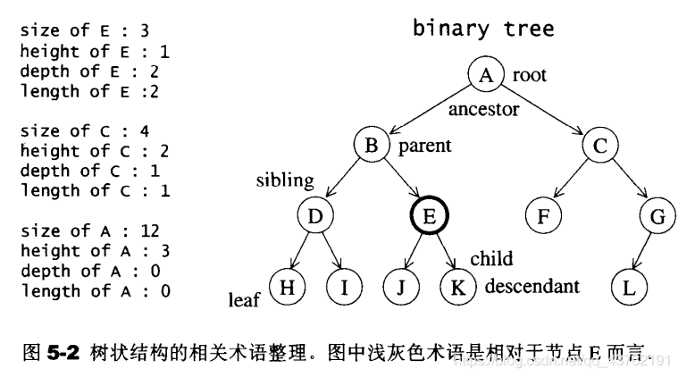  
 树具有以下特点：

```cpp
 1.每个结点有零个或多个子结点；
 2.没有父结点的结点为根结点；
 3.每一个非根结点只有一个父结点；
 4.每个结点及其后代结点整体上可以看做是一棵树，称为当前结点的父结点的一个子树；
```

  树的相关术语（图中那些英文）：

1. 结点的度：一个结点含有的子树的个数称为该结点的度；
2. 叶结点：度为0的结点称为叶结点，也可以叫做终端结点；
3. 分支结点：度不为0的结点称为分支结点，也可以叫做非终端结点；
4. 结点的层次：从根结点开始，根结点的层次为1，根的直接后继层次为2，以此类推；
5. 结点的层序编号：将树中的结点，按照从上层到下层，同层从左到右的次序排成一个线性序列，把他们编成连续的自然数；
6. 树的度：树中所有结点的度的最大值；
7. 树的高度(深度)：树中结点的最大层次；
8. 森林：m（m>=0）个互不相交的树的集合，将一颗非空树的根结点删去，树就变成一个森林；给森林增加一个统一的根结点，森林就变成一棵树；
9. 孩子结点：一个结点的直接后继结点称为该结点的孩子结点；
10. 双亲结点(父结点)：一个结点的直接前驱称为该结点的双亲结点；
11. 兄弟结点：同一双亲结点的孩子结点间互称兄弟结点。

---

## [二叉树](https://so.csdn.net/so/search?q=%E4%BA%8C%E5%8F%89%E6%A0%91&spm=1001.2101.3001.7020)

### 定义

  二叉树就是度不超过2的树(每个结点最多有两个子结点)。上面那张图就是二叉树。

  满二叉树：  
 一个二叉树，如果每一个层的结点树都达到最大值，则这个二叉树就是满二叉树。  
 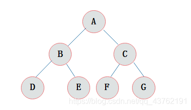  
 完全二叉树：  
 叶节点只能出现在最下层和次下层，并且最下面一层的结点都集中在该层最左边的若干位置的二叉树。  
 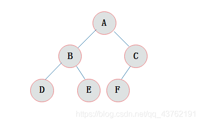​

### 二叉树的创建

  根据对图的观察，我们发现二叉树其实就是由一个一个的结点及其之间的关系组成的，按照面向对象的思想，我们  
 设计一个结点类来描述结点这个事物。

  二叉树的创建其实很简单，跟链表差不多：

```cpp
class TreeNode{ 
private:
	int val;
	TreeNode *left;
	TreeNode *right;
public:
	TreeNode(int x) : val(x), left(NULL), right(NULL) { }
}
```

---

### 二叉树的前中后序遍历

  以下图为例：  
 ​

#### 前序遍历：

  =先访问根结点，然后再访问左子树，最后访问右子树。=

```cpp
void PreOrderTraverse(TreeNode* root){ 
	if(NULL == root)
		return;
	cout<<root->val;
	PreOrderTraverse(root->left);
	PreOrderTraverse(root->right);
}
```

  打印信息：ABDECFG

#### 中序遍历

  =先访问左子树，中间访问根节点，最后访问右子树。=

```cpp
void MidOrderTraverse(TreeNode* root){ 
	if(NULL == root)
		return;
	MidOrderTraverse(root->left);
	cout<<root->val;
	MidOrderTraverse(root->right);
}
```

  打印信息：DBEAFCG

#### 后序遍历

  =先访问左子树，再访问右子树，最后访问根节点。=

```cpp
void LastOrderTraverse(TreeNode* root){ 
	if(NULL == root)
		return;
	LastOrderTraverse(root->left);
	LastOrderTraverse(root->right);
	cout<<root->val;
}
```

  打印顺序：DEBFGCA

#### 已知前序、中序遍历结果，还原二叉树

```cpp
给了中序那就好办了
一：看中序排列中的根节点位置在哪里，根节点前面都属于根的左子树及其后代，后面你懂得。
二：将中序序列分两段：（D、B、E）和（F、C、G）
三：明眼人一看就知道根节点左子树的“根节点”是：B
别问我为啥，问就是看前序序列的第二位
四：重复二三，直到根节点左子树排出来为止
五：同上，排出右子树
```

  具体思路：

  对于任意一颗树而言，前序遍历的形式总是  
 [ 根节点, [左子树的前序遍历结果], [右子树的前序遍历结果] ]  
 即根节点总是前序遍历中的第一个节点。

  而中序遍历的形式总是  
 [ [左子树的中序遍历结果], 根节点, [右子树的中序遍历结果] ]

  只要我们在中序遍历中定位到根节点，那么我们就可以分别知道左子树和右子树中的节点数目。由于同一颗子树的前序遍历和中序遍历的长度显然是相同的，因此我们就可以对应到前序遍历的结果中，对上述形式中的所有左右括号进行定位。

  这样以来，我们就知道了左子树的前序遍历和中序遍历结果，以及右子树的前序遍历和中序遍历结果，我们就可以递归地对构造出左子树和右子树，再将这两颗子树接到根节点的左右位置。

  细节

  在中序遍历中对根节点进行定位时，一种简单的方法是直接扫描整个中序遍历的结果并找出根节点，但这样做的时间复杂度较高。我们可以考虑使用哈希映射（HashMap）来帮助我们快速地定位根节点。对于哈希映射中的每个键值对，键表示一个元素（节点的值），值表示其在中序遍历中的出现位置。在构造二叉树的过程之前，我们可以对中序遍历的列表进行一遍扫描，就可以构造出这个哈希映射。在此后构造二叉树的过程中，我们就只需要 O(1) 的时间对根节点进行定位了。

  下面的代码给出了详细的注释。

```cpp
class Solution { 
private:
    unordered_map<int, int> index;

public:
    TreeNode* myBuildTree(const vector<int>& preorder, const vector<int>& inorder, int preorder_left, int preorder_right, int inorder_left, int inorder_right) { 
        if (preorder_left > preorder_right) { 
            return nullptr;
        }
      
        // 前序遍历中的第一个节点就是根节点
        int preorder_root = preorder_left;
        // 在中序遍历中定位根节点
        int inorder_root = index[preorder[preorder_root]];
      
        // 先把根节点建立出来
        TreeNode* root = new TreeNode(preorder[preorder_root]);
        // 得到左子树中的节点数目
        int size_left_subtree = inorder_root - inorder_left;
        // 递归地构造左子树，并连接到根节点
        // 先序遍历中「从 左边界+1 开始的 size_left_subtree」个元素就对应了中序遍历中「从 左边界 开始到 根节点定位-1」的元素
        root->left = myBuildTree(preorder, inorder, preorder_left + 1, preorder_left + size_left_subtree, inorder_left, inorder_root - 1);
        // 递归地构造右子树，并连接到根节点
        // 先序遍历中「从 左边界+1+左子树节点数目 开始到 右边界」的元素就对应了中序遍历中「从 根节点定位+1 到 右边界」的元素
        root->right = myBuildTree(preorder, inorder, preorder_left + size_left_subtree + 1, preorder_right, inorder_root + 1, inorder_right);
        return root;
    }

    TreeNode* buildTree(vector<int>& preorder, vector<int>& inorder) { 
        int n = preorder.size();
        // 构造哈希映射，帮助我们快速定位根节点
        for (int i = 0; i < n; ++i) { 
            index[inorder[i]] = i;
        }
        return myBuildTree(preorder, inorder, 0, n - 1, 0, n - 1);
    }
};

> 作者：LeetCode-Solution
> 链接：https://leetcode-cn.com/problems/construct-binary-tree-from-preorder-and-inorder-traversal/solution/cong-qian-xu-yu-zhong-xu-bian-li-xu-lie-gou-zao-9/ 来源：力扣（LeetCode） 著作权归作者所有。商业转载请联系作者获得授权，非商业转载请注明出处。

```

  时间复杂度：O(n)，其中 n 是树中的节点个数。

  空间复杂度：O(n)，除去返回的答案需要的 O(n) 空间之外，我们还需要使用 O(n) 的空间存储哈希映射，以及 O(h)（其中 h 是树的高度）的空间表示递归时栈空间。这里 h < nh<n，所以总空间复杂度为 O(n)。

> 作者：LeetCode-Solution  
> 链接：https://leetcode-cn.com/problems/construct-binary-tree-from-preorder-and-inorder-traversal/solution/cong-qian-xu-yu-zhong-xu-bian-li-xu-lie-gou-zao-9/ 来源：力扣（LeetCode） 著作权归作者所有。商业转载请联系作者获得授权，非商业转载请注明出处。

#### 已知后序、中序遍历结果，还原二叉树

  这个LeetCode上没找到，我模仿着写一个。

```cpp
//一、二步同上
//其实第三步原理是一样的，不过我们的脑子习惯了从前到后，所以，让我帮你们转个弯。

//像对中序分割一样，将后序序列也分割了。
//从中序排列的分割中我们知道根节点的右子树有哪些成员，所以后序序列这样分：
//（H I D J K E B）（L F G C）
//现在就很明显可以看出根节点左子树的“根节点”是谁了吧

//重复以上步骤
```

  具体思路：

  对于任意一颗树而言，后序遍历的形式总是  
 [ [左子树的前序遍历结果], [右子树的前序遍历结果],根节点 ]  
 即根节点总是后序遍历中的最后一个节点。

  而中序遍历的形式总是  
 [ [左子树的中序遍历结果], 根节点, [右子树的中序遍历结果] ]

  只要我们在中序遍历中定位到根节点，那么我们就可以分别知道左子树和右子树中的节点数目。由于同一颗子树的后序遍历和中序遍历的长度显然是相同的，因此我们就可以对应到后序遍历的结果中，对上述形式中的所有左右括号进行定位。

  这样以来，我们就知道了左子树的后序遍历和中序遍历结果，以及右子树的后序遍历和中序遍历结果，我们就可以递归地对构造出左子树和右子树，再将这两颗子树接到根节点的左右位置。

```cpp
class Solution { 
private:
    unordered_map<int, int> index;

public:
    TreeNode* myBuildTree(const vector<int>& lastorder, const vector<int>& inorder, int lastorder_left, int lastorder_right, int inorder_left, int inorder_right) { 
        if (lastorder_left > lastorder_right) { 
            return nullptr;
        }
      
        // 后序遍历中的最后一个节点就是根节点
        int lastorder_root = lastorder_right;
        // 在中序遍历中定位根节点
        int inorder_root = index[lastorder[lastorder_root]];
      
        // 先把根节点建立出来
        TreeNode* root = new TreeNode(lastorder[lastorder_root]);
        // 得到左子树中的节点数目
        int size_left_subtree = inorder_root - inorder_left;
        // 递归地构造左子树，并连接到根节点
        // 后序遍历中「从 左边界开始的 size_left_subtree」个元素就对应了中序遍历中「从 左边界 开始到 根节点定位-1」的元素
        root->left = myBuildTree(lastorder, inorder, lastorder_left, lastorder_left + size_left_subtree-1, inorder_left, inorder_root - 1);
        // 递归地构造右子树，并连接到根节点
        // 后序遍历中「从 左边界+左子树节点数目 开始到 右边界-1 」的元素就对应了中序遍历中「从 根节点定位+1 到 右边界」的元素
        root->right = myBuildTree(lastorder, inorder, lastorder_left + size_left_subtree, lastorder_right-1, inorder_root + 1, inorder_right);
        return root;
    }

    TreeNode* buildTree(vector<int>& preorder, vector<int>& inorder) { 
        int n = preorder.size();
        // 构造哈希映射，帮助我们快速定位根节点
        for (int i = 0; i < n; ++i) { 
            index[inorder[i]] = i;
        }
        return myBuildTree(preorder, inorder, 0, n - 1, 0, n - 1);
    }
};
```

### 二叉树的层序遍历

  所谓的层序遍历，就是从根节点（第一层）开始，依次向下，获取每一层所有结点的值，有二叉树如下：  
   
 实现步骤：

```cpp
1.创建队列，存储每一层的结点；
2.使用循环从队列中弹出一个结点：
 2.1获取当前结点的key；
 2.2如果当前结点的左子结点不为空，则把左子结点放入到队列中
 2.3如果当前结点的右子结点不为空，则把右子结点放入到队列中
```

  代码实现

```cpp
#include<queue>
#include<iostream>

using namespace std;

void LevelOrder(Node *root) { 
	if (root == NULL)
		return;
	
	queue<Node *>	q;
	// 启动
	q.push(root);

	while (!q.empty()) { 
		Node *front = q.front();
		q.pop();

		cout<<front->value;

		if (front->left != NULL) 
			q.push(front->left);

		if (front->right != NULL) 
			q.push(front->right);
	}
	cout<<endl;
}
```

---

## [二叉搜索树](https://so.csdn.net/so/search?q=%E4%BA%8C%E5%8F%89%E6%90%9C%E7%B4%A2%E6%A0%91&spm=1001.2101.3001.7020)

### 二叉搜索树是什么？

  所谓二叉搜索树，可提供对数时间的元素插入和访问。二叉搜索树的节点放置规则是：任何节点的键值一定大于去其左子树中的每一个节点的键值，并小于其右子树的每一个节点的键值。

  所以在二叉树中找到最大值和最小值是很简单的，比较麻烦的是元素的插入和移除。  
 插入新元素时，从根节点开始，遇键值较大者就向左，遇键值较小者就向右，一直到尾端，即为插入点。  
 移除旧元素时，如果它是叶节点，直接拿走就是了；如果它有一个节点，那就把那个节点补上去；如果它有两个节点，那就把它右节点的最小后代节点补上去。

  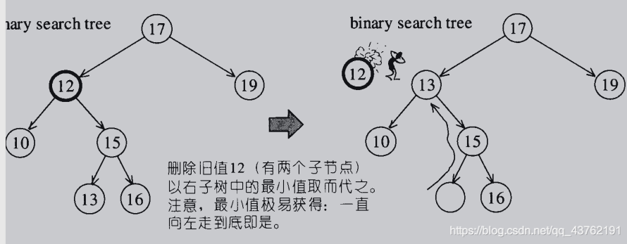​

### 构造二叉搜索树

  现有序列：A = {61, 87, 59, 47, 35, 73, 51, 98, 37, 93}。根据此序列构造二叉搜索树过程如下：

  （1）i = 0，A[0] = 61，节点61作为根节点；  
   （2）i = 1，A[1] = 87，87 > 61，且节点61右孩子为空，故81为61节点的右孩子；  
   （3）i = 2，A[2] = 59，59 < 61，且节点61左孩子为空，故59为61节点的左孩子；  
   （4）i = 3，A[3] = 47，47 < 59，且节点59左孩子为空，故47为59节点的左孩子；  
   （5）i = 4，A[4] = 35，35 < 47，且节点47左孩子为空，故35为47节点的左孩子；  
   （6）i = 5，A[5] = 73，73 < 87，且节点87左孩子为空，故73为87节点的左孩子；  
   （7）i = 6，A[6] = 51，47 < 51，且节点47右孩子为空，故51为47节点的右孩子；  
   （8）i = 7，A[7] = 98，98 < 87，且节点87右孩子为空，故98为87节点的右孩子；  
   （9）i = 8，A[8] = 93，93 < 98，且节点98左孩子为空，故93为98节点的左孩子；创建完毕后如图2.4中的二叉搜索树：

  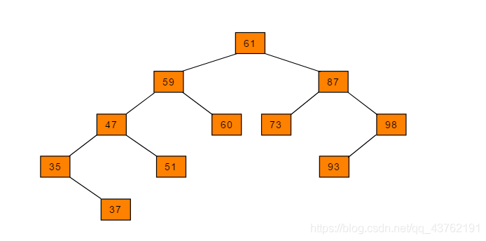​

### 代码实现：

```cpp
#include<vector>
#include<iostream>

using namespace std;

class SerchTree{ 
private:
	TreeNode* root;
public:
	SerchTree();

	//插入节点
	void Insert_Node(TreeNode* root,int val){ 
		if(NULL == root)
			root = new TreeNode(val);
		else{ 
			if(val<root->val)
				Insert_Node(root->left,val);
			else{ 	//一样大就往左走吧
				Insert_Node(root->right,val);
			}
		}
	}

	//从数组中构造二叉搜索树
	void Create_SerchTree(vector<int>& vec){ 
		int sz = vec.size();
		for(int i = 0;i<sz;i++){ 
			Insert_Node(root,vec[i]);
		}
	}

	//搜索某个节点是否存在
	bool SerchNode(TreeNode* root,int val){ 
		if(NULL == root)
			return false;
		if(val<root->val)
			return SerchNode(root->left,val);
		else if(val>root->val)
			return SerchNode(root->right)
		else
			return ture;
	}

	//删除节点
	void DelNode(TreeNode* node){ 
		TreeNode* temp;
		if(NULL == node->right){ 	//如果右子节点为空
			temp = node;
			node = node->left;
			delete temp;
		}
		else{ 	//如果右子节点不空
			temp = node;
			while(NULL != temp->left){ 
				temp = temp->left;
			}
			node->val = temp->val;
			delete temp;
		}
	}
	//删除某个节点
	void DelSerchNode(TreeNode* root,int val){ 
		if(NULL == root)
			return;
		if(val<root->val)
			return DelSerchNode(root->left,val);
		else if(val>root->val)
			return DelSerchNode(root->right)
		else
			DelNode(root);
	}

	//计算二叉树的最大深度
	int maxDepth(Node x) {  	//1.如果根结点为空，则最大深度为0； 
		if (x == null) 
			return 0; 
	
		int max = 0; 
		int maxL = 0; 
		int maxR = 0; 

		//2.计算左子树的最大深度； 
		if (x.left != null)  
			maxL = maxDepth(x.left); 
		
		//3.计算右子树的最大深度； 
		if (x.right != null)
			maxR = maxDepth(x.right);
			 
		//4.当前树的最大深度=左子树的最大深度和右子树的最大深度中的较大者+1 
		max = maxL > maxR ? maxL + 1 : maxR + 1; return max; 
	}
}
```

---

## 平衡二叉搜索树（[AVL树](https://so.csdn.net/so/search?q=AVL%E6%A0%91&spm=1001.2101.3001.7020)）

### 什么是平衡二叉搜索树？

  二叉搜索树一定程度上可以提高搜索效率，但是当原序列有序，例如序列A = {1，2，3，4，5，6}，构造二叉搜索树如图。依据此序列构造的二叉搜索树为右斜树，同时二叉树退化成单链表，搜索效率降低为O(n)。

  如下图：  
 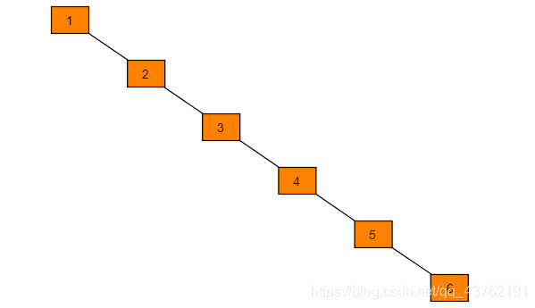  
 在此二叉搜索树中查找元素6需要查找6次。二叉搜索树的查找效率取决于树的高度，因此保持树的高度最小，即可保证树的查找效率。同样的序列A，改为下图方式存储，查找元素6时只需比较3次，查找效率提升一倍。  
 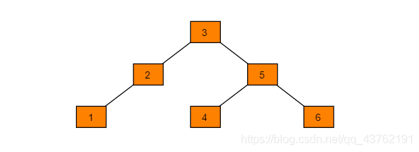​

  可以看出当节点数目一定，保持树的左右两端保持平衡，树的查找效率最高。这种左右子树的高度相差不超过1的树为平衡二叉树。

### AVL树的节点数据结构

  和上面使用的那个普通结构略有不同。

```cpp
    class AVLNode
    { 
    private:
        int depth; //深度，这里计算每个结点的深度，通过深度的比较可得出是否平衡
        Tree parent; //该结点的父节点，方便操作
        int val; //结点值
        TreeNode lchild;
        TreeNode rchild;
      
    public:
        AVLNode(int val=0)
        { 
            parent=NULL;
            depth=0;
            lchild=rchild=NULL;
            this->val=val;
        }
    };
```

### AVL树构造

  初始构造的时候，先把数组排序之后进行构造，这里不多说。

  直接看调整树的节点使平衡的操作：旋转

#### 左旋

  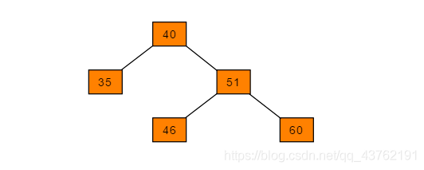  
 插入62：  
 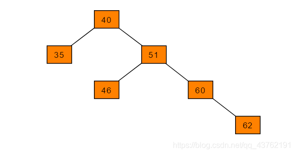​

  可以得出40节点的左子树高度为1，右子树高度为3，此时平衡因子为-2，树失去平衡。为保证树的平衡，此时需要对节点40做出旋转，​=因为右子树高度高于左子树，对节点进行左旋操作=​，流程如下：

```cpp
（1）节点的右孩子替代此节点位置
（2）右孩子的左子树变为该节点的右子树
（3）节点本身变为右孩子的左子树
```

  图解过程：  
 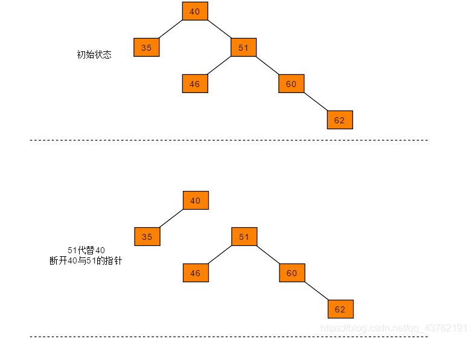  
 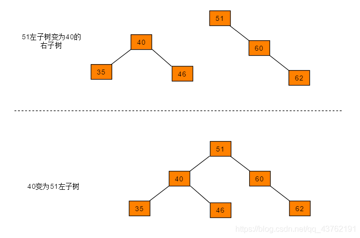​

#### 右旋

  右旋操作与左旋类似，操作流程为：

```cpp
（1）节点的左孩子代表此节点
（2）节点的左孩子的右子树变为节点的左子树
（3）将此节点作为左孩子节点的右子树。
```

  图解过程：

  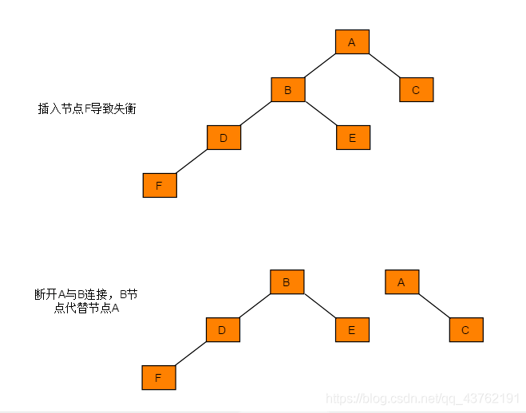​

  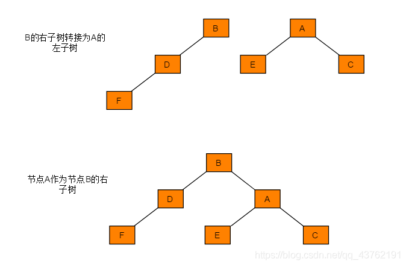​

#### 双旋转

  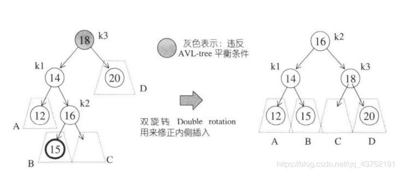  
 这个图我就要说两句了，有的人可能乍一看会觉得这用上面的单旋转就好了，为什么根节点不是14而是16？为什么这个会要叫双旋转？转着好玩的吗？

  其实不然，你可以试着把单旋转做法的图画出来，将会惊奇的发现，还是不平衡，这就很尴尬了。

  正确的转法应该是这样的：  
 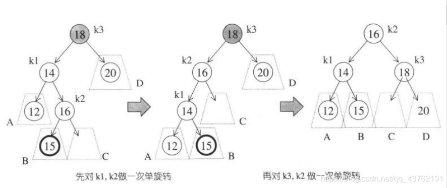​

### 新增节点（背多分）

  本部分参考自：[详细图文 - AVL树](https://blog.csdn.net/qq_25343557/article/details/89110319)

  往平衡二叉树中添加节点很可能会导致二叉树失去平衡，所以我们需要在每次插入节点后进行平衡的维护操作。插入节点破坏平衡性有如下四种情况：

#### LL(右旋)

  LL的意思是向左子树（L）的左孩子（L）中插入新节点后导致不平衡，这种情况下需要右旋操作，而不是说LL的意思是右旋，后面的也是一样。  
 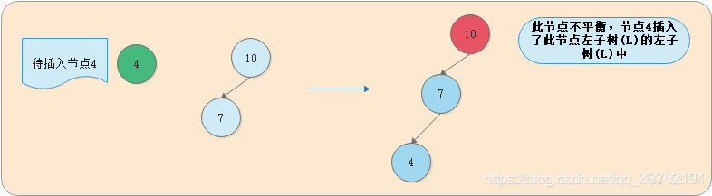  
 我们将这种情况抽象出来，得到下图：  
 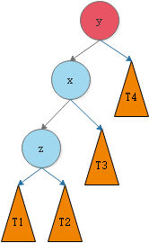​

  我们需要对节点y进行平衡的维护。步骤如下图所示：

  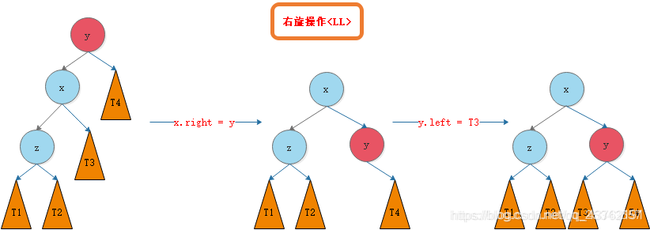  
 （被水印挡住部分：T1,T2,T3,T4）

  代码实现：

```cpp
AVLNode rightRotate(AVLNode y){ 
	AVLNode x = y.lchild;	//即将返回的节点是y的左子节点
	AVLNode t3 = x.rchild;	//先把y的右子节点取出来
	x.rchild = y;			//把y放进x的右子节点
	y.lchild = t3;			//把前面预存的放到y的左子节点
	//更新height
	y.height = Math.max(getHeight(y.lchild),getHeight(y.rchild))+1;
	x.height = Math.max(getHeight(x.lchild),getHeight(x.rchild))+1;
	return x;
}
```

#### RR(左旋)

  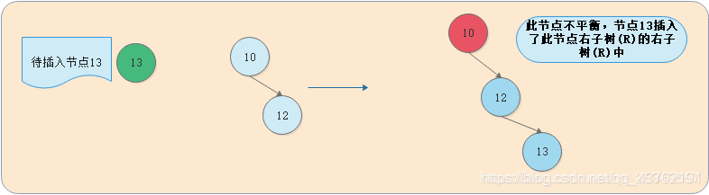  
 我们将这种情况抽象出来，得到下图：  
 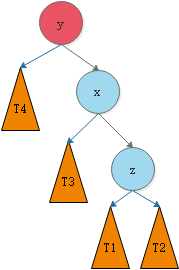  
 我们需要对节点y进行平衡的维护。步骤如下图所示：

  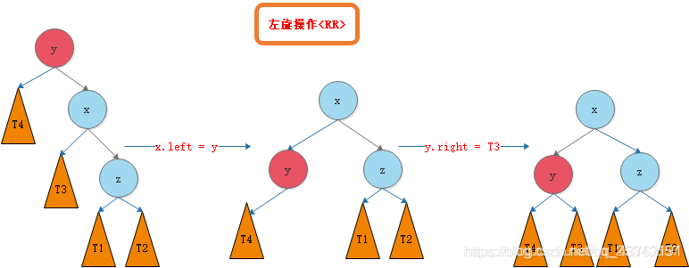  
 （被水印挡住部分：T4,T3,T1,T2）

  代码实现：

```cpp
AVLNode leftRotate(AVLNode y){ 
	AVLNode x = y.rchild;
	NAVLNode ode t2 = x.lchild;
	x.lchild= y;
	y.rchild= t2;
	//更新height
	y.height = Math.max(getHeight(y.lchild),getHeight(y.rchild))+1;
	x.height = Math.max(getHeight(x.lchild),getHeight(x.rchild))+1;
	return x;
}
```

#### LR

  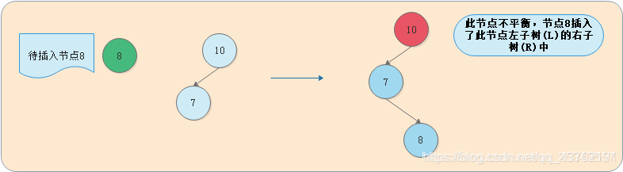  
 我们将这种情况抽象出来，得到下图：  
 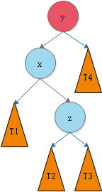​

  我们需要对节点y进行平衡的维护。步骤如下图所示：

  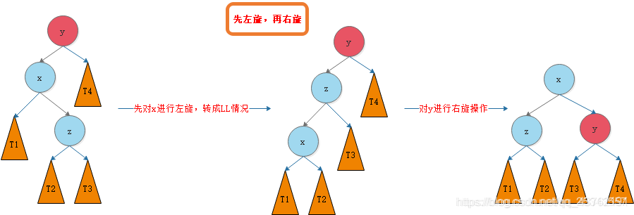  
 第三个图里面x和z的位置换一下。

#### RL

  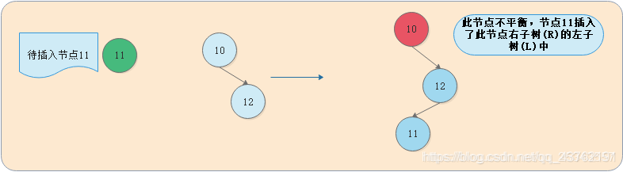  
 我们将这种情况抽象出来，得到下图：

  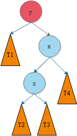​

  我们需要对节点y进行平衡的维护。步骤如下图所示：

  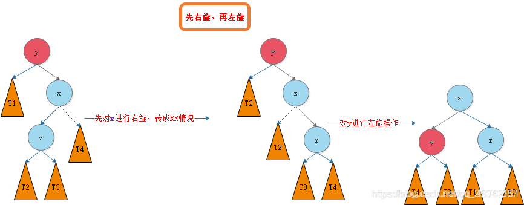第二个图中y的左孩子为T1，第三个图中x和z反了。

  （被水印遮住的部分为：T1，T2，T3，T4）

#### 插入节点

```cpp
AVLNode add(AVLNode node, int val){ 
	if(node == null){ 
		size ++;
		return new AVLNode(val);
	}
	if(val.compareTo(node.val) < 0)
		node.lchild = add(node.lchild, val);
	else if(val.compareTo(node.val) > 0)
		node.rchild = add(node.rchild, val);
	//更新height
	node.height = 1+Math.max(getHeight(node.lchild),getHeight(node.rchild));
	//计算平衡因子
	int balanceFactor = getBalanceFactor(node);
	if(balanceFactor > 1 && getBalanceFactor(node.lchild)>0) { 
		//右旋LL
		return rightRotate(node);
	}
	if(balanceFactor < -1 && getBalanceFactor(node.rchild)<0) { 
		//左旋RR
		return leftRotate(node);
	}
	//LR
	if(balanceFactor > 1 && getBalanceFactor(node.lchild) < 0){ 
		node.lchild = leftRotate(node.lchild);
		return rightRotate(node);
	}
	//RL
	if(balanceFactor < -1 && getBalanceFactor(node.rchild) > 0){ 
		node.rchild = rightRotate(node.rchild);
		return leftRotate(node);
	}
	return node;
}
```

  里面的几个必备函数：

```cpp
int getBalanceFactor(AVLNode node){ 
	if(node==NULL){ 
		return 0;
	}
	return getHeight(node.lchild)-getHeight(node.rchild);
}
```

```cpp
int getHeight(AVLNode node){ 
	if(node==NULL){ 
		return 0;
	}
	return node.height;
}
```

```cpp
//compareTo方法：
返回值是整型，它是先比较对应字符的大小(ASCII码顺序)，如果第一个字符和参数的第一个字符不等，结束比较，返回他们之间的差值，如果第一个字符和参数的第一个字符相等，则以第二个字符和参数的第二个字符做比较，以此类推,直至比较的字符或被比较的字符有一方结束。

    如果参数字符串等于此字符串，则返回值 0；
    如果此字符串小于字符串参数，则返回一个小于 0 的值；
    如果此字符串大于字符串参数，则返回一个大于 0 的值。
```

#### 删除节点

```cpp
int remove(int e){ 
	AVLNode node = getNode(root, e);
	if(node != NULL){ 
		root = remove(root, e);
		return node.e;
	}
	return NULL;
}

AVLNode remove(AVLNode node, int e){ 
	if( node == NULL )
		return NULL;
	AVLNode retNode;
	if( e.compareTo(node.e) < 0 ){ 
		node.left = remove(node.left , e);
		retNode = node;
	}
	else if(e.compareTo(node.e) > 0 ){ 
		node.right = remove(node.right, e);
		retNode = node;
	}
	else{    // e.compareTo(node.e) == 0
		// 待删除节点左子树为空的情况
		if(node.left == NULL){ 
			Node rightNode = node.right;
			node.right = NULL;
			size --;
			retNode = rightNode;
		}
		// 待删除节点右子树为空的情况
		else if(node.right == NULL){ 
			Node leftNode = node.left;
			node.left = NULL;
			size --;
			retNode = leftNode;
		}else { 
			// 待删除节点左右子树均不为空的情况
			// 找到比待删除节点大的最小节点, 即待删除节点右子树的最小节点
			// 用这个节点顶替待删除节点的位置
			Node successor = minimum(node.right);
			successor.right = remove(node.right, successor.e);
			successor.left = node.left;

			node.left = node.right = NULL;

			retNode = successor;
		}
	}
	if(retNode==NULL)
		return NULL;
	//维护平衡
	//更新height
	retNode.height = 1+Math.max(getHeight(retNode.left),getHeight(retNode.right));
	//计算平衡因子
	int balanceFactor = getBalanceFactor(retNode);
	if(balanceFactor > 1 && getBalanceFactor(retNode.left)>=0) { 
		//右旋LL
		return rightRotate(retNode);
	}
	if(balanceFactor < -1 && getBalanceFactor(retNode.right)<=0) { 
		//左旋RR
		return leftRotate(retNode);
	}
	//LR
	if(balanceFactor > 1 && getBalanceFactor(retNode.left) < 0){ 
		node.left = leftRotate(retNode.left);
		return rightRotate(retNode);
	}
	//RL
	if(balanceFactor < -1 && getBalanceFactor(retNode.right) > 0){ 
		node.right = rightRotate(retNode.right);
		return leftRotate(retNode);
	}
	return retNode;
}
```

  Java代码我是不排斥的，我都看得懂一些，主要是思想。

---

## [红黑树](https://so.csdn.net/so/search?q=%E7%BA%A2%E9%BB%91%E6%A0%91&spm=1001.2101.3001.7020)

### 1、红黑树？长什么果实吗

  红黑树，又称RB-tree，是一种平衡二叉搜索树。不过它这个平衡没有AVL-tree要求那么严格罢了。（最长路径不超过最短路径的两倍）

  红黑树的规矩：

1. 每个节点，非黑即红。
2. 根节点为黑。
3. 不能存在连续的两个红节点。
4. 任何节点，至其下属的、不同的叶节点的每条路径上，黑节点数必须相等。

  好，看了上面这些规矩，你是不是在想：这什么SJ病的规矩，这还是人能弄出来的吗？  
 没错，我就是这样想的，这样想很正常。确实绕。

  稍微来看一下这几个规则。  
 首先规则四便锁死了新增节点，妥妥得是红节点。  
 然而规则三又锁定了叶节点的父节点为黑节点。

  那就涉及到一个问题：如果某叶节点为红，要再它后面新增节点，怎么办？  
 那就只有调整颜色并旋转树形。

  这个调整的时候，可不能忘了它是红黑树，还是平衡二叉树，更是搜索树。所以还得守平衡二叉搜索树的规矩。

### 2、红黑树的节点设计

```cpp
typedef bool __rb_tree_color_type;
const __rb_tree_color_type __rbtree_red = false;	//红0
const __rb_tree_color_type __rbtree_black = true;	//黑1

struct __rb_tree_node_base
{ 
	typedef __rb_tree_color_type color_type;
	typedef __rb_tree_node_base* base_ptr;
	color_type color;
	base_ptr parent;
	base_ptr left;
	base_ptr right;

	static base_ptr minimum(base_ptr x)
	{  ··· }
	static base_ptr maximum(base_ptr x)
	{  ··· }
}
```

```cpp
template <class Value>
struct __rb_tree_node :public __rb_tree_node_base
{ 
	typedef ____rb_tree_node<Value>* link_type;
	Value value_field;	//节点值
} 

```

### 3、 红黑树的数据结构

  红黑树每次配置一个节点的空间。

```cpp
template<class Key,class Value,class KeyOfValue,class Compare,class Alloc = alloc>
class rb_tree
{ 
protected:
	typedef void* void_pointer;
	typedef __rb_tree_node<Value> rb_tree_node;
	typedef	__rb_tree_node* base_ptr;
	typedef simple_alloc<rb_tree_node,Alloc> rb_tree_node_allocator;
	typedef __rb_tree_color_type color_type;

public:
	typedef Key key_type;
	typedef Value value_type;
	typedef value_type* pointer;
	typedef const value_type* const_pointer;
	typedef value_type& reference;
	typedef rb_tree_node* link_node;
	typedef size_t size_type;
	typedef	ptrdiff_t difference_type;

protected:
	···	
	link_type header;	//这是实现上的一个技巧
	Compare key_compare;	//节点间的键值大小比较准则

	//以下三个函数用于取得header的成员
	link_type& root() const {  return (link_type&)header->parent; }
	link_type& leftmost() const {  return (link_type&)header->left; }
	link_type& rightmost() const {  return (link_type&)header->right; }

	···

};
```

  红黑树的构造有两种，一种是显式定义的复制构造函数，另一种是一颗空树。

### 4、红黑树插入节点

#### 4.1 元素插入操作(insert_equal())

  允许节点键值相同

```cpp
//返回的是一个RB-tree迭代器，指向新增节点

template<class Key,class Value,class KeyOfValue,class Compare,class Alloc>
typename rb_tree<Key,Value,KeyOfValue,Compare,Alloc>::iterator		//	这一行是返回值类型
rb_tree<Key,Value,KeyOfValue,Compare,Alloc>::insert_equal(const Value& v)	//这句看不懂的话我还有另一篇博客专门讲解这种句法，只是代码块里面放不了链接
{ 
	link_type y = header;
	link_type x = root();

	while(x!=0)
	{ 
		y = x;
		x = key_compare(KeyOfValue()(v),key(x)) ? left(x) : right(x);	//左右转
	}
	return __insert(x,y,v);	//x:新值插入点  y:插入点之父节点  v:新值
}
```

#### 4.2 元素插入操作(insert_unique())

  插入新值，节点键值不允许重复，若重复则插入无效

```cpp
template<class Key,class Value,class KeyOfValue,class Compare,class Alloc>
pair<typename rb_tree<Key,Value,KeyOfValue,Compare,Alloc>::iterator>		//	这一行是返回值类型
rb_tree<Key,Value,KeyOfValue,Compare,Alloc>::insert_unique(const Value& v)
{ 
	link_type y = header;
	link_type x = root();

	bool comp = true;
	while( x != 0 )
	{ 
		y = x;
		comp = key_compare(KeyOfValue()(v),key(x));
		 x = comp ? left(x) : right(x);	//左右转
	}
	//循环转出来之后，y所指的便是插入节点的父节点，此时y必为叶节点
	iterator j = iterator(y);	//令迭代器j指向插入y
	if(comp)	//y节点值大于新值
		if(j == begin())	//如果插入点的父节点为最左
			return pair<iterator,bool>(__insert(x,y,v),true);
		else
			--j;	//调整j,回头准备测试（我也不知道要测试啥）
	if(key_compare(key(j.node)KeyOfValue(key())(v))	//y节点小于新值
		return pair<iterator,bool>(__insert(x,y,v),true);

return pair<iterator,bool>(j,false);//要是走到这一步，那说明键值重复了
}
```

#### 4.3 插入的幕后黑手(__insert())

```cpp
template<class Key,class Value,class KeyOfValue,class Compare,class Alloc>
typename rb_tree<Key,Value,KeyOfValue,Compare,Alloc>::iterator		//	这一行是返回值类型
rb_tree<Key,Value,KeyOfValue,Compare,Alloc>::__insert(base_ptr x_,base_ptr y_,const Value& v)
{ 
	link_type y = link_type y_;
	link_type x = link_type x_;
	link_type z;

	if(y == header || x!=0 || Key_compare(KeyOfValue()(v),key(y)))
	{ 
		z = create_node(v);	//产生一个新节点
		left(y) = z;
		if(y == header)
		{ 
			root() = z;
			rightmost() = z;
		}
		else if(y == leftmost())
			leftmost() = z;
	}
	else
	{ 
		z = create_node(v);
		right(y) = z;
		if(y == rightmost())
			rightmost() = z;
	}
	parent(z) = y;	//设定新节点的父节点
	left(z) = 0;
	right(z) = 0;

	__rb_tree_rebalalance(z,header->parent);
	++node_count;
	return iterator(z);	//返回一个迭代器，指向新节点

}
```

### 5、调整红黑树

#### 旋转与改变颜色

  任何插入操作，在插入完成之后，都需要做一次调整性操作，将树的状态调整到符合RB-tree的要求。

```cpp
//函数功能：重新令树型平衡

inline void __rb_tree_rebalance(__rb_tree_node_base* x/* 新增节点*/,__rb_tree_node_base*& root)
{ 
	x->color = __rb_tree_red;
	while( x != root && x->parent->color == __rb_tree_red)	//父节点为红
	{ 
		if( x->parent == x->parent->parent->left )	//父节点为祖父节点的左子节点
		{ 
			__rb_tree_node_base* y = x->parent->parent->right;	//将y作为它的伯父节点
			if( y && y->color == __rb_tree_red)	//如果真的有伯父节点，且为红
			{ 
				x->parent->color = __rb_tree_black;	//将父节点改黑
				y->color = __rb_tree_black;	//将伯父也抹黑
				y->parent->color = __rb_tree_red;	//把爷爷放红
				x = x->parent->parent;	//自己当爷爷						
			}
			else	//没有伯父，或者伯父是非洲回来的
			{ 
				if( x == x->parent->right)	//如果新节点为父节点右孩子
				{ 
					x = x->parent;	//自己当爸爸
					__rb_tree_rotate_left(x,root);	//第一参数为左旋点
				}
				x->parent->color = __rb_tree_black;	//将父节点抹黑
				x->parent->parent->color = __rb_tree_red;	//把爷爷放红
				__rb_tree_rotate_right(x->parent->parent,root);	//第一参数为右旋点
			}
		}
		else	//父节点为祖父节点右子节点
		{ 
			__rb_tree_node_base* y = x->parent->parent->left;	//令y为伯父节点
			if( y && y->color == __rb_tree_red)	//如果真的有伯父节点，且为红
			{ 
				x->parent->color = __rb_tree_black;	//将父节点改黑
				y->color = __rb_tree_black;	//将伯父也抹黑
				y->parent->color = __rb_tree_red;	//把爷爷放红
				x = x->parent->parent;	//自己当爷爷						
			}
			else	//没有伯父，或者伯父是非洲回来的
			{ 
				if( x == x->parent->left)	//如果新节点为父节点左孩子
				{ 
					x = x->parent;	//自己当爸爸
					__rb_tree_rotate_right(x,root);	//第一参数为左旋点
				}
				x->parent->color = __rb_tree_black;	//将父节点抹黑
				x->parent->parent->color = __rb_tree_red;	//把爷爷放红
				__rb_tree_rotate_right(x->parent->parent,root);	//第一参数为右旋点
			}
		}
	}	//while结束
	root->color = __rb_tree_black;	//根节点抹黑
}
```

  //源码之前，了无秘密。  
 操作流程图稍后会画。

```cpp
//左旋

inline void __rb_tree_rotate_left(__rb_tree_node_base* x,__rb_tree_node_base*& root)
{ 
	__rb_tree_node_base* y = x->right;	//令y为旋转点的右子节点
	x->right = y->left;	//令旋转点的右子节点的左子节点为旋转点的右节点
	if(y->left != 0)
		y->left->parent = x;	//并不知道这个有什么意义
	y->parent = x->parent;

	//令y完全顶替x的位置
	if(x == root)
		root = y;
	else if(x == x->parent->left)
		x->parent->left = y;
	else
		x->parent->right = y;
	y->left = x;
	x->parent = y;
}
```

```cpp
//右旋

inline void __rb_tree_rotate_right(__rb_tree_node_base* x,__rb_tree_node_base*& root)
{ 
	__rb_tree_node_base* y = x->left;	//令y为旋转点的左子节点
	x->left = y->right;	//令旋转点的右子节点的左子节点为旋转点的右节点
	if(y->right != 0)
		y->right->parent = x;	//并不知道这个有什么意义
	y->parent = x->parent;

	//令y完全顶替x的位置
	if(x == root)
		root = y;
	else if(x == x->parent->right)
		x->parent->right = y;
	else
		x->parent->left = y;
	y->right = x;
	x->parent = y;
}
```

### 6、红黑树工作流程图

  前面都是不说两句就贴代码，接下来就比较友好了，贴图。  
 话说，源码之前，了无秘密。但是就算备注给你了，看着还费劲呢。

  所以，我便想重源码之中整理处一份流程图，留待有缘人。CSDn上搜红黑树，一搜一大把，但是既然打开了我的，看了这么多，那我就得留点彩蛋才是》

  先来张​**红黑树的流程图**​：  
 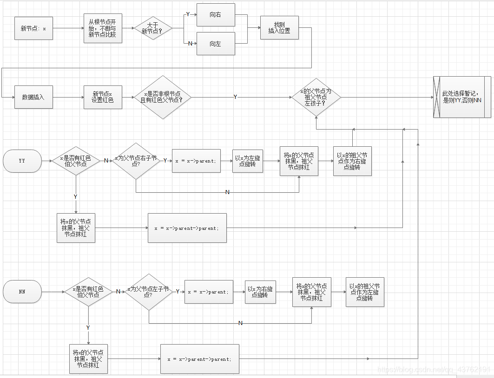​

### 7、红黑树图示

  由于时间关系这里没配上操作图了，  
 其实是我发现另一篇的图实在太精美了，让我不好意思画了。

  这里给出链接：[漫画图解 - 红黑树](https://blog.csdn.net/p5deyt322jacs/article/details/78433942)

## 哈夫曼树

### 什么是哈夫曼树

  哈夫曼大叔说，从树中一个结点到另一个结点之间的分支构成2个结点之间的路径，路劲上的分支数目称作路径长度。树的路径长度就是从树根到每一结点的路径长度之和。如果考虑到带权的结点，结点的带权的路径长度就为从该结点到树根之间的路径长度与结点上权的乘积。树的带权路径长度为树中所有叶子结点的带权路径长度之和。

  假设有n个权值{W1,W2…,Wn}，构造一棵n个叶子结点的二叉树，每个叶子结点带权Wk，每个叶子的路径长度为1k，我们通常记作，其中带权路径长度WPL最小的二叉树称为哈夫曼树（又称最优二叉树）。

### 哈夫曼树构造步骤

```cpp
根据给定的n个权值{ W1,W2,...,Wn}构成n棵二叉的集合F={ T1,T2,...Tn}，其中每棵二叉树Ti只有一个带权为Wi的根结点，其左右子树均为空。
在F中选取2棵根结点最小的树 作为左右子树 构造一棵新的二叉树，且新的二叉树的根结点左右子树根结点权值之和。
在F中删除这2棵子树，同时将新得到的二叉树加入F中。
重复2和3步骤，直到F只含一棵树为止，这棵树便是哈夫曼树。
```

### 代码

```cpp
//.h

#pragma once 
#ifndef __HUFFMANTREE_H__
#define __HUFFMANTREE_H__
 
//创建哈夫曼树提供的字符的最大长度
#define MAX_SZ 256
//哈夫曼编码字符串最大长度
#define MAX_ENCODE 1024
//哈夫曼树结点数据结构
typedef struct HuffmanNode
{ 
	char data;
	struct HuffmanNode *lchild, *rchild;
}HuffmanNode,*HuffmanTree;
 
//哈夫曼编码表结点数据结构
typedef struct HuffmanTableNode
{ 
	char data;		//字符
	char *encode;	//字符对应的哈夫曼编码
	struct HuffmanTableNode *next;
}HuffmanTableNode;
//哈夫曼编码表数据结构
typedef struct HuffmanTable
{ 
	HuffmanTableNode* front;//指向队头元素
	HuffmanTableNode* tail;	//指向队尾元素
}HuffmanTable;
 
//根据用户提供原始数据，生成对应的哈夫曼树
HuffmanTree BuildHuffmanTree(char* inputString);
 
//根据哈夫曼树 生成对应的哈夫曼编码表
HuffmanTable* BuildHuffmanTable(HuffmanTree tree);
 
//对用户提供的源字符进行哈夫曼编码
char* encode(HuffmanTable* table, char* src);
 
//根据用户提供的哈夫曼编码进行解码
char* decode(HuffmanTree root, char* encode);
 
//遍历哈夫曼编码表
void TraverseHuffmanTable(HuffmanTable* table);
#endif // !__HUFFMANTREE_H__
```

```cpp
//.cpp

#define _CRT_SECURE_NO_WARNINGS
#include <stdlib.h>
#include <stdio.h>
#include <string.h>
#include "HuffmanTree.h"
#include "HuffQueue.h"
 
//根据用户提供字符集，生成对应的哈夫曼树
HuffmanTree BuildHuffmanTree(char* inputString)
{ 
	//统计每个字符出现的权值
	int charWeight[MAX_SZ] = {  0 };
	for (int i = 0; i < inputString[i]!='\0'; i++)
	{ 
		charWeight[(unsigned char)inputString[i]]++;
	}
	HuffQueue* queue = NULL;
	InitHuffQueue(&queue);
 
	for (int i = 0; i <MAX_SZ; i++)
	{ 
		//对应的字符有权值，创建树结点，添加到树节点队列中
		if (charWeight[i])
		{ 
			HuffmanNode* treeNode = (HuffmanNode*)malloc(sizeof(HuffmanNode));
			treeNode->data = i;
			treeNode->lchild = treeNode->rchild = NULL;
			AddHuffQueueNode(queue, treeNode, charWeight[i]);
		}
	}
	//根据哈夫曼树创建原理构建哈夫曼树
	//核心就是将权值最小的2个结点，取出作为新创建树结点的孩子结点，新创建树结点的权值为它们之和，然后放回树结点队列
	//一直这样循环进行操作，直到队列中最后剩一个结点，它就是树的根结点。
	while (queue->size != 1)
	{ 
		HuffQueueNode* node1 = GetHuffQueueNode(queue);
		HuffQueueNode* node2 = GetHuffQueueNode(queue);
		HuffmanNode* treeNode = (HuffmanNode*)malloc(sizeof(HuffmanNode));
		treeNode->data = '\0';
		treeNode->lchild = node1->treeNode;
		treeNode->rchild = node2->treeNode;
		int weightNum = node1->weightNum + node2->weightNum;
		AddHuffQueueNode(queue, treeNode, weightNum);
	}
	return queue->first->treeNode;
}
/*
递归遍历哈夫曼树
depth 树的深度
tree 哈夫曼树
hTable 哈夫曼编码表
encode 字符对应的哈夫曼编码
*/
void traverseHuffTree(HuffmanTable* hTable,HuffmanTree tree,char* encode,int depth)
{ 

	if (NULL == tree->lchild && NULL == tree->rchild)
	{ 
		HuffmanTableNode* tableNode = (HuffmanTableNode*)malloc(sizeof(HuffmanTableNode));
		tableNode->data = tree->data;
		tableNode->next = NULL;
		encode[depth] = '\0';
		tableNode->encode = (char*)malloc(depth+1);
		strcpy(tableNode->encode, encode);
		if (hTable->front == NULL)
		{ 
			hTable->front = hTable->tail = tableNode;
		}
		else
		{ 
			hTable->tail->next = tableNode;
			hTable->tail = tableNode;
		}
	}
	if (NULL != tree->lchild)
	{ 
		encode[depth] = '0';//左分支代表0
		traverseHuffTree(hTable, tree->lchild, encode, depth+1);
	}
 
	if (NULL != tree->rchild)
	{ 
		encode[depth] = '1';//右分支代表1
		traverseHuffTree(hTable, tree->rchild, encode, depth+1);
	}
	return;
}
 
//根据哈夫曼树生成哈夫曼编码表
HuffmanTable * BuildHuffmanTable(HuffmanTree tree)
{ 
	HuffmanTable* hTable = (HuffmanTable*)malloc(sizeof(HuffmanTable));
	hTable->front = hTable->tail = NULL;
	char encode[MAX_SZ] = {  0 };
	traverseHuffTree(hTable, tree, encode, 0);
	return hTable;
}
 
//对用户提供的源字符进行哈夫曼编码
char* encode(HuffmanTable* table,char* src)
{ 
	char* encode = (char*)calloc(sizeof(char)*MAX_ENCODE,1);
	for (int i = 0; i < src[i]!='\0'; i++)
	{ 
		char ch = src[i];
		HuffmanTableNode* iterator = table->front;
		while (iterator != NULL)
		{ 
			if (iterator->data == ch)
			{ 
				strcat(encode, iterator->encode);
				break;
			}
			iterator = iterator->next;
		}
		if (iterator == NULL)
		{ 
			printf("哈夫曼编码表中没有字符%c对应的哈夫曼编码！\n",ch);
			return NULL;
		}
	}
	return encode;
}
 
//根据用户提供的哈夫曼编码进行解码
char* decode(HuffmanTree root,char* encode)
{ 
	char* decode = (char*)calloc(MAX_SZ, 1);
	HuffmanTree tree = root;
	for (int i = 0; i < encode[i]!='\0'; i++)
	{ 
		char ch = encode[i];
		if ('0' == ch)//0 往左走
		{ 
			tree = tree->lchild;
		}
		else//1 往右走
		{ 
			tree = tree->rchild;
		}
		//走到头，也就是找到相应的 源字符了
		if (tree->lchild == NULL && tree->rchild == NULL)
		{ 
			strncat(decode, &tree->data, 1);
			//找到字符后，树节点回到根结点，继续解码
			tree = root;
		}
	}
	return decode;
}
 
//打印哈夫曼编码表
void TraverseHuffmanTable(HuffmanTable* table)
{ 
	HuffmanTableNode* node = table->front;
	while (node != NULL)
	{ 
		printf("源字符:%c ->哈夫曼编码:%s\n", node->data, node->encode);
		node = node->next;
	}
}
 
int main(int argc, char *argv[])
{ 
	HuffmanTree tree = BuildHuffmanTree("aabbccc");
	HuffmanTable* table = BuildHuffmanTable(tree);
	TraverseHuffmanTable(table);
	char *src = "abc";
	char* dest = "10110101101";
	char* encode_str = encode(table, src);
	char* decode_str = decode(tree, dest);
	printf("原始字符串:%s ->哈夫曼编码:%s\n", src, encode_str);
	printf("哈夫曼编码:%s ->解码为:%s\n", dest, decode_str);
	return 0;
}
```

---

## 浅谈多路查找树（[B树](https://so.csdn.net/so/search?q=B%E6%A0%91&spm=1001.2101.3001.7020)）

  曾今我不知道多叉树有上面用，所以对于多叉树并没有过多的关注，或者说，基本没关注。  
 直到我了解到了多路查找树（B树），我知道，是我浅薄了。

  先不说那些高深莫测的内容，我们就通俗的聊聊。

  我们现在常说大数据大数据，就算没说过也听过不少了。但是我们的系统的内存就那么大，而外部硬盘却可以达到成千上百个G。

  我们之前聊的数据结构，都是基于内存的，因此考虑的是内存中的运算时间复杂度。但是如果我们操作的数据集非常大，大到内存已经无法处理了，这也是很正常的现象，比方说某个程序要从文件系统中取一个文件出来，这个时间复杂度就会发生变化了。

  试想一下，要在一个拥有几十万个文件的文件系统中查找一个文件，你所设计的算法需要读取磁盘上千次还是几十次，这是有本质上的差异的，后者可能是几秒，前者可能就要几分钟了，你能忍？找个文件都要等几分钟！！！

### 2-3树

  这是一个简单的多路查找树，学新东西嘛，自然从最简单的开始。什么是多路查找树？和二叉树做个比较可能会比较直观：二叉树，你可以叫它二路查找树。明白了吧。

  那么**2-3树**是一颗怎样的树？长这样：  
 1、其中每一个节点都有两个孩子（称为2节点）或三个孩子（三节点）或者没有。  
 2、子节点排序参考二叉树  
 3、一个二节点包含一个元素和两个子节点（或没有子节点），一个三节点包含两个元素和三个子节点（或没有子节点）  
 4、2-3树中所有的叶子节点都在同一层次上。

  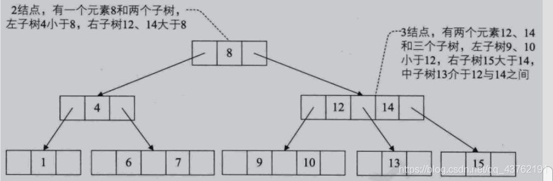​

#### 2-3树的插入

  这个比较开始复杂了，不过咱就随便聊聊，聊到哪儿算哪儿。

  首先，要明白每个新插入的节点都是二节点。

  插入情景1：  
 插入空树，直接插入，完事儿。

  插入情景2：  
 插入到一个二节点的叶子上，这也没什么，就像上面最左叶子节点，在“1"旁边给新节点“3”留个位置就好了。

  插入情景3：  
 插入到一个三节点的叶子上，这就很尴尬了，2-3树的节点极限就是3，比方说上面要插个5进去。  
 那怎么弄？  
 先看一下，要插入节点的父节点是个二节点，那就好办了，把那个二节点变成三节点，自然就有地方插入了。怎么变？把“6”提上去啊，图自己画。  
 如果要插入节点的父节点是个三节点，那就比较尴尬一点。比方说我现在要插个“11”进去。  
 那怎么弄？  
 那就一直往上找，找到二节点为止，然后该怎么做上面已经讲了。

  还是刚刚最后一种场景，如果往上找，找到根节点都是三节点，那怎么办？  
 那就意味着当前=层次已经无法满足我们的需要了，从根开始，全拆成二节点吧。  
 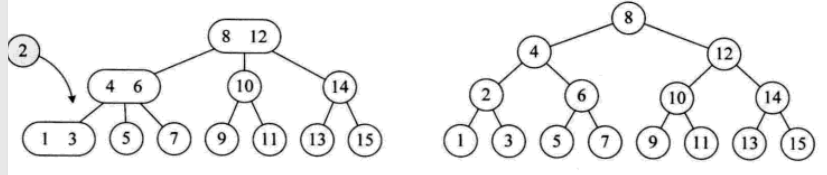​

  也不要去钻牛角尖了，咱就随便聊聊，要钻牛角尖咱往后去把代码实现写一下。现在知道是这么回事儿就好。

---

#### 2-3树的删除

  删除其实就是增加的逆过程，如果增加看懂了，删除就很简单。

  以下场景针对删除节点为叶子节点：  
 删除场景1：要删除的节点位于一个三节点上，直接删了。

  删除场景2：删除根节点，也是直接删了吧。

  删除场景3：删除的节点位于一个二节点上。就像插入节点在三节点上一样的尴尬。不，更尴尬。

  删除场景3.1：该节点的父节点为三节点：将父节点拆开下放一个节点。  
 删除场景3.2：上面场景不存在，但是 该节点的兄弟节点是三节点，将它的兄弟节点拆开，然后做单旋转。

  其他的删除场景嘛，日后深入研究的时候再行探讨，过于复杂。

---

### B树

  B树是一种平衡的多路查找树。  
 节点最大的孩子的数量的树叫做m阶B数。  
 所以2-3树就是3阶B树，二叉树就是2阶B树。

  B树有如下性质：

1. 如果根节点不是叶节点，那么B树至少有两叉。
2. 所有叶子节点都位于同一层次。
3. 每一个非根的分支结点都有k-1个元素和k个孩子，其中[m/2]<k<m. 21每一个叶子结点n都有k-1个元素，其中[m/2]<k< m.

  在B树上的查找过程是一个顺指针查找节点和在节点中查找关键字的交叉过程。

  关于B树的插入删除，和2-3树一样，只不过阶数可能会大了些。

### B树的典型应用

  我们的外存，比如硬盘，是将所有的信息分割成相等大小的页面，每次硬盘读写的都是一个或多个完整的页面，对于一个硬盘来说，-页的长度可能是 211到214个字节。

  在一个典型的B树应用中，要处理的硬盘数据量很大，因此无法一次全部装入内存。因此我们会对 B树进行调整， 使得B树的阶数 (或结点的元素)与硬盘存储的页面大小相匹配。比如说一棵B树的阶为1001 (即1个结点包含1000个关键字)，高度为2,它可以储存超过10亿个关键字，我们只要让根结点持久地保留在内存中，那么在这棵树上，寻找某一个关键字至多需要两次硬盘的读取即可。

  B树查找的时间复杂度：O(log n).

---

## 树与森林

### 树转换为二叉树

  由于二叉树是有序的，为了避免混淆，对于无序树，我们约定树中的每个结点的孩子结点按从左到右的顺序进行编号。

  将树转换成二叉树的步骤是：  
 （1）加线。就是在所有兄弟结点之间加一条连线；  
 （2）抹线。就是对树中的每个结点，只保留他与第一个孩子结点之间的连线，删除它与其它孩子结点之间的连线；  
 （3）旋转。就是以树的根结点为轴心，将整棵树顺时针旋转一定角度，使之结构层次分明。

  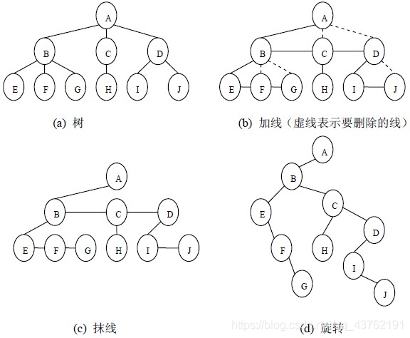​

### 森林转换为二叉树

  森林是由若干棵树组成，可以将森林中的每棵树的根结点看作是兄弟，由于每棵树都可以转换为二叉树，所以森林也可以转换为二叉树。

  将森林转换为二叉树的步骤是：  
 （1）先把每棵树转换为二叉树；  
 （2）第一棵二叉树不动，从第二棵二叉树开始，依次把后一棵二叉树的根结点作为前一棵二叉树的根结点的右孩子结点，用线连接起来。当所有的二叉树连接起来后得到的二叉树就是由森林转换得到的二叉树。

  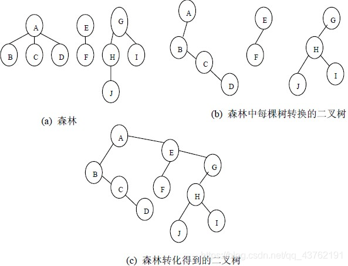​

### 二叉树转换为树

  二叉树转换为树是树转换为二叉树的逆过程，其步骤是：  
 （1）若某结点的左孩子结点存在，将左孩子结点的右孩子结点、右孩子结点的右孩子结点……都作为该结点的孩子结点，将该结点与这些右孩子结点用线连接起来；  
 （2）删除原二叉树中所有结点与其右孩子结点的连线；  
 （3）整理（1）和（2）两步得到的树，使之结构层次分明。

  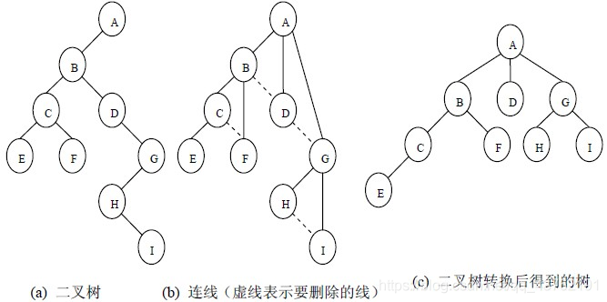​

### 二叉树转换为森林

  二叉树转换为森林比较简单，其步骤如下：  
 （1）先把每个结点与右孩子结点的连线删除，得到分离的二叉树；  
 （2）把分离后的每棵二叉树转换为树；  
 （3）整理第（2）步得到的树，使之规范，这样得到森林。

---

## 写在最后

  哇，累。

  如果喜欢，欢迎收藏、评论、点赞、关注哦！！！
