---

* [https://blog.csdn.net/u014454538/article/details/120120216?ops_request_misc=%257B%2522request%255Fid%2522%253A%2522166651727716800186558581%2522%252C%2522scm%2522%253A%252220140713.130102334.pc%255Fall.%2522%257D&amp;request_id=166651727716800186558581&amp;biz_id=0&amp;utm_medium=distribute.pc_search_result.none-task-blog-2](https://blog.csdn.net/u014454538/article/details/120120216?ops_request_misc=%257B%2522request%255Fid%2522%253A%2522166651727716800186558581%2522%252C%2522scm%2522%253A%252220140713.130102334.pc%255Fall.%2522%257D&request_id=166651727716800186558581&biz_id=0&utm_medium=distribute.pc_search_result.none-task-blog-2~all~first_rank_ecpm_v1~rank_v31_ecpm-14-120120216-null-null.142^v59^js_top,201^v3^control_2&utm_term=%E6%A0%91&spm=1018.2226.3001.4187)​[first_rank_ecpm_v1~rank_v31_ecpm-14-120120216-null-null.142](https://blog.csdn.net/u014454538/article/details/120120216?ops_request_misc=%257B%2522request%255Fid%2522%253A%2522166651727716800186558581%2522%252C%2522scm%2522%253A%252220140713.130102334.pc%255Fall.%2522%257D&request_id=166651727716800186558581&biz_id=0&utm_medium=distribute.pc_search_result.none-task-blog-2~all~first_rank_ecpm_v1~rank_v31_ecpm-14-120120216-null-null.142^v59^js_top,201^v3^control_2&utm_term=%E6%A0%91&spm=1018.2226.3001.4187)​[js_top,201](https://blog.csdn.net/u014454538/article/details/120120216?ops_request_misc=%257B%2522request%255Fid%2522%253A%2522166651727716800186558581%2522%252C%2522scm%2522%253A%252220140713.130102334.pc%255Fall.%2522%257D&request_id=166651727716800186558581&biz_id=0&utm_medium=distribute.pc_search_result.none-task-blog-2~all~first_rank_ecpm_v1~rank_v31_ecpm-14-120120216-null-null.142^v59^js_top,201^v3^control_2&utm_term=%E6%A0%91&spm=1018.2226.3001.4187)​[control_2&amp;utm_term=%E6%A0%91&amp;spm=1018.2226.3001.4187](https://blog.csdn.net/u014454538/article/details/120120216?ops_request_misc=%257B%2522request%255Fid%2522%253A%2522166651727716800186558581%2522%252C%2522scm%2522%253A%252220140713.130102334.pc%255Fall.%2522%257D&request_id=166651727716800186558581&biz_id=0&utm_medium=distribute.pc_search_result.none-task-blog-2~all~first_rank_ecpm_v1~rank_v31_ecpm-14-120120216-null-null.142^v59^js_top,201^v3^control_2&utm_term=%E6%A0%91&spm=1018.2226.3001.4187)​~[all](https://blog.csdn.net/u014454538/article/details/120120216?ops_request_misc=%257B%2522request%255Fid%2522%253A%2522166651727716800186558581%2522%252C%2522scm%2522%253A%252220140713.130102334.pc%255Fall.%2522%257D&request_id=166651727716800186558581&biz_id=0&utm_medium=distribute.pc_search_result.none-task-blog-2~all~first_rank_ecpm_v1~rank_v31_ecpm-14-120120216-null-null.142^v59^js_top,201^v3^control_2&utm_term=%E6%A0%91&spm=1018.2226.3001.4187)~​^[v59](https://blog.csdn.net/u014454538/article/details/120120216?ops_request_misc=%257B%2522request%255Fid%2522%253A%2522166651727716800186558581%2522%252C%2522scm%2522%253A%252220140713.130102334.pc%255Fall.%2522%257D&request_id=166651727716800186558581&biz_id=0&utm_medium=distribute.pc_search_result.none-task-blog-2~all~first_rank_ecpm_v1~rank_v31_ecpm-14-120120216-null-null.142^v59^js_top,201^v3^control_2&utm_term=%E6%A0%91&spm=1018.2226.3001.4187)^​^[v3](https://blog.csdn.net/u014454538/article/details/120120216?ops_request_misc=%257B%2522request%255Fid%2522%253A%2522166651727716800186558581%2522%252C%2522scm%2522%253A%252220140713.130102334.pc%255Fall.%2522%257D&request_id=166651727716800186558581&biz_id=0&utm_medium=distribute.pc_search_result.none-task-blog-2~all~first_rank_ecpm_v1~rank_v31_ecpm-14-120120216-null-null.142^v59^js_top,201^v3^control_2&utm_term=%E6%A0%91&spm=1018.2226.3001.4187)^
* 1. 概述1.1 红黑树的引入有了二叉搜索树，为什么还需要平衡二叉树？在学习二叉搜索树、平衡二叉树时，我们不止一次提到，二叉搜索树容易退化成一条链这时，查找的时间复杂度从O(log2N)O(log_2N)O(log2​N)也将退化成O(N)O(N)O(N)引入对左右子树高度差有限制的平衡二叉树，保证查找操作的最坏时间复杂度也为O(log2N)O(log_2N)O(log2​N)有了平衡二叉树，为什么还需要红黑树？AVL的左右子树高度差不能超过1，每次进行插入/删除操作时，几乎都需要通过旋
* 2022-10-23 17:30:46

---

## 红黑树详解

                                                   ​

[晓之木初](https://blog.csdn.net/u014454538)                                          **已于 2022-05-02 09:44:56 修改**                                          **78056**                     [                                                                           收藏                                                      609                                              ]()

                                  于 2021-09-12 20:23:18 首次发布

                                                                       版权声明：本文为博主原创文章，遵循[ CC 4.0 BY-SA ](http://creativecommons.org/licenses/by-sa/4.0/)版权协议，转载请附上原文出处链接和本声明。

                                                   ## 1. 概述

## 1.1 红黑树的引入

  **有了二叉搜索树，为什么还需要平衡二叉树？**

* 在学习二叉搜索树、平衡二叉树时，我们不止一次提到，二叉搜索树容易退化成一条链
* 这时，查找的时间复杂度从**                                        O                            (                            l                            o                                       g                               2                                      N                            )                                  O(log_2N)                     **O**(**l**o**g**2N**)也将退化成**                                        O                            (                            N                            )                                  O(N)                     **O**(**N**)**
* 引入对左右子树高度差有限制的平衡二叉树，保证查找操作的最坏时间复杂度也为**                                        O                            (                            l                            o                                       g                               2                                      N                            )                                  O(log_2N)                     **O**(**l**o**g**2N**)

  **有了平衡二叉树，为什么还需要红黑树？**

  * AVL的左右子树高度差不能超过1，每次进行插入/删除操作时，几乎都需要通过旋转操作保持平衡
* 在频繁进行插入/删除的场景中，频繁的旋转操作使得AVL的性能大打折扣
* 红黑树通过牺牲严格的平衡，换取插入/删除时少量的旋转操作，**整体性能**优于AVL

  * 红黑树插入时的不平衡，不超过两次旋转就可以解决；删除时的不平衡，不超过三次旋转就能解决
* 红黑树的红黑规则，保证最坏的情况下，也能在**                                        O                            (                            l                            o                                       g                               2                                      N                            )                                  O(log_2N)                     **O**(**l**o**g**2N**)时间内完成查找操作。

  ## 1.2 红黑规则

  * 一棵典型的红黑树，如图所示  
    ​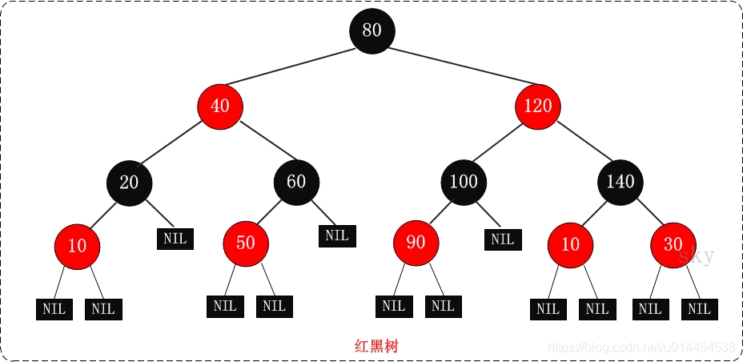​
* 从图示，可以发现红黑树的一些规律：

  * 节点不是红色就是黑色，根节点是黑色
  * 红黑树的叶子节点并非传统的叶子节点，红黑树的叶子节点是null节点（空节点）且为黑色
  * 同一路径，不存在连续的红色节点
* 以上是我们能发现的一些规律，这些规律其实是红黑规则的一部分

  红黑规则

  1. 节点不是黑色，就是红色（非黑即红）

1. 根节点为黑色
2. 叶节点为黑色（叶节点是指末梢的空节点 `Nil`​或`Null`​）
3. 一个节点为红色，则其两个子节点必须是黑色的（根到叶子的所有路径，不可能存在两个连续的红色节点）
4. 每个节点到叶子节点的所有路径，都包含相同数目的黑色节点（相同的黑色高度）

  一些说明

* 约束4和5，保证了红黑树的​**大致平衡**​：根到叶子的所有路径中，最长路径不会超过最短路径的2倍。
* 使得红黑树在最坏的情况下，也能有**                                        O                            (                            l                            o                                       g                               2                                      N                            )                                  O(log_2N)                     **O**(**l**o**g**2N**)的查找效率

  * 黑色高度为3时，最短路径：黑色**                                                  →                                          \rightarrow                           **→ 黑色 **                                                  →                                          \rightarrow                           **→ 黑色，最长路径：黑色**                                                  →                                          \rightarrow                           **→ 红色 **                                                  →                                          \rightarrow                           **→ 黑色 **                                                  →                                          \rightarrow                           **→ 红色 **                                                  →                                          \rightarrow                           **→ 黑色
  * 最短路径的长度为2（不算`Nil`​的叶子节点），最长路径为4
  * 这是其他博客的[举例](https://www.jianshu.com/p/4cd37000f4e3)，自己也不是很懂😂
* 关于叶子节点：Java实现中，null代表空节点，无法看到黑色的空节点，反而能看到传统的红色叶子节点
* 默认新插入的节点为红色：因为父节点为黑色的概率较大，插入新节点为红色，可以避免颜色冲突

  ## 1.3 红黑树的应用

  * Java中，TreeMap、TreeSet都使用红黑树作为底层数据结构
* JDK 1.8开始，HashMap也引入了红黑树：当冲突的链表长度超过8时，自动转为红黑树
* Linux底层的CFS进程调度算法中，vruntime使用红黑树进行存储。
* 多路复用技术的Epoll，其核心结构是红黑树 + 双向链表。

  ---

  参考文档：[为什么这么多关于红黑树的面试题呢？](https://www.zhihu.com/question/312327402)

  ## 2. 红黑树的左旋右旋

  ## 2.1 红黑树的定义

  * 上一章节可知，红黑树要比[二叉搜索树](https://so.csdn.net/so/search?q=%E4%BA%8C%E5%8F%89%E6%90%9C%E7%B4%A2%E6%A0%91&spm=1001.2101.3001.7020)多一个颜色属性
* 同时，为了方便确认插入位置，还可以多一个parent属性，用于表示当前节点的父节点
* 因此，红黑树节点的定义如下：

  ```java
  class RedBlackTreeNode { 
      public int val;
      public RedBlackTreeNode left;
      public RedBlackTreeNode right;
      // 记录节点颜色的color属性，暂定true表示红色
      public boolean color;
      // 为了方便迭代插入，所需的parent属性
      public RedBlackTreeNode parent;

      // 一些构造函数，根据实际需求构建
      public RedBlackTreeNode() { 
      }
  }
  ```
* 红黑树中，有一个root属性，用于记录当前红黑树的根节点

  ```java
  public class RedBlackTree { 
      // 当前红黑树的根节点，默认为null
      private RedBlackTreeNode root;
  }
  ```
* 当红黑规则不满足时，需要对节点进行**变色或旋转**操作

  ## 2.2 红黑树的左旋

  回忆二叉树的左旋：

  * 手工推演（先冲突，再移动）：
  * 根节点成为右儿子的左子树；
  * 右儿子原有的左子树成为根节点的右子树
* 代码实现（先空位，再补齐）：

  * 右儿子的左子树成为根节点的右子树
  * 根节点成为右儿子的左子树

  红黑树的左旋

  * 红黑树节点中，包含父节点的引用
* 进行左旋时，不仅需要更新左右子树的引用，还需要更新父节点的引用

  左旋需要三大步（被旋转的节点叫做节点P）：

  * **空出右儿子的左子树：** （对应下图步骤2）
  * 右儿子的左子树取代右儿子，成为节点P的右子树，从而空出右儿子的左子树
  * 若右儿子的左子树不为空，需要更新左子树的父节点为节点P
* **空出节点P的父节点：** （对应下图步骤3）

  * 右儿子去取代节点P，成为其父节点的子树
  * 父节点指向右儿子

    * 若父节点为null，root将指向右儿子，右儿子成为整棵树的根节点；
    * 节点P是父节点的左子树，则右儿子成为父节点的左儿子；
    * 节点P是父节点的右子树，则右儿子成为父节点的右儿子
* **节点P和右儿子成功会师：** （对应下图步骤4）

  * 上述两步，空出了节点P的父节点和右儿子的左子树。
  * 这时直接更新，即可将节点P变成右儿子的左子树。
* 给出一个不是很正确的示意图  
  ​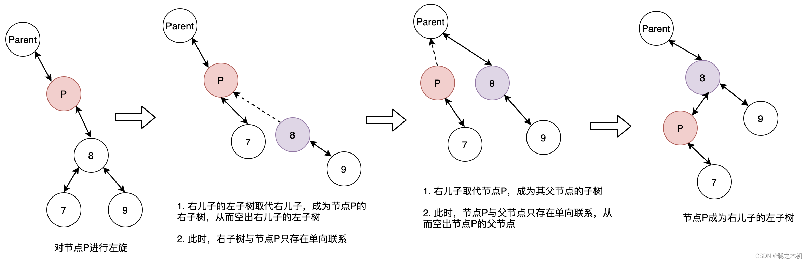​
* 具体代码如下：

  ```java
  public void leftRotate(RedBlackTreeNode p) { 
      // 在当前节点不为null时，才进行左旋操作
      if (p != null) { 
          // 先记录p的右儿子
          RedBlackTreeNode rightChild = p.right;

          // 1. 空出右儿子的左子树
          p.right = rightChild.left;
          // 左子树不为空，需要更新父节点
          if (rightChild.left != null) { 
              rightChild.left.parent = p;
          }

          // 2. 空出节点p的父节点
          rightChild.parent = p.parent;
          // 父节点指向右儿子
          if (p.parent == null) {  // 右儿子成为新的根节点
              this.root = rightChild;
          } else if (p == p.parent.left) {  // 右儿子成为父节点的左儿子
              p.parent.left = rightChild;
          } else {  // 右儿子成为父节点的右儿子
              p.parent.right = rightChild;
          }

          // 3. 右儿子和节点p成功会师，节点p成为左子树
          rightChild.left = p;
          p.parent = rightChild;
      }
  }
  ```

  ## 2.3 红黑树的右旋

  回忆二叉树的右旋：

  * 手工推演（先冲突，再移动）：
  * 根节点成为左儿子的右子树
  * 左儿子原有的右子树成为根节点的左子树
* 代码实现（先空位，再补齐）：

  * 左儿子的右子树成为根节点的左子树
  * 根节点成为左儿子右子树

  红黑树的右旋

  * 与红黑树的左旋一样，由于父节点引用的存在，不仅需要更新左右子树的引用，还需要更新父节点的引用

  右旋需要三大步（被旋转节点称为节点P）：

  * **空出左儿子的右子树：** （对应下图步骤2）
  * 左儿子的右子树取代左儿子，成为节点P的左子树，以空出左儿子的右子树
  * 若左儿子的右子树不为空，需要更新右子树的父节点为节点P
* **空出节点P的父节点：** （对应下图步骤3）

  * 左儿子取代节点P，成为其父节点的子树
  * 父节点指向左儿子：

    * 父节点为空，root将指向左儿子，左儿子成为整棵树的根节点
    * 节点P为父节点的左子树，左儿子成为父节点的左子树
    * 节点P为父节点的右子树，左儿子成为节点P的右子树
* **节点P和左儿子成功会师：** （对应下图步骤4）

  * 上述两步，空出了节点P的父节点和左儿子的右子树。
  * 这时直接更新，即可将节点P成左儿子的右子树
* 给出一个不是很正确的示意图  
  ​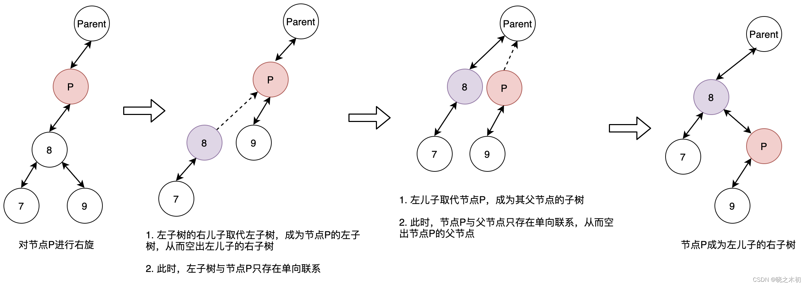​
* 具体代码如下：

  ```java
  public void rightRotate(RedBlackTreeNode p) { 
      if (p != null) { 
          // 记录p的左儿子
          RedBlackTreeNode leftChild = p.left;

          // 1. 空出左儿子的右子树
          p.left = leftChild.right;
          // 右子树不为空，需要更新父节点
          if (leftChild.right != null) { 
              leftChild.right.parent = p;
          }

          // 2. 空出节点p的父节点
          leftChild.parent = p.parent;
          // 父节点指向左儿子
          if (p.parent == null) {  // 左儿子成为整棵树根节点
              this.root = leftChild;
          } else if (p.parent.left == p) {  // 左儿子成为父节点左儿子
              p.parent.left = leftChild;
          } else {  // 左儿子成为父节点的右儿子
              p.parent.right = leftChild;
          }

          // 3. 顺利会师
          leftChild.right = p;
          p.parent = leftChild;
      }
  }
  ```

  ## 2.4 红黑树新增节点

  一些规则：

  * 新插入的节点默认为红色，原因：插入黑色节点会影响黑色高度，对红黑树的影响更大；
* 新增节点x时，循环的依据： `x != null && x != root && x.parent.color == RED`​，即节点非空、不是整棵树的根节点（保证存在父节点）且父节点为红色（违反红黑规则4，需要调整）
* 完成循环调整后，需要将整棵树的根节点设为黑色，以满足红黑规则1；同时，根节点设为黑色，不会影响从根节点开始的所有路径的黑色高度

  ### 2.4.1 父亲为祖父的左儿子

  情况一：父亲和叔叔都是红色

  * 当父亲为祖父的左儿子，父亲和叔叔都是红色时：  
    （1）将父亲和叔叔改成黑色，以满足红黑规则4  
    （2）父亲和叔叔变成黑色了，黑色高度变化，需要将祖父变成红色，以满足红黑规则5  
    （3）从祖父开始，继续调整
* 示意图如下  
  ​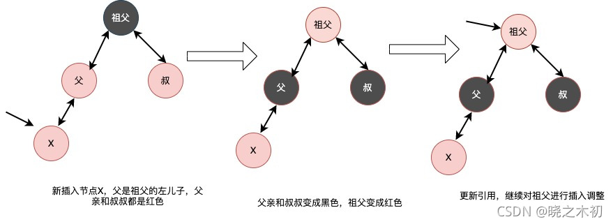​

  情况二：叔叔为黑色，自己是父亲的左儿子

  * 父亲为祖父的左儿子，叔叔为黑色，自己是父亲的左儿子  
    （1）父亲变成黑色，祖父变成红色（右子树的黑色高度变低）  
    （2）对祖父进行右旋，让父节点成为新的祖父，以恢复右子树的黑色高度  
    （3）不满足循环条件，退出循环
* 示意图如下：  
  ​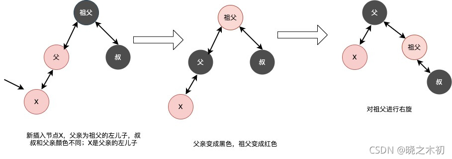​

  情况三：叔叔为黑色，自己是父亲的右儿子

  * 父亲为祖父的左儿子，叔叔为黑色，自己是父亲的右儿子  
    （1）父亲成为新的x，对父亲进行左旋操作，构造情况二的初始状态  
    （2）按照情况二，对新的x（原父亲）进行处理
* 示意图如下：  
  ​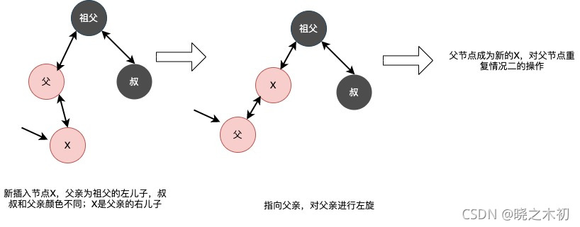​

  ### 2.4.2 父亲为祖父的右儿子

  情况一：父亲和叔叔都是红色

  * 父亲为祖父的右儿子，父亲和叔叔都是红色  
    （1）将父亲和叔叔都变成黑色，以保证红黑规则4  
    （2）将祖父变成红色，以保证红色规则5（相同的黑色高度）  
    （3）从祖父开始，继续调整
* 示意图如下  
  ​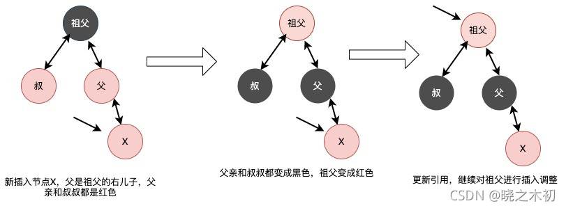​

  情况二：叔叔为黑色，自己是父亲的右儿子

  * 父亲为祖父的右儿子，叔叔为黑色，自己是父亲的右儿子  
    （1）父亲变成黑色，祖父变成红色（左子树的黑色高度降低）  
    （2）对祖父进行左旋操作，以恢复左子树的黑色高度  
    （3）不满足循环条件，退出循环
* 示意图如下  
  ​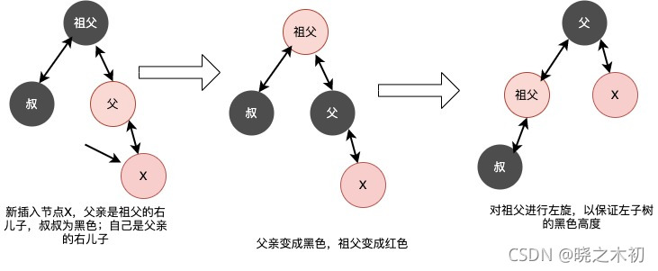​

  情况三：叔叔为黑色，自己是父亲的左儿子

  * 父亲是祖父的右儿子，叔叔为黑色，自己是父亲的左儿子  
    （1）父节点成为新的X，对父亲进行右旋操作，构造情况二的初始情况  
    （2）按照情况二，对新的x（原父节点）进行处理
* 示意图如下：  
  ​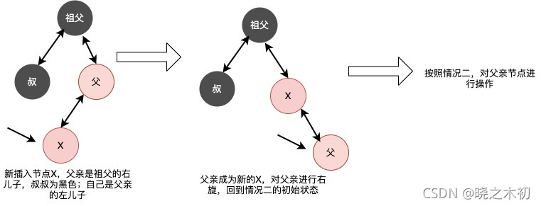​

  ### 2.4.3 规律总结

  * 循环条件： `x != null && x != root && x.parent.color == RED`​，即节点非空、不是整棵树的根节点（保证存在父节点）且父节点为红色
* 最终处理：将整棵树的根节点变成黑色，以满足红黑规则1，又不会违反红黑规则5
* 对父亲是祖父的左儿子或右儿子的​**处理是对称的**​，只需要理解左儿子时的处理方法，就可以举一反三，知道对右儿子的处理方法

  **父亲为祖父的左儿子：**

  1. 父亲和叔叔都是红色，将父亲和叔叔变成黑色，祖父变成红色，继续对祖父进行调整

1. 叔叔是黑色，自己是父亲的左儿子：父亲变成黑色，祖父变成红色；对祖父进行右旋以满足红黑规则；此时节点不满足循环条件，可以退出循环。
2. 叔叔是黑色，自己数父亲的右儿子：父亲成为新的X，对父亲执行左旋操作，构造情况2；按照情况2继续进行处理

* **总结：** 父叔同色，只进行变色操作；父叔异色，自己是右儿子，则进行LR操作；父叔异色，自己是左儿子，则进行R操作

  **父亲为祖父的右儿子**

* 父叔同色，只进行变色操作
* 父叔异色，自己是左儿子，则进行RL操作
* 父叔异色，自己是右儿子，则进行L操作

  ### 2.4.4 代码实现

  * 根据上面的分析，不难写出新增红黑节点后的代码
* 假设新增的节点为p，则代码如下

  ```java
  public void fixAfterInsert(RedBlackTreeNode x) { 
      // 新插入的节点，默认为红色
      x.color = RED;

      // p不为null、不是整棵树的根节点、父亲为红色，需要调整
      while (x != null && this.root != x && x.parent.color == RED) { 
          // 父亲是祖父的左儿子
          if (parentOf(x) == parentOf(parentOf(x)).left) { 
              // 父亲和叔叔都是红色
              RedBlackTreeNode uncle = parentOf(parentOf(x)).right;
              if (uncle.color == RED) { 
                  // 父亲和叔叔都变成黑色
                  parentOf(x).color = BLACK;
                  uncle.color = BLACK;
                  // 祖父变成红色，继续从祖父开始进行调整
                  parentOf(parentOf(x)).color = RED;
                  x = parentOf(parentOf(x));
              } else {  // 叔叔为黑色
                  // 自己是父亲的右儿子，需要对父亲左旋
                  if (x == parentOf(x).right) { 
                      x = parentOf(x);
                      leftRotate(x);
                  }
                  // 自己是父亲的左儿子，变色后右旋，保持黑色高度
                  parentOf(x).color = BLACK;
                  parentOf(parentOf(x)).color = RED;
                  rightRotate(parentOf(parentOf(x)));
              }
          } else {  //父亲是祖父的右儿子
              RedBlackTreeNode uncle = parentOf(parentOf(x)).left;
              // 父亲和叔叔都是红色
              if (uncle.color == RED) { 
                  // 叔叔和父亲变成黑色
                  parentOf(x).color = BLACK;
                  uncle.color = BLACK;
                  // 祖父变为红色，从祖父开始继续调整
                  parentOf(parentOf(x)).color = RED;
                  x = parentOf(parentOf(x));
              } else { 
                  // 自己是父亲的左儿子，以父亲为中心右旋
                  if (parentOf(x).left == x) { 
                      x = parentOf(x);
                      rightRotate(x);
                  }
                  // 自己是父亲的右儿子，变色后左旋，保持黑色高度
                  parentOf(x).color = BLACK;
                  parentOf(parentOf(x)).color = RED;
                  leftRotate(parentOf(parentOf(x)));
              }
          }
      }

      // 最后将根节点置为黑色，以满足红黑规则1，又不会破坏规则5
      this.root.color = BLACK;
  }

  private static RedBlackTreeNode parentOf(RedBlackTreeNode p) { 
      return (p == null ? null : p.parent);
  }
  ```

  ---

  参考文档

  * 操作过程与本文有差异，但调整后的结果具有参考意义：[java红黑树详解](https://www.huaweicloud.com/articles/afb8a79bb7ee0b2e2152e4cbcd18f03c.html)

  ## 2.5 删除节点

  一些规则：

  * 删除节点时，通过节点替换实现删除
* 假设替换节点为x，需要在x替换被删节点后，从x开始进行调整
* 调整操作，循环的依据： `x != root && x.color == BLACK`​，即替换节点不能为整棵树的根节点，替换节点的颜色为黑色（改变了红黑高度）
* 完成循环调整后，需要将x设为黑色，结束调整

  ### 2.5.1 自己是父亲的左儿子

  情况一：兄弟为红色

  * 此时，自己为黑色、兄弟为红色、父节点为黑色（满足红黑规则4）  
    （1）将兄弟变成黑色，父节点变成红色；这时，以父节点为起点的左子树黑色高度降低  
    （2）对父节点进行左旋，以恢复左子树黑色高度；同时，兄弟的左孩子成为新的兄弟
* 此时，自己和兄弟都是黑色，可能满足满足情况2、3和4、4
* 示意图如下：  
  ​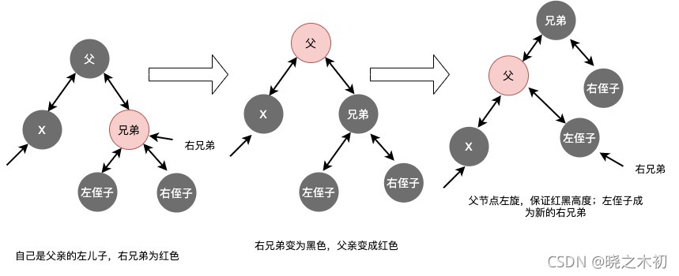​

  情况二：兄弟为黑色，左右侄子也是黑色

  * 此时，自己和兄弟都是黑色，父节点为黑色或红色；兄弟的两个儿子，都是黑色  
    （1）将兄弟变成为红色，x指向父节点，继续进行调整
* 示意图如下:  
  ​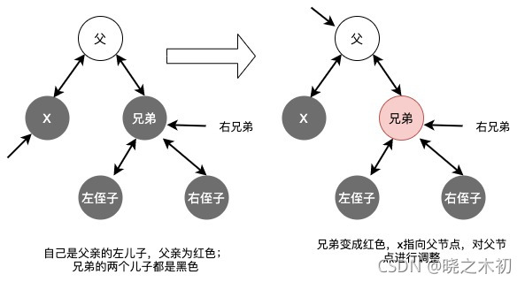​

  情况三：兄弟为黑色，右侄子为黑色

  * 此时，自己和兄弟均为黑色，父节点为红色或黑色；右侄子为黑色、左侄子为红色；  
    （1）将左侄子变成黑色，兄弟变为红色；这时，以兄弟为起点的右子树黑色高度降低  
    （2）将兄弟节点右旋，以恢复右子树的黑色高度；这时，左侄子将成为新的右兄弟
* 此时，兄弟的右儿子为红色，满足情况4；继续按照情况4，对节点x进行调整
* 示意图如下：  
  ​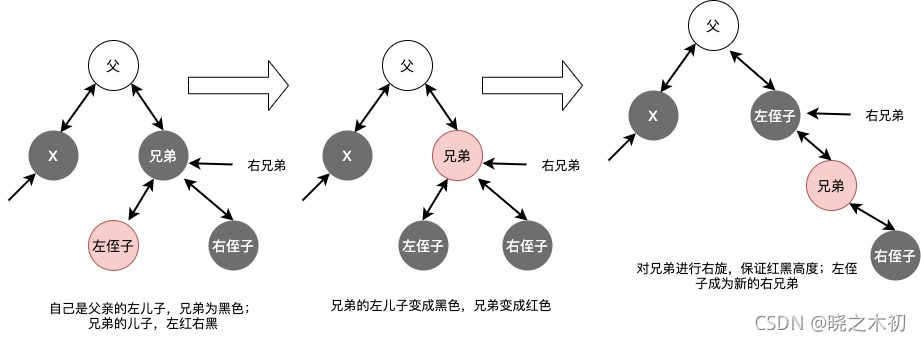​

  情况四：兄弟为黑色，右侄子为红色

  * 此时，自己和兄弟都是黑色，父节点为红色或黑色；右侄子为红色，左侄子为黑色或红色  
    （1）兄弟颜色改成与父节点一致，右侄子和父节点都变成黑色  
    （2）为了保证父节点变为黑色后，不影响所有路径的黑色高度，需要将父节点左旋（兄弟节点上提）  
    （3）x指向根节点，结束循环
* 示意图如下：  
  ​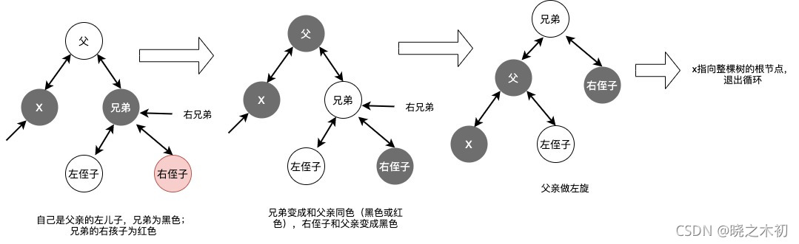​

  ### 2.5.2 自己是父亲的右儿子

  情况一：兄弟是红色节点

  * 此时，兄弟是红色节点，父节点必为黑色；若兄弟有左右儿子，左右儿子必为黑色（满足红黑规则4）  
    （1）将兄弟变成黑色节点，父节点变成红色；这时，以父节点为起点的右子树黑色高度降低  
    （2）将父节点右旋，以恢复右子树的黑色高度；这时，兄弟的右孩子成为新的兄弟
* 此时，自己和兄弟都是黑色，将满足情况2、3和4、4
* 示意图如下：  
  ​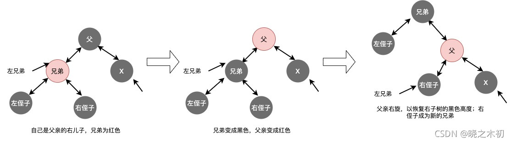​

  情况二：兄弟是黑色，左右侄子也是黑色

  * 此时，自己和兄弟是黑色，父节点可以为红色或黑色  
    （1）将兄弟变成红色，x指向父节点，继续对父节点进行调整
* 示意图如下:  
  ​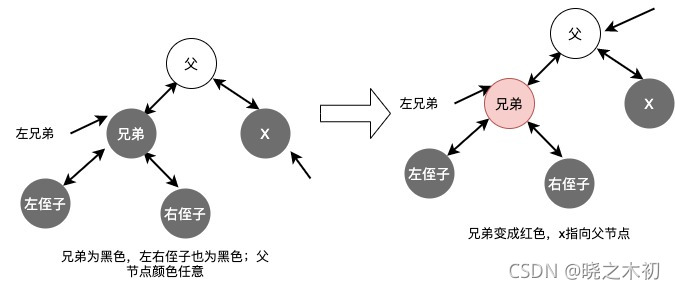​

  情况三：兄弟为黑色，左侄子为黑色

  * 此时，自己和兄弟均为黑色，父节点为黑色或红色；左侄子为黑色，右侄子为红色  
    （1）将右侄子变成黑色，兄弟变成红色；这是，以兄弟为起点的左子树黑色高度降低  
    （2）将兄弟左旋，以恢复左子树的黑色高度；这时，右侄子成为新的兄弟
* 此时，将满足情况4，可以按照情况4，继续进行调整
* 示意图如下：  
  ​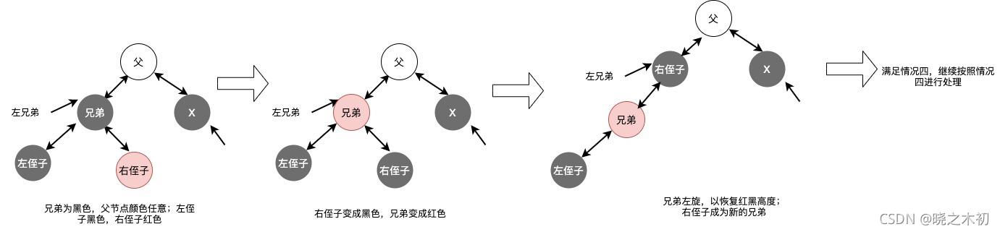​

  情况四：兄弟为黑色，左侄子为红色

  * 此时，自己和兄弟均为黑色，父节点为红色或黑色；左侄子为红色，右侄子为红色或黑色  
    （1）将兄弟变成与父节点一样的颜色，左侄子和父节点变成黑色  
    （2）为了保证父节点变成黑色，不会影响所有路径的黑色高度，需要将父节点右旋（兄弟上提）  
    （3）x指向根节点，退出循环
* 示意图如下：  
  ​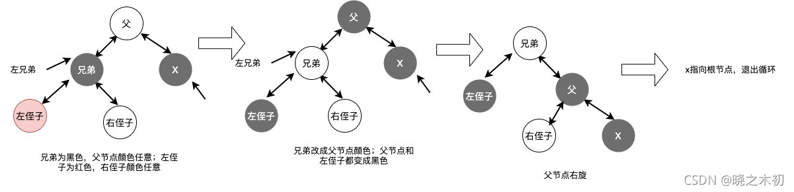​

  ### 2.5.3 规律总结

  * 循环条件：`x != root && x.color = BLACK`​，x不是根节点且颜色为黑色
* 收尾操作：将x置为黑色
* x为父亲的左儿子或右儿子，处理操作是对称的；同样只需要记住左儿子时的操作，即可举一反三

  **x为父亲的左儿子**

  1. 兄弟为红色：将兄弟变成黑色，父节点变成红色；对父节点左旋，恢复左子树的黑色高度，左侄子成为新的兄弟

1. 兄弟为黑色，左右侄子为黑色：兄弟变成红色，x指向父节点，继续进行调整
2. 兄弟为黑色，右侄子为黑色（左侄子为红色）：左侄子变成黑色，兄弟变成红色；兄弟右旋，恢复右子树的黑色高度，左侄子成为新的兄弟
3. 兄弟为黑色，右侄子为红色：兄弟变成父节点颜色，父节点和右侄子变成黑色；父节点左旋，x指向整棵树的根节点，结束循环

### 2.5.4 代码实现

* 删除节点后，调整红黑树的代码如下

```java
  public void fixAfterDeletion(RedBlackTreeNode x) { 
      // x不是根节点且颜色为黑色，开始循环调整
      while (x != root && x.color == BLACK) { 
          // x是父亲的左儿子
          if (x == parentOf(x).left) { 
              RedBlackTreeNode brother = parentOf(x).right;
              // 兄弟为红色
              if (brother.color == RED) { 
                  // 兄弟变成黑色，父节点变成红色
                  brother.color = BLACK;
                  parentOf(x).color = RED;
                  // 父节点左旋，恢复左子树的黑色高度
                  leftRotate(parentOf(x));
                  // 更新兄弟
                  brother = parentOf(x).right;
              }

              // 兄弟为黑色，左右侄子为黑色
              if (brother.left.color == BLACK && brother.right.color == BLACK) { 
                  // 兄弟变成红色
                  brother.color = RED;
                  // 从父节点开始继续调整
                  x = parentOf(x);
              } else { 
                  // 右侄子为黑色（左侄子为红色）
                  if (brother.right.color == BLACK) { 
                      // 左侄子变为黑色，兄弟变成红色
                      brother.left.color = BLACK;
                      brother.color = RED;
                      // 兄弟右旋，恢复右子树黑色高度
                      rightRotate(brother);
                      // 左侄子成为新的兄弟
                      brother = parentOf(x).right;
                  }
                  // 右侄子为红色，兄弟变成父节点颜色
                  brother.color = parentOf(x).color;
                  // 父节点和右侄子变成黑色
                  parentOf(x).color = BLACK;
                  brother.right.color = BLACK;
                  // 父节点左旋
                  leftRotate(parentOf(x));
                  // x指向根节点
                  x = root;
              }
          } else { 
              RedBlackTreeNode brother = parentOf(x).left;
              // 兄弟为红色
              if (brother.color == RED) { 
                  // 兄弟变黑色，父亲变红色
                  brother.color = BLACK;
                  parentOf(x).color = RED;
                  // 父亲右旋，恢复红黑色高度
                  rightRotate(parentOf(x));
                  // 更新兄弟为右侄子
                  brother = parentOf(x).left;
              }

              // 兄弟的左右儿子为黑色
              if (brother.left.color == BLACK && brother.right.color == BLACK) { 
                  // 兄弟变为红色
                  brother.color = RED;
                  // x指向父节点，继续进行调整
                  x = parentOf(x);
              } else { 
                  // 左侄子为黑色(右侄子为红色)
                  if (brother.left.color == BLACK) { 
                      // 右侄子变黑色，兄弟变红色
                      brother.right.color = BLACK;
                      brother.color = RED;
                      // 对兄弟左旋
                      leftRotate(brother);
                      // 右侄子成为新的兄弟
                      brother = parentOf(x).left;
                  }

                  // 左侄子为红色，兄弟改为父节点颜色
                  brother.color = parentOf(x).color;
                  // 父节点和左侄子变成黑色
                  brother.left.color = BLACK;
                  parentOf(x).color = BLACK;
                  // 兄弟节点上提(右旋父节点)
                  rightRotate(parentOf(x));
                  // x指向根节点
                  x = root;
              }

          }
      }
      // 更新x为黑色
      x.color = BLACK;
  }
```

---

  参考文档

* 删除节点后，如何调整红黑树，有清晰且与jdk源码一致的讲解：[自己手写HashMap——红黑树的Java实现](https://juejin.cn/post/6844903842513944583)
* 其他参考：[红黑树深入剖析及Java实现](https://tech.meituan.com/2016/12/02/redblack-tree.html)

  ## 3. 絮絮叨叨

  * 红黑树，自己差不多学了两周，菜鸟就是这么龟速
* 而且，关于删除或新增节点的调整，过一段时间就会忘记
* 这也是由于自己理解不到位，存在死记硬背的情况 😂
* 红黑树的删除或新增节点时的调整，应该属于高阶问题。面试被问到，能回答那就是加分项（毕竟我的追求不高）

  红黑树的重要知识点

  1. 从二叉搜索树 **                                        →                                  \rightarrow                     **→ AVL，严格控制左右子树高度差，避免二叉搜索树退化成链表（时间复杂度从**                                        O                            (                            l                            o                                       g                               2                                      N                            )                                  O(log_2N)                     **O**(**l**o**g**2N**) 退化成**                                        O                            (                            N                            )                                  O(N)                     **O**(**N**)**

1. 从AVL **                                        →                                  \rightarrow                     **→ 红黑树，牺牲严格的平衡要求，以换取新增/删除节点时少量的旋转操作，平均性能优于AVL；通过红黑规则，保证在最坏的情况下，也能拥有**                                        O                            (                            l                            o                                       g                               2                                      N                            )                                  O(log_2N)                     **O**(**l**o**g**2N**)的时间复杂度新城
2. 红黑树的应用：Java的TreeMap、TreeSet、HashMap(JDK1.8)；linux底层的CFS进程调度算法中，vruntime使用红黑树进行存储；多路复用技术的Epoll，其核心结构是红黑树 + 双向链表。
3. 红黑规则
4. 红黑树节点的定义、红黑树的定义、红黑树的左旋、右旋操作
5. 红黑树新增节点后的调整，记住左儿子的情况，举一反三右儿子的情况
6. 红黑树删除节点后的调整，记住左儿子的情况，举一反三右儿子的情况

---

  后来在学习的过程中，发现了一些还不错的博客

* 对红黑树的增加、删除节点的调整讲得不错（虽然自己也没有仔细看）：[Java TreeMap 源码解析](https://mr-dai.github.io/java_collection_treemap/)
