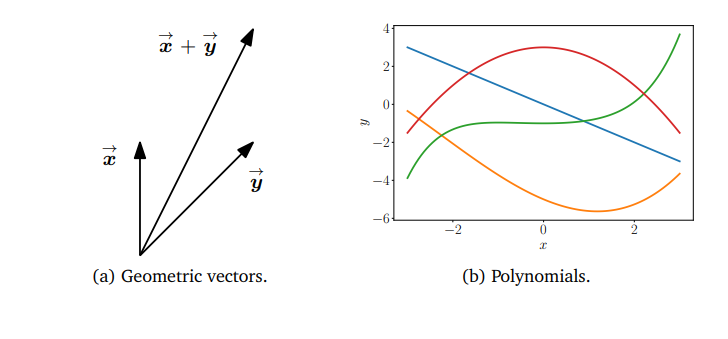
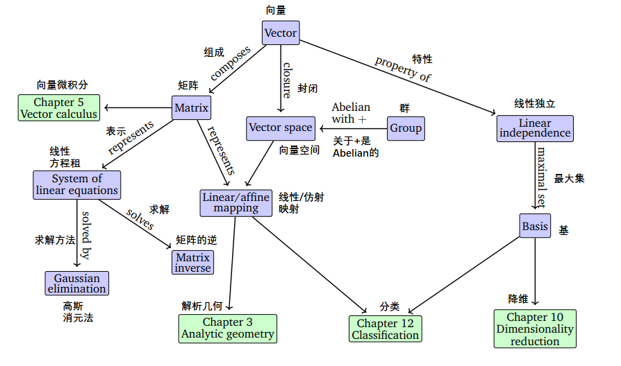
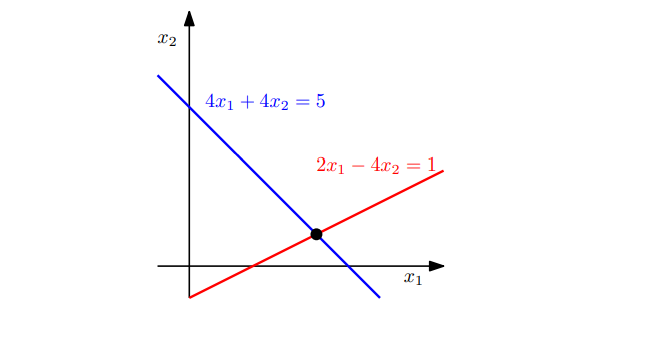
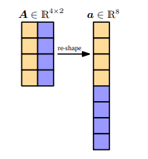
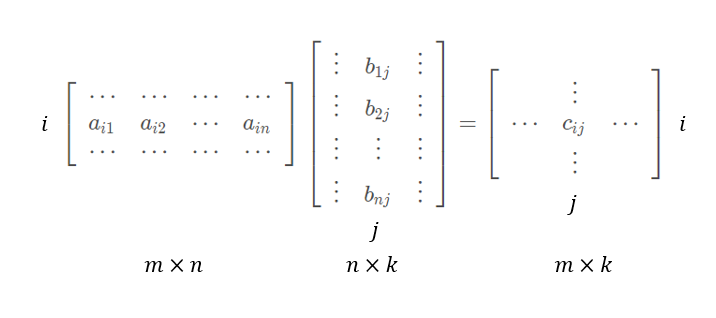
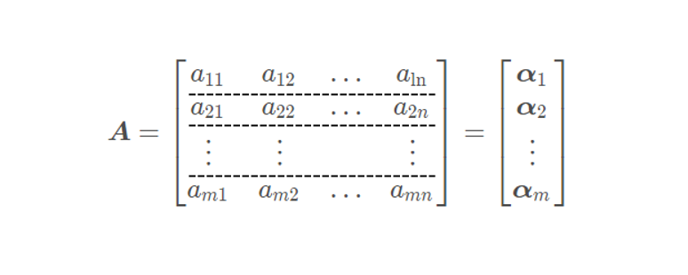
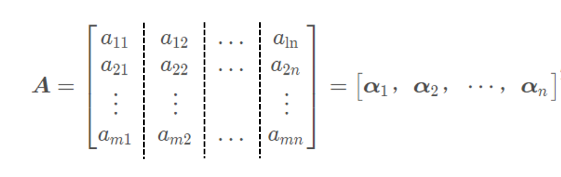
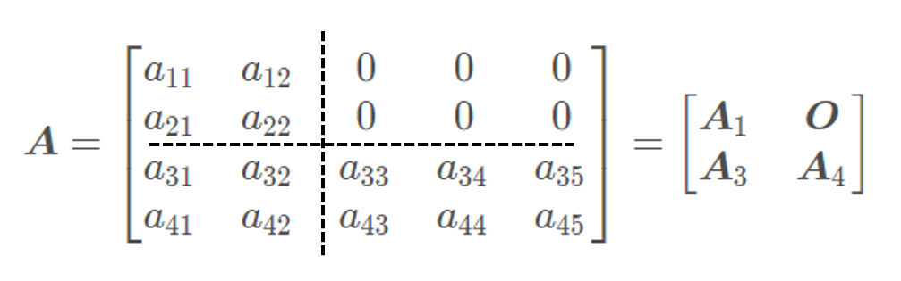
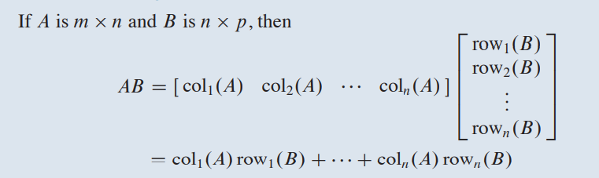

---

* [https://binaryai.blog.csdn.net/article/details/115050415](https://binaryai.blog.csdn.net/article/details/115050415)
* 2.1 线性方程组2.2 矩阵2.2.1 矩阵加法和乘法2.2.2 逆和转置2.2.3 与标量相乘2.2.4 线性方程组的紧凑表示2.3 线性方程组的求解2.3.1 特解和通解2.3.2 初等变换2.3.3 Minus-1 技巧2.3.4 求解线性方程组的算法..............................
* 2022-11-03 21:36:43

---

### 文章目录

*  

  * [2 线性代数(Linear Algebra)（上）](#2_Linear_Algebra_3)
*  

  * [2.1 线性方程组](#21___49)
  * [2.2 矩阵](#22__134)
  *  

    * [2.2.1 矩阵加法和乘法](#221___162)
    * [2.2.2 逆和转置](#222__288)
    * [2.2.3 与标量相乘](#223__383)
    * [2.2.4 分块矩阵](#224__418)
    * [2.2.5 线性方程组的紧凑表示](#225__481)
  * [2.3 线性方程组的求解](#23__500)

## 2 [线性](https://so.csdn.net/so/search?q=%E7%BA%BF%E6%80%A7&spm=1001.2101.3001.7020)代数(Linear Algebra)（上）

在形式化一些直观概念时，常见的方法是构造一组对象(符号)和一些操作这些对象的规则。这就是所谓的​**代数(**​***algebra***​**)**​。线性代数是研究向量以及使用某些确定的规则来操作向量的一门学科。

我们许多人从学校里知道的向量被称为“几何向量”，通常用上方带一个小箭头的字母表示，例如**                                             y                            ⃗                                       \vec{y}                  **y**             **​ 和 **                                             x                            ⃗                                       \vec{x}                  **x**             **。在这本书中，我们将讨论向量的更一般的概念，并使用粗体字母来表示它们，例如，**                                   x                              \boldsymbol{x}                  **x和**                                   y                              \boldsymbol{y}                  **y

一般来说，向量是特殊的对象，将它们相加并乘以标量产生的是另一个相同类型的对象。从抽象的数学来看，任何满足这两个性质的物体都可以被认为是向量。下面举一些例子：

  
 **图 2.1** 不同类型的向量。向量可以是出人意料的对象，包括（a）几何向量和（b）多项式。

**1 几何向量**

几何向量（见图2.1(a)）在高中数学和物理中可能很常见。它可以被绘制成有向线段(至少二维)。两个几何向量**                                             x                            →                                       \overrightarrow{\boldsymbol{x}}                  **x**            ** 和 **                                             y                            →                                       \overrightarrow{\boldsymbol{y}}                  **y**            **相加：**                                             x                            →                                  +                                   y                            →                                  =                                   z                            →                                       \overrightarrow{\boldsymbol{x}}+\overrightarrow{\boldsymbol{y}}=\overrightarrow{\boldsymbol{z}}                  **x**            **+**y**            =**z**            ，得到另一几何向量**                                             z                            →                                       \overrightarrow{\boldsymbol{z}}                  **z**            **。另外，几何向量与一个**标量(*scalar*​**)相乘：**                                   λ                                   x                            →                                  ,                         λ                         ∈                         R                              \lambda \overrightarrow{\boldsymbol{x}}, \lambda \in \mathbb{R}                  **λ**x**            **,**λ**∈**R，依然得到一个几何向量。事实上，**                                             x                            →                                       \overrightarrow{\boldsymbol{x}}                  **x**            **是被**                                   λ                              λ                  **λ**缩放(*scaled***​)的原始向量。因此，几何向量是前面介绍的向量概念的一个实例。将向量解释为几何向量使我们能够利用方向和大小直观地解释数学运算。

**2 多项式**

多项式也是向量；见图2.1(b)：两个多项式能相加，并得到另一个多项式；多项式与标量**                                   λ                         ∈                         R                              \lambda \in \mathbb{R}                  **λ**∈**R相乘，得到的也是多项式。因此，多项式也是向量的一个实例。注意多项式与几何向量有很大的不同。几何向量是具体的“图”，多项式是抽象的概念。然而，根据前文描述的向量概念，它们都是向量。

**3 音频信号**

音频信号是用一组数字表示的。我们可以把音频信号加在一起，得到新的音频信号。如果我们对音频信号进行缩放，我们也会得到一个音频信号。因此，音频信号也是向量。

**4 **                                                   R                               n                                            \mathbb{R}^{n}                     ​**​****R****​**n**的元素(含**                                        n                                  n                     **n个实数的元组)**

**                                             R                            n                                       \mathbb{R}^{n}                  **R**n**比多项式更抽象，它是这本书关注的概念。例如, **                                        a                            =                                       [                                                                                     1                                                                                                                   2                                                                                                                   3                                                                                 ]                                      ∈                                       R                               3                                             \**​**boldsymbol{a}=\left[**

123

\right] \in \mathbb{R}^{3}                      **a**=⎣               ⎡1**2**3⎦               ⎤∈**R**3

这个向量包含三个实数元素。两个向量**                                   a                         ,                         b                         ∈                                   R                            n                                       \boldsymbol{a}, \boldsymbol{b} \in \mathbb{R}^{n}                  ​^​**^a^**​^,^​**^b^**​^∈^​**^R^**​^n^​**^相加得到另一个向量：^**​^​                                   a                         +                         b                         =                         c                         ∈                                   R                            n                                       \boldsymbol{a}+\^​^boldsymbol{b}=\boldsymbol{c} \^​^in \mathbb{R}^{n}                  **a**+**b**=**c**∈**R**n**。另外，向量**                                   a                         ∈                                   R                            n                                       \boldsymbol{a} \in \mathbb{R}^{n}                  ​^​**^a^**​^∈^​**^R^**​^n^​**^与标量^**​^​                                   λ                         ∈                         R                              \lambda \^​^in \mathbb{R}                  ​^​**^λ^**​^∈^​**^R相乘得到一个被缩放的向量：^**​^​                                   λ                         a                         ∈                                   R                            n                                       \lambda \^​^boldsymbol{a} \in \^​^mathbb{R}^{n}                  **λ**a**∈**R**n。

将向量视为**                                             R                            n                                       \mathbb{R}^{n}                  **R**n**的元素还有一个额外的好处，即它可以用计算机上的实数数组表示。许多编程语言都支持数组操作，这使得我们可以方便地实现有关向量操作的算法。

线性代数关注的是这些向量之间的相似性。我们可以把它们加起来，然后乘以标量。我们将主要关注**                                             R                            n                                       \mathbb{R}^n                  ​^​**^R^**​^n^​**^中的向量，因为线性代数中的大多数算法都是在^**​^​                                             R                            n                                       \mathbb{R}^n                  **R**n**中表述的。我们将在第8章中看到，我们用**                                             R                            n                                       \mathbb{R}^n                  ​^​**^R^**​^n^​**^中的向量来表示数据。在这本书中，我们将关注有限维向量空间，在这种情况下，任何向量和^**​^​                                             R                            n                                       \mathbb{R}^n                  **R**n**之间都有1:1的对应关系。如果方便的话，我们将利用几何向量来直观表示，并考虑基于数组的算法。

数学中的一个主要概念是“封闭性”。相关的问题是:我提出的操作得到的所有的东西组成的集合是什么?在向量的例子中：从一个小的向量集合开始，然后把它们相加，再按比例缩放，得到的向量集合是什么?这将产生一个向量空间(第2.4节)。向量空间的概念及其特性是[机器学习](https://so.csdn.net/so/search?q=%E6%9C%BA%E5%99%A8%E5%AD%A6%E4%B9%A0&spm=1001.2101.3001.7020)的基础。图2.2总结了本章介绍的概念。

  
 **图2.2** 本章介绍的概念的思维导图，以及这些概念在本书其他部分中的使用。

线性代数在机器学习和一般数学中扮演着重要的角色。本章所介绍的概念将在第三章中进一步扩展到几何学相关的概念。在第五章，我们将讨论向量微积分，需要一些矩阵运算的知识。在第十章中，我们将使用投影(将在3.8节中介绍)进行主成分分析(PCA)实现降维。在第九章，我们将讨论线性回归，其中线性代数在解决最小二乘问题中扮演核心角色。

### 2.1 线性[方程组](https://so.csdn.net/so/search?q=%E6%96%B9%E7%A8%8B%E7%BB%84&spm=1001.2101.3001.7020)

线性方程组是线性代数的核心部分。许多问题可以表述为线性方程组，而线性代数为我们提供了求解它们的工具。

**例 2.1**  
 一家公司要生产产品**                                             N                            1                                  ,                         …                         ,                                   N                            n                                       N_{1}, \ldots, N_{n}                  **N**1,**…**,**N**n**，需要资源**                                             R                            1                                  ,                         …                         ,                                   R                            m                                       R_{1}, \ldots, R_{m}                  **R**1,**…**,**R**m**。要生产单位产品**                                             N                            j                                       N_j                  **N**j**，需要**                                             a                                       i                               j                                                 a_{ij}                  **a**ij**单位的资源**                                             R                            i                                       R_i                  **R**i**。其中**                                   i                         =                         1                         ,                         …                         ,                         m                              i=1, \ldots, m                  **i**=**1**,**…**,**m，**                                   j                         =                         1                         ,                         …                         ,                         n                              j=1, \ldots, n                  **j**=**1**,**…**,**n

我们的目标是找到一个最优的生产计划，即在资源**                                             R                            i                                       R_i                  **R**i**的有单位总数**                                             b                            i                                       b_i                  **b**i**可用且（理想情况下）没有剩余资源的前提下，产品**                                             N                            j                                       N_j                  **N**j**的应生产多少单位**                                             x                            i                                       x_i                  **x**i**​的计划。

如果我们要分别生产**                                             x                            1                                  ,                         …                         ,                                   x                            n                                       x_{1}, \ldots, x_{n}                  **x**1,**…**,**x**n**单元个相应产品，我们总共需要 **                                                   a                                           i                                  1                                                            x                               1                                      +                            ⋯                            +                                       a                                           i                                  n                                                            x                               n                                             a_**​**{i 1} x_{1}+\**​**cdots+a_{i n} x_**​**{n}                      ​**​****a****​**i**1x**1**​**+**⋯**+**a**in**​**x**n

单元个**                                             R                            i                                       R_i                  **R**i**。最优生产计划**                                             (                                       x                               1                                      ,                            …                            ,                                       x                               n                                      )                                  ∈                                   R                            n                                       \left(x_{1}, \ldots, x_{n}\right) \in \mathbb{R}^{n}                  **(**x**1**​**,**…**,**x**n**​**)**∈**R**n**需要满足以下方程组：  
 **                                                                                                                         a                                              11                                                                          x                                              1                                                          +                                           ⋯                                           +                                                           a                                                               1                                                 n                                                                                          x                                              n                                                          =                                                           b                                              1                                                                                                                                                      ⋮                                                                                                                                                                                                  a                                                               m                                                 1                                                                                          x                                              1                                                          +                                           ⋯                                           +                                                           a                                                               m                                                 n                                                                                          x                                              n                                                          =                                                           b                                              m                                                                                                                (                            2.3                            )                                   **

a11x1+⋯+a1nxn=b1⋮am1x1+⋯+amnxn=bm

\qquad(2.3)                      **a**11x**1**​**+**⋯**+**a**1**nx**n**​**=**b**1**​**⋮**a**m**1x**1**​**+**⋯**+**a**mn**​**x**n=**b**m​**(**2.3**)**

其中**                                             a                                       i                               j                                            ∈                         R                              a_{i j} \in \mathbb{R}                  **a**ij∈**R，**                                             b                            i                                  ∈                         R                              b_{i} \in \mathbb{R}                  **b**i∈**R。

式(2.3)就是​**线性方程组(**​***system of linear equations***​)的一般形式。**                                             x                            1                                  ,                         …                         ,                                   x                            n                                       x_{1}, \ldots, x_{n}                  **x**1,**…**,**x**n**是这个方程组的未知数。每一个满足式(2.3)的**                                   n                              n                  **n元组**                                             (                                       x                               1                                      ,                            …                            ,                                       x                               n                                      )                                  ∈                                   R                            n                                       \left(x_{1}, \ldots, x_{n}\right) \in\mathbb{R}^{n}                  **(**x**1**​**,**…**,**x**n**​**)**∈**R**n**都是线性方程组的一个**解（​*solution*​）**​。

**例 2.2**  
 线性方程组  
 **                                                                                          x                                        1                                                                                            +                                                                                             x                                        2                                                                                            +                                                                                             x                                        3                                                                                            =                                                                                             3                                                     (                                        1                                        )                                                                                                                            x                                        1                                                                                            −                                                                                             x                                        2                                                                                            +                                                                                             2                                                       x                                           3                                                                                                          =                                                                                             2                                                     (                                        2                                        )                                                                                                                            2                                                       x                                           1                                                                                                                                                                                                                      +                                                                                             3                                                       x                                           3                                                                                                          =                                                                                             1                                                     (                                        3                                        )                                                                                 **

x1+x2+x3=3(1)x1−x2+2x3=2(2)2x1+3x3=1(3)

**x**1x**1**​**2**x**1**​+**−**​**x**2x**2**​+**+**+x**3**​**2**x**3**​**3**x**3**​=**=**=3**(**1**)**2**(**2**)**1**(**3**)**​

​**无解(**​***no solution***​**)**​：将前两个方程相加得到**                                   2                                   x                            1                                  +                         3                                   x                            3                                  =                         5                              2 x_{1}+3 x_{3}=5                  **2**x**1**​**+**3**x**3=**5，这与第三个方程（3）相矛盾。

让我们看看另一个线性方程组：  
 **                                                                                          x                                        1                                                                                            +                                                                                             x                                        2                                                                                            +                                                                                             x                                        3                                                                                            =                                                                                             3                                                     (                                        1                                        )                                                                                                                            x                                        1                                                                                            −                                                                                             x                                        2                                                                                            +                                                                                             2                                                       x                                           3                                                                                                          =                                                                                             2                                                     (                                        2                                        )                                                                                                                                                                                                                                        x                                        2                                                                                            +                                                                                             x                                        3                                                                                            =                                                                                             2                                                     (                                        3                                        )                                                                                 **

x1+x2+x3=3(1)x1−x2+2x3=2(2)x2+x3=2(3)

**x**1x**1**​+**−**​**x**2x**2**​**x**2​**+**+**+**​**x**32**x**3x**3**​=**=**=3**(**1**)**2**(**2**)**2**(**3**)**​

根据第一个和第三个方程，得到**                                             x                            1                                  =                         1                              x_1=1                  **x**1=**1。 由(1)+(2)得到：**                                   2                                   x                            1                                  +                         3                                   x                            3                                  =                         5                              2 x_{1}+3 x_{3}=5                  **2**x**1**​**+**3**x**3=**5，即：**                                             x                            3                                       x_3                  **x**3**=1。由(3)，我们可以得到**                                             x                            2                                  =                         1                              x_2=1                  **x**2=**1。因此，**                                   (                         1                         ，                         1                         ，                         1                         )                              (1，1，1)                  **(**1**，**1**，**1**)是**唯一解(​*unique solution*​)**（通过代入方程组可验证**                                   (                         1                         ，                         1                         ，                         1                         )                              (1，1，1)                  **(**1**，**1**，**1**)是解）。

接下来看第三个例子：  
 **                                                                                          x                                        1                                                                                            +                                                                                             x                                        2                                                                                            +                                                                                             x                                        3                                                                                            =                                                                                             3                                                     (                                        1                                        )                                                                                                                            x                                        1                                                                                            −                                                                                             x                                        2                                                                                            +                                                                                             2                                                       x                                           3                                                                                                          =                                                                                             2                                                     (                                        2                                        )                                                                                                                            2                                                       x                                           1                                                                                                                                                                                                                      +                                                                                             3                                                       x                                           3                                                                                                          =                                                                                             5                                                     (                                        3                                        )                                                                                 **

x1+x2+x3=3(1)x1−x2+2x3=2(2)2x1+3x3=5(3)

**x**1x**1**​**2**x**1**​+**−**​**x**2x**2**​+**+**+x**3**​**2**x**3**​**3**x**3**​=**=**=3**(**1**)**2**(**2**)**5**(**3**)**​

因为**                                   (                         1                         )                         +                         (                         2                         )                         =                         (                         3                         )                              (1)+(2)=(3)                  **(**1**)**+**(**2**)**=**(**3**)，我们可以省略第三个等式（冗余）。由(1)和(2)，我们可以得到：**                                   2                                   x                            1                                  =                         5                         −                         3                                   x                            3                                       2 x_{1}=5-3 x_{3}                  **2**x**1**​**=**5**−**3**x**3**，**                                   2                                   x                            2                                  =                         1                         +                                   x                            3                                       2 x_{2}=1+x_{3}                  **2**x**2**​**=**1**+**x**3**​**。我们定义**                                             x                            3                                  =                         a                         ∈                         R                              x_{3}=a \in \mathbb{R}                  **x**3=**a**∈**R为自由变量，使得任意三元组**                                             (                                       5                               2                                      −                                       3                               2                                      a                            ,                                       1                               2                                      +                                       1                               2                                      a                            ,                            a                            )                                  ,                                 a                         ∈                         R                              \left(\frac{5}{2}-\frac{3}{2} a, \frac{1}{2}+\frac{1}{2} a, a\right), \quad a \in \mathbb{R}                  **(**2**5**​**−**2**3**​**a**,**2**1+**2**1a**,**a**)**,**a**∈**R是线性方程组的一个解，即我们得到一个包含**无穷多解（*infinitely many solutions***​）的解集。

一般来说，对于一个实值线性方程组，我们要么无解，要么有唯一解，要么有无穷多解。线性回归(​*Linear regression*​，第九章)能解决无解的方程组。

​**备注**​（线性方程组的几何解释）。

在具有两个变量**                                             x                            1                                       x_1                  **x**1**，**                                             x                            2                                       x_2                  **x**2**的线性方程组中，每个线性方程表示**                                             x                            1                                  −                                   x                            2                                       x_1-x_2                  **x**1−**x**2**​平面上的一条线。由于线性方程组的解必须同时满足所有方程，所以解集是这些线的交集。这个交集可以是一条直线（如果线性方程描述同一条直线）、一个点，也可以是空的（当直线平行时）。  
 对于两个变量的方程组

**                                                                                          4                                                       x                                           1                                                      +                                        4                                                       x                                           2                                                      =                                        5                                                                                                                            2                                                       x                                           1                                                      −                                        4                                                       x                                           2                                                      =                                        1                                                                                 **

4x1+4x2=52x1−4x2=1

**4**x**1**​**+**4**x**2=**5**2**x**1−**4**x**2**​**=**1

其图示为：  
   
 **图 2.3** 二元线性方程组的解空间可以几何地解释为两条直线的交点。每个线性方程都代表一条直线。

方程组的解空间为点**                                   (                                   x                            1                                  ,                                   x                            2                                  )                         =                         (                         1                         ,                                   1                            4                                  )                              (x_1,x_2)=(1,\frac{1}{4})                  **(**x**1**​**,**x**2**​**)**=**(**1**,**4**1**​**)

类似地，对于三个变量，每个线性方程确定了三维空间中的一个平面。这些平面相交部分，即同时满足所有线性方程组的集合，为方程组的解集，它可以是一个平面、一条直线、一个点或空的（当这些平面不相交时）。

在介绍求解线性方程组的方法前，我们首先介绍一种线性方程组的紧凑表示法。我们将系数**                                             a                                       i                               j                                                 a_{ij}                  **a**ij**​组合表示为向量，并进一步组合表示成矩阵。换句话说，我们将  
 **                                                                                                         a                                           11                                                                     x                                           1                                                      +                                        ⋯                                        +                                                       a                                                           1                                              n                                                                                    x                                           n                                                      =                                                       b                                           1                                                                                                                                          ⋮                                                                                                                                                                                   a                                                           m                                              1                                                                                    x                                           1                                                      +                                        ⋯                                        +                                                       a                                                           m                                              n                                                                                    x                                           n                                                      =                                                       b                                           m                                                                                               **

a11x1+⋯+a1nxn=b1⋮am1x1+⋯+amnxn=bm

**a**11x**1**​**+**⋯**+**a**1**nx**n**​**=**b**1**​**⋮**a**m**1x**1**​**+**⋯**+**a**mn**​**x**n=**b**m​

写成以下形式：  
 **                                                   [                                                                                                     a                                              11                                                                                                                                                  ⋮                                                                                                                                                                                                a                                                               m                                                 1                                                                                                                ]                                                 x                               1                                      +                                       [                                                                                                     a                                              12                                                                                                                                                  ⋮                                                                                                                                                                                                a                                                               m                                                 2                                                                                                                ]                                                 x                               2                                      +                            ⋯                            +                                       [                                                                                                     a                                                               1                                                 n                                                                                                                                                                  ⋮                                                                                                                                                                                                a                                                               m                                                 n                                                                                                                ]                                                 x                               n                                      =                                       [                                                                                                     b                                              1                                                                                                                                                  ⋮                                                                                                                                                                                                b                                              m                                                                                                ]                                             \left[**

a11⋮am1

\right] x_{1}+\left[a12⋮am2

\right] x_{2}+\cdots+\left[a1n⋮amn

\right] x_{n}=\left[b1⋮bm

\right]                      ⎣               ⎡a**11**​**⋮**a**m**1​⎦               ⎤x**1**​**+**⎣               ⎡a**12**​**⋮**a**m**2​⎦               ⎤x**2**​**+**⋯**+**⎣               ⎡a**1**n⋮**a**mn​⎦               ⎤x**n**​**=**⎣               ⎡b**1**​**⋮**b**m**​⎦               ⎤

**                                        ⟺                                       [                                                                                                     a                                              11                                                                                                            ⋯                                                                                                             a                                                               1                                                 n                                                                                                                                                                  ⋮                                                                                                                                                                                                                                          ⋮                                                                                                                                                                                                a                                                               m                                                 1                                                                                                                            ⋯                                                                                                             a                                                               m                                                 n                                                                                                                ]                                                 [                                                                                                     x                                              1                                                                                                                                                  ⋮                                                                                                                                                                                                x                                              n                                                                                                ]                                      =                                       [                                                                                                     b                                              1                                                                                                                                                  ⋮                                                                                                                                                                                                b                                              m                                                                                                ]                                             \Longleftrightarrow\left[**

a11⋯a1n⋮⋮am1⋯amn

\right]\left[x1⋮xn

\right]=\left[b1⋮bm

\right]                      **⟺**⎣               ⎡a**11**​**⋮**a**m**1​**⋯**⋯a**1**n⋮**a**mn​⎦               ⎤⎣               ⎡x**1**​**⋮**x**n**​⎦               ⎤=⎣               ⎡b**1**​**⋮**b**m**​⎦               ⎤

下面，我们将仔细研究这些矩阵(matrices )并定义一些计算规则。我们将在2.3节中回到求解线性方程的问题。

### 2.2 矩阵

矩阵在线性代数中起着核心作用。它们可以用来紧凑地表示线性方程组，也可以表示线性函数（线性映射），这将在后面2.7节看到。在我们讨论这些话题之前，让我们先定义什么是矩阵，以及我们可以对矩阵做什么样的操作。我们将在第四章看到矩阵的更多性质。

​**定义2.1**​（矩阵）

对于任意**                                   m                         ,                         n                         ∈                         N                              m, n \in \mathbb{N}                  **m**,**n**∈**N，**                                   (                         m                         ,                         n                         )                              (m, n)                  **(**m**,**n**)实值**矩阵(​*Matrix*​)**                                   A                              \boldsymbol{A}                  **A**是由元素**                                             a                                       i                               j                                                 a_{ij}                  **a**ij**组成的**                                   m                         ⋅                         n                              m·n                  **m**⋅**n元组，其中**                                   i                         =                         1                         ,                         …                         ,                         m                         ,                         j                         =                         1                         ,                         …                         ,                         n                              i=1, \ldots, m, j=1, \ldots, n                  **i**=**1**,**…**,**m**,**j**=**1**,**…**,**n，并按照**                                   m                              m                  **m行和**                                   n                              n                  **n列的表格形式排序：

**                                        A                            =                                       [                                                                                                     a                                              11                                                                                                                            a                                              12                                                                                                            ⋯                                                                                                             a                                                               1                                                 n                                                                                                                                                                  a                                              21                                                                                                                            a                                              22                                                                                                            ⋯                                                                                                             a                                                               2                                                 n                                                                                                                                                                  ⋮                                                                                                                                                                          ⋮                                                                                                                                                                                                                                          ⋮                                                                                                                                                                                                a                                                               m                                                 1                                                                                                                                            a                                                               m                                                 2                                                                                                                            ⋯                                                                                                             a                                                               m                                                 n                                                                                                                ]                                      ,                                                a                                           i                                  j                                                 ∈                            R                                   \boldsymbol{A}=\left[**

a11a12⋯a1na21a22⋯a2n⋮⋮⋮am1am2⋯amn

\right], \quad a_{i j} \in \mathbb{R}                      **A**=⎣               ⎡a**11**​**a**21⋮**a**m**1**​a**12**​**a**22⋮**a**m**2**​⋯**⋯**⋯a**1**na**2**n⋮**a**mn​⎦               ⎤,**a**ij∈**R**

按惯例，**                                   (                         1                         ,                         n                         )                              (1,n)                  **(**1**,**n**)-矩阵称为**行(​*rows*​)**，**                                   (                         m                         ,                         1                         )                              (m,1)                  **(**m**,**1**)-矩阵称为**列(​*columns*​)**。这两个特殊矩阵也称为**行或列向量(​*row/column vectors*​)**。另外，我们称**                                   (                         n                         ,                         n                         )                              (n,n)                  **(**n**,**n**)-矩阵为**                                   n                              n                  **n阶**方阵(​*square matrices*​)**​，因为它们行数和与列数相等。

如果一个矩阵的所有元素都为0，则称这个矩阵为**零矩阵**                                   O                              \boldsymbol{O}                  **O**：

**                                        [                                                                              0                                                                                      0                                                                                      ⋯                                                                                      0                                                                                                          0                                                                                      0                                                                                      ⋯                                                                                      0                                                                                                                         ⋮                                                                                                                                                              ⋮                                                                                                                                                                                                                         ⋮                                                                                                                                                                   0                                                                                      0                                                                                      ⋯                                                                                      0                                                                          ]                                   \left[**

00⋯000⋯0⋮⋮⋮00⋯0

\right]                      ⎣               ⎡0**0**⋮**0**​**0**0**⋮**0⋯**⋯**⋯0**0**⋮**0**​⎦               ⎤

​**备注**​：

**                                             R                                       m                               ×                               n                                                 \mathbb{R}^{m \times n}                  ​^​**^R^**​^m^​**^×^**​^n^​**^是所有^**​^​                                   (                         m                         ,                         n                         )                              (m,n)                  ​^​**^(^**​^m^​**^,^**​^n^​**^)实值矩阵的集合。^**​^​                                   A                         ∈                                   R                                       m                               ×                               n                                                 \boldsymbol{A} \^​^in \mathbb{R}^{m \times n}                  **A**∈**R**m**×**n**可以等价地表示为**                                   a                         ∈                                   R                                       m                               n                                                 \boldsymbol{a} \in \mathbb{R}^{m n}                  **a**∈**R**mn**，方法是将矩阵的所有**                                   n                              n                  **n列叠加成一个长向量，如图2.4所示。（线性代数（下）的**定理 2.17**给出解释）

  
 **图2.4** 通过堆叠其列，矩阵**                                   A                              \boldsymbol{A}                  **A可以表示为长向量**                                   a                              \boldsymbol{a}                  **a。

#### 2.2.1 矩阵加法和乘法

矩阵**                                   A                         ∈                                   R                                       m                               ×                               n                                            ,                         B                         ∈                                   R                                       m                               ×                               n                                                 \boldsymbol{A} \in \mathbb{R}^{m \times n}, \^​^boldsymbol{B} \in \^​^mathbb{R}^{m \times n}                  **A**∈**R**m**×**n**,**B**∈**R**m**×**n相加定义为其对应元素相加，即：

**                                        A                            +                            B                            :                            =                                       [                                                                                                                      a                                                 11                                                              +                                                               b                                                 11                                                                                                                            ⋯                                                                                                                              a                                                                   1                                                    n                                                                               +                                                               b                                                                   1                                                    n                                                                                                                                                                                   ⋮                                                                                                                                                                                                                                          ⋮                                                                                                                                                                                                                 a                                                                   m                                                    1                                                                               +                                                               b                                                                   m                                                    1                                                                                                                                             ⋯                                                                                                                              a                                                                   m                                                    n                                                                               +                                                               b                                                                   m                                                    n                                                                                                                                 ]                                      ∈                                       R                                           m                                  ×                                  n                                                        \boldsymbol{A}+\boldsymbol{B}:=\left[**

a11+b11⋯a1n+b1n⋮⋮am1+bm1⋯amn+bmn

\right] \in \mathbb{R}^{m \times n}                      **A**+**B**:=⎣               ⎡a**11**​**+**b**11**​**⋮**a**m**1+**b**m**1**​⋯**⋯**​**a**1**n**​**+**b**1**n⋮**a**mn+**b**mn​⎦               ⎤∈**R**m**×**n

以下是矩阵加法的一些性质：

对于矩阵**                                   A                         ∈                                   R                                       m                               ×                               n                                            ，                         B                         ∈                                   R                                       m                               ×                               n                                            ，                         C                         ∈                                   R                                       m                               ×                               n                                                 \boldsymbol{A} \in \mathbb{R}^{m \times n}，\^​^boldsymbol{B} \in \^​^mathbb{R}^{m \times n}，\boldsymbol{C} \in \mathbb{R}^{m \times n}                  **A**∈**R**m**×**n**，**B**∈**R**m**×**n**，**C**∈**R**m**×**n**： **                                        A                            +                            B                            =                            B                            +                            A                                   \**​**boldsymbol{A}+\boldsymbol{B}=\**​**boldsymbol{B}+\boldsymbol{A}                      ​**​****A****​**+**B**=**B**+**A  
 **                                        (                            A                            +                            B                            )                            +                            C                            =                            A                            +                            (                            B                            +                            C                            )                                  (\boldsymbol{A}+\boldsymbol{B})+\boldsymbol{C}=\boldsymbol{A}+(\boldsymbol{B}+\boldsymbol{C})                      **(**A**+**B**)**+**C**=**A**+**(**B**+**C**) **                                        A                            +                            O                            =                            A                                   \**​**boldsymbol{A}+\boldsymbol{O}=\**​**boldsymbol{A}                      ​**​****A****​**+**O**=**A  
 **                                        A                            +                            (                            −                            A                            )                            =                            O                                   \boldsymbol{A}+(-\boldsymbol{A})=\boldsymbol{O}                      **A**+**(**−**A**)**=**O**

对于矩阵**                                   A                         ∈                                   R                                       m                               ×                               n                                            ,                         B                         ∈                                   R                                       n                               ×                               k                                                 \boldsymbol{A} \in \mathbb{R}^{m \times n}, \^​^boldsymbol{B} \in \^​^mathbb{R}^{n \times k}                  **A**∈**R**m**×**n**,**B**∈**R**n**×**k相乘：**                                   C                         =                                              A                               B                                            ∈                                   R                                       m                               ×                               k                                                 \boldsymbol{C}=\boldsymbol{A B} \in \mathbb{R}^{m \times k}                  ​^​**^C^**​^=^​**^AB^**​^∈^​**^R^**​^m^​**^×^**​^k^​**^，^**​^​                                   C                              \boldsymbol{C}                  ​^​**^C的元素^**​^​                                             c                                       i                               j                                                 c_{ij}                  ​^​**^c^**​^ij**计算如下： **                                                   c                                           i                                  j                                                 =                                       ∑                                           l                                  =                                  1                                          n                                                 a                                           i                                  l                                                            b                                           l                                  j                                                 =                                       a                                           i                                  1                                                            b                                           1                                  j                                                 +                                       a                                           i                                  2                                                            b                                           2                                  j                                                 +                            ⋯                            +                                       a                                           i                                  n                                                            b                                           n                                  j                                                 ，                                     i                            =                            1                            ,                            …                            ,                            m                            ,                                     j                            =                            1                            ,                            …                            ,                            k                                   c_^​^{i j}=\sum_^​^{l=1}^{n} a_{i l} b_{l j}=a_{i 1} b_{1 j}+a_{i 2} b_{2 j}+\cdots+a_{i n} b_{nj}，\quad i=1, \ldots, m, \quad j=1, \ldots, k                      **c**ij=**l**=**1**∑**n**​**a**i**l**​**b**l**j**​**=**a**i**1b**1**j+**a**i**2**​**b**2**j**​**+**⋯**+**a**in**​**b**nj，**i**=**1**,**…**,**m**,**j**=**1**,**…**,**k

​

这意味着，为了计算元素**                                             c                                       i                               j                                                 c_{ij}                  **c**ij**，我们将**                                   A                              \boldsymbol{A}                  **A的第**                                   i                              i                  **i行的元素与**                                   B                              \boldsymbol{B}                  **B的第**                                   j                              j                  **j列元素对应相乘，然后求和。在后面的解析几何中，我们将其称为相应行和列的点积(dot product)。在某些情况下，我们需要明确表示我们在进行乘法运算，我们用符号**                                   A                         ⋅                         B                              \boldsymbol{A}·\boldsymbol{B}                  **A**⋅**B来表示矩阵乘法（显式地表示“**                                   ⋅                              ·                  **⋅”).

特别地，如果**                                   A                              \boldsymbol{A}                  **A是一个**                                   n                              n                  **n阶方阵，则记**                                                                    A                                  ⋅                                  A                                  ⋯                                  A                                          ⏞                                      k                                  =                                   A                            k                                       \overbrace{\boldsymbol{A} \cdot \boldsymbol{A} \cdots \boldsymbol{A}}^{k}=\boldsymbol{A}^{k}                  **A**⋅**A**⋯**A**                  **                  **                  **k**=**A**k**为**                                   A                              \boldsymbol{A}                  **A的**                                   k                              k                  **k次幂。

​**备注**​：

矩阵只有在“相邻”维度匹配时才能相乘。例如，**                                   n                         ×                         k                              n×k                  **n**×**k矩阵**                                   A                              \boldsymbol{A}                  **A可以与**                                   k                         ×                         m                              k×m                  **k**×**m矩阵**                                   B                              \boldsymbol{B}                  **B相乘，且只能从左侧相乘： **                                                               A                                  ⏟                                                      n                                  ×                                  k                                                                        B                                  ⏟                                                      k                                  ×                                  m                                                 =                                                   C                                  ⏟                                                      n                                  ×                                  m                                                        \**​**underbrace{A}_{n \**​**times k} \underbrace{B}_**​**{k \times m}=\**​**underbrace{C}_{n \**​**times m}                      ​**​****n****​**×**k**                   **                   **                   **A**​k**×**m**                   **                   **                   **B**​=**n**×**m**                   **                   **                   **C**​

**                                   m                         ≠                         n                              m\not =n                  **m****=**n**，所以**                                   B                         A                              \boldsymbol{B}\boldsymbol{A}                  **B**A**不成立，因为相邻维度不匹配。

​**备注**​：

矩阵乘法不是对矩阵元素的逐元素运算，即**                                             c                                       i                               j                                            ≠                                   a                                       i                               j                                                      b                                       i                               j                                                 c_{i j} \neq a_{i j} b_{i j}                  **c**ij**=**a**ij**​**b**ij**，即使**                                   A                         ,                         B                              \boldsymbol{A},\boldsymbol{B}                  **A**,**B的尺寸选择得当。实际上，这种逐元素的乘法通常出现在编程语言中，被称为**Hadamard积( ​*Hadamard product*​)**​。

**例 2.3**

对于

**                                        A                            =                                       [                                                                                     1                                                                                             2                                                                                             3                                                                                                                   3                                                                                             2                                                                                             1                                                                                 ]                                      ∈                                       R                                           2                                  ×                                  3                                                 ,                            B                            =                                       [                                                                                     0                                                                                             2                                                                                                                   1                                                                                                             −                                              1                                                                                                                                  0                                                                                             1                                                                                 ]                                      ∈                                       R                                           3                                  ×                                  2                                                        \boldsymbol{A}=\left[**

123321

\right] \in \mathbb{R}^{2 \times 3}, \boldsymbol{B}=\left[021−101

\right] \in \mathbb{R}^{3 \times 2}                      **A**=**[**1**3**​**2**23**1**​**]**∈**R**2**×**3**,**B**=**⎣               ⎡0**1**02**−**1**1**​⎦               ⎤∈**R**3**×**2  
 我们可以得到：  
 **                                                               A                                  B                                                 =                                       [                                                                                     1                                                                                             2                                                                                             3                                                                                                                   3                                                                                             2                                                                                             1                                                                                 ]                                                 [                                                                                     0                                                                                             2                                                                                                                   1                                                                                                             −                                              1                                                                                                                                  0                                                                                             1                                                                                 ]                                      =                                       [                                                                                     2                                                                                             3                                                                                                                   2                                                                                             5                                                                                 ]                                      ∈                                       R                                           2                                  ×                                  2                                                        \boldsymbol{A B}=\left[**123321

\right]\left[021−101

\right]=\left[2325

\right] \in \mathbb{R}^{2 \times 2}                      **AB**=**[**1**3**​**2**23**1**​**]**⎣               ⎡0**1**02**−**1**1**​⎦               ⎤=**[**2**2**​**3**5]**∈**R**2**×**2**

**                                        B                            A                            =                                       [                                                                                     0                                                                                             2                                                                                                                   1                                                                                                             −                                              1                                                                                                                                  0                                                                                             1                                                                                 ]                                                 [                                                                                     1                                                                                             2                                                                                             3                                                                                                                   3                                                                                             2                                                                                             1                                                                                 ]                                      =                                       [                                                                                     6                                                                                             4                                                                                             2                                                                                                                                   −                                              2                                                                                                            0                                                                                             2                                                                                                                   3                                                                                             2                                                                                             1                                                                                 ]                                      ∈                                       R                                           3                                  ×                                  3                                                        \boldsymbol{B} \boldsymbol{A}=\left[**

021−101

\right]\left[123321

\right]=\left[642−202321

\right] \in \mathbb{R}^{3 \times 3}                      **B**A**=**⎣               ⎡0**1**02**−**1**1**​⎦               ⎤[**1**32**2**​**3**1]**=**⎣               ⎡6**−**2**3**​**4**0**2**​**2**2**1**​⎦               ⎤∈**R**3**×**3

从这个例子中，我们已经可以看出矩阵乘法是不可交换顺序的，即**                                                        A                               B                                            ≠                                              B                               A                                                 \boldsymbol{A B} \neq \boldsymbol{B A}                  **AB****=**BA**，另见图2.5的说明。 ​**​**​ ​**​****图2.5****​**​ 即使矩阵乘法**                                                        A                               B                                                 \boldsymbol{A B}                  **AB和**                                                        B                               A                                                 \boldsymbol{B A}                  **BA都有定义，结果的维数也可能不同。

​**定义 2.2**​(单位矩阵)

在**                                             R                                       n                               ×                               n                                                 \mathbb{R}^{n \times n}                  **R**n**×**n**中，**单位矩阵( ​*identity matrix*​)**： **                                                   I                               n                                      :                            =                                       [                                                                                     1                                                                                             0                                                                                             ⋯                                                                                             0                                                                                             ⋯                                                                                             0                                                                                                                   0                                                                                             1                                                                                             ⋯                                                                                             0                                                                                             ⋯                                                                                             0                                                                                                                                   ⋮                                                                                                                                                                          ⋮                                                                                                                                                          ⋱                                                                                                             ⋮                                                                                                                                                          ⋱                                                                                                             ⋮                                                                                                                                                                                0                                                                                             0                                                                                             ⋯                                                                                             1                                                                                             ⋯                                                                                             0                                                                                                                                   ⋮                                                                                                                                                                          ⋮                                                                                                                                                          ⋱                                                                                                             ⋮                                                                                                                                                          ⋱                                                                                                             ⋮                                                                                                                                                                                0                                                                                             0                                                                                             ⋯                                                                                             0                                                                                             ⋯                                                                                             1                                                                                 ]                                      ∈                                       R                                           n                                  ×                                  n                                                        \**​**boldsymbol{I}_{n}:=\**​**left[**

10⋯0⋯001⋯0⋯0⋮⋮⋱⋮⋱⋮00⋯1⋯0⋮⋮⋱⋮⋱⋮00⋯0⋯1

\right] \in \mathbb{R}^{n \times n}                      **I**n:=⎣               ⎡1**0**⋮**0**⋮**0**​**0**1**⋮**0**⋮**0⋯**⋯**⋱**⋯**⋱**⋯**​**0**0**⋮**1**⋮**0⋯**⋯**⋱**⋯**⋱**⋯**​**0**0**⋮**0**⋮**1⎦               ⎤∈**R**n**×**n

为**                                   n                         ×                         n                              n×n                  **n**×**n-矩阵，对角线上为1，其他为0。

现在我们已经定义了矩阵乘法和单位矩阵，让我们看看矩阵的一些性质：

* 结合律(​*Associativity*​)  
  **                                                  ∀                                  A                                  ∈                                               R                                                   m                                        ×                                        n                                                           ,                                  B                                  ∈                                               R                                                   n                                        ×                                        p                                                           ,                                  C                                  ∈                                               R                                                   p                                        ×                                        q                                                           :                                  (                                  A                                  B                                  )                                  C                                  =                                  A                                  (                                                             B                                        C                                                           )                                           \forall \boldsymbol{A} \in \mathbb{R}^{m \times n}, \^​^boldsymbol{B} \in \^​^mathbb{R}^{n \times p}, \boldsymbol{C} \in \mathbb{R}^{p \times q}:(\boldsymbol{A} \boldsymbol{B}) \boldsymbol{C}=\boldsymbol{A}(\boldsymbol{B C})                            **∀**A**∈**R**m**×**n**,**B**∈**R**n**×**p**,**C**∈**R**p**×**q**:**(**A**B**)**C**=**A**(**BC**)**
* 分配律(​*Distributivity*​)

  **                                                                                          ∀                                        A                                        ,                                        B                                        ∈                                                       R                                                           m                                              ×                                              n                                                                     ,                                        C                                        ,                                        D                                        ∈                                                       R                                                           n                                              ×                                              p                                                                     :                                        (                                        A                                        +                                        B                                        )                                        C                                                                                                                       =                                        A                                        C                                        +                                                                       B                                              C                                                                                                                                                         A                                        (                                        C                                        +                                        D                                        )                                                                                                                       =                                        A                                        C                                        +                                        A                                        D                                                                                 **

∀A,B∈Rm×n,C,D∈Rn×p:(A+B)C=AC+BCA(C+D)=AC+AD

**∀**A**,**B**∈**R**m**×**n**,**C**,**D**∈**R**n**×**p**:**(**A**+**B**)**C**A**(**C**+**D**)**​**=**A**C**+**BC**=**A**C**+**A**D**​

* 与单位矩阵乘法

对于**                                   m                         ≠                         n                              m \neq n                  **m****=**n**，**                                             I                            m                                  ≠                                   I                            n                                       \boldsymbol{I}_{m} \neq \boldsymbol{I}_{n}                  **I**m**=**I**n**​**.

**                                        ∀                            A                            ∈                                       R                                           m                                  ×                                  n                                                 :                                       I                               m                                      A                            =                            A                                       I                               n                                      =                            A                                   \forall \boldsymbol{A} \in \mathbb{R}^{m \times n}: \boldsymbol{I}_{m} \boldsymbol{A}=\boldsymbol{A} \boldsymbol{I}_{n}=\boldsymbol{A}                      **∀**A**∈**R**m**×**n**:**I**mA**=**A**I**n=**A

* 方阵的幂

**                                                               (                                               A                                     k                                              )                                          l                                      =                                       A                                           k                                  l                                                 ,                                       A                               k                                                 A                               l                                      =                                       A                                           k                                  +                                  l                                                        \left(\boldsymbol{A}^{k}\right)^{l}=\boldsymbol{A}^{k l}, \boldsymbol{A}^{k} \boldsymbol{A}^{l}=\boldsymbol{A}^{k+l}                      **(**A**k**)**l**=**A**k**l**,**A**k**A**l**=**A**k**+**l 注意：**​**​ **                                        (                            A                            B                                       )                               k                                      =                            (                            A                            B                            )                            (                            A                            B                            )                            ⋯                            (                            A                            B                            )                            ≠                                       A                               k                                                 B                               k                                             (\boldsymbol{A} \**​**boldsymbol{B})**​^**{k}=(\boldsymbol{A} \**^​^**boldsymbol{B})(\boldsymbol{A} \**^​^**boldsymbol{B}) \cdots(\**^​^**boldsymbol{A} \boldsymbol{B}) \**^​^**neq \boldsymbol{A}**^​**{k} \boldsymbol{B}^{k}                      ​**​****(****​**A**B**)**k**=**(**A**B**)**(**A**B**)**⋯**(**A**B**)****=**A**k**B**k

**                                        (                            A                            +                            B                                       )                               2                                      =                                       A                               2                                      +                            A                            B                            +                            B                            A                            +                                       B                               2                                      ≠                                       A                               2                                      +                            2                            A                            B                            +                                       B                               2                                             (\boldsymbol{A}+\boldsymbol{B})^{2}=\boldsymbol{A}^{2}+\boldsymbol{A} \boldsymbol{B}+\boldsymbol{B} \boldsymbol{A}+\boldsymbol{B}^{2} \neq \^​^boldsymbol{A}^{2}+2 \boldsymbol{A} \boldsymbol{B}+\boldsymbol{B}^{2}                      ​^​**^(^**​^A^​**^+^**​^B^​**^)^**​^2^​**^=^**​^A^​**^2^**​^+^​**^A^**​^B^​**^+^**​^B^​**^A^**​^+^​**^B^**​^2^​**^^**​^=^​**^A^**​^2^​**^+^**​^2^​**^A^**​^B^​**^+^**​^B**2 **                                        (                            A                            +                            B                            )                            (                            A                            −                            B                            )                            =                                       A                               2                                      −                            A                            B                            +                            B                            A                            −                                       B                               2                                      ≠                                       A                               2                                      −                                       B                               2                                             (\^​^boldsymbol{A}+\boldsymbol{B})(\^​^boldsymbol{A}-\boldsymbol{B})=\^​^boldsymbol{A}^{2}-\boldsymbol{A} \boldsymbol{B}+\boldsymbol{B} \boldsymbol{A}-\boldsymbol{B}^{2} \neq \^​^boldsymbol{A}^{2}-\boldsymbol{B}^{2}                      **(**A**+**B**)**(**A**−**B**)**=**A**2**−**A**B**+**B**A**−**B**2****=**A**2**−**B**2

#### 2.2.2 逆和转置

​**定义 2.3**​(逆)

考虑一个方阵**                                   A                         ∈                                   R                                       n                               ×                               n                                                 \boldsymbol{A} \in \mathbb{R}^{n \times n}                  ​^​**^A^**​^∈^​**^R^**​^n^​**^×^**​^n^​**^，使得矩阵^**​^​                                   B                         ∈                                   R                                       n                               ×                               n                                                 \boldsymbol{B} \^​^in \mathbb{R}^{n \times n}                  **B**∈**R**n**×**n**：**                                   A                         B                         =                                              I                               n                                            =                         B                         A                              \boldsymbol{A}\boldsymbol{B}=\boldsymbol{I_{n}}=\boldsymbol{B}\boldsymbol{A}                  **A**B**=**I**n**​**=**B**A，则**                                   B                              \boldsymbol{B}                  **B称为**                                   A                              \boldsymbol{A}                  **A的**逆(*Inverse*​**)，表示为：**                                             A                                       −                               1                                                 \boldsymbol{A}^{-1}                  **A**−**1

不过，不是所有矩阵**                                   A                              \boldsymbol{A}                  **A都有逆**                                             A                                       −                               1                                                 \boldsymbol{A}^{-1}                  **A**−**1。如果矩阵的逆存在，则称它为**正则/可逆/非奇异(​*regular/invertible/nonsingular*​)**，否则称为**奇异/不可逆(​*singular/noninvertible*​)**​。当矩阵逆存在时，这个逆是唯一的。在第2.3节中，我们将讨论通过求解线性方程组来计算矩阵逆的一般方法。

​**备注**​(2×2矩阵逆的存在性)：

考虑一个矩阵：  
 **                                        A                            :                            =                                       [                                                                                                     a                                              11                                                                                                                            a                                              12                                                                                                                                                  a                                              21                                                                                                                            a                                              22                                                                                                ]                                      ∈                                       R                                           2                                  ×                                  2                                                        \boldsymbol{A}:=\left[**

a11a12a21a22

\right] \in \mathbb{R}^{2 \times 2}                      **A**:=**[**a**11**​**a**21​**a**12a**22**​]**∈**R**2**×**2**

将它与**                                             A                            ′                                       \boldsymbol{A}'                  **A**′**相乘 **                                                   A                               ′                                      :                            =                                       [                                                                                                     a                                              22                                                                                                                            −                                                               a                                                 12                                                                                                                                                                  −                                                               a                                                 21                                                                                                                                            a                                              11                                                                                                ]                                             \**​**boldsymbol{A}^{\prime}:=\**​**left[**

a22−a12−a21a11

\right]                      **A**′**:=**[**a**22−**a**21​**−**a**12**​**a**11​**]**

我们得到：

**                                        A                                       A                               ′                                      =                                       [                                                                                                                      a                                                 11                                                                               a                                                 22                                                              −                                                               a                                                 12                                                                               a                                                 21                                                                                                                            0                                                                                                                   0                                                                                                                              a                                                 11                                                                               a                                                 22                                                              −                                                               a                                                 12                                                                               a                                                 21                                                                                                                ]                                      =                                       (                                           a                                  11                                                      a                                  22                                          −                                           a                                  12                                                      a                                  21                                          )                                      I                                   \boldsymbol{A} \boldsymbol{A}^{\prime}=\left[**

a11a22−a12a2100a11a22−a12a21

\right]=\left(a_{11} a_{22}-a_{12} a_{21}\right) \boldsymbol{I}                      **A**A**′**=**[**a**11**​**a**22−**a**12a**21**​**0**​**0**a**11**​**a**22−**a**12a**21**​]**=**(**a**11a**22**​**−**a**12**​**a**21)**I**

因此：当且仅当**                                             a                            11                                            a                            22                                  −                                   a                            12                                            a                            21                                  ≠                         0                              a_{11} a_{22}-a_{12} a_{21} \neq 0                  **a**11a**22**​**−**a**12**​**a**21**=**0**  
 **                                                   A                                           −                                  1                                                 =                                       1                                                        a                                     11                                                           a                                     22                                              −                                               a                                     12                                                           a                                     21                                                                        [                                                                                                     a                                              22                                                                                                                            −                                                               a                                                 12                                                                                                                                                                  −                                                               a                                                 21                                                                                                                                            a                                              11                                                                                                ]                                             \boldsymbol{A}^{-1}=\frac{1}{a_{11} a_{22}-a_{12} a_{21}}\left[**

a22−a12−a21a11

\right]                      **A**−**1**=**a**11a**22**​**−**a**12**​**a**211[**a**22−**a**21​**−**a**12**​**a**11​**]**

在后面的4.1节中，我们将会知道**                                             a                            11                                            a                            22                                  −                                   a                            12                                            a                            21                                       a_{11} a_{22}-a_{12} a_{21}                  **a**11a**22**​**−**a**12**​**a**21**是2x2矩阵的**行列式(​*determinant*​)**​。此外，我们一般可以用行列式来检验矩阵是否可逆。

​**例 2.4**​：逆矩阵

对于矩阵  
 **                                        A                            =                                       [                                                                                     1                                                                                             2                                                                                             1                                                                                                                   4                                                                                             4                                                                                             5                                                                                                                   6                                                                                             7                                                                                             7                                                                                 ]                                      ,                                     B                            =                                       [                                                                                                     −                                              7                                                                                                                            −                                              7                                                                                                            6                                                                                                                   2                                                                                             1                                                                                                             −                                              1                                                                                                                                  4                                                                                             5                                                                                                             −                                              4                                                                                                ]                                             \boldsymbol{A}=\left[**

121445677

\right], \quad \boldsymbol{B}=\left[−7−7621−145−4

\right]                      **A**=⎣               ⎡1**4**62**4**71**5**7⎦               ⎤,**B**=⎣               ⎡−**7**2**4**​**−**7**1**56**−**1**−**4⎦               ⎤  
 由于**                                   A                         B                         =                         I                         =                         B                         A                              \boldsymbol{A}\boldsymbol{B}=\boldsymbol{I}=\boldsymbol{B}\boldsymbol{A}                  **A**B**=**I**=**B**A，因此两个矩阵互逆。

以下是逆的一些重要性质：  
 **                                        A                                       A                                           −                                  1                                                 =                            I                            =                                       A                                           −                                  1                                                 A                                   \boldsymbol{A} \boldsymbol{A}^{-1}=\boldsymbol{I}=\^​^boldsymbol{A}^{-1} \boldsymbol{A}                      **A**A**−**1**=**I**=**A**−**1**A

**                                        (                                                   A                                  B                                                            )                                           −                                  1                                                 =                                       B                                           −                                  1                                                            A                                           −                                  1                                                        (\boldsymbol{A B})^{-1}=\boldsymbol{B}^{-1} \boldsymbol{A}^{-1}                      **(**AB**)**−**1**=**B**−**1**A**−**1**

**                                        (                            A                            +                            B                                       )                                           −                                  1                                                 ≠                                       A                                           −                                  1                                                 +                                       B                                           −                                  1                                                        (\boldsymbol{A}+\boldsymbol{B})^{-1} \neq \^​^boldsymbol{A}^{-1}+\boldsymbol{B}^{-1}                      **(**A**+**B**)**−**1****=**A**−**1**+**B**−**1**  
 类似于**                                             1                                       2                               +                               4                                            =                                   1                            6                                  ≠                                   1                            2                                  +                                   1                            4                                       \frac{1}{2+4}=\frac{1}{6} \neq \frac{1}{2}+\frac{1}{4}                  **2**+**4**1=**6**1**=**2**1**​**+**4**1**​**

​**定义 2.4**​(转置)

对于矩阵**                                   A                         ∈                                   R                                       m                               ×                               n                                                 \boldsymbol{A} \in \mathbb{R}^{m \times n}                  ​^​**^A^**​^∈^​**^R^**​^m^​**^×^**​^n^​**^，若矩阵^**​^​                                   B                         ∈                                   R                                       n                               ×                               m                                                 \boldsymbol{B} \^​^in \mathbb{R}^{n \times m}                  **B**∈**R**n**×**m**满足**                                             b                                       i                               j                                            =                                   a                                       j                               i                                                 b_{i j}=a_{j i}                  **b**ij=**a**ji**，则**                                   B                              \boldsymbol{B}                  **B称为**                                   A                              \boldsymbol{A}                  **A的**转置(​*Transpose*​)**，记作 **                                   B                         =                                   A                            ⊤                                       \**​**boldsymbol{B}=\boldsymbol{A}^{\**​**top}                  ​**​****B****​**=**A**⊤**

**                                        A                            =                                       [                                                                                                     a                                              11                                                                                                                            a                                              12                                                                                                            ⋯                                                                                                             a                                                               1                                                 n                                                                                                                                                                  a                                              21                                                                                                                            a                                              22                                                                                                            ⋯                                                                                                             a                                                               2                                                 n                                                                                                                                                                  ⋮                                                                                                                                                                          ⋮                                                                                                                                                                                                                                          ⋮                                                                                                                                                                                                a                                                               m                                                 1                                                                                                                                            a                                                               m                                                 2                                                                                                                            ⋯                                                                                                             a                                                               m                                                 n                                                                                                                ]                                      ,                             则                                        A                               T                                      =                                       [                                                                                                     a                                              11                                                                                                                            a                                              21                                                                                                            ⋯                                                                                                             a                                                               m                                                 1                                                                                                                                                                  a                                              12                                                                                                                            a                                              22                                                                                                            ⋯                                                                                                             a                                                               m                                                 2                                                                                                                                                                  ⋮                                                                                                                                                                          ⋮                                                                                                                                                                                                                                          ⋮                                                                                                                                                                                                a                                                               1                                                 n                                                                                                                                            a                                                               2                                                 n                                                                                                                            ⋯                                                                                                             a                                                               n                                                 m                                                                                                                ]                                             \boldsymbol{A}=\left[**

a11a12⋯a1na21a22⋯a2n⋮⋮⋮am1am2⋯amn

\right], \text { 则 } \boldsymbol{A}^{\mathrm{T}}=\left[a11a21⋯am1a12a22⋯am2⋮⋮⋮a1na2n⋯anm

\right]                      **A**=⎣               ⎡a**11**​**a**21⋮**a**m**1**​a**12**​**a**22⋮**a**m**2**​⋯**⋯**⋯a**1**na**2**n⋮**a**mn​⎦               ⎤,** **则** **A**T**=⎣               ⎡**​**a**11a**12**​**⋮**a**1**n​**a**21a**22**​**⋮**a**2**n​**⋯**⋯**⋯**​**a**m**1**​**a**m**2**​**⋮**a**nm**​**⎦               ⎤**​**

通常，**                                             A                            ⊤                                       \boldsymbol{A}^{\top}                  ​^​**^A^**​^⊤^​**^可以通过将^**​^​                                   A                              \boldsymbol{A}                  ​^​**^A的列写为^**​^​                                             A                            ⊤                                       \boldsymbol{A}^{\top}                  **A**⊤**的行来获得。

**                                                               (                                               A                                     ⊤                                              )                                          ⊤                                      =                            A                                   \left(\boldsymbol{A}^{\top}\^​^right)^{\top}=\boldsymbol{A}                      **(**A**⊤**)**⊤**=**A

**                                        (                            A                            +                            B                                       )                               ⊤                                      =                                       A                               ⊤                                      +                                       B                               ⊤                                             (\boldsymbol{A}+\boldsymbol{B})^{\top}=\^​^boldsymbol{A}^{\top}+\boldsymbol{B}^{\top}                      **(**A**+**B**)**⊤**=**A**⊤**+**B**⊤**

**                                        (                                                   A                                  B                                                            )                               ⊤                                      =                                       B                               ⊤                                                 A                               ⊤                                             (\boldsymbol{A B})^{\top}=\^​^boldsymbol{B}^{\top} \boldsymbol{A}^{\top}                      **(**AB**)**⊤**=**B**⊤**A**⊤

矩阵**                                   A                              \boldsymbol{A}                  **A的**主对角线(*main diagonal*  
 )**（有时称为“principal diagonal”、“primary diagonal”、“leading diagonal”或“major diagonal”）是元素**                                             A                                       i                               j                                            ,                         i                         =                         j                              A_{ij},i=j                  **A**ij,**i**=**j的集合。

​**定义 2.5**​(对称矩阵)

若对于矩阵**                                   A                         ∈                                   R                                       n                               ×                               n                                                 \boldsymbol{A} \in \mathbb{R}^{n \times n}                  ​^​**^A^**​^∈^​**^R^**​^n^​**^×^**​^n^​**^有^**​^​                                   A                         =                                   A                            ⊤                                       \boldsymbol{A}=\^​^boldsymbol{A}^{\top}                  **A**=**A**⊤**，则称它是**对称的(​*symmetric*​)**​。

注意，只有**                                   (                         n                         ，                         n                         )                              (n，n)                  **(**n**，**n**)-矩阵可以是对称的。另外，如果矩阵**                                   A                              \boldsymbol{A}                  **A可逆，则**                                             A                            ⊤                                       \boldsymbol{A}^{\top}                  ​^​**^A^**​^⊤^​**^也是可逆的，且^**​^​                                                        (                                           A                                               −                                     1                                                      )                                      ⊤                                  =                                              (                                           A                                  ⊤                                          )                                                 −                               1                                            =                         :                                   A                                       −                               ⊤                                                 \left(\^​^boldsymbol{A}^{-1}\right)^{\top}=\^​^left(\boldsymbol{A}^{\top}\right)^{-1}=: \boldsymbol{A}^{-\top}                  **(**A**−**1**)**⊤**=**(**A**⊤**)**−**1**=:**A**−**⊤

​**备注：**​（对称矩阵的和与积）

对称矩阵**                                   A                         ,                         B                         ∈                                   R                                       n                               ×                               n                                                 \boldsymbol{A}, \boldsymbol{B} \in \mathbb{R}^{n \times n}                  **A**,**B**∈**R**n**×**n**之和总是对称的。然而，尽管他们积总是有定义的，但通常不是对称的： **                                                   [                                                                                     1                                                                                             0                                                                                                                   0                                                                                             0                                                                                 ]                                                 [                                                                                     1                                                                                             1                                                                                                                   1                                                                                             1                                                                                 ]                                      =                                       [                                                                                     1                                                                                             1                                                                                                                   0                                                                                             0                                                                                 ]                                             \**​**left[**

1000

\right]\left[1111

\right]=\left[1100

\right]                      **[**1**0**​**0**0]**[**1**1**​**1**1]**=**[**1**01**0**​**]**

#### 2.2.3 与标量相乘

让我们看看当矩阵与标量**                                   λ                         ∈                         R                              \lambda \in \mathbb{R}                  **λ**∈**R相乘时会发生什么。若有**                                   A                         ∈                                   R                                       m                               ×                               n                                                 \boldsymbol{A} \in \mathbb{R}^{m \times n}                  **A**∈**R**m**×**n**，**                                   λ                         ∈                         R                              \lambda \in \mathbb{R}                  **λ**∈**R，则**                                   λ                         A                         =                         K                         ,                                   K                                       i                               j                                            =                         λ                                   a                                       i                               j                                                 \lambda \boldsymbol{A}=\boldsymbol{K}, K_{i j}=\lambda a_{i j}                  **λ**A**=**K**,**K**ij**​**=**λ**a**ij**。实际上，**                                   λ                              \lambda                  **λ对矩阵的每个元素进行了缩放。对于**                                   λ                         ,                         ψ                         ∈                         R                              \lambda, \psi \in \mathbb{R}                  **λ**,**ψ**∈**R，以下公式成立：

* 结合律：  
  **                                                  (                                  λ                                  ψ                                  )                                  C                                  =                                  λ                                  (                                  ψ                                  C                                  )                                  ,                                             C                                  ∈                                               R                                                   m                                        ×                                        n                                                                    (\lambda \psi) \boldsymbol{C}=\lambda(\psi \boldsymbol{C}), \quad \boldsymbol{C} \in \mathbb{R}^{m \times n}                            **(**λ**ψ**)**C**=**λ**(**ψ**C**)**,**C**∈**R**m**×**n**
* **                                             λ                               (                                                        B                                     C                                                      )                               =                               (                               λ                               B                               )                               C                               =                               B                               (                               λ                               C                               )                               =                               (                                                        B                                     C                                                      )                               λ                               ,                                         B                               ∈                                           R                                               m                                     ×                                     n                                                      ,                               C                               ∈                                           R                                               n                                     ×                                     k                                                             \lambda(\boldsymbol{B C})=(\lambda \boldsymbol{B}) \boldsymbol{C}=\boldsymbol{B}(\lambda \boldsymbol{C})=(\boldsymbol{B C}) \lambda, \quad \boldsymbol{B} \in \mathbb{R}^{m \times n}, \^​^boldsymbol{C} \in \^​^mathbb{R}^{n \times k}                        **λ**(**BC**)**=**(**λ**B**)**C**=**B**(**λ**C**)**=**(**BC**)**λ**,**B**∈**R**m**×**n**,**C**∈**R**n**×**k

  这允许我们任意移动标量的位置。

  * **                                             (                               λ                               C                                           )                                  ⊤                                          =                                           C                                  ⊤                                                      λ                                  ⊤                                          =                                           C                                  ⊤                                          λ                               =                               λ                                           C                                  ⊤                                           since                                λ                               =                                           λ                                  ⊤                                           for all                                λ                               ∈                               R                                      (\lambda \boldsymbol{C})^{\top}=\^​^boldsymbol{C}^{\top} \lambda^{\top}=\^​^boldsymbol{C}^{\top} \lambda=\lambda \boldsymbol{C}^{\top} \^​^text { since } \lambda=\^​^lambda^{\top} \text { for all } \lambda \in \mathbb{R}                        **(**λ**C**)**⊤**=**C**⊤**λ**⊤**=**C**⊤**λ**=**λ**C**⊤** since **λ**=**λ**⊤** for all **λ**∈**R
* 分配律：  
  **                                                  (                                  λ                                  +                                  ψ                                  )                                  C                                  =                                  λ                                  C                                  +                                  ψ                                  C                                  ,                                             C                                  ∈                                               R                                                   m                                        ×                                        n                                                                    (\lambda+\psi) \boldsymbol{C}=\lambda \boldsymbol{C}+\psi \boldsymbol{C}, \quad \boldsymbol{C} \in \mathbb{R}^{m \times n}                            ​^​**^(^**​^λ^​**^+^**​^ψ^​**^)^**​^C^​**^=^**​^λ^​**^C^**​^+^​**^ψ^**​^C^​**^,^**​^C^​**^∈^**​^R^​**^m^**​^×**n**                                                  λ                                  (                                  B                                  +                                  C                                  )                                  =                                  λ                                  B                                  +                                  λ                                  C                                  ,                                             B                                  ,                                  C                                  ∈                                               R                                                   m                                        ×                                        n                                                                    \^​^lambda(\boldsymbol{B}+\^​^boldsymbol{C})=\lambda \^​^boldsymbol{B}+\lambda \^​^boldsymbol{C}, \quad \^​^boldsymbol{B}, \boldsymbol{C} \^​^in \mathbb{R}^{m \times n}                            **λ**(**B**+**C**)**=**λ**B**+**λ**C**,**B**,**C**∈**R**m**×**n

  ​**例 2.5**​(分配律)

  如果我们定义：  
  **                                        C                            :                            =                                       [                                                                                     1                                                                                             2                                                                                                                   3                                                                                             4                                                                                 ]                                             C:=\left[**

1234

\right]                      **C**:=**[**1**3**​**2**4]

那么对任意**                                   λ                         ,                         ψ                         ∈                         R                              \lambda, \psi \in \mathbb{R}                  **λ**,**ψ**∈**R，我们可以得到：  
 **                                                                                          (                                        λ                                        +                                        ψ                                        )                                        C                                                                                                                       =                                                       [                                                                                                                                     (                                                          λ                                                          +                                                          ψ                                                          )                                                          1                                                                                                                                                                (                                                          λ                                                          +                                                          ψ                                                          )                                                          2                                                                                                                                                                                              (                                                          λ                                                          +                                                          ψ                                                          )                                                          3                                                                                                                                                                (                                                          λ                                                          +                                                          ψ                                                          )                                                          4                                                                                                                                ]                                                      =                                                       [                                                                                                                                     λ                                                          +                                                          ψ                                                                                                                                                                2                                                          λ                                                          +                                                          2                                                          ψ                                                                                                                                                                                              3                                                          λ                                                          +                                                          3                                                          ψ                                                                                                                                                                4                                                          λ                                                          +                                                          4                                                          ψ                                                                                                                                ]                                                                                                                                                                                                             =                                                       [                                                                                                                 λ                                                                                                                                             2                                                          λ                                                                                                                                                                                              3                                                          λ                                                                                                                                                                4                                                          λ                                                                                                                                ]                                                      +                                                       [                                                                                                                 ψ                                                                                                                                             2                                                          ψ                                                                                                                                                                                              3                                                          ψ                                                                                                                                                                4                                                          ψ                                                                                                                                ]                                                      =                                        λ                                        C                                        +                                        ψ                                        C                                                                                 **

(λ+ψ)C=[(λ+ψ)1(λ+ψ)2(λ+ψ)3(λ+ψ)4]=[λ+ψ2λ+2ψ3λ+3ψ4λ+4ψ]=[λ2λ3λ4λ]+[ψ2ψ3ψ4ψ]=λC+ψC

**(**λ**+**ψ**)**C=**[**(**λ**+**ψ**)**1**(**λ**+**ψ**)**3**​**(**λ**+**ψ**)**2**(**λ**+**ψ**)**4]**=**[**λ**+**ψ**3**λ**+**3**ψ2**λ**+**2**ψ**4**λ**+**4**ψ**​**]**=**[**λ**3**λ2**λ**4**λ**​**]**+**[**ψ**3**ψ2**ψ**4**ψ**​**]**=**λ**C**+**ψ**C**​

#### 2.2.4 分块矩阵

矩阵除了可以看作一个整体，还可以看作是由若干个子矩阵拼接而成，将矩阵用若干水平线和竖直线分成几块子块，称为矩阵的​**分块**​。

**矩阵**                                        A                                  \boldsymbol{A}                     **A按行分块：**

​

其中  
 **                                                   α                               i                                      =                            [                                       a                                           i                                  1                                                 ,                                       a                                           i                                  2                                                 ,                            ⋯                             ,                                       a                                           i                                  n                                                 ]                            ，                            i                            =                            1                            ,                            2                            ,                            ⋯                             ,                            m                                   \boldsymbol{\alpha} _{i}=[a_{i1},a_{i2},\cdots,a_{in}]，i=1,2,\cdots,m                      **α**i=**[**a**i**1,**a**i**2**​**,**⋯**,**a**in**​**]**，**i**=**1**,**2**,**⋯**,**m

**矩阵**                                        A                                  \boldsymbol{A}                     **A按列分块：**  
 ​

其中  
 **                                                   α                               j                                      =                            [                                       a                                           1                                  j                                                 ,                                       a                                           2                                  j                                                 ,                            ⋯                             ,                                       a                                           m                                  j                                                            ]                               T                                      ，                            j                            =                            1                            ,                            2                            ,                            ⋯                             ,                            n                                  \boldsymbol{\alpha} _{j}=[a_{1j},a_{2j},\cdots,a_{mj}]^T，j=1,2,\cdots,n                      **α**j=**[**a**1**j,**a**2**j**​**,**⋯**,**a**mj**​**]**T**，**j**=**1**,**2**,**⋯**,**n**

**矩阵**                                        A                                  \boldsymbol{A}                     **A混合分块：**

​

**分块矩阵的运算：**

在保证子块运算满足矩阵运算条件的前提下，有以下运算：

**                                                   [                                                                                                     A                                              1                                                                                                                            A                                              2                                                                                                                                                  A                                              3                                                                                                                            A                                              4                                                                                                ]                                      +                                       [                                                                                                     B                                              1                                                                                                                            B                                              2                                                                                                                                                  B                                              3                                                                                                                            B                                              4                                                                                                ]                                      =                                       [                                                                                                                      A                                                 1                                                              +                                                               B                                                 1                                                                                                                                                             A                                                 2                                                              +                                                               B                                                 2                                                                                                                                                                                   A                                                 3                                                              +                                                               B                                                 3                                                                                                                                                             A                                                 4                                                              +                                                               B                                                 4                                                                                                                ]                                             **

[A1A2A3A4]

+[B1B2B3B4]

=[A1+B1A2+B2A3+B3A4+B4]

**[**A**1**​**A**3​**A**2A**4**​]**+**[**B**1B**3**​B**2**​**B**4​**]**=**[**A**1**​**+**B**1**​**A**3+**B**3​**A**2+**B**2A**4**​**+**B**4**​]

**                                                   [                                                                                                     A                                              1                                                                                                                            A                                              2                                                                                                                                                  A                                              3                                                                                                                            A                                              4                                                                                                ]                                                 [                                                                                                     B                                              1                                                                                                                            B                                              2                                                                                                                                                  B                                              3                                                                                                                            B                                              4                                                                                                ]                                      =                                       [                                                                                                                      A                                                 1                                                                               B                                                 1                                                              +                                                               A                                                 2                                                                               B                                                 3                                                                                                                                                             A                                                 1                                                                               B                                                 2                                                              +                                                               A                                                 2                                                                               B                                                 4                                                                                                                                                                                   A                                                 3                                                                               B                                                 1                                                              +                                                               A                                                 4                                                                               B                                                 3                                                                                                                                                             A                                                 3                                                                               B                                                 2                                                              +                                                               A                                                 4                                                                               B                                                 4                                                                                                                ]                                             **

[A1A2A3A4]

[B1B2B3B4]

=[A1B1+A2B3A1B2+A2B4A3B1+A4B3A3B2+A4B4]

**[**A**1**​**A**3​**A**2A**4**​]**[**B**1**​**B**3​**B**2B**4**​]**=**[**A**1B**1**​**+**A**2**​**B**3A**3**​**B**1+**A**4B**3**​A**1**​**B**2+**A**2B**4**​**A**3B**2**​**+**A**4**​**B**4​**]**

**                                                               [                                                                                                             A                                                 1                                                                                                                                     A                                                 2                                                                                                                                                             A                                                 3                                                                                                                                     A                                                 4                                                                                                        ]                                          ⊤                                      =                                       [                                                                                                     A                                              1                                              ⊤                                                                                                                            A                                              3                                              ⊤                                                                                                                                                  A                                              2                                              ⊤                                                                                                                            A                                              4                                              ⊤                                                                                                ]                                             **

[A1A2A3A4]

^\top=[A1⊤A3⊤A2⊤A4⊤]

**[**A**1**​**A**3​**A**2A**4**​]**⊤**=**[**A**1**⊤A**2**⊤​**A**3**⊤**​**A**4**⊤**​]

**                                                               [                                                                                                             A                                                 1                                                                                                                    O                                                                                                                            O                                                                                                                     A                                                 4                                                                                                        ]                                          n                                      =                                       [                                                                                                     A                                              1                                              n                                                                                                            O                                                                                                                   O                                                                                                             A                                              4                                              n                                                                                                ]                                             **

[A1OOA4]

^n=[A1nOOA4n]

**[**A**1**​**O**​**O**A**4**​]**n**=**[**A**1**nOO**A**4**n**​]

**                                                               [                                                                                                             A                                                 1                                                                                                                    O                                                                                                                            O                                                                                                                     A                                                 4                                                                                                        ]                                                      −                                  1                                                 =                                       [                                                                                                     A                                              1                                                               −                                                 1                                                                                                                            O                                                                                                                   O                                                                                                             A                                              4                                                               −                                                 1                                                                                                                ]                                             **

[A1OOA4]

^{-1}=[A1−1OOA4−1]

**[**A**1**​**O**​**O**A**4**​]**−**1**=**[**A**1**−**1OO**A**4**−**1​**]**

**                                                               [                                                                                            O                                                                                                                     A                                                 2                                                                                                                                                             A                                                 3                                                                                                                    O                                                                                        ]                                                      −                                  1                                                 =                                       [                                                                                     O                                                                                                             A                                              3                                                               −                                                 1                                                                                                                                                                  A                                              2                                                               −                                                 1                                                                                                                            O                                                                                 ]                                             **

[OA2A3O]

^{-1}=[OA3−1A2−1O]

**[**O**A**3​**A**2O]**−**1**=**[**O**A**2**−**1**​A**3**−**1**​**O**​**]**

​**例子**​：

​

#### 2.2.5 线性方程组的紧凑表示

如果我们考虑考虑线性方程组

**                                                                                          2                                                       x                                           1                                                      +                                        3                                                       x                                           2                                                      +                                        5                                                       x                                           3                                                      =                                        1                                                                                                                            4                                                       x                                           1                                                      −                                        2                                                       x                                           2                                                      −                                        7                                                       x                                           3                                                      =                                        8                                                                                                                            9                                                       x                                           1                                                      +                                        5                                                       x                                           2                                                      −                                        3                                                       x                                           3                                                      =                                        2                                                                                 **

2x1+3x2+5x3=14x1−2x2−7x3=89x1+5x2−3x3=2

**2**x**1**​**+**3**x**2+**5**x**3**​**=**1**4**x**1**​**−**2**x**2−**7**x**3**​**=**8**9**x**1**​**+**5**x**2−**3**x**3**​**=**2

利用矩阵的乘法法则，我们可以把这个方程组写成更紧凑的形式  
 **                                                   [                                                                                     2                                                                                             3                                                                                             5                                                                                                                   4                                                                                                             −                                              2                                                                                                                            −                                              7                                                                                                                                  9                                                                                             5                                                                                                             −                                              3                                                                                                ]                                                 [                                                                                                     x                                              1                                                                                                                                                  x                                              2                                                                                                                                                  x                                              3                                                                                                ]                                      =                                       [                                                                                     1                                                                                                                   8                                                                                                                   2                                                                                 ]                                             \left[**

2354−2−795−3

\right]\left[x1x2x3

\right]=\left[182

\right]                      ⎣               ⎡2**4**93**−**2**5**​**5**−**7**−**3**​⎦               ⎤⎣               ⎡x**1**​**x**2x**3**​⎦               ⎤=⎣               ⎡1**8**2⎦               ⎤

可以注意到，**                                             x                            1                                       x_1                  **x**1**缩放第一列，**                                             x                            2                                       x_2                  **x**2**缩放第二列，**                                             x                            3                                       x_3                  **x**3**​缩放第三列。

一般来说，线性方程组可以用矩阵形式表示为**                                   A                         x                         =                         b                              \boldsymbol{A}\boldsymbol{x}=\boldsymbol{b}                  **A**x**=**b**；且乘积**                                   A                         x                              \boldsymbol{A}\boldsymbol{x}                  **A**x**是**                                   A                              \boldsymbol{A}                  **A每一列的（线性）组合。我们将在2.5节中更详细地讨论线性组合。

### 2.3 线性方程组的求解

[线性代数(Linear Algebra)（上+）](https://binaryai.blog.csdn.net/article/details/125596991)

翻译自：  
 《MATHEMATICS FOR MACHINE LEARNING》作者是 Marc Peter Deisenroth，A Aldo Faisal 和 Cheng Soon Ong
