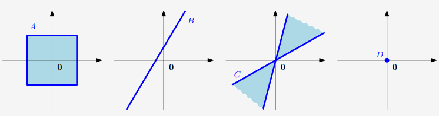

---

* [https://binaryai.blog.csdn.net/article/details/113834812](https://binaryai.blog.csdn.net/article/details/113834812)
* 文章目录5 线性独立6 基和秩7 线性映射8 仿射空间(Affine Spaces)5 线性独立下面我们来看看我们可以用向量（向量空间的元素）做什么。特别地，我们可以将向量相加，然后用标量相乘，而封闭性保证我们在同一个向量空间中得到另一个向量。那么有可能找到一组向量，我们可以用这些向量表示向量空间中的其他所有向量，方法是将它们相加并缩放。这组向量是一个基(basis)，我们将在后面讨论它。在此之前，我们需要介绍以下线性组合和线性独立(linear combinations 和 linear indepe
* 2022-11-03 21:38:14

---

### 文章目录

*  

  * [2 线性代数 (Linear Algebra)（中）](#2_Linear_Algebra_1)
*  

  * [2.4 向量空间](#24__3)
  *  

    * [2.4.1 群](#241__8)
    * [2.4.2 向量空间](#242__56)
    * [2.4.3 向量子空间](#243__117)
  * [2.5 线性独立](#25__151)
  * [2.6 基和秩](#26__256)
  *  

    * [2.6.1 生成集和基](#261__259)
    * [2.6.2 秩](#262__341)

## 2 [线性](https://so.csdn.net/so/search?q=%E7%BA%BF%E6%80%A7&spm=1001.2101.3001.7020)代数 (Linear Algebra)（中）

### 2.4 向量空间

到目前为止，我们已经了解了线性方程组以及如何求解它们 (2.3 节)。我们看到线性方程组可以用矩阵 - 向量表示法来表示。下面，我们将更深入地了解向量空间，即向量所在的结构化空间。

在本章的开头，我们非正式地将向量描述为相加并乘以标量后，仍然是相同类型的对象。现在，我们准备将其形式化，我们将首先介绍群的概念，它包含一组元素和一个定义在这些元素上的操作，该操作可以保持集合的某些结构完整。

#### 2.4.1 群

群在计算机科学中扮演着重要的角色。除了为集合上的运算提供一个基本框架外，它们还被大量应用于密码学、编码理论和图形学。

**定义 2.7** 群

考虑一个集合**                                   G                              \mathcal{G}                  **G 和一个定义在**                                   G                              \mathcal{G}                  **G 上的运算**                                   ⊗                         :                         G                         ×                         G                         →                         G                              \otimes: \mathcal{G} \times \mathcal{G} \rightarrow \mathcal{G}                  **⊗**:**G**×**G**→**G。如果下列条件成立，则**                                   G                         :                         =                         (                         G                         ,                         ⊗                         )                              G:=(\mathcal{G}, \otimes)                  **G**:**=**(**G**,**⊗**)** 称为群 (​*group*​)：

* 1 **                                        G                                  \mathcal{G}                     **G 在**                                        ⊗                                  \otimes                     **⊗运算下的**封闭性 (​*Closure*​)**：**                                        ∀                            x                            ,                            y                            ∈                            G                            :                            x                            ⊗                            y                            ∈                            G                                  \forall x, y \in \mathcal{G}: x \otimes y \in \mathcal{G}                     **∀**x**,**y**∈**G**:**x**⊗**y**∈**G**
* 2 ​**结合律 (**​***Associativity***​**)**​：**                                        ∀                            x                            ,                            y                            ,                            z                            ∈                            G                            :                            (                            x                            ⊗                            y                            )                            ⊗                            z                            =                            x                            ⊗                            (                            y                            ⊗                            z                            )                                  \forall x, y, z \in \mathcal{G}:(x \otimes y) \otimes z=x \otimes(y \otimes z)                     **∀**x**,**y**,**z**∈**G**:**(**x**⊗**y**)**⊗**z**=**x**⊗**(**y**⊗**z**)**
* 3 ​**单位元 (**​***Neutral elemen***​**)**​：**                                        ∃                            e                            ∈                            G                            ∀                            x                            ∈                            G                            :                            x                            ⊗                            e                            =                            x                             and                             e                            ⊗                            x                            =                            x                                  \exists e \in \mathcal{G} \forall x \in \mathcal{G}: x \otimes e=x \text { and } e \otimes x=x                     **∃**e**∈**G**∀**x**∈**G**:**x**⊗**e**=**x** and **e**⊗**x**=**x**
* 4 ​**逆元 (**​***Inverse element***​**)**​：**                                        ∀                            x                            ∈                            G                            ∃                            y                            ∈                            G                            :                            x                            ⊗                            y                            =                            e                             and                             y                            ⊗                            x                            =                            e                                  \forall x \in \mathcal{G} \exists y \in \mathcal{G}: x \otimes y=e \text { and } y \otimes x=e                     **∀**x**∈**G**∃**y**∈**G**:**x**⊗**y**=**e** and **y**⊗**x**=**e**，其中**                                        e                                  e                     **e 是单位元。我们经常写**                                                   x                                           −                                  1                                                       x^{−1}                     **x**−**1 来表示**                                        x                                  x                     **x 的逆元。

  ​**备注**​：

  逆元是针对运算**                                   ⊗                              ⊗                  **⊗定义的，并不一定意味着逆元一定是**                                             1                            x                                       \frac{1}{x}                  **x**1**​

  另外，**                                   ∀                         x                         ,                         y                         ∈                         G                         :                         x                         ⊗                         y                         =                         y                         ⊗                         x                              \forall x, y \in \mathcal{G}: x \otimes y=y \otimes x                  **∀**x**,**y**∈**G**:**x**⊗**y**=**y**⊗**x**, 那么**                                   G                         =                         (                         G                         ,                         ⊗                         )                              G=(\mathcal{G}, \otimes)                  **G**=**(**G**,**⊗**) 是**阿贝尔群** ( ​*Abelian group*​, 即可交换运算顺序的)。

  **例 2.10** 群

  **                                   Z                              \mathbb{Z}                  **Z：整数；**                                             N                            0                                       \mathrm{N}_{0}                  **N**0**：自然数；**                                   R                              \mathbb{R}                  **R：实数。**                                   C                              \mathbb{C}                  **C：复数

  让我们看一些具有相关操作的集合示例，判断它们是否为群：

  * **                                             (                               Z                               ,                               +                               )                                      (\mathbb{Z},+)                        **(**Z**,**+**) 是一个阿贝尔群。
* **                                             (                                           N                                  0                                          ,                               +                               )                                      (\mathrm{N}_{0},+)                        **(**N**0**​**,**+**) 不是一个群：虽然**                                             (                                           N                                  0                                          ,                               +                               )                                      (\mathrm{N}_{0},+)                        **(**N**0**​**,**+**) 有一个单位元，但是缺少逆元。
* **                                             (                               Z                               ,                               ⋅                               )                                      (\mathbb{Z}, \cdot)                        **(**Z**,**⋅**) 不是群：虽然**                                             (                               Z                               ,                               ⋅                               )                                      (\mathbb{Z}, \cdot)                        **(**Z**,**⋅**) 包含一个单位元（1），但是任何**                                             z                               ∈                               Z                               ,                               z                               ≠                               ±                               1                                      z \in \mathbb{Z}, z \neq\pm 1                        **z**∈**Z**,**z**=**±**1** 的逆元都不是整数。
* **                                             (                               R                               ,                               ⋅                               )                                      (\mathbb{R}, \cdot)                        **(**R**,**⋅**) 不是群，因为 0 不具有逆元。
* **                                             (                               R                               \                               {0}                               ,                               ⋅                               )                                      (\mathbb{R} \backslash\{0\}, \cdot)                        **(**R**\**{**0**}**,**⋅**) 是阿贝尔群。
* **                                                         (                                               R                                     n                                              ,                                  +                                  )                                          ,                                           (                                               Z                                     n                                              ,                                  +                                  )                                          ,                               n                               ∈                               N                                      \left(\mathbb{R}^{n},+\right),\^​^left(\mathbb{Z}^{n},+\right), n \in \mathbb{N}                        **(**R**n**,**+**)**,**(**Z**n**,**+**)**,**n**∈**N 是阿贝尔群，前提是**                                             +                                      +                        **+ 是按分量定义的，即：**                                                               (                                                   x                                        1                                                  ,                                     ⋯                                      ,                                                   x                                        n                                                  )                                              +                                               (                                                   y                                        1                                                  ,                                     ⋯                                      ,                                                   y                                        n                                                  )                                              =                                               (                                                   x                                        1                                                  +                                                   y                                        1                                                  ,                                     ⋯                                      ,                                                   x                                        n                                                  +                                                   y                                        n                                                  )                                                       \**​**left(x_{1}, \**​**cdots, x_{n}\**​**right)+\left(y_**​**{1}, \cdots, y_**​**{n}\right)=\**​**left(x_{1}+y_**​**{1}, \cdots, x_**​**{n}+y_{n}\**​**right)                            ​**​****(****​**x**1,**⋯**,**x**n)**+**(**y**1,**⋯**,**y**n)**=**(**x**1+**y**1,**⋯**,**x**n+**y**n)  
  **                                                                      (                                                   x                                        1                                                  ,                                     ⋯                                      ,                                                   x                                        n                                                  )                                                           −                                     1                                                      :                               =                                           (                                  −                                               x                                     1                                              ,                                  ⋯                                   ,                                  −                                               x                                     n                                              )                                                 \left(x_{1}, \cdots, x_{n}\right)^{-1}:=\left(-x_{1}, \cdots,-x_{n}\right)                        **(**x**1**​**,**⋯**,**x**n**​**)**−**1**:**=**(**−**x**1**​**,**⋯**,**−**x**n)** 为逆元，**                                             e                               =                               (                               0                               ,                               ⋯                                ,                               0                               )                                      e=(0, \cdots, 0)                        **e**=**(**0**,**⋯**,**0**) 为单位元。
* **                                             (                                           R                                               m                                     ×                                     n                                                      ,                               +                               )                                      \left(\mathbb{R}^{m \times n},+\right)                        **(**R**m**×**n**,**+**)**，**                                             m                               ×                               n                                      m×n                        **m**×**n- 矩阵集是阿贝尔群（前提是具有上面例子一样的分量加法）。
* 让我们仔细看看**                                             (                                           R                                               n                                     ×                                     n                                                      ,                               ⋅                               )                                      \left(\mathbb{R}^{n \times n}, \^​^cdot\right)                        ​^​**^(^**​^R^​**^n^**​^×^​**^n^**​^,^​**^⋅^**​^)^​**^，即前文定义的具有矩阵乘法的^**​^​                                             n                               ×                               n                                      n×n                        ​^​**^n^**​^×^​**^n- 矩阵集。– 封闭性和结合性直接来自于矩阵乘法的定义。^**​**^– 单位元：单位矩阵^**​^​                                                         I                                  n                                                 \boldsymbol{I}_^​^{n}                        ​^​**^I^**​^n^​**^– 逆元：如果^**​^​                                             A                                      \boldsymbol{A}                        ​^​**^A 的逆存在（^**​^​                                             A                                      \boldsymbol{A}                        ​^​**^A 是正则的），那么^**​^​                                                         A                                               −                                     1                                                             \boldsymbol{A}^{−1}                        **A**−**1 就是**                                             A                               ∈                                           R                                               n                                     ×                                     n                                                             \boldsymbol{A} \in \mathbb{R}^{n \times n}                        ​^​**^A^**​^∈^​**^R^**​^n^​**^×^**​^n** 的逆元，在这种情况下**                                             (                                           R                                               n                                     ×                                     n                                                      ,                               ⋅                               )                                      \left(\^​^mathbb{R}^{n \times n}, \cdot\right)                        **(**R**n**×**n**,**⋅**)** 就是一个群，称为一般​**线性群 (**​***general linear group***​**)**​。

  **定义 2.8** 一般线性群

  正则（可逆）矩阵集**                                   A                         ∈                                   R                                       n                               ×                               n                                                 \boldsymbol{A} \in \mathbb{R}^{n \times n}                  **A**∈**R**n**×**n** 关于矩阵乘法的群，称为一般线性群**                                   G                         L                         (                         n                         ,                         R                         )                              G L(n, \mathbb{R})                  **G**L**(**n**,**R**)。然而，由于矩阵乘法是不可交换的，所以该群不是阿贝尔群。

  #### 2.4.2 向量空间

  当我们讨论群时，我们研究了集合**                                   G                              \mathcal{G}                  **G 的内部运算，即**                                   G                              \mathcal{G}                  **G 内部元素运算的映射**                                   G                         ×                         G                         →                         G                              \mathcal{G} \times \mathcal{G} \rightarrow \mathcal{G}                  **G**×**G**→**G。在下面，我们将考虑除了**内部运算 ( ​*inner operation*​)**“**                                   +                              +                  **+” 外的**外部运算 (​*outer operation*​)**“**                                   ⋅                              ·                  **⋅”：向量**                                   x                         ∈                         G                              x \in \mathcal{G}                  **x**∈**G 乘以一个标量**                                   λ                         ∈                         R                              \lambda \in \mathbb{R}                  **λ**∈**R。我们可以把内部运算看作是加法的形式，外部运算看作是缩放的形式。请注意，内部 / 外部操作与内积 / 外积无关。

  **定义 2.9** 向量空间

  实值**向量空间 (**​***Vector Space***​**)**                                   V                         =                         (                         V                         ,                         +                         ,                         ⋅                         )                              V=(\mathcal{V},+,\cdot)                  **V**=**(**V**,**+**,**⋅**)** 是一个有两类运算的集合**                                   V                              \mathcal{V}                  **V

  **                                   +                         :                         V                         ×                         V                         →                         V                              +: \mathcal{V} \times \mathcal{V} \rightarrow \mathcal{V}                  **+**:**V**×**V**→**V**                                   ⋅                         :                         R                         ×                         V                         →                         V                              \**​**cdot :\mathbb{R} \**​**times \mathcal{V} \**​**rightarrow \mathcal{V}                  ​**​****⋅****​**:**R**×**V**→**V

  其中

  1 **                                   (                         V                         ,                         +                         )                              (\mathcal{V},+)                  **(**V**,**+**) 是阿贝尔群

  2 分配律：

  **                                   ∀                         λ                         ∈                         R                         ,                         x                         ,                         y                         ∈                         V                         :                         λ                         ⋅                         (                         x                         +                         y                         )                         =                         λ                         ⋅                         x                         +                         λ                         ⋅                         y                              \forall \lambda \in \mathbb{R}, \boldsymbol{x}, \boldsymbol{y} \in \mathcal{V}: \lambda \cdot(\boldsymbol{x}+\boldsymbol{y})=\lambda \cdot \boldsymbol{x}+\lambda \cdot \boldsymbol{y}                  **∀**λ**∈**R**,**x**,**y**∈**V**:**λ**⋅**(**x**+**y**)**=**λ**⋅**x**+**λ**⋅**y**  
  **                                   ∀                         λ                         ,                         ψ                         ∈                         R                         ,                         x                         ∈                         V                         :                         (                         λ                         +                         ψ                         )                         ⋅                         x                         =                         λ                         ⋅                         x                         +                         ψ                         ⋅                         x                              \forall \lambda, \psi \in \mathbb{R}, \boldsymbol{x} \in \mathcal{V}:(\lambda+\psi) \cdot \boldsymbol{x}=\lambda \cdot \boldsymbol{x}+\psi \cdot \boldsymbol{x}                  **∀**λ**,**ψ**∈**R**,**x**∈**V**:**(**λ**+**ψ**)**⋅**x**=**λ**⋅**x**+**ψ**⋅**x**

  3 结合律（外部操作）：**                                   ∀                         λ                         ,                         ψ                         ∈                         R                         ,                         x                         ∈                         V                         :                         λ                         ⋅                         (                         ψ                         ⋅                         x                         )                         =                         (                         λ                         ψ                         )                         ⋅                         x                              \forall \lambda, \psi \in \mathbb{R}, \boldsymbol{x} \in \mathcal{V}: \lambda \cdot(\psi \cdot \boldsymbol{x})=(\lambda \psi) \cdot \boldsymbol{x}                  **∀**λ**,**ψ**∈**R**,**x**∈**V**:**λ**⋅**(**ψ**⋅**x**)**=**(**λ**ψ**)**⋅**x

  4 关于外部操作的单位元：**                                   ∀                         x                         ∈                         V                         :                         1                         ⋅                         x                         =                         x                              \forall \boldsymbol{x} \in \mathcal{V}: 1 \cdot \boldsymbol{x}=\boldsymbol{x}                  **∀**x**∈**V**:**1**⋅**x**=**x**

  元素**                                   x                         ∈                         V                              \boldsymbol{x} \in V                  **x**∈**V 称为向量。**                                   (                         V                         ,                         +                         )                              (\mathcal{V},+)                  **(**V**,**+**) 的单位元是零向量**                                   0                         =                         [                         0                         ,                         …                         ,                         0                                   ]                            ⊤                                       \mathbf{0}=[0, \ldots, 0]^{\top}                  **0**=**[**0**,**…**,**0**]**⊤**，内部运算**                                   +                              +                  **+ 称为**向量加法 (​*vector addition*​)**。元素**                                   λ                         ∈                         R                              \lambda \in \mathbb{R}                  **λ**∈**R 称为**标量 (​*scalars*​)**，外部运算 “**                                   ⋅                              ·                  **⋅” 是被**标量乘 (​*multiplication by scalars*​)**。注意**标量积 ( *scalar product***​) 与这是不同的，这在 3.2 节中会讲。

  **备注：**

  “向量乘法 (​*vector multiplication*​)”**                                             a                            b                                  ,                         a                         ,                         b                         ∈                                   R                            n                                       \boldsymbol{a b}, \boldsymbol{a}, \boldsymbol{b} \in \mathbb{R}^{n}                  ​^​**^a^**​^b^​**^,^**​^a^​**^,^**​^b^​**^∈^**​^R^​**^n 是没有定义的。理论上，我们可以定义一个按元素的乘法，比如^**​^​                                   c                         =                                   a                            b                                       \boldsymbol{c}=\^​^boldsymbol{a b}                  ​^​**^c^**​^=^​**^a^**​^b^​**^，其中^**​^​                                             c                            j                                  =                                   a                            j                                            b                            j                                       c_j=a_^​^j b_j                  ​^​**^c^**​^j=^​**^a^**​^jb^​**^j^**​^**。这种 “数组乘法 (^​*^array multiplication^*​^)” 在许多编程语言中都很常见，但这使得用矩阵乘法的标准规则在数学意义上有限：通过将向量视为**                                   n                         ×                         1                              n×1                  ​^​**^n^**​^×^​**^1 矩阵（我们通常这样做），我们可以使用 2.3 节定义的矩阵乘法进行运算。可这样的话，向量与向量直接相乘的维数却不匹配。仅以下向量乘法有定义：^**​^​                                   a                                   b                            ⊤                                  ∈                                   R                                       n                               ×                               n                                                 \boldsymbol{a} \^​^boldsymbol{b}^{\top} \in \mathbb{R}^{n \times n}                  ​^​**^a^**​^b^​**^⊤^**​^∈^​**^R^**​^n^​**^×^**​^n**（外积,^​*^outer product^*​^），**                                             a                            ⊤                                  b                         ∈                         R                              \boldsymbol{a}^{\top} \boldsymbol{b} \in \mathbb{R}                  **a**⊤**b**∈**R（内积 / 标量积 / 点积​*​ inner/scalar/dot product*​）

  **例 2.11** 向量空间

  让我们看看一些重要的例子：

  * **                                             V                               =                                           R                                  n                                          ,                               n                               ∈                               N                                      \mathcal{V}=\mathbb{R}^{n}, n \in \^​^mathbb{N}                        ​^​**^V^**​^=^​**^R^**​^n^​**^,^**​^n^​**^∈^**​^N** 是一个向量空间，其运算定义如下：– 相加：对于所有**                                             x                               ,                               y                               ∈                                           R                                  n                                                 \^​^boldsymbol{x}, \boldsymbol{y} \^​^in \mathbb{R}^{n}                        **x**,**y**∈**R**n**，**                                             x                               +                               y                               =                                           (                                               x                                     1                                              ,                                  …                                  ,                                               x                                     n                                              )                                          +                                           (                                               y                                     1                                              ,                                  …                                  ,                                               y                                     n                                              )                                          =                                           (                                               x                                     1                                              +                                               y                                     1                                              ,                                  …                                  ,                                               x                                     n                                              +                                               y                                     n                                              )                                                 \boldsymbol{x}+\boldsymbol{y}=\left(x_{1}, \ldots, x_{n}\right)+\left(y_{1}, \ldots, y_{n}\right)=\left(x_{1}+y_{1}, \ldots, x_{n}+y_{n}\right)                        **x**+**y**=**(**x**1**​**,**…**,**x**n**​**)**+**(**y**1**​**,**…**,**y**n**​**)**=**(**x**1**​**+**y**1**​**,**…**,**x**n**​**+**y**n**​**)– 与标量相乘：对于所有**                                             λ                               ∈                               R                               ,                               x                               ∈                                           R                                  n                                                 \lambda \in \mathbb{R}, \boldsymbol{x} \in \mathbb{R}^{n}                        **λ**∈**R**,**x**∈**R**n**，**                                             λ                               x                               =                               λ                                           (                                               x                                     1                                              ,                                  …                                  ,                                               x                                     n                                              )                                          =                                           (                                  λ                                               x                                     1                                              ,                                  …                                  ,                                  λ                                               x                                     n                                              )                                                 \lambda \boldsymbol{x}=\lambda\left(x_{1}, \ldots, x_{n}\right)=\left(\lambda x_{1}, \ldots, \lambda x_{n}\right)                        **λ**x**=**λ**(**x**1**​**,**…**,**x**n**​**)**=**(**λ**x**1,**…**,**λ**x**n**​**)
* **                                             V                               =                                           R                                               m                                     ×                                     n                                                      ,                               m                               ,                               n                               ∈                               N                                      \mathcal{V}=\mathbb{R}^{m \times n}, m, n \in \mathbb{N}                        **V**=**R**m**×**n**,**m**,**n**∈**N** 是一个向量空间  
  – 相加：对于**                                             A                               ,                               B                               ∈                               V                                      A, B \in \mathcal{V}                        **A**,**B**∈**V 逐元素相加**                                             A                               +                               B                               =                                           [                                                                                                                               a                                                    11                                                                  +                                                                   b                                                    11                                                                                                                                     ⋯                                                                                                                                       a                                                                       1                                                       n                                                                                    +                                                                   b                                                                       1                                                       n                                                                                                                                                                               ⋮                                                                                                                                                                                                                       ⋮                                                                                                                                                                                                             a                                                                       m                                                       1                                                                                    +                                                                   b                                                                       m                                                       1                                                                                                                                                       ⋯                                                                                                                                       a                                                                       m                                                       n                                                                                    +                                                                   b                                                                       m                                                       n                                                                                                                                           ]                                                 \boldsymbol{A}+\boldsymbol{B}=\left[**  
  a11+b11⋯a1n+b1n⋮⋮am1+bm1⋯amn+bmn  
  \right]                        **A**+**B**=⎣⎢⎡a**1**1+**b**1**1**​**⋮**a**m**1+**b**m**1**​⋯**⋯**​**a**1**n**​**+**b**1**n⋮**a**m**n**​**+**b**m**n​⎦⎥⎤  
  – 与标量相乘：**                                             λ                               A                               =                                           [                                                                                                             λ                                                                   a                                                    11                                                                                                                                     ⋯                                                                                                                     λ                                                                   a                                                                       1                                                       n                                                                                                                                                                               ⋮                                                                                                                                                                                                                       ⋮                                                                                                                                                                                           λ                                                                   a                                                                       m                                                       1                                                                                                                                                       ⋯                                                                                                                     λ                                                                   a                                                                       m                                                       n                                                                                                                                           ]                                                 \lambda \boldsymbol{A}=\left[**λa11⋯λa1n⋮⋮λam1⋯λamn

  \right]                        **λ**A**=**⎣⎢⎡λ**a**1**1**​**⋮**λ**a**m**1**​⋯**⋯**​**λ**a**1**n⋮**λ**a**m**n​⎦⎥⎤，记住**                                                         R                                               m                                     ×                                     n                                                             \mathbb{R}^{m \times n}                        ​^​**^R^**​^m^​**^×^**​^n** 相当于**                                                         R                                               m                                     n                                                             \mathbb{R}^{m n}                        **R**m**n。
* **                                             V                               =                               C                                      \mathcal{V}=\mathbb{C}                        **V**=**C 也是一个向量空间。

  ​**备注**​：

  在下面，当**                                   +                              +                  **+ 和**                                   ⋅                              ·                  **⋅是标准向量加法和标量乘法时，我们将用**                                   V                              V                  **V 表示向量空间**                                   (                         V                         ,                         +                         ,                         ⋅                         )                              (\mathcal{V},+, \cdot)                  **(**V**,**+**,**⋅**)。此外，我们将使用符号**                                   x                         ∈                         V                              \boldsymbol{x} \in V                  **x**∈**V 表示**                                   V                              \mathcal{V}                  **V 中的向量，以简化符号。

  ​**备注**​：

  向量空间**                                             R                            n                                  ,                                   R                                       n                               ×                               1                                            ,                                   R                                       1                               ×                               n                                                 \mathbb{R}^{n}, \mathbb{R}^{n \times 1}, \mathbb{R}^{1 \times n}                  ​^​**^R^**​^n^​**^,^**​^R^​**^n^**​^×^​**^1^**​^,^​**^R^**​^1^​**^×^**​^n** 只是我们写向量的方式不同。在下文中，我们将不区分**                                             R                            n                                       \mathbb{R}^{n}                  **R**n** 和**                                             R                                       n                               ×                               1                                                 \mathbb{R}^{n \times 1}                  **R**n**×**1**，这允许我们将**                                   n                              n                  **n 元组用列向量 ( ​*column vectors*​) 表示  
  **                                        x                            =                                       [                                                                                                     x                                              1                                                                                                                                  ⋮                                                                                                                                                                              x                                              n                                                                                                ]                                             \boldsymbol{x}=\left[**

x1⋮xn

\right]                      **x**=⎣⎢⎡x**1**​**⋮**x**n**​⎦⎥⎤

这简化了向量空间运算的表示法。但是，我们确实要区分了**                                             R                                       n                               ×                               1                                                 \mathbb{R}^{n \times 1}                  ​^​**^R^**​^n^​**^×^**​^1** 和**                                             R                                       1                               ×                               n                                                 \mathbb{R}^{1 \times n}                  **R**1**×**n**（行向量**​***​ row vectors***​**），以避免在使用矩阵乘法时混淆。默认情况下，我们写**                                   x                              \boldsymbol{x}                  **x 来表示列向量，行向量则由**                                             x                            ⊤                                       \boldsymbol{x}^{\top}                  **x**⊤**表示，为列向量的转置。

#### 2.4.3 向量子空间

下面，我们将介绍向量子空间。直观地说，它们是原始向量空间中的集合，且具有这样的性质：我们对子空间的元素进行向量空间运算，结果不会超出子空间。从这个意义上说，它们是 “封闭的”。向量子空间是[机器学习](https://so.csdn.net/so/search?q=%E6%9C%BA%E5%99%A8%E5%AD%A6%E4%B9%A0&spm=1001.2101.3001.7020)中的一个重要概念。例如，第 10 章展示了如何使用向量子空间进行降维。

**定义 2.10** 向量子空间

令**                                   V                         =                         (                         V                         ,                         +                         ,                         ⋅                         )                              V=(\mathcal{V},+, \cdot)                  **V**=**(**V**,**+**,**⋅**) 为向量空间，且**                                   U                         ⊆                         V                         ,                         U                         ≠                         ∅                              \mathcal{U} \subseteq \mathcal{V}, \mathcal{U} \neq \emptyset                  **U**⊆**V**,**U**=**∅，如果**                                   U                              U                  **U 是一个向量空间，且它的向量空间运算 “**                                   +                              +                  **+” 和 “**                                   ⋅                              ·                  **⋅” 限制为**                                   U                         ×                         U                              \mathcal{U} \times \mathcal{U}                  **U**×**U 和**                                   R                         ×                         U                              \mathbb{R} \times \mathcal{U}                  **R**×**U，那么**                                   U                         =                         (                         U                         ,                         +                         ,                         ⋅                         )                              U=(\mathcal{U},+, \cdot)                  **U**=**(**U**,**+**,**⋅**) 称为**                                   V                              V                  **V 的**向量子空间** (​*vector subspace*​，或​*​ linear subspace*​)。我们用**                                   U                         ⊆                         V                              U⊆V                  **U**⊆**V 来表示**                                   V                              V                  **V 的子空间**                                   U                              U                  **U。

如果**                                   U                         ⊆                         V                              U \subseteq V                  **U**⊆**V(书中**                                   U                         ⊆                         V                              \mathcal{U} \subseteq \mathcal{V}                  **U**⊆**V 可能有误) 且**                                   V                              V                  **V 是向量空间，那么**                                   U                              U                  **U 自然地直接从**                                   V                              V                  **V 继承了许多性质，因为这些性质适用于所有**                                   x                         ∈                         V                              x∈\mathcal{V}                  **x**∈**V，特别是所有**                                   x                         ∈                         U                         ⊆                         V                              \boldsymbol{x} \in \mathcal{U} \subseteq \mathcal{V}                  **x**∈**U**⊆**V。这包括阿贝尔群的性质、分配律、结合律和基元。为了确定**                                   (                         U                         ,                         +                         ,                         ⋅                         )                              (\mathcal{U},+, \cdot)                  **(**U**,**+**,**⋅**) 是否是**                                   V                              V                  **V 的子空间，我们还需要确定：

1 **                                   U                         ≠                         ∅                              \mathcal{U} \neq \emptyset                  **U**=**∅，特别地，单位元**                                   0                         ∈                         U                              \boldsymbol{0}\in \mathcal{U}                  **0**∈**U

2 **                                   U                              U                  **U 的封闭性：

* 关于外部操作：**                                        ∀                            λ                            ∈                            R                            ∀                            x                            ∈                            U                            :                            λ                            x                            ∈                            U                                  \forall \lambda \in \mathbb{R} \forall \boldsymbol{x} \in \mathcal{U}: \lambda \boldsymbol{x} \in \mathcal{U}                     **∀**λ**∈**R**∀**x**∈**U**:**λ**x**∈**U
* 关于内部操作：**                                        ∀                            x                            ,                            y                            ∈                            U                            :                            x                            +                            y                            ∈                            U                                  \forall x, y \in \mathcal{U}: x+y \in \mathcal{U}                     **∀**x**,**y**∈**U**:**x**+**y**∈**U**

**例 2.12** 向量子空间

让我们来看一些例子：

* 对于每个向量空间**                                             V                                      V                        **V，其**平凡子空间 ( *trivial subspaces*​**) 是**                                             V                                      V                        **V 本身和**                                             0                                      {\boldsymbol{0}}                        **0
* 图 2.6 中只有示例**                                             D                                      D                        **D 是**                                                         R                                  2                                                 \mathbb{R}^{2}                        **R**2** 的子空间（包含内部 / 外部操作）。在**                                             A                                      A                        **A 和**                                             C                                      C                        **C 中，违反了封闭性；而**                                             B                                      B                        **B 不包含**                                             0                                      \boldsymbol{0}                        **0。  
  ​​

  **图 2.6** 不是所有的**                                                         R                                  2                                                 \mathbb{R}^2                        **R**2** 子集都是子空间。**                                             A                                      A                        **A 和**                                             C                                      C                        **C 违反了封闭性；**                                             B                                      B                        **B 不包含**                                             0                                      \boldsymbol{0}                        **0。只有**                                             D                                      D                        **D 是子空间。
* 具有**                                             n                                      n                        **n 个未知量**                                             x                               =                                                        [                                                   x                                        1                                                  ,                                     …                                     ,                                                   x                                        n                                                  ]                                              ⊤                                                 \boldsymbol{x}=\left[x_{1}, \ldots, x_{n}\right]^{\top}                        ​^​**^x^**​^=^​**^[^**​^x^​**^1,^**​^…^​**^,^**​^x^​**^n]^**​^⊤^​**^的齐次线性方程组^**​^​                                             A                               x                               =                               0                                      \boldsymbol{A}\^​^boldsymbol{x}=\boldsymbol{0}                        ​^​**^A^**​^x^​**^=^**​^0** 的解集是**                                                         R                                  n                                                 \mathbb{R}^{n}                        **R**n** 的一个子空间  
  .
* 非齐次线性方程组**                                             A                               z                               =                               b                               ，                               b                               ≠                               0                                      \boldsymbol{A}\boldsymbol{z}=\boldsymbol{b}，\boldsymbol{b}\not = \boldsymbol{0}                        **A**z**=**b**，**b****​**=**0** 的解不是**                                                         R                                  n                                                 \mathbb{R}^{n}                        **R**n** 的子空间
* 任意子空间的交集是它们本身的一个子空间。

  **备注：**

  对于**                                   x                         ∈                                   R                            n                                       \boldsymbol{x} \in \mathbb{R}^{n}                  ​^​**^x^**​^∈^​**^R^**​^n^​**^，每个子空间^**​^​                                   U                         ⊆                                   (                                       R                               n                                      ,                            +                            ,                            ⋅                            )                                       U \subseteq\^​^left(\mathbb{R}^{n},+, \cdot\right)                  **U**⊆**(**R**n**,**+**,**⋅**)** 是齐次线性方程组**                                   A                         x                         =                         0                              \boldsymbol{A}\boldsymbol{x}=\boldsymbol{0}                  **A**x**=**0** 的解空间

  ### 2.5 线性独立

  下面我们来看看我们可以用向量（向量空间的元素）做什么。从前文我们知道，我们将向量相加，然后用标量相乘，封闭性能保证我们在同一个向量空间中得到另一个向量。那么有没有可能找到一组向量，允许我们可以用这些向量相加并缩放后得到向量空间中的其他所有向量？实际上，这组向量是一组​**基 (**​***basis***​**)**​，我们将在后面讨论它。在此之前，我们需要介绍一下线性组合和线性独立。

  **定义 2.11** 线性组合

  考虑向量空间**                                   V                              V                  **V 和有限个向量**                                             x                            1                                  ,                         …                         ,                                   x                            k                                  ∈                         V                              x_{1}, \ldots, x_{k} \in V                  **x**1,**…**,**x**k∈**V。那么，每一个以下形式的向量**                                   v                         ∈                         V                              \boldsymbol{v} \in V                  **v**∈**V：**                                        v                            =                                       λ                               1                                                 x                               1                                      +                            ⋯                            +                                       λ                               k                                                 x                               k                                      =                                       ∑                                           i                                  =                                  1                                          k                                                 λ                               i                                                 x                               i                                      ∈                            V                                   \**​**boldsymbol{v}=\lambda_**​**{1} \boldsymbol{x}_**​**{1}+\cdots+\**​**lambda_{k} \**​**boldsymbol{x}_{k}=\**​**sum_{i=1}^{k} \**​**lambda_{i} \**​**boldsymbol{x}_{i} \**​**in V                      ​**​****v****​**=**λ**1**​**x**1+**⋯**+**λ**kx**k**​**=**i**=**1**∑**kλ**i**​**x**i∈**V**  
  称为向量**                                             x                            1                                  ,                         …                         ,                                   x                            k                                       \boldsymbol{x}_{1}, \ldots, \boldsymbol{x}_{k}                  **x**1,**…**,**x**k**的**线性组合 (​*linear combination*​)**，其中**                                             λ                            1                                  ,                         …                         ,                                   λ                            k                                  ∈                         R                              \lambda_{1}, \ldots, \lambda_{k} \in \mathbb{R}                  **λ**1,**…**,**λ**k∈**R。

  **                                   0                              \boldsymbol{0}                  **0 向量总是可以写成**                                   k                              k                  **k 个向量**                                             x                            1                                  ,                         …                         ,                                   x                            k                                       \boldsymbol{x}_{1}, \ldots, \boldsymbol{x}_{k}                  **x**1,**…**,**x**k**的线性组合，因为**                                   0                         =                                   ∑                                       i                               =                               1                                      k                                  0                                   x                            i                                       \mathbf{0}=\sum_{i=1}^{k} 0 \boldsymbol{x}_{i}                  **0**=**∑**i**=**1**k**​**0**x**i**​**总是成立。在下文中，我们关注一组向量的非平凡线性组合来表示**                                   0                              \boldsymbol{0}                  **0，即：向量**                                             x                            1                                  ,                         …                         ,                                   x                            k                                       \boldsymbol{x}_{1}, \ldots, \boldsymbol{x}_{k}                  **x**1,**…**,**x**k**在系数**                                             λ                            i                                       λ_i                  **λ**i**​不都为 0 的情况下的线性组合。

  **定义 2.12** 线性相关与线性无关 (独立)

  考虑一个向量空间**                                   V                              V                  **V，且有**                                             x                            1                                  ,                         …                         ,                                   x                            k                                  ∈                         V                         ，                         k                         ∈                         N                              \boldsymbol{x}_{1}, \ldots, \boldsymbol{x}_{k} \in V，k \in \mathbb{N}                  **x**1,**…**,**x**k∈**V**，**k**∈**N。如果存在一个非平凡的线性组合，使得**                                   0                         =                                   ∑                                       i                               =                               1                                      k                                            λ                            i                                            x                            i                                       \boldsymbol{0}=\sum_{i=1}^{k} \lambda_{i} \boldsymbol{x}_{i}                  **0**=**∑**i**=**1**k**​**λ**ix**i**​**，即其中至少有一个**                                             λ                            i                                  ≠                         0                              \lambda_{i} \neq 0                  **λ**i=**0，则向量**                                             x                            1                                  ,                         …                         ,                                   x                            k                                       \boldsymbol{x}_{1}, \ldots, \boldsymbol{x}_{k}                  **x**1,**…**,**x**k**是**线性相关的 (*linearly dependent*​**)。如果只有平凡解存在，即：**                                             λ                            1                                  =                         …                         =                                   λ                            k                                  =                         0                              \lambda_{1}=\ldots=\lambda_{k}=0                  **λ**1=**…**=**λ**k=**0，则向量**                                             x                            1                                  ,                         …                         ,                                   x                            k                                       \boldsymbol{x}_{1}, \ldots, \boldsymbol{x}_{k}                  **x**1,**…**,**x**k**是**线性独立 ( ​*linearly independent*​)**​。

  线性独立是线性代数中最重要的概念之一。直观地说，一组线性无关的向量是由没有冗余的向量组成的，也就是说，如果我们把这些向量中的任何一个去掉，我们就会失去一些东西。在接下来的几节中，我们将进一步形式化这种直觉。

  **例 2.13** 线性相关的向量

  一个地理例子可能有助于理解线性独立的概念。如图 2.7 所示，在 Nairobi (Kenya)的人描述 Kigali (Rwanda)所在地可能会说，“你可以先往西北方向 506 公里到 Kampala (Uganda)，然后往西南方向 374 公里”。这足以说明 Kigali 的位置，因为地理坐标系可被视为二维向量空间（忽略海拔和地球曲面）。这个人可能会补充说，“大约在西边 751 公里处 “。尽管最后一句话是对的，但鉴于前面的信息，这句话没有必要说。在此示例中，“506 km 西北” 矢量（蓝色）和 “374 km 西南” 矢量（紫色）是线性独立的。这意味着西南方向的矢量不能用西北方向的矢量来描述，反之亦然。然而，第三个 “751 km west” 向量（黑色）是其他两个向量的线性组合，这使得这三个向量线性相关。同样地，给定 “西 751 公里” 和“西南 374 公里”，可以线性组合得到“西北 506 公里”。

​

**图 2.7** 二维空间（平面）中线性相关向量的地理示例（基本方向的粗略近似）。

​**备注**​：以下属性可用于确定向量是否线性独立：

* **                                        k                                  k                     **k 个向量要么线性相关，要么线性无关。没有第三种选择。
* 向量**                                                   x                               1                                      ,                            …                            ,                                       x                               k                                            \boldsymbol{x}_{1}, \ldots, \boldsymbol{x}_{k}                     **x**1,**…**,**x**k**​中只要有一个零向量或有两个向量相同，则它们是线性相关的。
* 向量**                                                   {                                           x                                  1                                          ,                               …                               ,                                           x                                  k                                          :                                           x                                  i                                          ≠                               0                               ,                               i                               =                               1                               ,                               …                               ,                               k                               }                                      ,                            k                            ⩾                            2                                  \left\{\boldsymbol{x}_{1}, \ldots, \boldsymbol{x}_{k}: \boldsymbol{x}_{i} \neq \mathbf{0}, i=1, \ldots, k\right\}, k \geqslant 2                     **{**x**1**​**,**…**,**x**k**​**:**x**i**​****​**=**0**,**i**=**1**,**…**,**k**}**,**k**⩾**2，是线性相关的当且仅当（至少）其中一个是其他的线性组合。特别是，如果一个向量是另一个向量的倍数，即：**                                                   x                               i                                      =                            λ                                       x                               j                                      ,                            λ                            ∈                            R                                  \boldsymbol{x}_{i}=\lambda \boldsymbol{x}_{j}, \lambda \in \mathbb{R}                     **x**i=**λ**x**j**​**,**λ**∈**R**，那么集合**                                        {                                       x                               1                                      ,                            …                            ,                                       x                               k                                      :                                       x                               i                                      ≠                            0                            ,                            i                            =                            1                            ,                            …                            ,                            k                            }                                  \left\{\boldsymbol{x}_{1}, \ldots, \boldsymbol{x}_{k}: \boldsymbol{x}_{i} \neq \mathbf{0}, i=1, \ldots, k\right\}                     **{**x**1**​**,**…**,**x**k**​**:**x**i**​****​**=**0**,**i**=**1**,**…**,**k**} 是线性相关的。
* 检验向量**                                                   x                               1                                      ,                            …                            ,                                       x                               k                                      ∈                            V                                  \boldsymbol{x}_{1}, \ldots, \boldsymbol{x}_{k} \in V                     **x**1,**…**,**x**k∈**V 是线性无关的有效方法是采用高斯消元法：将所有向量写为矩阵**                                        A                                  \boldsymbol{A}                     **A 的列，并进行高斯消元，直到矩阵为行阶梯型（这里不需要行最简阶梯型）：– 主元列表示与左侧的向量线性无关的向量。请注意在构建矩阵时对向量排序。**​**– 非主元列可以表示为其左侧主元列的线性组合。例如，行阶梯型矩阵**                                             [                                                                                     1                                                                                             3                                                                                             0                                                                                                                   0                                                                                             0                                                                                             2                                                                                 ]                                       \**​**left[**130002

  \right]                         **[**1**0**​**3**00**2**​**]**  
  告诉我们第一列和第三列是主元列。第二列是非主元列，它是第一列的三倍。

  ​**当且仅当所有列都是主元列时，所有列向量才是线性独立的**​。尽管只有一个非主元列，这些列（以及相应的向量）也是线性相关的。

  **例 2.14**

  考虑**                                             R                            4                                       \mathbb{R}^{4}                  **R**4** 以及向量：  
  **                                                   x                               1                                      =                                       [                                                                                     1                                                                                                                   2                                                                                                                                   −                                              3                                                                                                                                  4                                                                                 ]                                      ,                                                x                               2                                      =                                       [                                                                                     1                                                                                                                   1                                                                                                                   0                                                                                                                   2                                                                                 ]                                      ,                                                x                               3                                      =                                       [                                                                                                     −                                              1                                                                                                                                                  −                                              2                                                                                                                                  1                                                                                                                   1                                                                                 ]                                             \boldsymbol{x}_{1}=\left[**

12−34

\right], \quad \boldsymbol{x}_{2}=\left[

1102

\right], \quad \boldsymbol{x}_{3}=\left[

−1−211

\right]                      **x**1=⎣⎢⎢⎡1**2**−**3**4⎦⎥⎥⎤,**x**2=⎣⎢⎢⎡1**1**0**2**​⎦⎥⎥⎤,**x**3=⎣⎢⎢⎡−**1**−**2**1**1**​⎦⎥⎥⎤  
 为了检验它们是否是线性相关的，对于**                                             λ                            1                                  ,                         …                         ,                                   λ                            3                                       \lambda_{1}, \ldots, \lambda_{3}                  **λ**1,**…**,**λ**3**，我们采用一般的方法求解 **                                                   λ                               1                                                 x                               1                                      +                                       λ                               2                                                 x                               2                                      +                                       λ                               3                                                 x                               3                                      =                                       λ                               1                                                 [                                                                                     1                                                                                                                   2                                                                                                                                   −                                              3                                                                                                                                  4                                                                                 ]                                      +                                       λ                               2                                                 [                                                                                     1                                                                                                                   1                                                                                                                   0                                                                                                                   2                                                                                 ]                                      +                                       λ                               3                                                 [                                                                                                     −                                              1                                                                                                                                                  −                                              2                                                                                                                                  1                                                                                                                   1                                                                                 ]                                      =                            0                                   \**​**lambda_{1} \**​**boldsymbol{x}_{1}+\**​**lambda_{2} \**​**boldsymbol{x}_{2}+\**​**lambda_{3} \**​**boldsymbol{x}_{3}=\**​**lambda_{1}\**​**left[**

12−34

\right]+\lambda_{2}\left[1102

\right]+\lambda_{3}\left[−1−211

\right]=\mathbf{0}                      **λ**1x**1**​**+**λ**2**​**x**2+**λ**3x**3**​**=**λ**1**​⎣⎢⎢⎡1**2**−**3**4⎦⎥⎥⎤+**λ**2⎣⎢⎢⎡1**1**0**2**​⎦⎥⎥⎤+**λ**3⎣⎢⎢⎡−**1**−**2**1**1**​⎦⎥⎥⎤=**0**  
 我们将向量**                                             x                            i                                  ,                         i                         =                         1                         ,                         2                         ,                         3                              \boldsymbol{x}_{i}, i=1,2,3                  **x**i,**i**=**1**,**2**,**3 作为矩阵的列，并应用初等行变换，直到我们确定主元列： **                                                   [                                                                                     1                                                                                             1                                                                                                             −                                              1                                                                                                                                  2                                                                                             1                                                                                                             −                                              2                                                                                                                                                  −                                              3                                                                                                            0                                                                                             1                                                                                                                   4                                                                                             2                                                                                             1                                                                                 ]                                               ⇝                            ⋯                            ⇝                                                [                                                                                     1                                                                                             1                                                                                                             −                                              1                                                                                                                                  0                                                                                             1                                                                                             0                                                                                                                   0                                                                                             0                                                                                             1                                                                                                                   0                                                                                             0                                                                                             0                                                                                 ]                                             \**​**left[**11−121−2−301421

\right] \quad \rightsquigarrow \cdots \rightsquigarrow \quad\left[11−1010001000

\right]                      ⎣⎢⎢⎡1**2**−**3**41**1**0**2**​**−**1**−**2**1**1⎦⎥⎥⎤⇝**⋯**⇝⎣⎢⎢⎡1**0**0**0**​**1**1**0**0−**1**0**1**0⎦⎥⎥⎤

这里，矩阵的每一列都是主元列。因此，不存在非平凡解，只有**                                             λ                            1                                  =                         0                         ,                                   λ                            2                                  =                         0                         ,                                   λ                            3                                  =                         0                              \lambda_{1}=0, \lambda_{2}=0, \lambda_{3}=0                  **λ**1=**0**,**λ**2=**0**,**λ**3=**0 为方程组的解。因此，向量**                                             x                            l                                  ,                                   x                            2                                  ,                                   x                            3                                       \boldsymbol{x}_{\mathrm{l}}, \boldsymbol{x}_{2}, \boldsymbol{x}_{3}                  **x**l,**x**2,**x**3**​是线性独立的。

**备注：**

考虑一个向量空间**                                   V                              V                  **V 与其中**                                   k                              k                  **k 个线性无关的向量**                                             b                            1                                  ,                         …                         ,                                   b                            k                                       \boldsymbol{b}_{1}, \ldots, \boldsymbol{b}_{k}                  **b**1,**…**,**b**k**和**                                   m                              m                  **m 种线性组合  
 **                                                                                          x                                        1                                                                                                                       =                                                       ∑                                                           i                                              =                                              1                                                          k                                                                     λ                                                           i                                              1                                                                                    b                                           i                                                                                                                                                                                                             ⋮                                                                                                                                                                    x                                        m                                                                                                                       =                                                       ∑                                                           i                                              =                                              1                                                          k                                                                     λ                                                           i                                              m                                                                                    b                                           i                                                                                               **

x1=∑i=1kλi1bi⋮xm=∑i=1kλimbi

**x**1x**m**​=**i**=**1**∑**k**​**λ**i**1**​**b**i⋮**=**i**=**1**∑**kλ**i**mb**i**​  
 定义矩阵**                                   B                         =                                   [                                       b                               1                                      ,                            …                            ,                                       b                               k                                      ]                                       \boldsymbol{B}=\left[\boldsymbol{b}_{1}, \ldots, \boldsymbol{b}_{k}\right]                  **B**=**[**b**1**​**,**…**,**b**k**​**]，该矩阵的列为线性无关向量**                                             b                            1                                  ,                         …                         ,                                   b                            k                                       \boldsymbol{b}_{1}, \ldots, \boldsymbol{b}_{k}                  **b**1,**…**,**b**k**，我们可以将上式写成紧凑的形式： **                                                   x                               j                                      =                            B                                       λ                               j                                      ,                                                λ                               j                                      =                                       [                                                                                                     λ                                                               1                                                 j                                                                                                                                                  ⋮                                                                                                                                                                              λ                                                               k                                                 j                                                                                                                ]                                      ,                                     j                            =                            1                            ,                            …                            ,                            m                                   \**​**boldsymbol{x}_{j}=\**​**boldsymbol{B} \boldsymbol{\**​**lambda}_{j}, \**​**quad \boldsymbol{\**​**lambda}_{j}=\**​**left[**

λ1j⋮λkj

\right], \quad j=1, \ldots, m                      **x**j=**B**λ**j**​**,**λ**j**​**=**⎣⎢⎡λ**1**j⋮**λ**k**j**​⎦⎥⎤,**j**=**1**,**…**,**m**  
 我们想检验**                                             x                            1                                  ,                         …                         ,                                   x                            m                                       \boldsymbol{x}_{1}, \ldots, \boldsymbol{x}_{m}                  **x**1,**…**,**x**m**是否线性无关。为此，我们遵循**                                             ∑                                       j                               =                               1                                      m                                            ψ                            j                                            x                            j                                  =                         0                              \sum_{j=1}^{m} \psi_^​^{j} \boldsymbol{x}_^​^{j}=\mathbf{0}                  ​^​**^∑^**​^j^​**^=^**​^1^​**^mψ^**​^jx^​**^j=^**​^0** 的一般测试方法。我们可以进一步得到： **                                                   ∑                                           j                                  =                                  1                                          m                                                 ψ                               j                                                 x                               j                                      =                                       ∑                                           j                                  =                                  1                                          m                                                 ψ                               j                                      B                                       λ                               j                                      =                            B                                       ∑                                           j                                  =                                  1                                          m                                                 ψ                               j                                                 λ                               j                                             \^​^sum_{j=1}^{m} \psi_{j} \boldsymbol{x}_{j}=\sum_{j=1}^{m} \psi_^​^{j} \boldsymbol{B} \^​^boldsymbol{\lambda}_^​^{j}=\boldsymbol{B} \^​^sum_{j=1}^{m} \psi_{j} \boldsymbol{\lambda}_{j}                      **j**=**1**∑**m**​**ψ**jx**j**​**=**j**=**1**∑**mψ**j**​**B**λ**j**​**=**B**j**=**1**∑**m**​**ψ**jλ**j**​**  
 这意味着**                                   {                                   x                            1                                  ,                         …                         ,                                   x                            m                                  }                              \left\{\boldsymbol{x}_{1}, \ldots, \boldsymbol{x}_{m}\right\}                  **{**x**1**​**,**…**,**x**m**​**} 是线性无关的当且仅当列向量**                                   {                                   λ                            1                                  ,                         …                         ,                                   λ                            m                                  }                              \left\{\boldsymbol{\lambda}_{1}, \ldots, \boldsymbol{\lambda}_{m}\right\}                  **{**λ**1**​**,**…**,**λ**m**​**} 是线性无关。

**备注：**

在向量空间**                                   V                              V                  **V 中，当**                                   m                         >                         k                              m>k                  **m**>**k 时，**                                   k                              k                  **k 个向量**                                             x                            1                                  ,                         …                         ,                                   x                            k                                       \boldsymbol{x}_{1}, \ldots, \boldsymbol{x}_{k}                  **x**1,**…**,**x**k**的**                                   m                              m                  **m 个线性组合是线性相关的。

**例 2.15**

考虑一组线性无关向量**                                             b                            1                                  ,                                   b                            2                                  ,                                   b                            3                                  ,                                   b                            4                                  ∈                                   R                            n                                       \boldsymbol{b}_{1}, \boldsymbol{b}_{2}, \boldsymbol{b}_{3}, \boldsymbol{b}_{4} \in \mathbb{R}^{n}                  **b**1,**b**2,**b**3,**b**4∈**R**n**，有：  
 **                                                                                          x                                        1                                                                                                                       =                                                                                                          b                                        1                                                                                                                       −                                                                                            2                                                                                                                         b                                           2                                                                                                          +                                                                                                                         b                                           3                                                                                                          −                                                                                                                         b                                           4                                                                                                                                          x                                        2                                                                                                                       =                                                                                                          −                                        4                                                       b                                           1                                                                                                                                     −                                                                                            2                                                                                                                         b                                           2                                                                                                                                                                                                                      +                                                                                                          4                                                       b                                           4                                                                                                                                          x                                        3                                                                                                                       =                                                                                                          2                                                       b                                           1                                                                                                                                     +                                                                                                          3                                                       b                                           2                                                                                                                                     −                                                                                                          b                                        3                                                                                                                       −                                                                                                          3                                                       b                                           4                                                                                                                                          x                                        4                                                                                                                       =                                                                                                          17                                                       b                                           1                                                                                                                                     −                                                                                                          10                                                       b                                           2                                                                                                                                     +                                                                                                          11                                                       b                                           3                                                                                                                                     +                                                                                                          b                                        4                                                                                 **

x1=b1−2b2+b3−b4x2=−4b1−2b2+4b4x3=2b1+3b2−b3−3b4x4=17b1−10b2+11b3+b4

**x**1x**2**​**x**3x**4**​=**=**=**=**​**b**1−**4**b**1**​**2**b**1**​**1**7**b**1​**−**−**+**−2**2**3**b**21**0**b**2**​b**2**​**b**2−**+**​**+**b**3**​**1**1**b**3​**b**3−**+**​**−**+**3**b**4**​**b**4​**b**44**b**4  
 向量是**                                             x                            1                                  ,                         …                         ,                                   x                            4                                  ∈                                   R                            n                                       \boldsymbol{x}_{1}, \ldots, \boldsymbol{x}_{4} \in \mathbb{R}^{n}                  **x**1,**…**,**x**4∈**R**n** 是否线性无关呢？为了回答这个问题，我们来看看以下列向量  
 **                                        {                                       [                                                                                     1                                                                                                                                   −                                              2                                                                                                                                  1                                                                                                                                   −                                              1                                                                                                ]                                      ,                                       [                                                                                                     −                                              4                                                                                                                                                  −                                              2                                                                                                                                  0                                                                                                                   4                                                                                 ]                                      ,                                       [                                                                                     2                                                                                                                   3                                                                                                                                   −                                              1                                                                                                                                                  −                                              3                                                                                                ]                                      ,                                       [                                                                                     17                                                                                                                                   −                                              10                                                                                                                                  11                                                                                                                   1                                                                                 ]                                      }                                   \left\{\left[**

1−21−1

\right],\left[−4−204

\right],\left[23−1−3

\right],\left[17−10111

\right]\right\}                      ⎩⎪⎪⎨⎪⎪⎧⎣⎢⎢⎡1**−**2**1**−**1**​⎦⎥⎥⎤,⎣⎢⎢⎡−**4**−**2**0**4**​⎦⎥⎥⎤,⎣⎢⎢⎡2**3**−**1**−**3**​⎦⎥⎥⎤,⎣⎢⎢⎡1**7**−**1**0**1**1**1**​⎦⎥⎥⎤⎭⎪⎪⎬⎪⎪⎫  
 是否线性无关。

线性方程组对应的矩阵为：  
 **                                        A                            =                                       [                                                                                     1                                                                                                             −                                              4                                                                                                            2                                                                                             17                                                                                                                                   −                                              2                                                                                                                            −                                              2                                                                                                            3                                                                                                             −                                              10                                                                                                                                  1                                                                                             0                                                                                                             −                                              1                                                                                                            11                                                                                                                                   −                                              1                                                                                                            4                                                                                                             −                                              3                                                                                                            1                                                                                 ]                                             \boldsymbol{A}=\left[**

1−4217−2−23−1010−111−14−31

\right]                      **A**=⎣⎢⎢⎡1**−**2**1**−**1**​**−**4**−**2**0**42**3**−**1**−**3**​**1**7**−**1**0**1**1**1⎦⎥⎥⎤  
 对应的最简阶梯型矩阵为：  
 **                                        [                                                                              1                                                                                      0                                                                                      0                                                                                                     −                                           7                                                                                                                        0                                                                                      1                                                                                      0                                                                                                     −                                           15                                                                                                                        0                                                                                      0                                                                                      1                                                                                                     −                                           18                                                                                                                        0                                                                                      0                                                                                      0                                                                                      0                                                                          ]                                   \left[**

100−7010−15001−180000

\right]                      ⎣⎢⎢⎡1**0**0**0**​**0**1**0**00**0**1**0**​**−**7**−**1**5**−**1**8**0**​⎦⎥⎥⎤

可以看到相应的线性方程组是有非平凡解的：最后一列不是主元列，**                                             x                            4                                  =                         −                         7                                   x                            1                                  −                         15                                   x                            2                                  −                         18                                   x                            3                                       \boldsymbol{x}_{4}=-7 \boldsymbol{x}_{1}-15 \boldsymbol{x}_{2}-18 \boldsymbol{x}_{3}                  **x**4=**−**7**x**1−**1**5**x**2−**1**8**x**3**，因此，**                                             x                            1                                  ,                         …                         ,                                   x                            4                                       \boldsymbol{x}_{1}, \ldots, \boldsymbol{x}_{4}                  **x**1,**…**,**x**4**是线性相关的，**                                             x                            4                                       \boldsymbol{x}_{4}                  **x**4**可以表示为**                                             x                            1                                  ,                         …                         ,                                   x                            3                                       \boldsymbol{x}_{1}, \ldots, \boldsymbol{x}_{3}                  **x**1,**…**,**x**3**​的线性组合。

### 2.6 基和秩

在向量空间**                                   V                              V                  **V 中，我们特别关注的是向量集合**                                   A                              \mathcal{A}                  **A，这些集合具有这样的性质：任何向量**                                   v                         ∈                         V                              \boldsymbol{v}\in V                  **v**∈**V 都可以通过**                                   A                              \mathcal{A}                  **A 中向量的线性组合得到。这些向量是特殊的向量，下面我们将对它们进行描述。

#### 2.6.1 生成集和基

**定义 2.13** 生成集和生成空间

考虑一个向量空间**                                   V                         =                         (                         V                         ,                         +                         ,                         ⋅                         )                              V=(\mathcal{V},+, \cdot)                  **V**=**(**V**,**+**,**⋅**) 和一个向量集**                                   A                         =                                   {                                       x                               1                                      ,                            …                            ,                                       x                               k                                      }                                  ⊆                         V                              \mathcal{A}=\left\{\boldsymbol{x}_{1}, \ldots, \boldsymbol{x}_{k}\right\} \subseteq \mathcal{V}                  **A**=**{**x**1**​**,**…**,**x**k**​**}**⊆**V。如果每个向量**                                   v                         ∈                         V                              \boldsymbol{v} \in \mathcal{V}                  **v**∈**V 都可以表示为**                                             x                            1                                  ,                         …                         ,                                   x                            k                                       \boldsymbol{x}_{1}, \ldots, \boldsymbol{x}_{k}                  **x**1,**…**,**x**k**的线性组合。则**                                   A                              \mathcal{A}                  **A 称为**                                   V                              V                  **V 的**生成集 (*generating set* )**。**                                   A                              \mathcal{A}                  **A 中的向量的所有线性组合形成的集合称为**                                   A                              \mathcal{A}                  **A 的**生成空间 (​*span*​)**。如果**                                   A                              \mathcal{A}                  **A 张成向量空间**                                   V                              V                  **V，则记：**                                   V                         =                         span                         ⁡                         [A]                              V=\operatorname{span}[\mathcal{A}]                  **V**=**s**p**a**n**[**A**] 或**                                   V                         =                         span                         ⁡                                   [                                       x                               1                                      ,                            …                            ,                                       x                               k                                      ]                                       V=\operatorname{span}\left[x_{1}, \ldots, x_{k}\right]                  **V**=**s**p**a**n**[**x**1**​**,**…**,**x**k**​**]

生成集是张成向量空间 (或子空间) 的向量集，即，向量空间 (或子空间) 中的每个向量都可以表示为生成集中向量的线性组合。下面，我们将更具体地描述向量（子）空间的最小生成集。

**定义 2.14** 基

考虑向量空间**                                   V                         =                         (                         V                         ,                         +                         ,                         ⋅                         )                              V=(\mathcal{V},+, \cdot)                  **V**=**(**V**,**+**,**⋅**) 以及**                                   A                         ⊆                         V                              \mathcal{A} \subseteq\mathcal{V}                  **A**⊆**V。如果没有更小的集合**                                             A                            ~                                  ⊊                         A                         ⊆                         V                              \tilde{\mathcal{A}} \subsetneq \mathcal{A} \subseteq \mathcal{V}                  **A**~**⊊**A**⊆**V** 可以生成**                                   V                              V                  **V，则称**                                   V                              V                  **V 的生成集**                                   A                              \mathcal{A}                  **A 为**最小生成集 (​*minimal*​)**。**                                   V                              V                  **V 的每一个线性独立的生成集都是最小生成集，被称为**                                   V                              V                  **V 的**基 (​*basis*​)**​。

设**                                   V                         =                         (                         V                         ,                         +                         ,                         ⋅                         )                              V=(\mathcal{V},+, \cdot)                  **V**=**(**V**,**+**,**⋅**) 为向量空间，且**                                   B                         ⊆                         V                         ,                         B                         ≠                         ∅                              \mathcal{B} \subseteq \mathcal{V}, \mathcal{B} \neq \emptyset                  **B**⊆**V**,**B**=**∅。那么，以下描述是等价的：

* **                                        B                                  \mathcal{B}                     **B 是**                                        V                                  V                     **V 的基。
* **                                        B                                  \mathcal{B}                     **B 是最小生成集。
* **                                        B                                  \mathcal{B}                     **B 是**                                        V                                  V                     **V 中向量的一个最大线性无关集，也就是说，在这个向量集中加上任何其他向量都会使它线性相关。
* 每个向量**                                        x                            ∈                            V                                  \boldsymbol{x} \in V                     **x**∈**V 都是**                                        B                                  \mathcal{B}                     **B 中向量的线性组合，且每个线性组合都是唯一的，即**                                             x                               =                                           ∑                                               i                                     =                                     1                                              k                                                      λ                                  i                                                      b                                  i                                          =                                           ∑                                               i                                     =                                     1                                              k                                                      ψ                                  i                                                      b                                  i                                                  \**​**boldsymbol{x}=\sum_**​**{i=1}**​^**{k} \lambda_**^​^**{i} \boldsymbol{b}_**^​^**{i}=\sum_**^​^**{i=1}**^​**{k} \psi_**​**{i} \boldsymbol{b}_**​**{i}                         ​**​****x****​**=**i**=**1**∑**kλ**i**​**b**i=**i**=**1**∑**k**​**ψ**ib**i**​  
  其中**                                                   λ                               i                                      ,                                       ψ                               i                                      ∈                            R                            ,                                       b                               i                                      ∈                            B                                  \lambda_{i}, \psi_{i} \in \mathbb{R}, \boldsymbol{b}_{i} \in \mathcal{B}                     **λ**i,**ψ**i∈**R**,**b**i∈**B，且：**                                                   λ                               i                                      =                                       ψ                               i                                      ,                            i                            =                            1                            ,                            …                            ,                            k                                  \lambda_{i}=\psi_{i}, i=1, \ldots, k                     **λ**i=**ψ**i,**i**=**1**,**…**,**k

  **例 2.16**

  * 在**                                                         R                                  3                                                 \mathbb{R}^{3}                        **R**3** 中，规范 / 标准基 (​*canonical/standard basis*​) 为  
    **                                                  B                                  =                                               {                                                   [                                                                                                          1                                                                                                                                              0                                                                                                                                              0                                                                                                      ]                                                  ,                                                   [                                                                                                          0                                                                                                                                              1                                                                                                                                              0                                                                                                      ]                                                  ,                                                   [                                                                                                          0                                                                                                                                              0                                                                                                                                              1                                                                                                      ]                                                  }                                                       \mathcal{B}=\left\{\left[**  
    100  
    \right],\left[010

  \right],\left[001

  \right]\right\}                            **B**=⎩⎨⎧⎣⎡1**0**0⎦⎤,⎣⎡0**1**0⎦⎤,⎣⎡0**0**1⎦⎤⎭⎬⎫
* **                                                         R                                  3                                                 \mathbb{R}^{3}                        **R**3** 中有不唯一的基：  
  **                                                               B                                     1                                              =                                               {                                                   [                                                                                                          1                                                                                                                                              0                                                                                                                                              0                                                                                                      ]                                                  ,                                                   [                                                                                                          1                                                                                                                                              1                                                                                                                                              0                                                                                                      ]                                                  ,                                                   [                                                                                                          1                                                                                                                                              1                                                                                                                                              1                                                                                                      ]                                                  }                                              ,                                               B                                     2                                              =                                               {                                                   [                                                                                                          0.5                                                                                                                                              0.8                                                                                                                                              0.4                                                                                                      ]                                                  ,                                                   [                                                                                                          1.8                                                                                                                                              0.3                                                                                                                                              0.3                                                                                                      ]                                                  ,                                                   [                                                                                                                             −                                                       2.2                                                                                                                                                                                   −                                                       1.3                                                                                                                                                                3.5                                                                                                      ]                                                  }                                                       \mathcal{B}_{1}=\left\{\left[**  
  100  
  \right],\left[110

  \right],\left[111

  \right]\right\}, \mathcal{B}_{2}=\left\{\left[0.50.80.4

  \right],\left[1.80.30.3

  \right],\left[−2.2−1.33.5

  \right]\right\}                            **B**1=⎩⎨⎧⎣⎡1**0**0⎦⎤,⎣⎡1**1**0⎦⎤,⎣⎡1**1**1⎦⎤⎭⎬⎫,**B**2=⎩⎨⎧⎣⎡0**.**5**0**.**8**0**.**4⎦⎤,⎣⎡1**.**8**0**.**3**0**.**3⎦⎤,⎣⎡−**2**.**2**−**1**.**3**3**.**5⎦⎤⎭⎬⎫
* 集合  
  **                                                  A                                  =                                               {                                                   [                                                                                                          1                                                                                                                                              2                                                                                                                                              3                                                                                                                                              4                                                                                                      ]                                                  ,                                                   [                                                                                                          2                                                                                                                                                                 −                                                       1                                                                                                                                                                0                                                                                                                                              2                                                                                                      ]                                                  ,                                                   [                                                                                                          1                                                                                                                                              1                                                                                                                                              0                                                                                                                                                                 −                                                       4                                                                                                                        ]                                                  }                                                       \mathcal{A}=\left\{\left[**  
  1234  
  \right],\left[2−102

  \right],\left[110−4

  \right]\right\}                            **A**=⎩⎪⎪⎨⎪⎪⎧⎣⎢⎢⎡1**2**3**4**​⎦⎥⎥⎤,⎣⎢⎢⎡2**−**1**0**2⎦⎥⎥⎤,⎣⎢⎢⎡1**1**0**−**4⎦⎥⎥⎤⎭⎪⎪⎬⎪⎪⎫  
  是线性独立的，但不是**                                                         R                                  4                                                 \mathbb{R}^{4}                        ​^​**^R^**​^4** 的生成集（也不是基）：例如，向量**                                             [                               1                               ，                               0                               ，                               0                               ，                               0                                           ]                                  ⊤                                                 [1，0，0，0]^{\top}                        **[**1**，**0**，**0**，**0**]**⊤**不能通过**                                             A                                      \mathcal{A}                        **A 中元素的线性组合获得。

  **备注：**

  每个向量空间**                                   V                              V                  **V 都有一个基**                                   B                              \mathcal{B}                  **B。前面的例子表明向量空间**                                   V                              V                  **V 可以有许多基，即没有唯一基。然而，所有的基都由相同数量的元素，即**基向量（ ​*basis vectors*​）** 组成。

  我们只考虑有限维向量空间**                                   V                              V                  **V。在这种情况下，**                                   V                              V                  **V 的**维数 (​*dimension*​)** 是**                                   V                              V                  **V 的基向量的个数，我们写成**                                   dim                         ⁡                         (V)                              \operatorname{dim}(V)                  **d**i**m**(**V**)**。如果**                                   V                              V                  **V 的子空间为**                                   U                         ⊆                         V                              U \subseteq V                  **U**⊆**V，那么**                                   dim                         ⁡                         (U)                         ⩽                         dim                         ⁡                         (                         V                         )                              \operatorname{dim}(U) \leqslant \operatorname{dim}(V)                  **d**i**m**(**U**)**⩽**d**i**m**(**V**)。当**                                   U                         =                         V                              U=V                  **U**=**V 时，**                                   dim                         ⁡                         (U)                         =                         dim                         ⁡                         (                         V                         )                              \operatorname{dim}(U) =\operatorname{dim}(V)                  **d**i**m**(**U**)**=**d**i**m**(**V**)。直观地说，向量空间的维数可以看作是这个向量空间中独立方向的个数。

  **备注：**

  向量空间的维数不一定是向量中元素的个数。 例如，向量空间**                                   V                         =                         span                         ⁡                         [                                   [                                                                              0                                                                                                          1                                                                          ]                                  ]                              V=\operatorname{span}[\left[**

01

\right]]                  **V**=**s**p**a**n**[**[**0**1]**]** 是一维的，尽管基向量有两个元素。

**备注：**

子空间**                                   U                         =                         span                         ⁡                                   [                                       x                               1                                      ,                            …                            ,                                       x                               m                                      ]                                  ⊆                                   R                            n                                       U=\operatorname{span}\left[\boldsymbol{x}_{1}, \ldots, \boldsymbol{x}_{m}\right] \subseteq \mathbb{R}^{n}                  **U**=**s**p**a**n**[**x**1**​**,**…**,**x**m**​**]**⊆**R**n** 的基可通过执行以下步骤确定：

* 1 把生成向量写成矩阵**                                        A                                  \boldsymbol{A}                     **A 的列
* 2 确定**                                        A                                  \boldsymbol{A}                     **A 的行阶梯型。
* 3 与主元列对应的生成向量就是**                                        U                                  U                     **U 的基。

  **例 2.17** 基的确定

  向量子空间**                                   U                         ⊆                                   R                            5                                       U \subseteq \mathbb{R}^{5}                  **U**⊆**R**5**，由以下向量张成：**                                                   x                               1                                      =                                       [                                                                                     1                                                                                                                   2                                                                                                                                   −                                              1                                                                                                                                                  −                                              1                                                                                                                                                  −                                              1                                                                                                ]                                      ,                                                x                               2                                      =                                       [                                                                                     2                                                                                                                                   −                                              1                                                                                                                                  1                                                                                                                   2                                                                                                                                   −                                              2                                                                                                ]                                      ,                                                x                               3                                      =                                       [                                                                                     3                                                                                                                                   −                                              4                                                                                                                                  3                                                                                                                   5                                                                                                                                   −                                              3                                                                                                ]                                      ,                                                x                               4                                      =                                       [                                                                                                     −                                              1                                                                                                                                  8                                                                                                                                   −                                              5                                                                                                                                                  −                                              6                                                                                                                                  1                                                                                 ]                                      ∈                                       R                               5                                             \**​**boldsymbol{x}_{1}=\**​**left[**

12−1−1−1

\right], \quad \boldsymbol{x}_{2}=\left[

2−112−2

\right], \quad \boldsymbol{x}_{3}=\left[

3−435−3

\right], \quad \boldsymbol{x}_{4}=\left[

−18−5−61

\right] \in \mathbb{R}^{5}                      **x**1=⎣⎢⎢⎢⎢⎡1**2**−**1**−**1**−**1**​⎦⎥⎥⎥⎥⎤,**x**2=⎣⎢⎢⎢⎢⎡2**−**1**1**2**−**2⎦⎥⎥⎥⎥⎤,**x**3=⎣⎢⎢⎢⎢⎡3**−**4**3**5**−**3⎦⎥⎥⎥⎥⎤,**x**4=⎣⎢⎢⎢⎢⎡−**1**8**−**5**−**6**1**​⎦⎥⎥⎥⎥⎤∈**R**5

我们关注**                                             x                            1                                  ,                         …                         ,                                   x                            4                                       \boldsymbol{x}_{1}, \ldots, \boldsymbol{x}_{4}                  **x**1,**…**,**x**4**中哪几个是**                                   U                              U                  **U 的基。为此，我们需要判断**                                             x                            1                                  ,                         …                         ,                                   x                            4                                       \boldsymbol{x}_{1}, \ldots, \boldsymbol{x}_{4}                  **x**1,**…**,**x**4**是否线性独立。因此，我们需要解一个矩阵齐次方程组： **                                                   ∑                                           i                                  =                                  1                                          4                                                 λ                               i                                                 x                               i                                      =                            0                                   \**​**sum_{i=1}^{4} \**​**lambda_{i} \**​**boldsymbol{x}_{i}=\**​**mathbf{0}                      ​**​****i****​**=**1**∑**4λ**i**​**x**i=**0**  
 对应矩阵为：  
 **                                                   [                                           x                                  1                                          ,                                           x                                  2                                          ,                                           x                                  3                                          ,                                           x                                  4                                          ]                                      =                                       [                                                                                     1                                                                                             2                                                                                             3                                                                                                             −                                              1                                                                                                                                  2                                                                                                             −                                              1                                                                                                                            −                                              4                                                                                                            8                                                                                                                                   −                                              1                                                                                                            1                                                                                             3                                                                                                             −                                              5                                                                                                                                                  −                                              1                                                                                                            2                                                                                             5                                                                                                             −                                              6                                                                                                                                                  −                                              1                                                                                                                            −                                              2                                                                                                                            −                                              3                                                                                                            1                                                                                 ]                                             \left[\boldsymbol{x}_{1}, \boldsymbol{x}_{2}, \boldsymbol{x}_{3}, \boldsymbol{x}_{4}\right]=\left[**

123−12−1−48−113−5−125−6−1−2−31

\right]                      **[**x**1**​**,**x**2**​**,**x**3**​**,**x**4**​**]**=⎣⎢⎢⎢⎢⎡1**2**−**1**−**1**−**1**​**2**−**1**1**2**−**2**​**3**−**4**3**5**−**3**​**−**1**8**−**5**−**6**1⎦⎥⎥⎥⎥⎤  
 利用线性方程组的基本变换规则，得到了行阶梯型矩阵：  
 **                                                   [                                                                                     1                                                                                             2                                                                                             3                                                                                                             −                                              1                                                                                                                                  2                                                                                                             −                                              1                                                                                                                            −                                              4                                                                                                            8                                                                                                                                   −                                              1                                                                                                            1                                                                                             3                                                                                                             −                                              5                                                                                                                                                  −                                              1                                                                                                            2                                                                                             5                                                                                                             −                                              6                                                                                                                                                  −                                              1                                                                                                                            −                                              2                                                                                                                            −                                              3                                                                                                            1                                                                                 ]                                               ⇝                            ⋯                            ⇝                                                [                                                                                     1                                                                                             2                                                                                             3                                                                                                             −                                              1                                                                                                                                  0                                                                                             1                                                                                             2                                                                                                             −                                              2                                                                                                                                  0                                                                                             0                                                                                             0                                                                                             1                                                                                                                   0                                                                                             0                                                                                             0                                                                                             0                                                                                                                   0                                                                                             0                                                                                             0                                                                                             0                                                                                 ]                                             \left[**

123−12−1−48−113−5−125−6−1−2−31

\right] \quad \rightsquigarrow \cdots \rightsquigarrow \quad\left[123−1012−2000100000000

\right]                      ⎣⎢⎢⎢⎢⎡1**2**−**1**−**1**−**1**​**2**−**1**1**2**−**2**​**3**−**4**3**5**−**3**​**−**1**8**−**5**−**6**1⎦⎥⎥⎥⎥⎤⇝**⋯**⇝⎣⎢⎢⎢⎢⎡1**0**0**0**02**1**0**0**03**2**0**0**0−**1**−**2**1**0**0⎦⎥⎥⎥⎥⎤

由于主元列对应的那组向量是线性独立的，因此我们从行阶梯型可以看出**                                             x                            1                                  ,                                   x                            2                                  ,                                   x                            4                                       \boldsymbol{x}_{1}, \boldsymbol{x}_{2}, \boldsymbol{x}_{4}                  **x**1,**x**2,**x**4**是线性独立的（因为线性方程组**                                             λ                            1                                            x                            1                                  +                                   λ                            2                                            x                            2                                  +                                   λ                            4                                            x                            4                                  =                         0                              \lambda_{1} x_{1}+\lambda_{2} x_{2}+\lambda_{4} x_{4}=0                  **λ**1x**1**​**+**λ**2**​**x**2+**λ**4x**4**​**=**0** 只能用**                                             λ                            1                                  =                                   λ                            2                                  =                                   λ                            4                                  =                         0                              \lambda_{1}=\lambda_{2}=\lambda_{4}=0                  **λ**1=**λ**2=**λ**4=**0 来解）。因此，**                                   {                                   x                            1                                  ,                                   x                            2                                  ,                                   x                            4                                  }                              \left\{\boldsymbol{x}_{1}, \boldsymbol{x}_{2}, \boldsymbol{x}_{4}\right\}                  **{**x**1**​**,**x**2**​**,**x**4**​**} 是**                                   U                              U                  **U 的基。

#### 2.6.2 秩

矩阵**                                   A                         ∈                                   R                                       m                               ×                               n                                                 \boldsymbol{A} \in \mathbb{R}^{m \times n}                  **A**∈**R**m**×**n** 的线性独立列的个数等于线性独立行的个数，这个数称为**                                   A                              \boldsymbol{A}                  **A 的**秩 (Rank)**，用**                                   rk                         ⁡                         (A)                              \operatorname{rk}(\boldsymbol{A})                  **r**k**(**A**) 表示。

​**备注**​：

矩阵的秩有一些重要的性质：

* **                                        rk                            ⁡                            (A)                            =                            rk                            ⁡                                       (                                           A                                  ⊤                                          )                                            \operatorname{rk}(\boldsymbol{A})=\operatorname{rk}\left(\boldsymbol{A}^{\top}\right)                     **r**k**(**A**)**=**r**k**(**A**⊤**)**，即列秩等于行秩
* **                                        A                            ∈                                       R                                           m                                  ×                                  n                                                       \boldsymbol{A} \in \mathbb{R}^{m \times n}                     ​^​**^A^**​^∈^​**^R^**​^m^​**^×^**​^n** 的列张成一个子空间**                                        U                            ⊆                                       R                               m                                            U \subseteq \^​^mathbb{R}^{m}                     **U**⊆**R**m**，**                                        dim                            ⁡                            (U)                            =                            rk                            ⁡                            (                            A                            )                                  \operatorname{dim}(U)=\operatorname{rk}(\boldsymbol{A})                     **d**i**m**(**U**)**=**r**k**(**A**)**。在后面内容中我们将这个子空间称为像或值域。通过对**                                        A                                  \boldsymbol{A}                     **A 应用高斯消元法来确认主元列，可以找到**                                        U                                  U                     **U 的基。
* **                                        A                            ∈                                       R                                           m                                  ×                                  n                                                       \boldsymbol{A} \in \mathbb{R}^{m \times n}                     ​^​**^A^**​^∈^​**^R^**​^m^​**^×^**​^n** 的行张成一个子空间**                                        W                            ⊆                                       R                               n                                            W \subseteq \^​^mathbb{R}^{n}                     **W**⊆**R**n**，**                                        dim                            ⁡                            (W)                            =                            rk                            ⁡                            (                            A                            )                                  \operatorname{dim}(W)=\operatorname{rk}(\boldsymbol{A})                     **d**i**m**(**W**)**=**r**k**(**A**)**。通过对**                                                   A                               ⊤                                            \boldsymbol{A}^{\top}                     **A**⊤**应用高斯消元法来确认主元列，可以找到**                                        W                                  W                     **W 的基。
* 对于任意方阵**                                        A                            ∈                                       R                                           n                                  ×                                  n                                                       \boldsymbol{A} \in \mathbb{R}^{n \times n}                     **A**∈**R**n**×**n**，**                                        A                                  \boldsymbol{A}                     **A 是正则的 (可逆）当且仅当**                                        rk                            ⁡                            (A)                            =                            n                                  \operatorname{rk}(\boldsymbol{A})=n                     **r**k**(**A**)**=**n
* 对于任意**                                        A                            ∈                                       R                                           m                                  ×                                  n                                                       \boldsymbol{A} \in \mathbb{R}^{m \times n}                     ​^​**^A^**​^∈^​**^R^**​^m^​**^×^**​^n^​**^，和^**​^​                                        b                            ∈                                       R                               m                                            \boldsymbol{b} \^​^in \mathbb{R}^{m}                     **b**∈**R**m**，线性方程组**                                        A                            x                            =                            b                                  \boldsymbol{A}\boldsymbol{x}=\boldsymbol{b}                     **A**x**=**b** 有解当且仅当**                                        rk                            ⁡                            (A)                            =                            rk                            ⁡                            (                            A                            ∣                            b                            )                                  \operatorname{rk}(\boldsymbol{A})=\operatorname{rk}(\boldsymbol{A} \mid \boldsymbol{b})                     **r**k**(**A**)**=**r**k**(**A**∣**b**)，其中**                                        A                            ∣                            b                                  \boldsymbol{A} \mid \boldsymbol{b}                     **A**∣**b 表示增广矩阵。
* 对于任意**                                        A                            ∈                                       R                                           m                                  ×                                  n                                                       \boldsymbol{A} \in \mathbb{R}^{m \times n}                     **A**∈**R**m**×**n**，**                                        A                            x                            =                            0                                  \boldsymbol{A}\boldsymbol{x}=\boldsymbol{0}                     **A**x**=**0** 的解的子空间维数为**                                        n                            −                            rk                            ⁡                            (A)                                  n-\operatorname{rk}(\boldsymbol{A})                     **n**−**r**k**(**A**)。后面我们会称这个子空间为核或零空间。
* 如果矩阵**                                        A                            ∈                                       R                                           m                                  ×                                  n                                                       \boldsymbol{A} \in \mathbb{R}^{m \times n}                     **A**∈**R**m**×**n** 的秩等于相同维数矩阵的最大可能秩，则它拥有​**满秩 ( ​**​***full rank***​)。也就是说满秩矩阵的秩是行数和列数中的较小者，即**                                        rk                            ⁡                            (A)                            =                            min                            ⁡                            (                            m                            ,                            n                            )                                  \operatorname{rk}(\boldsymbol{A})=\min (m, n)                     **r**k**(**A**)**=**min**(**m**,**n**)**。如果矩阵不满足满秩的要求，则称它**不满秩 ( ​*rank deficient*​)**​。

  **例 2.18**

  * **                                             A                               =                                           [                                                                                            1                                                                                                    0                                                                                                    1                                                                                                                            0                                                                                                    1                                                                                                    1                                                                                                                            0                                                                                                    0                                                                                                    0                                                                                        ]                                                 \boldsymbol{A}=\left[**  
    101011000  
    \right]                        **A**=⎣⎡1**0**00**1**01**1**0⎦⎤  
    **                                             A                                      \boldsymbol{A}                        **A 有两个线性独立的行 / 列，所以**                                             rk                               ⁡                               (A)                               =                               2                                      \operatorname{rk}(\boldsymbol{A})=2                        **r**k**(**A**)**=**2
* **                                             A                               =                                           [                                                                                            1                                                                                                    2                                                                                                    1                                                                                                                                             −                                                 2                                                                                                                                     −                                                 3                                                                                                                    1                                                                                                                            3                                                                                                    5                                                                                                    0                                                                                        ]                                                 \boldsymbol{A}=\left[**  
  121−2−31350  
  \right]                        **A**=⎣⎡1**−**2**3**​**2**−**3**51**1**0⎦⎤  
  使用高斯消元法来确定秩：  
  **                                                               [                                                                                                   1                                                                                                           2                                                                                                           1                                                                                                                                                       −                                                    2                                                                                                                                              −                                                    3                                                                                                                            1                                                                                                                                     3                                                                                                           5                                                                                                           0                                                                                               ]                                                         ⇝                                  ⋯                                  ⇝                                                          [                                                                                                   1                                                                                                           2                                                                                                           1                                                                                                                                     0                                                                                                           1                                                                                                           3                                                                                                                                     0                                                                                                           0                                                                                                           0                                                                                               ]                                                       \left[**121−2−31350

  \right] \quad \rightsquigarrow \cdots \rightsquigarrow \quad\left[121013000

  \right]                            ⎣⎡1**−**2**3**​**2**−**3**51**1**0⎦⎤⇝**⋯**⇝⎣⎡1**0**02**1**01**3**0⎦⎤  
  有两个线性独立的行 / 列，所以**                                             rk                               ⁡                               (A)                               =                               2                                      \operatorname{rk}(\boldsymbol{A})=2                        **r**k**(**A**)**=**2

  翻译自：  
  《MATHEMATICS FOR MACHINE LEARNING》作者是 Marc Peter Deisenroth，A Aldo Faisal 和 Cheng Soon Ong

  公众号后台回复【m4ml】即可获取这本书。

  另外，[机器学习的数学基础. pdf](https://mp.weixin.qq.com/s?__biz=Mzg2MzM4Njk4MA==&mid=2247489905&idx=1&sn=185accfd53ba568cbbbd7f8f86c2ef05&chksm=ce78357af90fbc6c56bd26795199ab2968d3d8343bb1c7bb661e07ebfbcc36f4f6eb431b3b28&token=944015231&lang=zh_CN#rd)
