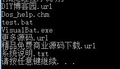
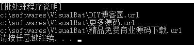
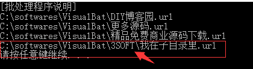
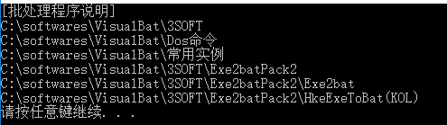

# (200条消息) 批处理（bat）遍历文件夹下所有文件_大雄Obear的博客-CSDN博客_bat脚本循环遍历目录

# 语法

`for [参数] %%变量名 in （匹配符） do （执行的命令）`

注意：  
每个指令之间必须以空格隔开，in 与 ( 之间有空格，do 与 （ 间也有空格，否则命令会无法成功执行

# 参数

参数取值一共有四种： /d, /r, /l, /f，加上无参数，所以一共五种场景

*   `无参`：遍历当前路径的文件夹下的文件，但也可在(匹配符)中指定路径
*   `/d`：遍历当前路径的文件夹下的文件夹，但也可在(匹配符)中指定路径
*   `/r [路径]`：深度遍历指定路径下的所有文件，子目录中的文件也会被遍历到，如果没指定路径，默认当前路径
*   `/l`：当使用参数 /l 时，需结合(匹配符)一起使用，此时 () 括号内部的用法规则为：(start, step, end)，此时的 for 命令作用等同于 java 语言中的 for 语句
*   `/f`：用于解析文件中的内容

# 使用说明

`%%变量名`：作用类似于 for(int i = 0; ; ) 中的 int i = 0，有些区别点的就是，批处理的 for 循环[遍历](https://so.csdn.net/so/search?q=%E9%81%8D%E5%8E%86&spm=1001.2101.3001.7020)每一个子项时，%%变量名 <=> 每个子项，即 &&变量名 已经是指向具体的每个子项了

`（匹配符）`：在 in 指令之后 () 括号里的内容可表示为通配符，用于按照指定的规则过滤文件夹下的文件，如 (\*.txt) 表示遍历文件夹内所有以 .txt 结尾的文件

`(执行的命令)`：前面的指令就可以取到文件夹内指定的每个子项了，那么接下去要对每个子项如何操作，就在这里写，类似于 java 的 for 命令后的 {} 大括号的作用

# 示例

### 无参

`for %%i in (*) do ( echo %%i )`  
遍历当前目录下的所有文件  

### 无参指定路径

`for %%i in (c:\softwares\VisualBat\*.url) do ( echo %%i )`  
遍历在(匹配符)中指定路径下的以 .url 结尾的文件  

### 带参数 `/d`

`for /d %%i in (*) do ( echo %%i )`  
遍历指定目录下的所有文件夹，%%i 指向每个子文件夹的绝对路径  

### 带参数 `/r`

`for /r %%i in (*.url) do ( echo %%i )`  

### 带参数 `/r 指定路径`

`for /r c:\softwares\VisualBat\ %%i in (*.url) do ( echo %%i )`  
深度遍历当前路径下所有以 .url 结尾的文件，因为是深度遍历，因此 %%i 指向文件的绝对路径  

### 带参数 `/l`

`for /l %%i in (1, 1, 5) do ( echo %%i )`  
等效于 java 中的 for (int i = 1; i <= 5; i++)语句，起始值，递增或递减，终止值都可自行设置  

### 带参数 `/d /r`

`for /d /r %%i in (*) do ( echo %%i )`  
参数可结合使用，/d 表示遍历文件夹，/r 表示深度遍历，因此以上命令作用为深度遍历当前目录下的所有文件夹，包括子目录中的文件夹  

查考资料：[https://www.cnblogs.com/liangblog/p/9835940.html](https://www.cnblogs.com/liangblog/p/9835940.html)