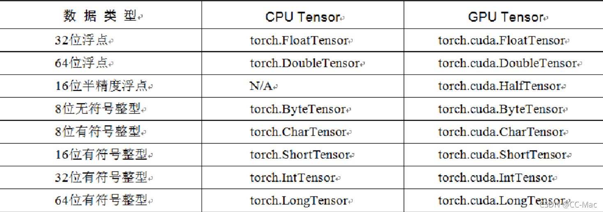
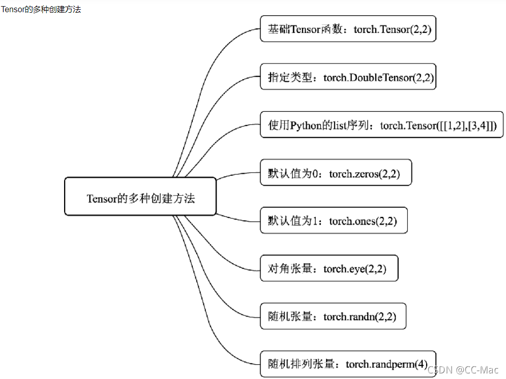
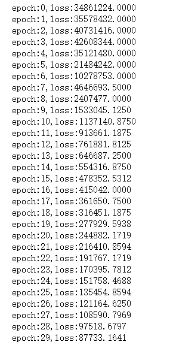
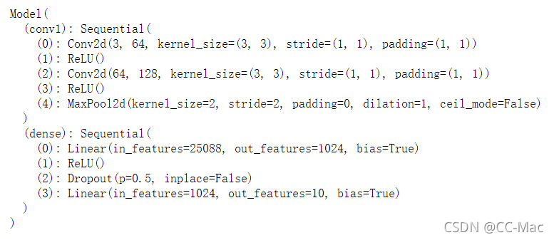
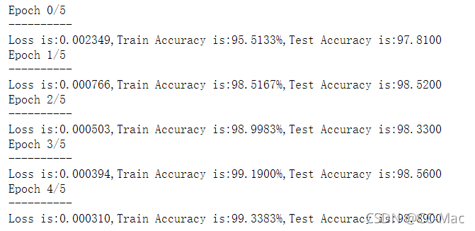
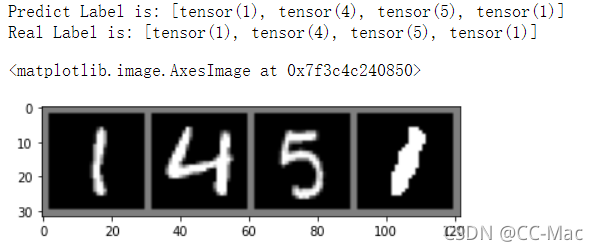

# (200条消息) 狂肝两万字带你用pytorch搞深度学习！！！_CC-Mac的博客-CSDN博客

# [深度](https://so.csdn.net/so/search?q=%E6%B7%B1%E5%BA%A6&spm=1001.2101.3001.7020)学习

基础知识和各种网络结构实战 ...

* * *

### 狂肝两万字带你用[pytorch](https://so.csdn.net/so/search?q=pytorch&spm=1001.2101.3001.7020)搞深度学习！！！

*   [深度学习](#_0)
*   [前言](#_14)
*   [一、基本数据：Tensor](#Tensor_23)
*   *   [1.1 Tensor的创建](#11_Tensor_26)
    *   [1.2 torch.FloatTensor](#12_torchFloatTensor_29)
    *   [1.3 torch.IntTensor](#13_torchIntTensor_43)
    *   [1.4 torch.randn](#14_torchrandn_61)
    *   [1.5 torch.range](#15_torchrange_73)
    *   [1.6 torch.zeros/ones/empty](#16_torchzerosonesempty_84)
*   [二、Tensor的运算](#Tensor_100)
*   *   [2.1 torch.abs](#21_torchabs_101)
    *   [2.2 torch.add](#22_torchadd_123)
    *   [2.3 torch.clamp](#23_torchclamp_165)
    *   [2.4 torch.div](#24_torchdiv_183)
    *   [2.5 torch.pow](#25_torchpow_209)
    *   [2.6 torch.mm](#26_torchmm_226)
    *   [2.7 torch.mv](#27_torchmv_250)
*   [三、神经网络工具箱torch.nn](#torchnn_272)
*   *   [3.1 nn.Module类](#31_nnModule_274)
    *   [3.2 搭建简易神经网络](#32__305)
*   [四、torch实现一个完整的神经网络](#torch_387)
*   *   [4.1 torch.autograd和Variable](#41_torchautogradVariable_388)
    *   [4.2 自定义传播函数](#42__542)
    *   [4.3 PyTorch 之 torch.nn](#43_PyTorch__torchnn_587)
    *   *   [4.3.1 torch.nn.Sequential](#431_torchnnSequential_588)
        *   [4.3.2 torch.nn.Linear](#432_torchnnLinear_611)
        *   [4.3.3 torch.nn.ReLU](#433_torchnnReLU_613)
        *   [4.3.4 torch.nn.MSELoss](#434_torchnnMSELoss_615)
        *   [4.3.4 torch.nn.L1Loss](#434_torchnnL1Loss_627)
        *   [4.3.5 torch.nn.CrossEntropyLoss](#435_torchnnCrossEntropyLoss_639)
        *   [4.3.5 使用损失函数的神经网络](#435__651)
    *   [4.4 PyTorch 之 torch.optim](#44_PyTorch__torchoptim_695)
*   [五、搭建神经网络实现手写数据集](#_743)
*   *   [5.1 torchvision](#51_torchvision_744)
    *   *   [5.1.1 torchvision.datasets](#511_torchvisiondatasets_754)
        *   [5.1.2 torchvision.models](#512_torchvisionmodels_767)
        *   [5.1.3 torch.transforms](#513_torchtransforms_796)
        *   *   [5.1.3.1 torchvision.transforms.Resize](#5131_torchvisiontransformsResize_798)
            *   [5.1.3.2 torchvision.transforms.Scale](#5132_torchvisiontransformsScale_800)
            *   [5.1.3.3 torchvision.transforms.CenterCrop](#5133_torchvisiontransformsCenterCrop_802)
            *   [5.1.3.4 torchvision.transforms.RandomCrop](#5134_torchvisiontransformsRandomCrop_804)
            *   [5.1.3.5 torchvision.transforms.RandomHorizontalFlip](#5135_torchvisiontransformsRandomHorizontalFlip_806)
            *   [5.1.3.6 torchvision.transforms.RandomVerticalFlip](#5136_torchvisiontransformsRandomVerticalFlip_808)
            *   [5.1.3.7 torchvision.transforms.ToTensor](#5137_torchvisiontransformsToTensor_810)
            *   [5.1.3.8 torchvision.transforms.ToPILImage:](#5138_torchvisiontransformsToPILImage_812)
        *   [5.1.4 torch.utils](#514_torchutils_826)
    *   [5.2 模型搭建和参数优化](#52__859)
    *   *   [5.2.1 torch.nn.Conv2d](#521_torchnnConv2d_891)
        *   [5.2.2 torch.nn.MaxPool2d](#522_torchnnMaxPool2d_895)
        *   [5.2.3 torch.nn.Dropout](#523_torchnnDropout_899)
    *   [5.3 参数优化](#53__902)
    *   *   [5.3.1 模型训练](#531__911)
    *   [5.4 模型验证](#54__944)
    *   [5.5 完整代码](#55__966)
*   [六、结语](#_1102)

# 前言

学习深度学习一个好的框架十分的重要，现在主流的就是Pytorch和tf，今天让我们一起来学习pytorch

* * *


# 一、基本数据：[Tensor](https://so.csdn.net/so/search?q=Tensor&spm=1001.2101.3001.7020)

Tensor，即张量，是PyTorch中的基本操作对象，可以看做是包含单一数据类型元素的多维矩阵。从使用角度来看，Tensor与NumPy的ndarrays非常类似，相互之间也可以自由转换，只不过Tensor还支持GPU的加速。  


## 1.1 Tensor的创建



## 1.2 [torch](https://so.csdn.net/so/search?q=torch&spm=1001.2101.3001.7020).FloatTensor

torch.FloatTensor用于生成数据类型为浮点型的Tensor，传递给torch.FloatTensor的参数可以是列表，也可以是一个维度值。

```py
import torch
a = torch.FloatTensor(2,3)
b = torch.FloatTensor([2,3,4,5])
a,b
```

得到的结果是：

```py
(tensor([[1.0561e-38, 1.0102e-38, 9.6429e-39],
         [8.4490e-39, 9.6429e-39, 9.1837e-39]]),
 tensor([2., 3., 4., 5.]))
```

## 1.3 torch.IntTensor

torch.IntTensor用于生成数据类型为整型的Tensor,传递给传递给torch.IntTensor的参数可以是列表，也可以是一个维度值。

```py
import torch
a = torch.FloatTensor(2,3)
b = torch.FloatTensor([2,3,4,5])
a,b
```

```py
import torch
a = torch.rand(2,3)
a 
```

得到：

```py
tensor([[0.5625, 0.5815, 0.8221],
        [0.3589, 0.4180, 0.2158]])
```

## 1.4 torch.randn

用于生成数据类型为浮点数且维度指定的随机Tensor，和在numpy中使用的numpy.randn生成的随机数的方法类似，随机生成的浮点数的取值满足均值为0，方差为1的正态分布。

```py
import torch
a = torch.randn(2,3)
a 
```

得到：

```py
tensor([[-0.0067, -0.0707, -0.6682],
        [ 0.8141,  1.1436,  0.5963]])
```

## 1.5 torch.range

torch.range用于生成数据类型为浮点型且起始范围和结束范围的Tensor，所以传递给torch.range的参数有三个，分别为起始值，结束值，步长，其中步长用于指定从起始值到结束值得每步的数据间隔。

```py
import torch
a = torch.range(1,20,2)
a
```

得到：

```py
tensor([ 1.,  3.,  5.,  7.,  9., 11., 13., 15., 17., 19.])
```

## 1.6 torch.zeros/ones/empty

torch.zeros用于生成数据类型为浮点型且维度指定的Tensor，不过这个浮点型的Tensor中的元素值全部为0。

torch.ones生成全1的数组。

torch.empty创建一个未被初始化数值的tensor,tensor的大小是由size确定,size: 定义tensor的shape ，这里可以是一个list 也可以是一个tuple

```py
import torch
a = torch.zeros(2,3)
a
```

得到：

```py
tensor([[0., 0., 0.],
        [0., 0., 0.]])
```

# 二、Tensor的运算

## 2.1 torch.abs

将参数传递到torch.abs后返回输入参数的绝对值作为输出，输入参数必须是一个Tensor数据类型的变量，如：

```py
import torch
a = torch.randn(2,3)
a
```

得到的a是：

```py
tensor([[ 0.0948,  0.0530, -0.0986],
        [ 1.8926, -2.0569,  1.6617]])
```

对a进行abs处理：

```py
b = torch.abs(a)
b
```

得到：

```py
tensor([[0.0948, 0.0530, 0.0986],
        [1.8926, 2.0569, 1.6617]])
```

## 2.2 torch.add

将参数传递到torch.add后返回输入参数的求和结果作为输出，输入参数既可以全部是Tensor数据类型的变量，也可以一个是Tensor数据类型的变量，另一个是标量。

```py
import torch
a = torch.randn(2,3)
a
#tensor([[-0.1146, -0.3282, -0.2517],
#        [-0.2474,  0.8323, -0.9292]])
```

```py
b = torch.randn(2,3)
b
#tensor([[ 0.9526,  1.5841, -3.2665],
#        [-0.4831,  0.9259, -0.5054]])
```

```py
c = torch.add(a,b)
c
```

输出的c:

```py
tensor([[ 0.8379,  1.2559, -3.5182],
        [-0.7305,  1.7582, -1.4346]])
```

再看一个：

```py
d = torch.randn(2,3)
d
#这里我们得到的d：
#tensor([[ 0.1473,  0.7631, -0.1953],
#        [-0.2796, -0.7265,  0.7142]])
```

我们对d与一个标量10相加：

```py
e = torch.add(d,10)
e
```

得到：

```py
tensor([[10.1473, 10.7631,  9.8047],
        [ 9.7204,  9.2735, 10.7142]])
```

## 2.3 torch.clamp

torch.clamp是对输入参数按照自定义的范围进行裁剪，最后将参数裁剪的结果作为输出，所以输入参数一共有三个，分别是需要进行裁剪的Tensor数据类型的变量、裁剪的上上边界和裁剪的下边界，具体的裁剪过程是：使用变量中的每个元素分别和裁剪的上边界及裁剪的下边界的值进行比较，如果元素的值小于裁剪的下边界的值，该元素被重写成裁剪的下边界的值；同理，如果元素的值大于裁剪的上边界的值，该元素就被重写成裁剪的上边界的值。我们直接看例子：

```py
a = torch.randn(2,3)
a
#我们得到a为：
#tensor([[-1.4049,  1.0336,  1.2820],
#        [ 0.7610, -1.7475,  0.2414]])
```

我们对b进行clamp操作：

```py

b = torch.clamp(a,-0.1,0.1)
b
#我们得到b为：
#tensor([[-0.1000,  0.1000,  0.1000],
#        [ 0.1000, -0.1000,  0.1000]])
```

## 2.4 torch.div

torch.div是将参数传递到torch.div后返回输入参数的求商结果作为输出，同样，参与运算的参数可以全部是Tensor数据类型的变量，也可以是Tensor数据类型的变量和标量的组合。具体我们看例子

```py
a = torch.randn(2,3)
a
#我们得到a为：
#tensor([[ 0.6276,  0.6397, -0.0762],
#        [-0.4193, -0.5528,  1.5192]])
```

```py
b = torch.randn(2,3)
b
#我们得到b为：
#tensor([[ 0.9219,  0.2120,  0.1155],
#        [ 1.1086, -1.1442,  0.2999]])
```

对a,b进行div操作

```py

c = torch.div(a,b)
c
#得到c：
#tensor([[ 0.6808,  3.0173, -0.6602],
#        [-0.3782,  0.4831,  5.0657]])
```

## 2.5 torch.pow

torch.pow：将参数传递到torch.pow后返回输入参数的求幂结果作为输出，参与运算的参数可以全部是Tensor数据类型的变量，也可以是Tensor数据类型的变量和标量的组合。

```py
a = torch.randn(2,3)
a
#我们得到a为：
#tensor([[ 0.3896, -0.1475,  0.1104],
#        [-0.6908, -0.0472, -1.5310]])
```

对a进行平方操作

```py
b = torch.pow(a,2)
b
#我们得到b为：
#tensor([[1.5181e-01, 2.1767e-02, 1.2196e-02],
#        [4.7722e-01, 2.2276e-03, 2.3441e+00]])
```

## 2.6 torch.mm

torch.mm：将参数传递到torch.mm后返回输入参数的求积结果作为输出，不过这个求积的方式和之前的torch.mul运算方式不太一样，torch.mm运用矩阵之间的乘法规则进行计算，所以被传入的参数会被当作矩阵进行处理，参数的维度自然也要满足矩阵乘法的前提条件，即前一个矩阵的行数必须和后一个矩阵列数相等  
下面我们看实例：

```py
a = torch.randn(2,3)
a
#我们得到a为：
#tensor([[ 0.1057,  0.0104, -0.1547],
#        [ 0.5010, -0.0735,  0.4067]])
```

```py
b = torch.randn(2,3)
b
#我们得到b为：
#tensor([[ 1.1971, -1.4010,  1.1277],
#        [-0.3076,  0.9171,  1.9135]])
```

然后我们用产生的a,b进行矩阵乘法操作：

```py
c = torch.mm(a,b.T)
c
#tensor([[-0.0625, -0.3190],
#        [ 1.1613,  0.5567]])
```

## 2.7 torch.mv

将参数传递到torch.mv后返回输入参数的求积结果作为输出，torch.mv运用矩阵与向量之间的乘法规则进行计算，被传入的第1个参数代表矩阵，第2个参数代表向量，循序不能颠倒。  
下面我们看实例：

```py
a = torch.randn(2,3)
a
#我们得到a为：
#tensor([[ 1.0909, -1.1679,  0.3161],
#        [-0.8952, -2.1351, -0.9667]])
```

```py
b = torch.randn(3)
b
#我们得到b为：
#tensor([-1.4689,  1.6197,  0.7209])
```

然后我们用产生的a,b进行矩阵乘法操作：

```py
c = torch.mv(a,b)
c
#tensor([-3.2663, -2.8402])
```

# 三、神经网络工具箱torch.nn

torch.autograd库虽然实现了自动求导与梯度反向传播，但如果我们要完成一个模型的训练，仍需要手写参数的自动更新、训练过程的控制等，还是不够便利。为此，PyTorch进一步提供了集成度更高的模块化接口torch.nn，该接口构建于Autograd之上，提供了网络模组、优化器和初始化策略等一系列功能。

## 3.1 nn.Module类

nn.Module是PyTorch提供的神经网络类，并在类中实现了网络各层的定义及前向计算与反向传播机制。在实际使用时，如果想要实现某个神经网络，只需继承nn.Module，在初始化中定义模型结构与参数，在函数forward()中编写网络前向过程即可。

1．nn.Parameter函数

2．forward()函数与反向传播

3．多个Module的嵌套

4．nn.Module与nn.functional库

5．nn.Sequential()模块

```py
#这里用torch.nn实现一个MLP
from torch import nn

class MLP(nn.Module):
    def __init__(self, in_dim, hid_dim1, hid_dim2, out_dim):
        super(MLP, self).__init__()
        self.layer = nn.Sequential(
          nn.Linear(in_dim, hid_dim1),
          nn.ReLU(),
          nn.Linear(hid_dim1, hid_dim2),
          nn.ReLU(),
          nn.Linear(hid_dim2, out_dim),
          nn.ReLU()
       )
    def forward(self, x):
        x = self.layer(x)
        return x
```

## 3.2 搭建简易神经网络

下面我们用torch搭一个简易神经网络：  
1、我们设置输入节点为1000，隐藏层的节点为100，输出层的节点为10  
2、输入100个具有1000个特征的数据，经过隐藏层后变成100个具有10个分类结果的特征，然后将得到的结果后向传播

```py
import torch
batch_n = 100#一个批次输入数据的数量
hidden_layer = 100
input_data = 1000#每个数据的特征为1000
output_data = 10

x = torch.randn(batch_n,input_data)
y = torch.randn(batch_n,output_data)

w1 = torch.randn(input_data,hidden_layer)
w2 = torch.randn(hidden_layer,output_data)

epoch_n = 20
lr = 1e-6

for epoch in range(epoch_n):
    h1=x.mm(w1)#(100,1000)*(1000,100)-->100*100
    print(h1.shape)
    h1=h1.clamp(min=0)
    y_pred = h1.mm(w2)
    
    loss = (y_pred-y).pow(2).sum()
    print("epoch:{},loss:{:.4f}".format(epoch,loss))
    
    grad_y_pred = 2*(y_pred-y)
    grad_w2 = h1.t().mm(grad_y_pred)
    
    grad_h = grad_y_pred.clone()
    grad_h = grad_h.mm(w2.t())
    grad_h.clamp_(min=0)#将小于0的值全部赋值为0，相当于sigmoid
    grad_w1 = x.t().mm(grad_h)
    
    w1 = w1 -lr*grad_w1
    w2 = w2 -lr*grad_w2
```

```py
torch.Size([100, 100])
epoch:0,loss:112145.7578
torch.Size([100, 100])
epoch:1,loss:110014.8203
torch.Size([100, 100])
epoch:2,loss:107948.0156
torch.Size([100, 100])
epoch:3,loss:105938.6719
torch.Size([100, 100])
epoch:4,loss:103985.1406
torch.Size([100, 100])
epoch:5,loss:102084.9609
torch.Size([100, 100])
epoch:6,loss:100236.9844
torch.Size([100, 100])
epoch:7,loss:98443.3359
torch.Size([100, 100])
epoch:8,loss:96699.5938
torch.Size([100, 100])
epoch:9,loss:95002.5234
torch.Size([100, 100])
epoch:10,loss:93349.7969
torch.Size([100, 100])
epoch:11,loss:91739.8438
torch.Size([100, 100])
epoch:12,loss:90171.6875
torch.Size([100, 100])
epoch:13,loss:88643.1094
torch.Size([100, 100])
epoch:14,loss:87152.6406
torch.Size([100, 100])
epoch:15,loss:85699.4297
torch.Size([100, 100])
epoch:16,loss:84282.2500
torch.Size([100, 100])
epoch:17,loss:82899.9062
torch.Size([100, 100])
epoch:18,loss:81550.3984
torch.Size([100, 100])
epoch:19,loss:80231.1484
```

# 四、torch实现一个完整的神经网络

## 4.1 torch.autograd和Variable

torch.autograd包的主要功能就是完成神经网络后向传播中的链式求导，手动去写这些求导程序会导致重复造轮子的现象。

自动梯度的功能过程大致为：先通过输入的Tensor数据类型的变量在神经网络的前向传播过程中生成一张计算图，然后根据这个计算图和输出结果精确计算出每一个参数需要更新的梯度，并通过完成后向传播完成对参数的梯度更新。

完成自动梯度需要用到的torch.autograd包中的Variable类对我们定义的Tensor数据类型变量进行封装，在封装后，计算图中的各个节点就是一个Variable对象，这样才能应用自动梯度的功能。

下面我们使用autograd实现一个二层结构的神经网络模型

```py
import torch
from torch.autograd import Variable
batch_n = 100#一个批次输入数据的数量
hidden_layer = 100
input_data = 1000#每个数据的特征为1000
output_data = 10

x = Variable(torch.randn(batch_n,input_data),requires_grad=False)
y = Variable(torch.randn(batch_n,output_data),requires_grad=False)
#用Variable对Tensor数据类型变量进行封装的操作。requires_grad如果是False，表示该变量在进行自动梯度计算的过程中不会保留梯度值。
w1 = Variable(torch.randn(input_data,hidden_layer),requires_grad=True)
w2 = Variable(torch.randn(hidden_layer,output_data),requires_grad=True)

#学习率和迭代次数
epoch_n=50
lr=1e-6

for epoch in range(epoch_n):
    h1=x.mm(w1)#(100,1000)*(1000,100)-->100*100
    print(h1.shape)
    h1=h1.clamp(min=0)
    y_pred = h1.mm(w2)
    #y_pred = x.mm(w1).clamp(min=0).mm(w2)
    loss = (y_pred-y).pow(2).sum()
    print("epoch:{},loss:{:.4f}".format(epoch,loss.data))
    
#     grad_y_pred = 2*(y_pred-y)
#     grad_w2 = h1.t().mm(grad_y_pred)
    loss.backward()#后向传播
#     grad_h = grad_y_pred.clone()
#     grad_h = grad_h.mm(w2.t())
#     grad_h.clamp_(min=0)#将小于0的值全部赋值为0，相当于sigmoid
#     grad_w1 = x.t().mm(grad_h)
    w1.data -= lr*w1.grad.data
    w2.data -= lr*w2.grad.data

    w1.grad.data.zero_()
    w2.grad.data.zero_()
    
#     w1 = w1 -lr*grad_w1
#     w2 = w2 -lr*grad_w2
```

```py
得到结果：
torch.Size([100, 100])
epoch:0,loss:54572212.0000
torch.Size([100, 100])
epoch:1,loss:133787328.0000
torch.Size([100, 100])
epoch:2,loss:491439904.0000
torch.Size([100, 100])
epoch:3,loss:683004416.0000
torch.Size([100, 100])
epoch:4,loss:13681055.0000
torch.Size([100, 100])
epoch:5,loss:8058388.0000
torch.Size([100, 100])
epoch:6,loss:5327059.5000
torch.Size([100, 100])
epoch:7,loss:3777382.5000
torch.Size([100, 100])
epoch:8,loss:2818449.5000
torch.Size([100, 100])
epoch:9,loss:2190285.0000
torch.Size([100, 100])
epoch:10,loss:1760991.0000
torch.Size([100, 100])
epoch:11,loss:1457116.3750
torch.Size([100, 100])
epoch:12,loss:1235850.6250
torch.Size([100, 100])
epoch:13,loss:1069994.0000
torch.Size([100, 100])
epoch:14,loss:942082.4375
torch.Size([100, 100])
epoch:15,loss:841170.6250
torch.Size([100, 100])
epoch:16,loss:759670.1875
torch.Size([100, 100])
epoch:17,loss:692380.5625
torch.Size([100, 100])
epoch:18,loss:635755.0625
torch.Size([100, 100])
epoch:19,loss:587267.1250
torch.Size([100, 100])
epoch:20,loss:545102.0000
torch.Size([100, 100])
epoch:21,loss:508050.6250
torch.Size([100, 100])
epoch:22,loss:475169.9375
torch.Size([100, 100])
epoch:23,loss:445762.8750
torch.Size([100, 100])
epoch:24,loss:419216.2812
torch.Size([100, 100])
epoch:25,loss:395124.9375
torch.Size([100, 100])
epoch:26,loss:373154.8438
torch.Size([100, 100])
epoch:27,loss:352987.6875
torch.Size([100, 100])
epoch:28,loss:334429.0000
torch.Size([100, 100])
epoch:29,loss:317317.7500
torch.Size([100, 100])
epoch:30,loss:301475.8125
torch.Size([100, 100])
epoch:31,loss:286776.8750
torch.Size([100, 100])
epoch:32,loss:273114.4062
torch.Size([100, 100])
epoch:33,loss:260383.6406
torch.Size([100, 100])
epoch:34,loss:248532.8125
torch.Size([100, 100])
epoch:35,loss:237452.3750
torch.Size([100, 100])
epoch:36,loss:227080.5156
torch.Size([100, 100])
epoch:37,loss:217362.9375
torch.Size([100, 100])
epoch:38,loss:208250.5312
torch.Size([100, 100])
epoch:39,loss:199686.1094
torch.Size([100, 100])
epoch:40,loss:191620.0312
torch.Size([100, 100])
epoch:41,loss:184017.4375
torch.Size([100, 100])
epoch:42,loss:176841.0156
torch.Size([100, 100])
epoch:43,loss:170073.1719
torch.Size([100, 100])
epoch:44,loss:163686.5000
torch.Size([100, 100])
epoch:45,loss:157641.5000
torch.Size([100, 100])
epoch:46,loss:151907.0000
torch.Size([100, 100])
epoch:47,loss:146470.1250
torch.Size([100, 100])
epoch:48,loss:141305.3594
torch.Size([100, 100])
epoch:49,loss:136396.7031
```

## 4.2 自定义传播函数

其实除了可以采用自动梯度方法，我们还可以通过构建一个继承了torch.nn.Module的新类，来完成对前向传播函数和后向传播函数的重写。在这个新类中，我们使用forward作为前向传播函数的关键字，使用backward作为后向传播函数的关键字。下面我们进行自定义传播函数：

```py
import torch
from torch.autograd import Variable
batch_n = 64#一个批次输入数据的数量
hidden_layer = 100
input_data = 1000#每个数据的特征为1000
output_data = 10
class Model(torch.nn.Module):#完成类继承的操作
    def __init__(self):
        super(Model,self).__init__()#类的初始化
        
    def forward(self,input,w1,w2):
        x = torch.mm(input,w1)
        x = torch.clamp(x,min = 0)
        x = torch.mm(x,w2)
        return x
    
    def backward(self):
        pass
model = Model()
x = Variable(torch.randn(batch_n,input_data),requires_grad=False)
y = Variable(torch.randn(batch_n,output_data),requires_grad=False)
#用Variable对Tensor数据类型变量进行封装的操作。requires_grad如果是F，表示该变量在进行自动梯度计算的过程中不会保留梯度值。
w1 = Variable(torch.randn(input_data,hidden_layer),requires_grad=True)
w2 = Variable(torch.randn(hidden_layer,output_data),requires_grad=True)

epoch_n=30

for epoch in range(epoch_n):
    y_pred = model(x,w1,w2)
    
    loss = (y_pred-y).pow(2).sum()
    print("epoch:{},loss:{:.4f}".format(epoch,loss.data))
    loss.backward()
    w1.data -= lr*w1.grad.data
    w2.data -= lr*w2.grad.data

    w1.grad.data.zero_()
    w2.grad.data.zero_()
    
```

得到结果：  


## 4.3 PyTorch 之 torch.nn

### 4.3.1 torch.nn.Sequential

torch.nn.Sequential类是torch.nn中的一种序列容器，通过在容器中嵌套各种实现神经网络模型的搭建，最主要的是，参数会按照我们定义好的序列自动传递下去。

```py
import torch
from torch.autograd import Variable
batch_n = 100#一个批次输入数据的数量
hidden_layer = 100
input_data = 1000#每个数据的特征为1000
output_data = 10

x = Variable(torch.randn(batch_n,input_data),requires_grad=False)
y = Variable(torch.randn(batch_n,output_data),requires_grad=False)
#用Variable对Tensor数据类型变量进行封装的操作。requires_grad如果是F，表示该变量在进行自动梯度计算的过程中不会保留梯度值。

models = torch.nn.Sequential(
    torch.nn.Linear(input_data,hidden_layer),
    torch.nn.ReLU(),
    torch.nn.Linear(hidden_layer,output_data)
)
#torch.nn.Sequential括号内就是我们搭建的神经网络模型的具体结构，Linear完成从隐藏层到输出层的线性变换，再用ReLU激活函数激活
#torch.nn.Sequential类是torch.nn中的一种序列容器，通过在容器中嵌套各种实现神经网络模型的搭建，
#最主要的是，参数会按照我们定义好的序列自动传递下去。
```

### 4.3.2 torch.nn.Linear

torch.nn.Linear类用于定义模型的线性层，即完成前面提到的不同的层之间的线性变换。 线性层接受的参数有3个：分别是输入特征数、输出特征数、是否使用偏置，默认为True,使用torch.nn.Linear类，会自动生成对应维度的权重参数和偏置，对于生成的权重参数和偏置，我们的模型默认使用一种比之前的简单随机方式更好的参数初始化方式。

### 4.3.3 torch.nn.ReLU

torch.nn.ReLU属于非线性激活分类，在定义时默认不需要传入参数。当然，在torch.nn包中还有许多非线性激活函数类可供选择，比如PReLU、LeaKyReLU、Tanh、Sigmoid、Softmax等。

### 4.3.4 torch.nn.MSELoss

torch.nn.MSELoss类使用均方误差函数对损失值进行计算，定义类的对象时不用传入任何参数，但在使用实例时需要输入两个维度一样的参数方可进行计算。

```py
import torch
from torch.autograd import Variable
loss_f = torch.nn.MSELoss()
x = Variable(torch.randn(100,100))
y = Variable(torch.randn(100,100))
loss = loss_f(x,y)
loss.data
#tensor(1.9529)
```

### 4.3.4 torch.nn.L1Loss

torch.nn.L1Loss类使用平均绝对误差函数对损失值进行计算，定义类的对象时不用传入任何参数，但在使用实例时需要输入两个维度一样的参数方可进行计算。

```py
import torch
from torch.autograd import Variable
loss_f = torch.nn.L1Loss()
x = Variable(torch.randn(100,100))
y = Variable(torch.randn(100,100))
loss = loss_f(x,y)
loss.data
#tensor(1.1356)
```

### 4.3.5 torch.nn.CrossEntropyLoss

torch.nn.CrossEntropyLoss类用于计算交叉熵，定义类的对象时不用传入任何参数，但在使用实例时需要输入两个满足交叉熵的计算条件的参数。

```py
import torch
from torch.autograd import Variable
loss_f = torch.nn.CrossEntropyLoss()
x = Variable(torch.randn(3,5))
y = Variable(torch.LongTensor(3).random_(5))#3个0-4的随机数字
loss = loss_f(x,y)
loss.data
#tensor(2.3413)
```

### 4.3.5 使用损失函数的神经网络

```py
import torch
from torch.autograd import Variable
import torch
from torch.autograd import Variable
loss_fn = torch.nn.MSELoss()
x = Variable(torch.randn(100,100))
y = Variable(torch.randn(100,100))
loss = loss_fn(x,y)


batch_n = 100#一个批次输入数据的数量
hidden_layer = 100
input_data = 1000#每个数据的特征为1000
output_data = 10

x = Variable(torch.randn(batch_n,input_data),requires_grad=False)
y = Variable(torch.randn(batch_n,output_data),requires_grad=False)
#用Variable对Tensor数据类型变量进行封装的操作。requires_grad如果是F，表示该变量在进行自动梯度计算的过程中不会保留梯度值。

models = torch.nn.Sequential(
    torch.nn.Linear(input_data,hidden_layer),
    torch.nn.ReLU(),
    torch.nn.Linear(hidden_layer,output_data)
)
#torch.nn.Sequential括号内就是我们搭建的神经网络模型的具体结构，Linear完成从隐藏层到输出层的线性变换，再用ReLU激活函数激活
#torch.nn.Sequential类是torch.nn中的一种序列容器，通过在容器中嵌套各种实现神经网络模型的搭建，
#最主要的是，参数会按照我们定义好的序列自动传递下去。


for epoch in range(epoch_n):
    y_pred = models(x)
    
    loss = loss_fn(y_pred,y)
    if epoch%1000 == 0:
        print("epoch:{},loss:{:.4f}".format(epoch,loss.data))
    models.zero_grad()
    
    loss.backward()
    
    for param in models.parameters():
        param.data -= param.grad.data*lr
```

## 4.4 PyTorch 之 torch.optim

torch.optim包提供非常多的可实现参数自动优化的类，如SGD、AdaGrad、RMSProp、Adam等  
使用自动优化的类实现神经网络：

```py
import torch
from torch.autograd import Variable

batch_n = 100#一个批次输入数据的数量
hidden_layer = 100
input_data = 1000#每个数据的特征为1000
output_data = 10

x = Variable(torch.randn(batch_n,input_data),requires_grad=False)
y = Variable(torch.randn(batch_n,output_data),requires_grad=False)
#用Variable对Tensor数据类型变量进行封装的操作。requires_grad如果是F，表示该变量在进行自动梯度计算的过程中不会保留梯度值。

models = torch.nn.Sequential(
    torch.nn.Linear(input_data,hidden_layer),
    torch.nn.ReLU(),
    torch.nn.Linear(hidden_layer,output_data)
)
#torch.nn.Sequential括号内就是我们搭建的神经网络模型的具体结构，Linear完成从隐藏层到输出层的线性变换，再用ReLU激活函数激活
#torch.nn.Sequential类是torch.nn中的一种序列容器，通过在容器中嵌套各种实现神经网络模型的搭建，
#最主要的是，参数会按照我们定义好的序列自动传递下去。

# loss_fn = torch.nn.MSELoss()
# x = Variable(torch.randn(100,100))
# y = Variable(torch.randn(100,100))
# loss = loss_fn(x,y)

epoch_n=10000
lr=1e-4
loss_fn = torch.nn.MSELoss()

optimzer = torch.optim.Adam(models.parameters(),lr=lr)
#使用torch.optim.Adam类作为我们模型参数的优化函数，这里输入的是：被优化的参数和学习率的初始值。
#因为我们需要优化的是模型中的全部参数，所以传递的参数是models.parameters()

#进行，模型训练的代码如下：
for epoch in range(epoch_n):
    y_pred = models(x)
    loss = loss_fn(y_pred,y)
    print("Epoch:{},Loss:{:.4f}".format(epoch,loss.data))
    optimzer.zero_grad()#将模型参数的梯度归0
    
    loss.backward()
    optimzer.step()#使用计算得到的梯度值对各个节点的参数进行梯度更新。
```

# 五、搭建神经网络实现手写数据集

## 5.1 torchvision

torchvision 是PyTorch中专门用来处理图像的库。这个包中有四个大类。

torchvision.datasets

torchvision.models

torchvision.transforms

torchvision.utils

### 5.1.1 torchvision.datasets

torchvision.datasets可以实现对一些数据集的下载和加载如MNIST可以用torchvision.datasets.MNIST COCO、ImageNet、CIFCAR等都可用这个方法下载和载入，

这里用torchvision.datasets加载MNIST数据集：

```py
data_train = datasets.MNIST(root="./data/",
                           transform=transform,
                           train = True,
                           download = True)
data_test = datasets.MNIST(root="./data/",
                          transform = transform,
                          train = False)
```

### 5.1.2 torchvision.models

torchvision.models 中为我们提供了已经训练好的模型，让我们可以加载之后，直接使用。

torchvision.models模块的 子模块中包含以下模型结构。如：

AlexNet

VGG

ResNet

SqueezeNet

DenseNet等

我们可以直接使用如下代码来快速创建一个权重随机初始化的模型：

```py
import torchvision.models as models
resnet18 = models.resnet18()
alexnet = models.alexnet()
squeezenet = models.squeezenet1_0()
densenet = models.densenet_161()
```

也可以通过使用 pretrained=True 来加载一个别人预训练好的模型:

```py
import torchvision.models as models
resnet18 = models.resnet18(pretrained=True)
alexnet = models.alexnet(pretrained=True)
```

### 5.1.3 torch.transforms

torch.transforms中有大量数据变换类，如：

#### 5.1.3.1 torchvision.transforms.Resize

用于对载入的图片数据按照我们需求的大小进行缩放。传递的参数可以是一个整型数据，也可以是一个类似于(h,w)的序列。h代表高度，w代表宽度，如果输入的是整型数据那么h和w都等于这个数。

#### 5.1.3.2 torchvision.transforms.Scale

用于对载入的图片数据按照我们需求的大小进行缩放。和Resize类似。

#### 5.1.3.3 torchvision.transforms.CenterCrop

用于对载入的图片以图片中心为参考点，按照我们需要的大小进行裁剪。传递给这个类的参数可以是一个整型数据，也可以是一个类似于(h,w)的序列。

#### 5.1.3.4 torchvision.transforms.RandomCrop

用于对载入的图片按照我们需要的大小进行随机裁剪。传递给这个类的参数可以是一个整型数据，也可以是一个类似于(h,w)的序列。

#### 5.1.3.5 torchvision.transforms.RandomHorizontalFlip

用于对载入的图片按随机概率进行水平翻转。我们通过传递给这个类的自定义随机概率，如果没有定义，则使用默认的概率为0.5

#### 5.1.3.6 torchvision.transforms.RandomVerticalFlip

用于对载入的图片按随机概率进行垂直翻转。我们通过传递给这个类的自定义随机概率，如果没有定义，则使用默认的概率为0.5

#### 5.1.3.7 torchvision.transforms.ToTensor

用于对载入的图片数据进行类型转换，将之前构成PIL图片数据转换为Tensor数据类型的变量，让PyTorch能够对其进行计算和处理。

#### 5.1.3.8 torchvision.transforms.ToPILImage:

用于对Tensor变量的数据转换成PIL图片数据，主要为方便图片显示。

这里使用transforms对MNIST数据集进行操作：

```py
#torchvision.transforms: 常用的图片变换，例如裁剪、旋转等；
transform=transforms.Compose(
    [transforms.ToTensor(),#将PILImage转换为张量
     transforms.Normalize((0.5,0.5,0.5),(0.5,0.5,0.5))#将[0, 1]归一化到[-1, 1]
     #前面的（0.5，0.5，0.5） 是 R G B 三个通道上的均值， 后面(0.5, 0.5, 0.5)是三个通道的标准差
    ])
#上述代码我们可以将transforms.Compose()看作一种容器，它能够同时对多种数据变换进行组合。
#传入的参数是一个列表，列表中的元素就是对载入数据进行的变换操作。
```

### 5.1.4 torch.utils

关于torchvision.utils我们介绍一种用来对数据进行装载的类：torch.utils.data.DataLoader和

torch.utils.data.DataLoader类中， dataset参数指定我们载入的数据集的名称，batch\_size参数设置每个包中图片的数量， shuffle设置为True代表在装载的过程会将数据随机打乱顺序并进行打包。

```py
data_loader_train=torch.utils.data.DataLoader(dataset=data_train,
                                       batch_size=64,#每个batch载入的图片数量，默认为1,这里设置为64
                                        shuffle=True,
                                        #num_workers=2#载入训练数据所需的子任务数
                                       )
data_loader_test=torch.utils.data.DataLoader(dataset=data_test,
                                      batch_size=64,
                                      shuffle=True)
                                      #num_workers=2)
```

还有torchvision.utils.make\_grid将一个批次的图片构造成网格模式的图片。

```py
#预览
#在尝试过多次之后，发现错误并不是这一句引发的，而是因为图片格式是灰度图只有一个channel，需要变成RGB图才可以，所以将其中一行做了修改：
images,labels = next(iter(data_loader_train))
# dataiter = iter(data_loader_train) #随机从训练数据中取一些数据
# images, labels = dataiter.next()

img = torchvision.utils.make_grid(images)

img = img.numpy().transpose(1,2,0)
std = [0.5,0.5,0.5]
mean = [0.5,0.5,0.5]
img = img*std+mean
print([labels[i] for i in range(64)])
plt.imshow(img)
```

这里，iter和next获取一个批次的图片数据和其对应的图片标签， 再使用torchvision.utils.make\_grid将一个批次的图片构造成网格模式 经过torchvision.utils.make\_grid后图片维度变为channel,h,w三维， 因为要用matplotlib将图片显示，我们要使用的数据要是数组且维度为（height,weight,channel）即色彩通道在最后 因此我们需要用numpy和transpose完成原始数据类型的转换和数据维度的交换。

## 5.2 模型搭建和参数优化

实现卷积神经网络模型搭建：

```py
import math
import torch
import torch.nn as nn
class Model(nn.Module):
    def __init__(self):
        super(Model, self).__init__()
        
        #构建卷积层之后的全连接层以及分类器
        self.conv1 = nn.Sequential(
                nn.Conv2d(3,64,kernel_size=3,stride=1,padding=1),
                nn.ReLU(),
                nn.Conv2d(64,128,kernel_size=3,stride=1,padding=1),
                nn.ReLU(),
                nn.MaxPool2d(stride=2,kernel_size=2)
                )
        
        self.dense = torch.nn.Sequential(
                nn.Linear(14*14*128,1024),
                nn.ReLU(),
                nn.Dropout(p=0.5),
                nn.Linear(1024,10)
            )
        
    def forward(self,x):
        x=self.conv1(x)
        x=x.view(-1,14*14*128)
        x=self.dense(x)
        return x
```

### 5.2.1 torch.nn.Conv2d

用于搭建卷积神经网络的卷积层，主要参数是：

输入通道数、输出通道数、卷积核大小、卷积核移动步长和paddingde值（用于对边界像素的填充）

### 5.2.2 torch.nn.MaxPool2d

实现卷积姐神经网络的最大池化层，主要参数是：

池化窗口的大小，池化窗口移动步长和paddingde值

### 5.2.3 torch.nn.Dropout

用于防止卷积神经网络在训练过程中发生过拟合，原理是以一定的随机概率将卷积神经网络模型的部分参数归零，以达到减少相邻两层神经连接的目的

## 5.3 参数优化

搭完模型后，我们就可以对模型进行训练和参数优化了:

```py
model = Model()
cost = nn.CrossEntropyLoss()
optimizer = torch.optim.Adam(model.parameters())
print(model)
```



### 5.3.1 模型训练

```py
n_epochs = 5

for epoch in range(n_epochs):
    running_loss = 0.0
    running_correct = 0
    print("Epoch {}/{}".format(epoch,n_epochs))
    print("-"*10)
    for data in data_loader_train:
        X_train,y_train = data
        X_train,y_train = Variable(X_train),Variable(y_train)
        outputs = model(X_train)
        _,pred=torch.max(outputs.data,1)
        optimizer.zero_grad()
        loss = cost(outputs,y_train)
        
        loss.backward()
        optimizer.step()
        running_loss += loss.data
        running_correct += torch.sum(pred == y_train.data)
    testing_correct = 0
    for data in data_loader_test:
        X_test,y_test = data
        X_test,y_test = Variable(X_test),Variable(y_test)
        outputs = model(X_test)
        _,pred=torch.max(outputs.data,1)
        testing_correct += torch.sum(pred == y_test.data)
    print("Loss is:{:4f},Train Accuracy is:{:.4f}%,Test Accuracy is:{:.4f}".format(running_loss/len(data_train),100*running_correct/len(data_train)
                                                                                  ,100*testing_correct/len(data_test)))

```



## 5.4 模型验证

为了验证我们训练的模型是不是真的已知结果显示的一样准确，则最好的方法就是随机选取一部分测试集中的图片，用训练好的模型进行预测，看看和真实值有多大的偏差，并对结果进行可视化。测试代码如下：

```py
data_loader_test = torch.utils.data.DataLoader(dataset=data_test,
                                              batch_size = 4,
                                              shuffle = True)
X_test,y_test = next(iter(data_loader_test))
inputs = Variable(X_test)
pred = model(inputs)
_,pred = torch.max(pred,1)

print("Predict Label is:",[i for i in pred.data])
print("Real Label is:",[i for i in y_test])
img = torchvision.utils.make_grid(X_test)
img = img.numpy().transpose(1,2,0)

std = [0.5,0.5,0.5]
mean = [0.5,0.5,0.5]
img = img*std+mean
plt.imshow(img)
```



## 5.5 完整代码

```py
import torch 
import torchvision
from torchvision import datasets,transforms
from torch.autograd import Variable
import numpy as np
import matplotlib.pyplot as plt

#torchvision.transforms: 常用的图片变换，例如裁剪、旋转等；
# transform=transforms.Compose(
#     [transforms.ToTensor(),#将PILImage转换为张量
#      transforms.Normalize((0.5,0.5,0.5),(0.5,0.5,0.5))#将[0, 1]归一化到[-1, 1]
#      #前面的（0.5，0.5，0.5） 是 R G B 三个通道上的均值， 后面(0.5, 0.5, 0.5)是三个通道的标准差
#     ])
transform = transforms.Compose([
     transforms.ToTensor(),
     transforms.Lambda(lambda x: x.repeat(3,1,1)),
     transforms.Normalize(mean=(0.5, 0.5, 0.5), std=(0.5, 0.5, 0.5))
 ])   # 修改的位置

data_train = datasets.MNIST(root="./data/",
                           transform=transform,
                           train = True,
                           download = True)
data_test = datasets.MNIST(root="./data/",
                          transform = transform,
                          train = False)

data_loader_train=torch.utils.data.DataLoader(dataset=data_train,
                                       batch_size=64,#每个batch载入的图片数量，默认为1,这里设置为64
                                        shuffle=True,
                                        #num_workers=2#载入训练数据所需的子任务数
                                       )
data_loader_test=torch.utils.data.DataLoader(dataset=data_test,
                                      batch_size=64,
                                      shuffle=True)
                                      #num_workers=2)

#预览
#在尝试过多次之后，发现错误并不是这一句引发的，而是因为图片格式是灰度图只有一个channel，需要变成RGB图才可以，所以将其中一行做了修改：
images,labels = next(iter(data_loader_train))
# dataiter = iter(data_loader_train) #随机从训练数据中取一些数据
# images, labels = dataiter.next()

img = torchvision.utils.make_grid(images)

img = img.numpy().transpose(1,2,0)
std = [0.5,0.5,0.5]
mean = [0.5,0.5,0.5]
img = img*std+mean
print([labels[i] for i in range(64)])
plt.imshow(img)

import math
import torch
import torch.nn as nn
class Model(nn.Module):
    def __init__(self):
        super(Model, self).__init__()
        
        #构建卷积层之后的全连接层以及分类器
        self.conv1 = nn.Sequential(
                nn.Conv2d(3,64,kernel_size=3,stride=1,padding=1),
                nn.ReLU(),
                nn.Conv2d(64,128,kernel_size=3,stride=1,padding=1),
                nn.ReLU(),
                nn.MaxPool2d(stride=2,kernel_size=2)
                )
        
        self.dense = torch.nn.Sequential(
                nn.Linear(14*14*128,1024),
                nn.ReLU(),
                nn.Dropout(p=0.5),
                nn.Linear(1024,10)
            )
        
    def forward(self,x):
        x=self.conv1(x)
        x=x.view(-1,14*14*128)
        x=self.dense(x)
        return x

model = Model()
cost = nn.CrossEntropyLoss()
optimizer = torch.optim.Adam(model.parameters())
print(model)

n_epochs = 5

for epoch in range(n_epochs):
    running_loss = 0.0
    running_correct = 0
    print("Epoch {}/{}".format(epoch,n_epochs))
    print("-"*10)
    for data in data_loader_train:
        X_train,y_train = data
        X_train,y_train = Variable(X_train),Variable(y_train)
        outputs = model(X_train)
        _,pred=torch.max(outputs.data,1)
        optimizer.zero_grad()
        loss = cost(outputs,y_train)
        
        loss.backward()
        optimizer.step()
        running_loss += loss.data
        running_correct += torch.sum(pred == y_train.data)
    testing_correct = 0
    for data in data_loader_test:
        X_test,y_test = data
        X_test,y_test = Variable(X_test),Variable(y_test)
        outputs = model(X_test)
        _,pred=torch.max(outputs.data,1)
        testing_correct += torch.sum(pred == y_test.data)
    print("Loss is:{:4f},Train Accuracy is:{:.4f}%,Test Accuracy is:{:.4f}".format(running_loss/len(data_train),100*running_correct/len(data_train)
                                                                                  ,100*testing_correct/len(data_test)))

data_loader_test = torch.utils.data.DataLoader(dataset=data_test,
                                              batch_size = 4,
                                              shuffle = True)
X_test,y_test = next(iter(data_loader_test))
inputs = Variable(X_test)
pred = model(inputs)
_,pred = torch.max(pred,1)

print("Predict Label is:",[i for i in pred.data])
print("Real Label is:",[i for i in y_test])
img = torchvision.utils.make_grid(X_test)
img = img.numpy().transpose(1,2,0)

std = [0.5,0.5,0.5]
mean = [0.5,0.5,0.5]
img = img*std+mean
plt.imshow(img)

```

# 六、结语

关于pytorch的一个学习总结，代码文件我也会上传到github，期待大家和我交流，留言或者私信，一起学习，一起进步！  
