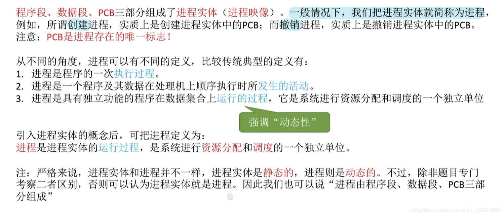
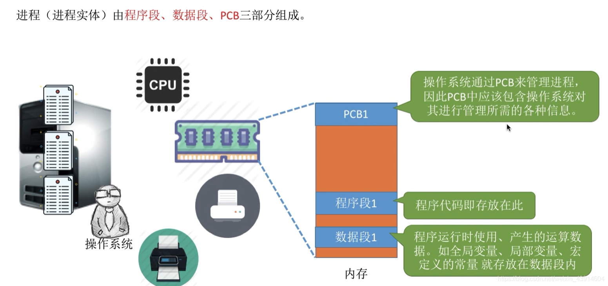
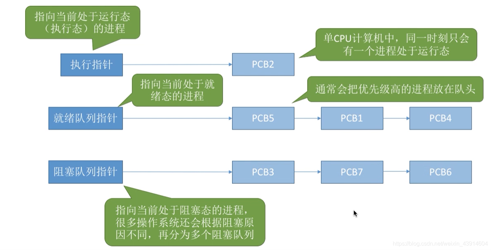
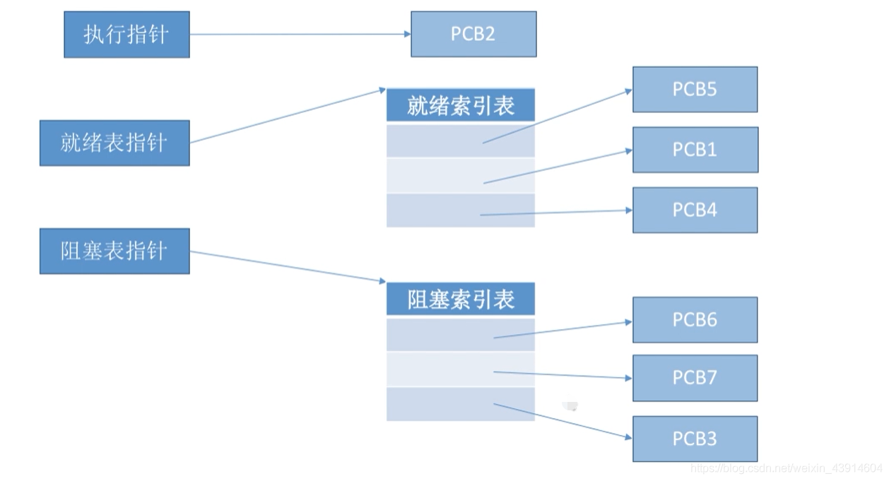

# (200条消息) 2.1.1 操作系统之进程的定义、特征、组成、组织_BitHachi的博客-CSDN博客_进程的定义和特征

### 文章目录

*   *   [1.进程的定义](#1_3)
    *   *   [（1）程序的概念](#1_4)
        *   [（2）进程的概念](#2_6)
        *   [（3）进程的定义](#3_21)
    *   [2.进程的特征](#2_24)
    *   [3.进程的组成](#3_27)
    *   [4.进程的组织](#4_43)
    *   *   [（1）链接方式](#1_45)
        *   [（2）索引方式](#2_47)

* * *

## 1.进程的定义

### （1）程序的概念

### （2）进程的概念

*   进程和程序的区别和联系：

> 区别：  
> 1)进程是动态的;程序是静态的。  
> (2)进程有独立性，能并发执行;程序不能并发执行。  
> (3)二者无一一对应关系。  
> (4)进程异步运行，会相互制约;程序不具备此特征。  
> 但是，进程与程序又有密切的联系： 进程不能脱离具体程序而虚设， 程序规定了相应进程所要完成的动作。  
> (5)组成不同。进程包含PCB、程序段、数据段。程序包含数据和指令代码。  
> (6)程序是一个包含了所有指令和数据的静态实体。本身除占用磁盘的存储空间外，并不占用系统如CPU、内存等运行资源。  
> (7)进程由程序段、数据段和PCB构成,会占用系统如CPU、内存等运行资源。  
> (8)一个程序可以启动多个进程来共同完成。  
> 联系：进程不能脱离具体程序而虚设， 程序规定了相应进程所要完成的动作。

### （3）进程的定义

## 2.进程的特征

## 3.进程的组成

*   而其中最重要的就是`进程控制块PCB`（Process Control Block）
    
*   PCB简介：  
            PCB中记录了操作系统所需的，用于描述进程的当前情况以及控制进程运行的全部信息。  
            PCB的作用是使一个在多道程序环境下不能独立运行的程序（含数据），成为一个能独立运行的基本单位，一个能与其他进程并发执行的进程。  
            或者说，`OS是根据PCB来对并发执行的进程进行控制和管理的。`  
            例如，当OS要`调度`某进程执行时，要从该进程的PCB中查处其现行状态及优先级；在调度到某进程后，要根据其PCB中所保存的处理机状态信息，设置该进程恢复运行的现场，并根据其PCB中的程序和数据的内存始址，找到其程序和数据；  
            进程在`执行`过程中，当需要和与之合作的进程实现同步，通信或者访问文件时，也都需要访问PCB；  
            当进程由于某种原因而`暂停`执行时，又须将器断点的处理机环境保存在PCB中。  
            可见，在进程的整个生命期中，系统总是通过PCB对进程进行控制的，即系统是根据进程的PCB而不是任何别的什么而感知到该进程的存在的。  
            所以说，PCB是进程存在的唯一标志。
    

PCB通常包含的内容：  

## 4.进程的组织

### （1）链接方式

### （2）[索引](https://so.csdn.net/so/search?q=%E7%B4%A2%E5%BC%95&spm=1001.2101.3001.7020)方式

参考：

*   https://baike.baidu.com/item/PCB/16067368
*   https://www.bilibili.com/video/av70156862?p=7