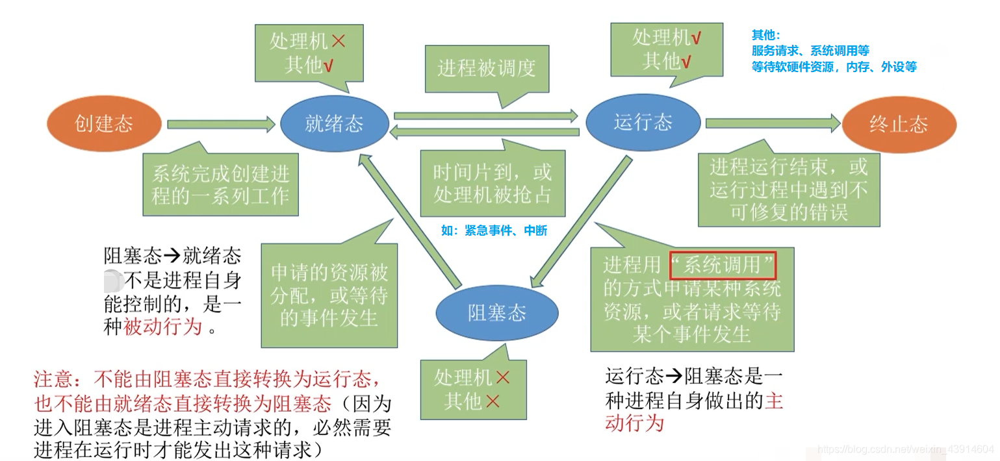

# (200条消息) 2.1.2 操作系统之进程的状态（运行、就绪、阻塞、创建、终止）及转换（就绪->运行、运行->就绪、运行->阻塞、阻塞->就绪）_BitHachi的博客-CSDN博客_阻塞-->运行

### 文章目录

*   *   *   [1.思维导图总览](#1_3)
        *   [2.进程的状态](#2_5)
        *   *   [（1）三种基本状态（就绪、运行、阻塞）](#1_6)
            *   [（2）创建态和结束态](#2_8)
        *   [3.进程状态之间的转换](#3_14)

* * *

### 1.思维导图总览

### 2.进程的状态

#### （1）三种基本状态（就绪、运行、阻塞）

#### （2）创建态和结束态

*   创建态
*   结束态  
    

### 3.[进程状态](https://so.csdn.net/so/search?q=%E8%BF%9B%E7%A8%8B%E7%8A%B6%E6%80%81&spm=1001.2101.3001.7020)之间的转换

*   进程一共有如下5种状态，那么他们之间如何实现切换呢？

*   咱们从一个进程的从无到有看起，来了解进程5种状态之间的转换  
    
*   来一张形象生动的图片感受一下5种状态之间的切换  
    

参考：https://www.bilibili.com/video/av70156862?p=8