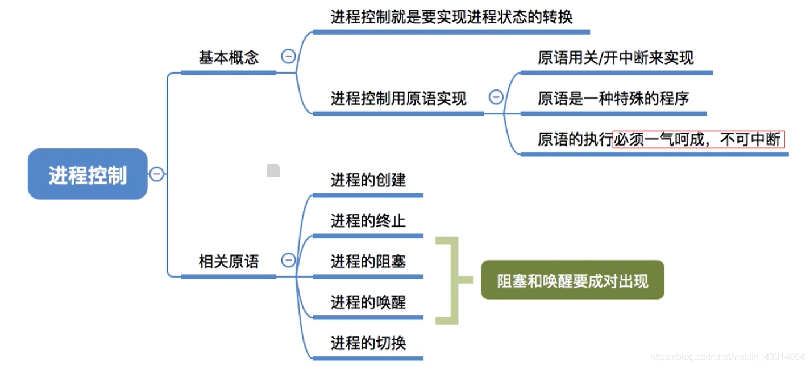
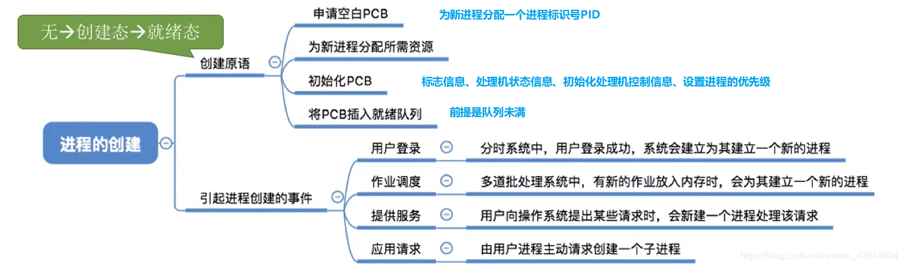
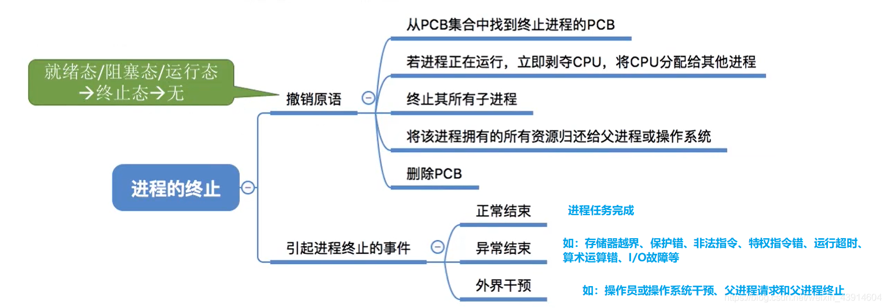
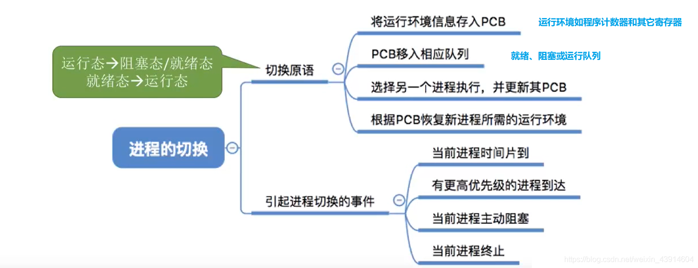

# (200条消息) 2.1.3 操作系统之原语实现对进程的控制_BitHachi的博客-CSDN博客_原语的实现

### 文章目录

*   *   *   [0.思维导图](#0_2)
        *   [1.什么是进程控制？](#1_4)
        *   [2.原语实现对进程的控制](#2_7)
        *   [3.回忆进程的组织](#3_11)
        *   [4.进程控制大致图解](#4_14)
        *   [5.进程控制原语的相同点](#5_21)
        *   [6.进程控制的五种原语](#6_25)
        *   *   [（1）进程的创建原语](#1_26)
            *   [（2）进程的终止原语](#2_28)
            *   [（3）进程的唤醒和阻塞原语](#3_31)
            *   [（4）进程的切换原语](#4_37)

* * *

### 0.思维导图

### 1.什么是进程控制？

### 2.原语实现对进程的控制

*   关于原语的作用和处在操作系统内核的重要地位可参考：[https://blog.csdn.net/weixin\_43914604/article/details/104452762](https://blog.csdn.net/weixin_43914604/article/details/104452762)  
    

### 3.回忆进程的组织

*   进程在操作系统中的组织使各个进程能够有序的进行切换和运行  
    

### 4.进程控制大致图解

> 这里说明一下调度和切换的区别：  
> `调度`是指决定资源分配给哪个进程的行为，是一种决策行为  
> `切换`是指实际分配的行为，是执行行为  
> 一般来说现有资源调度，后有进程切换

### 5.进程控制原语的相同点

*   接下来我们就具体学习一下关于进程控制的五种原语，`进程的创建、终止、唤醒、阻塞、切换；`

### 6.进程控制的五种原语

#### （1）进程的创建原语

#### （2）进程的终止原语

#### （3）进程的唤醒和阻塞原语

*   进程的阻塞和唤醒原语是`成对存在`的，必须`成对使用`。
*   `阻塞原语`是由被阻塞进程自我调用实现的
*   `唤醒原语`是由一个被唤醒进程合作或被其他相关的进程调用实现的  
    

#### （4）进程的切换原语

参考：[https://www.bilibili.com/video/av70156862?p=9](https://www.bilibili.com/video/av70156862?p=9)