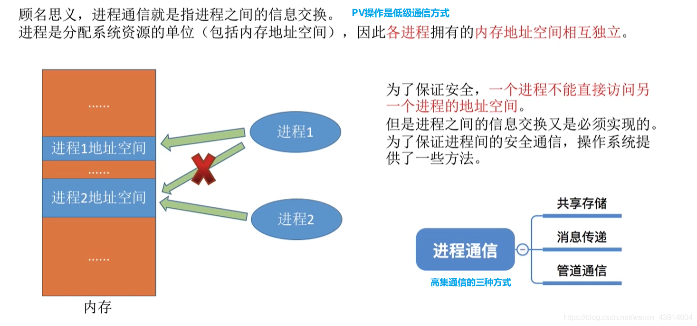
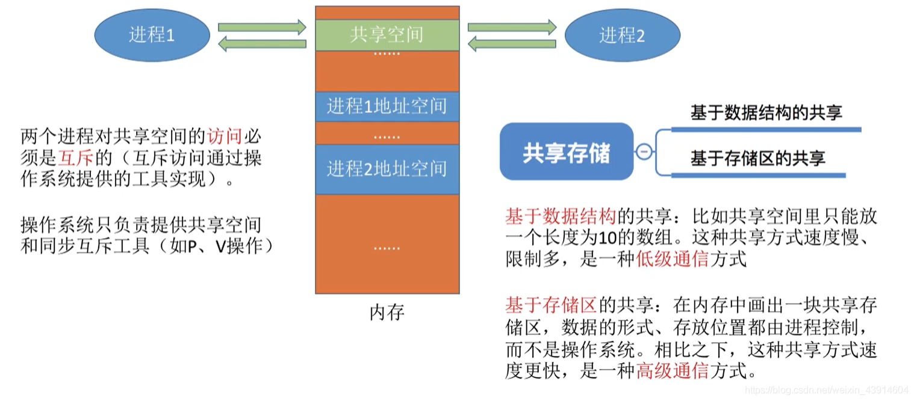

# (200条消息) 2.1.4 进程之间的通信（共享通信、消息传递、管道通信）_BitHachi的博客-CSDN博客_进程通信方式信息传递

### 文章目录

*   *   *   [0.思维导图](#0_3)
        *   [1.什么是进程通信？](#1_6)
        *   [2.共享存储](#2_10)
        *   [3.管道通信](#3_13)
        *   [4.消息传递](#4_15)

* * *

### 0.思维导图

### 1.什么是进程通信？

*   图中我们可以知道什么是进程通信，以及进程通信的低级和高级方式；
*   我们还可以知道为什么要引入进程通信方式，以及它的意义  
    

### 2.共享存储

*   共享一块大家都可以访问的空间，一次只能有一个进程进行读或写操作  
    

### 3.管道通信

### 4.消息传递

*   发送信息的进程将消息头写好，接受信息进程根据消息头读取信息或寻找信封是哪一个  
      
    参考：[https://www.bilibili.com/video/av70156862?p=10](https://www.bilibili.com/video/av70156862?p=10)