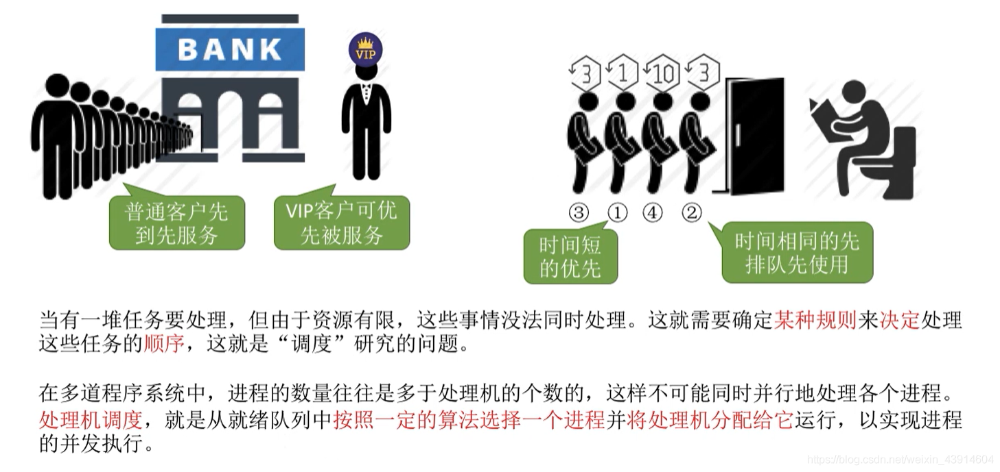
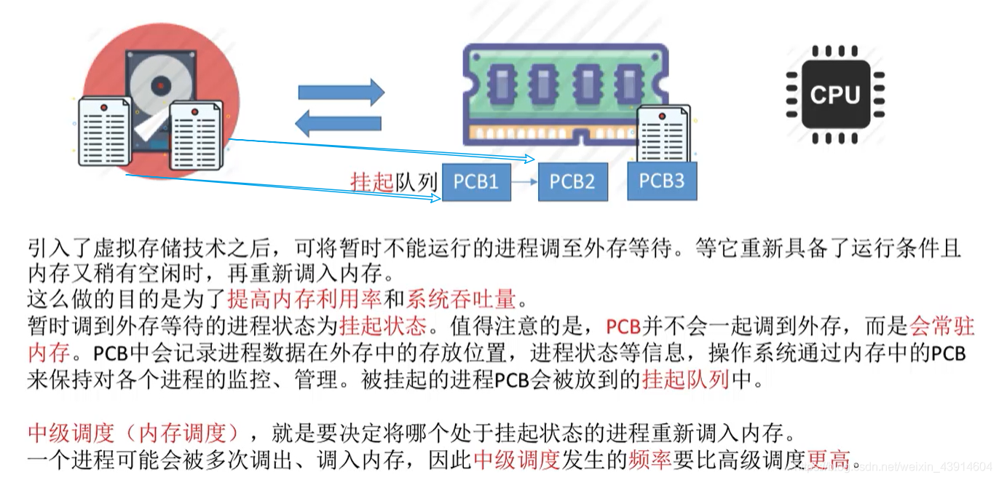

# (200条消息) 2.2.1操作系统之处理机调度的概念及层次_BitHachi的博客-CSDN博客

### 文章目录

*   *   *   *   [0.思维导图](#0_2)
            *   [1.调度的基本概念](#1_4)
            *   [2.调度的三个层次](#2_6)
            *   *   [（1）高级调度（ 作业调度）](#1__7)
                *   [（2）中级调度（内存调度）](#2_9)
                *   [（3）进程的挂起状态与七状态模型](#3_11)
                *   [（4）低级调度（进程调度）](#4_13)
                *   [（5）三层调度的联系和对比](#5_15)

* * *

#### 0.思维导图

#### 1.调度的基本概念

#### 2.调度的三个层次

##### （1）高级调度（ 作业调度）

##### （2）中级调度（内存调度）

##### （3）进程的[挂起](https://so.csdn.net/so/search?q=%E6%8C%82%E8%B5%B7&spm=1001.2101.3001.7020)状态与七状态模型

##### （4）低级调度（进程调度）

##### （5）三层调度的联系和对比

  
参考：[https://www.bilibili.com/video/BV1YE411D7nH?p=12](https://www.bilibili.com/video/BV1YE411D7nH?p=12)