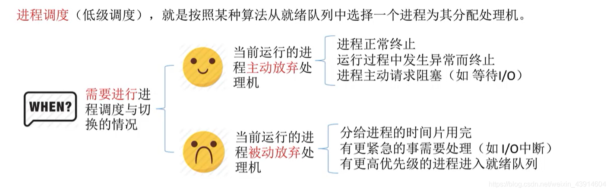
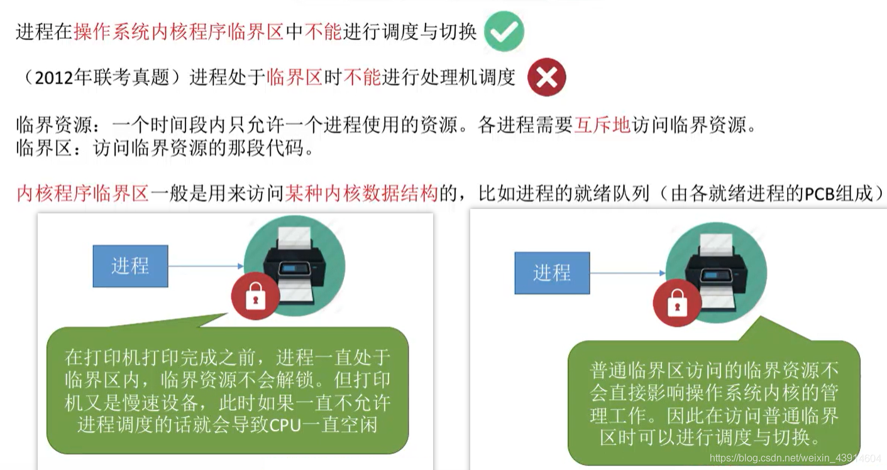
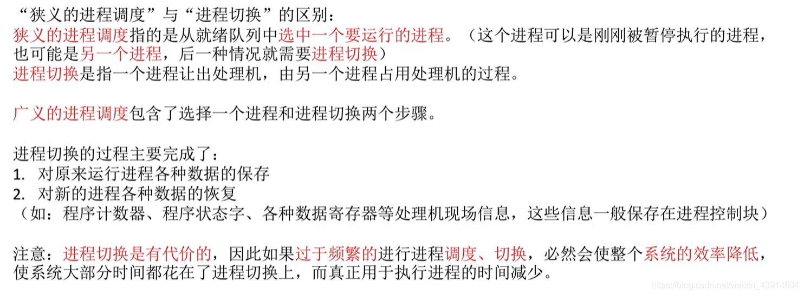

# (200条消息) 2.2.2 操作系统之进程调度的时机（主动放弃与被动放弃）、切换与过程（广义与狭义）、方式（非剥夺与剥夺）_BitHachi的博客-CSDN博客

### 文章目录

*   *   *   *   [0.思维导图](#0_2)
            *   [1.时机](#1_4)
            *   *   [（1）什么时候进行进程调度？](#1_5)
                *   [（2）什么时候不能进行进程调度？](#2_7)
                *   [（3）OS内核程序临界区与普通临界区的进程调度情况](#3OS_9)
            *   [2.进程调度的方式](#2_12)
            *   [3.进程的切换和过程](#3_15)

* * *

#### 0.思维导图

#### 1.时机

##### （1）什么时候进行进程调度？

##### （2）什么时候不能进行进程调度？

##### （3）OS内核程序临界区与普通临界区的进程调度情况

  

#### 2.进程调度的方式

*   所谓进程调度方式，是指当某个进程正在处理机上执行时，若有某个更为重要或紧迫的进程需要处理，即有优先权更高的进程进入就绪队列，此时应如何分配处理机。  
    

#### 3.进程的切换和过程

