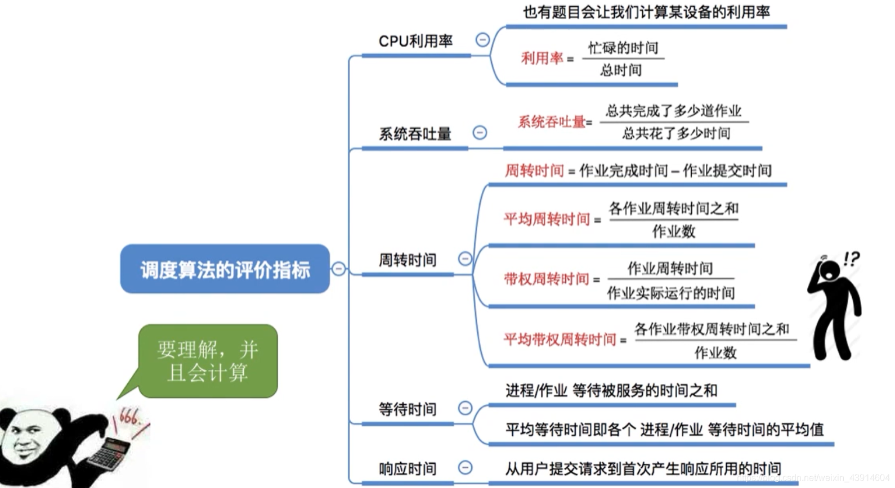
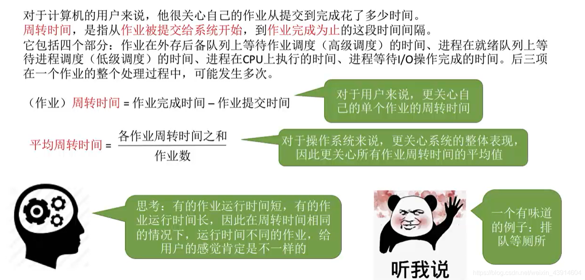

# (200条消息) 2.2.3 操作系统之调度算法的评价指标（cpu利用率、系统吞吐量、周转时间、等待时间、响应时间）_BitHachi的博客-CSDN博客

### 文章目录

*   *   *   *   [0.思维导图](#0_2)
            *   [1.CPU利用率](#1CPU_4)
            *   [2.系统吞吐量](#2_6)
            *   [3.周转时间](#3_8)
            *   [4.等待时间](#4_10)
            *   [5.响应时间](#5_12)

* * *

#### 0.思维导图

#### 1.CPU利用率

#### 2.系统[吞吐量](https://so.csdn.net/so/search?q=%E5%90%9E%E5%90%90%E9%87%8F&spm=1001.2101.3001.7020)

#### 3.周转时间

#### 4.等待时间

#### 5.响应时间

文章知识点与官方知识档案匹配，可进一步学习相关知识

[算法技能树](https://edu.csdn.net/skill/algorithm/)[首页](https://edu.csdn.net/skill/algorithm/)[概览](https://edu.csdn.net/skill/algorithm/)28638 人正在系统学习中