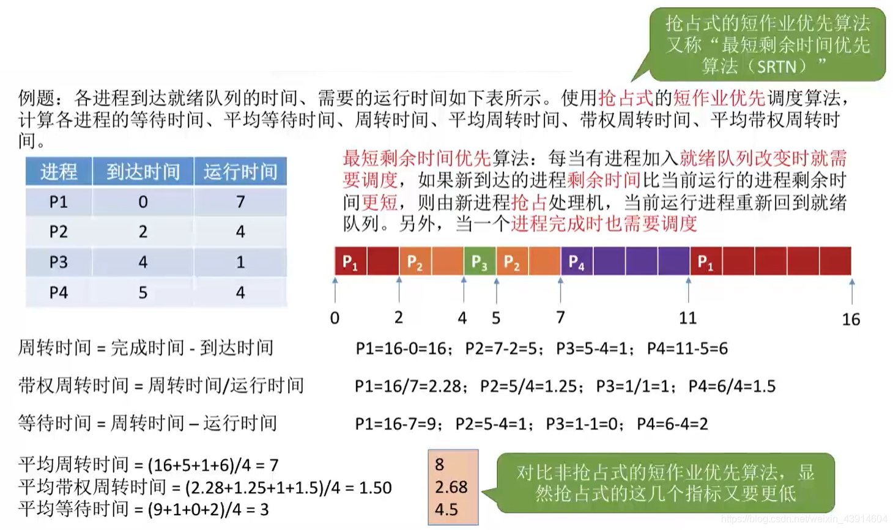

# (200条消息) 2.2.4 操作系统之作业/进程调度算法（FCFS先来先服务、SJF短作业优先、HRRN高响应比优先）_BitHachi的博客-CSDN博客

### 文章目录

*   *   *   *   [0.思维导图](#0_2)
            *   [1.先来先服务---FCFS](#1FCFS_5)
            *   [2.短作业优先---SJF](#2SJF_9)
            *   [3.高响应比优先---HRRN](#3HRRN_21)
            *   [4.三种算法的对比和总结](#4_29)

* * *

#### 0.思维导图

#### 1.先来先服务—FCFS

*   First come first sever  
      
    

#### 2.短作业优先—SJF

*   Shortest Job First

*   非抢占式—SJF  
    
*   抢占式—SJF(SRTN)  
      
    
*   注意几个细节  
    

#### 3.高响应比优先—HRRN

*   Highest Response Ratio Next

  

#### 4.三种算法的对比和总结

文章知识点与官方知识档案匹配，可进一步学习相关知识

[算法技能树](https://edu.csdn.net/skill/algorithm/)[首页](https://edu.csdn.net/skill/algorithm/)[概览](https://edu.csdn.net/skill/algorithm/)28643 人正在系统学习中