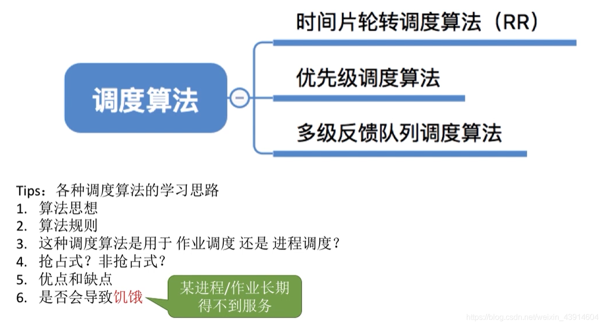
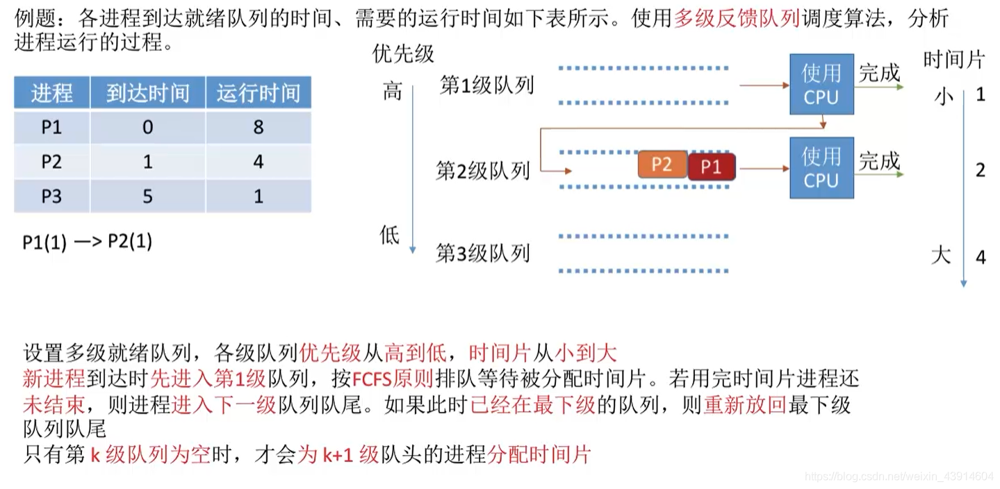
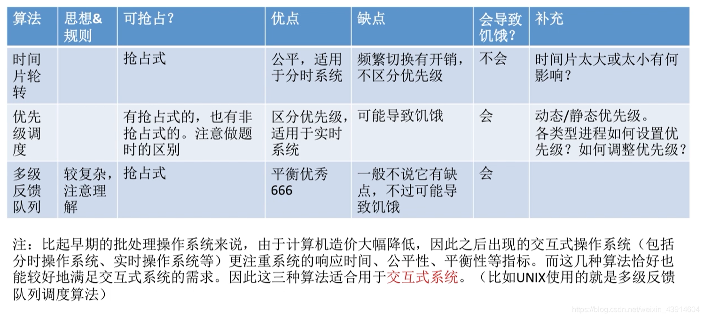

# (200条消息) 2.2.5 操作系统之调度算法（时间片轮转调度算法、优先级调度算法、多级反馈队列调度算法）_BitHachi的博客-CSDN博客_时间片轮转时间片为2

### 文章目录

*   *   *   *   [0.思维导图](#0_2)
            *   [1.时间片轮转---RR](#1RR_4)
            *   [2.优先级调度算法](#2_14)
            *   [3.多级反馈队列调度算法](#3_22)
            *   [4.三种算法的对比总结](#4_33)

* * *

#### 0.思维导图

#### 1.时间片轮转—RR

*   Round-Robin  
    
*   时间片为2举例  
    
*   以时间片为5举例  
    
*   可能出现的问题，比如与FCFS对比  
      
    

#### 2.[优先级](https://so.csdn.net/so/search?q=%E4%BC%98%E5%85%88%E7%BA%A7&spm=1001.2101.3001.7020)调度算法

*   非抢占式例子  
    \- 抢占式例子

*   补充  
    

#### 3.多级反馈[队列](https://so.csdn.net/so/search?q=%E9%98%9F%E5%88%97&spm=1001.2101.3001.7020)调度算法

  

*   举个例子  
      
      
      
      
      
    

#### 4.三种算法的对比总结

