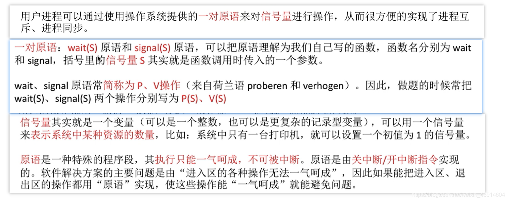
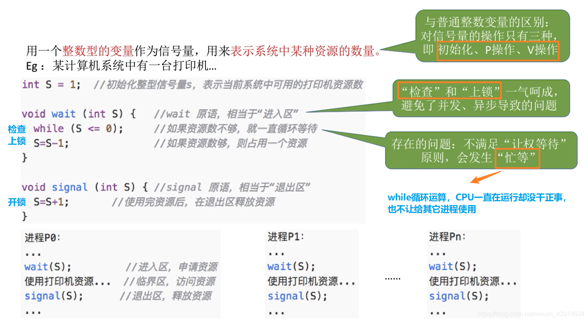
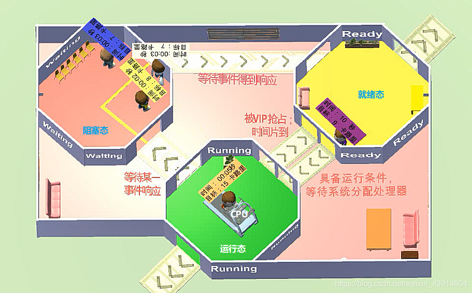
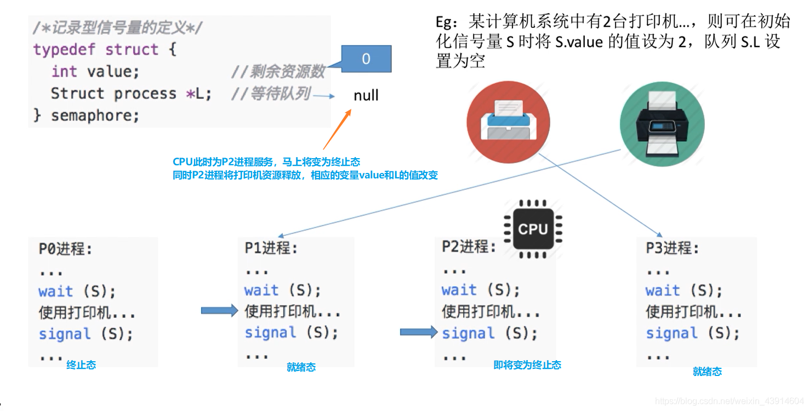

# (200条消息) 2.3.4 操作系统之信号量机制（整型信号量、记录型信号量P、V）_BitHachi的博客-CSDN博客_整型信号量机制

### 文章目录

*   *   *   *   [0.思维导图](#0_3)
            *   [1.为什么引入信号量机制？](#1_5)
            *   [2.什么是信号量机制？](#2_8)
            *   [3.整型信号量](#3_10)
            *   [4.记录型信号量](#4_13)
            *   *   [（1）举一个生动形象的例子了解记录型信号量](#1_15)
                *   [（2）梳理一下记录型信号量的知识点（P、V）](#2PV_25)

* * *

#### 0.思维导图

#### 1.为什么引入[信号量](https://so.csdn.net/so/search?q=%E4%BF%A1%E5%8F%B7%E9%87%8F&spm=1001.2101.3001.7020)机制？

*   为了更好的解决进程互斥与同步的问题  
    

#### 2.什么是信号量机制？

#### 3.[整型](https://so.csdn.net/so/search?q=%E6%95%B4%E5%9E%8B&spm=1001.2101.3001.7020)信号量

#### 4.记录型信号量

##### （1）举一个生动形象的例子了解记录型信号量

*   一张图咱们回忆一下进程的状态  
    
*   一个例子  
      
    

  
  

##### （2）梳理一下记录型信号量的知识点（P、V）

  
参考：[https://www.bilibili.com/video/av70156862?p=20](https://www.bilibili.com/video/av70156862?p=20)