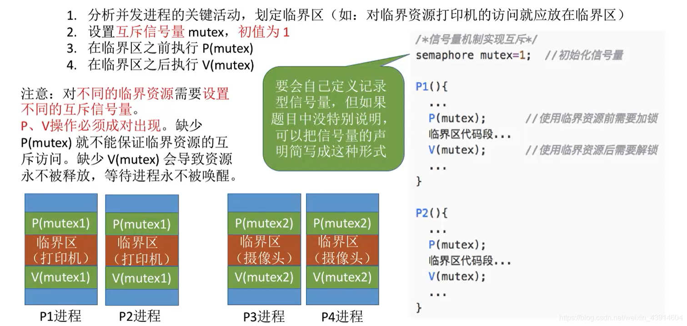

# (200条消息) 2.3.5 操作系统之信号量机制实现进程的互斥、同步与前驱关系_BitHachi的博客-CSDN博客

### 文章目录

*   *   *   *   [0.思维导图](#0_3)
            *   [1.信号量机制实现进程互斥](#1_6)
            *   [2.信号量机制实现进程同步](#2_8)
            *   [3.信号量机制实现前驱关系](#3_13)

* * *

#### 0.思维导图

*   在看此小结内容之前，需熟悉这一篇博客里面的知识，关于P、V操作内部实现原理等[https://blog.csdn.net/weixin\_43914604/article/details/104951182](https://blog.csdn.net/weixin_43914604/article/details/104951182)  
    

#### 1.[信号量](https://so.csdn.net/so/search?q=%E4%BF%A1%E5%8F%B7%E9%87%8F&spm=1001.2101.3001.7020)机制实现进程互斥

#### 2.信号量机制实现进程同步

*   想象一下四则运算的顺序，加减乘除；  
    
*   要想理解这一部分知识，必须知道P、V操作的内部实现原理  
    

#### 3.信号量机制实现前驱关系

参考：[https://www.bilibili.com/video/av70156862?p=21](https://www.bilibili.com/video/av70156862?p=21)