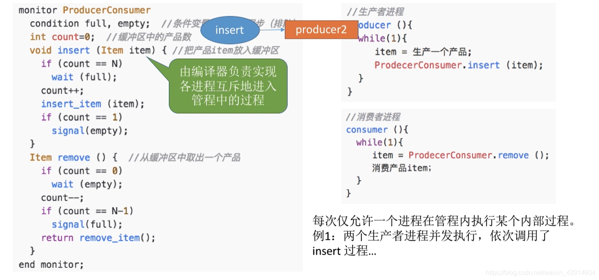

# (200条消息) 2.3.7 操作系统之管程和java中实现管程的机制_BitHachi的博客-CSDN博客

### 文章目录

*   *   [0.思维导图](#0_3)
    *   [1.为什么引入管程？](#1_5)
    *   [2.管程的组成及基本特征](#2_7)
    *   [3.管程实现生产者消费者问题](#3_9)
    *   [4.java中类似于管程的机制](#4java_14)

* * *

## 0.思维导图

## 1.为什么引入管程？

## 2.管程的组成及基本特征

## 3.管程实现生产者消费者问题

  
  
  

## 4.java中类似于管程的机制

文章知识点与官方知识档案匹配，可进一步学习相关知识

[Java技能树](https://edu.csdn.net/skill/java/java-e525dd82742940e49b520309333a334e)[使用JDBC操作数据库](https://edu.csdn.net/skill/java/java-e525dd82742940e49b520309333a334e)[JDBC概述](https://edu.csdn.net/skill/java/java-e525dd82742940e49b520309333a334e)80571 人正在系统学习中