# (200条消息) 2.4操作系统之死锁详解(预防、避免、检测、解除)+思维导图_BitHachi的博客-CSDN博客_死锁的思维导图

### 文章目录

*   *   *   *   [0.思维导图](#0_2)
            *   [1.什么是死锁？](#1_4)
            *   [2.死锁、饥饿、死循环的区别](#2_8)
            *   [3.死锁产生的四个必要条件](#3_11)
            *   [4.什么时候会发生死锁？](#4_13)
            *   [5.死锁的处理策略](#5_15)
            *   *   [（1）预防死锁](#1_17)
                *   *   [① 破坏互斥条件](#__18)
                    *   [② 破坏不可剥夺条件](#__20)
                    *   [③ 破坏请求和保持条件](#__22)
                    *   [④ 破坏循环等待条件](#__24)
                *   [（2）避免死锁](#2_26)
                *   *   [① 什么是安全序列？](#__27)
                    *   [② 安全序列、安全状态、不安全状态、死锁之间的联系](#__34)
                    *   [③ 避免系统进入不安全状态------银行家算法](#__37)
                *   [（3）死锁的检测和解除](#3_50)
                *   *   [① 死锁的检测](#__52)
                    *   [② 死锁的解除](#__63)

* * *

#### 0.思维导图

#### 1.什么是[死锁](https://so.csdn.net/so/search?q=%E6%AD%BB%E9%94%81&spm=1001.2101.3001.7020)？

  

#### 2.死锁、饥饿、死循环的区别

  

#### 3.死锁产生的四个必要条件

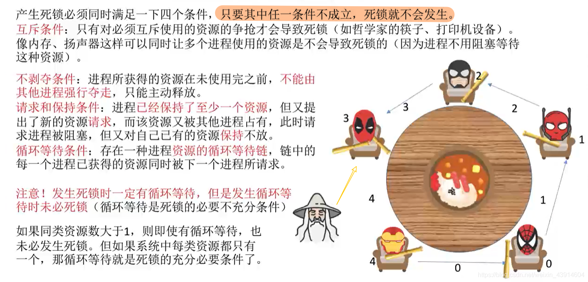

#### 4.什么时候会发生死锁？

#### 5.死锁的处理策略

##### （1）预防死锁

###### ① 破坏互斥条件

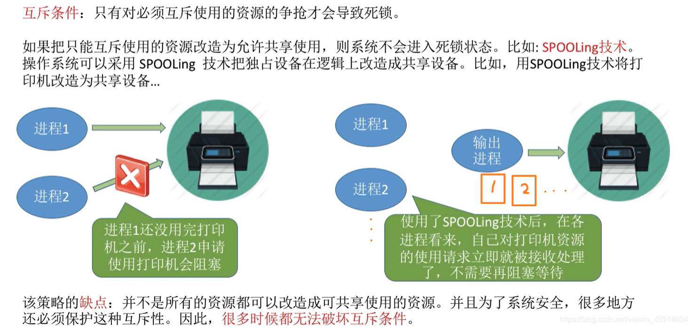

###### ② 破坏不可剥夺条件

###### ③ 破坏请求和保持条件

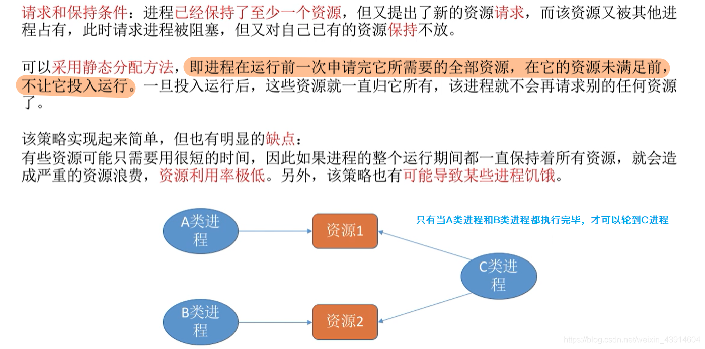

###### ④ 破坏循环等待条件

##### （2）避免死锁

###### ① 什么是安全序列？

*   所谓安全序列  
      
      
    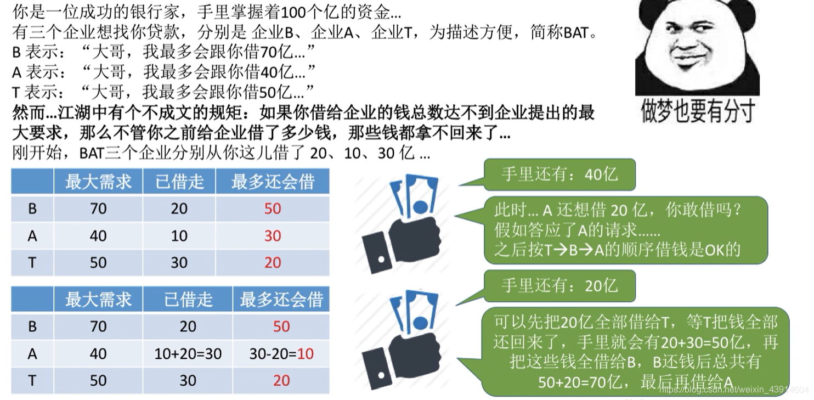  
      
    

###### ② 安全序列、安全状态、不安全状态、死锁之间的联系

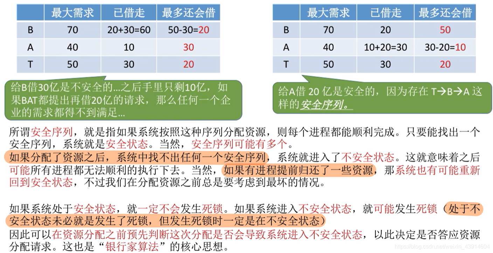  

###### ③ 避免系统进入不安全状态------[银行家算法](https://so.csdn.net/so/search?q=%E9%93%B6%E8%A1%8C%E5%AE%B6%E7%AE%97%E6%B3%95&spm=1001.2101.3001.7020)

  
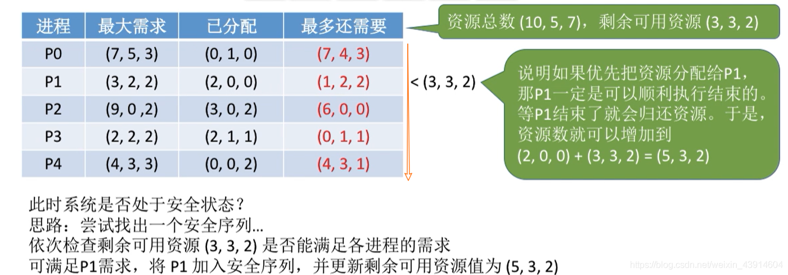  
  
  
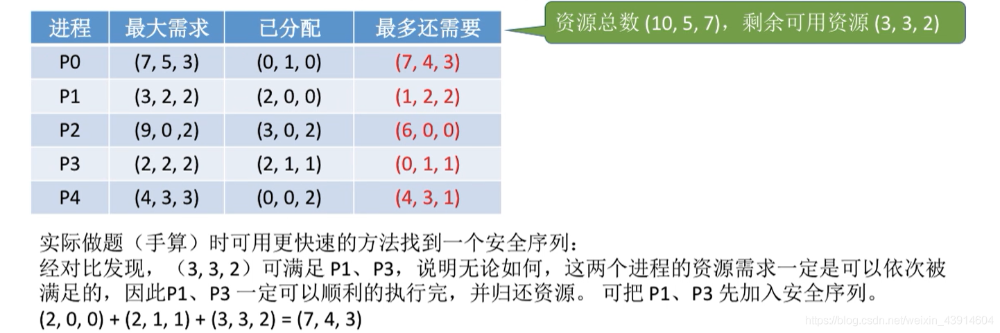  
  
  

*   使用代码实现  
      
      
    

##### （3）死锁的检测和解除

###### ① 死锁的检测

*   举个例子，可以消除所有边，即无死锁发生  
    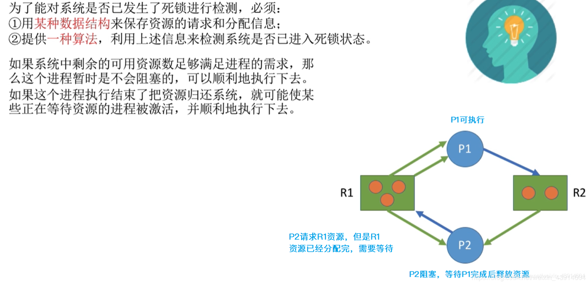  
    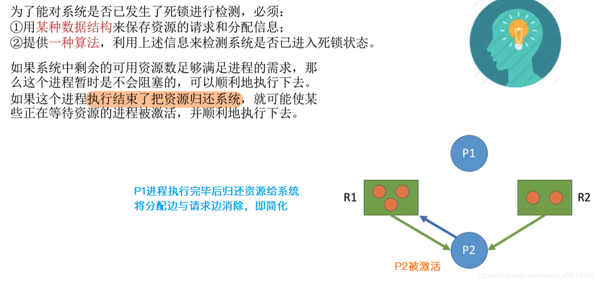  
    
*   举个例子，不可消除所有边，即产生死锁  
      
      
      
    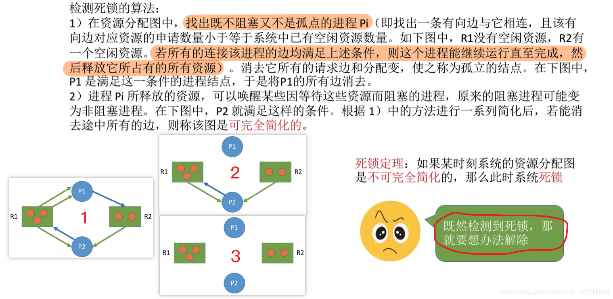

###### ② 死锁的解除

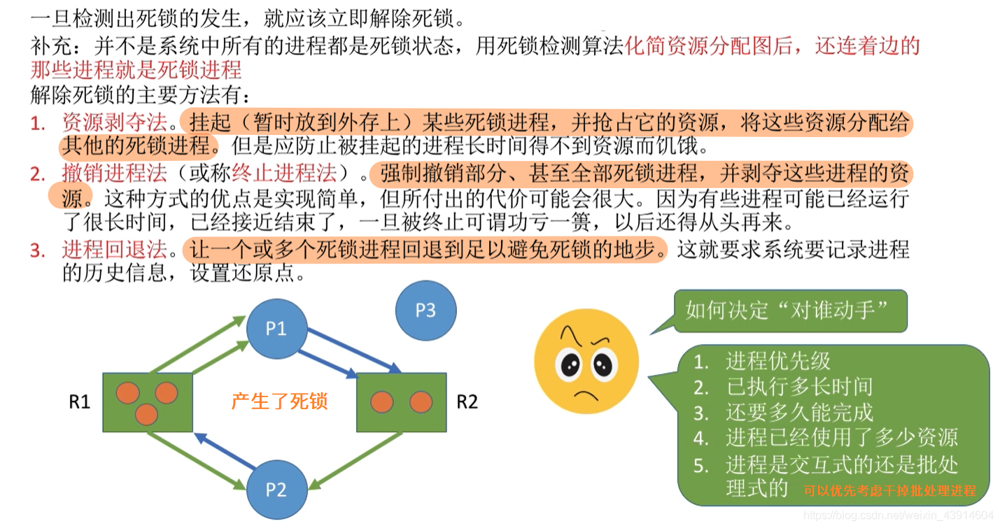