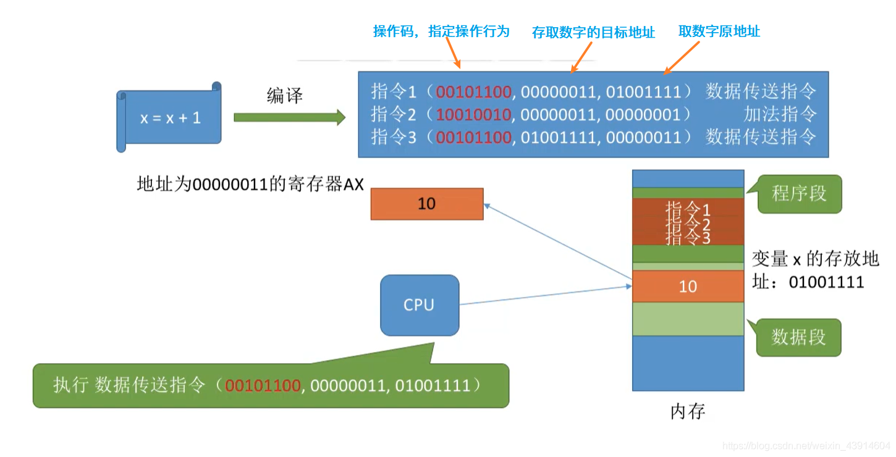
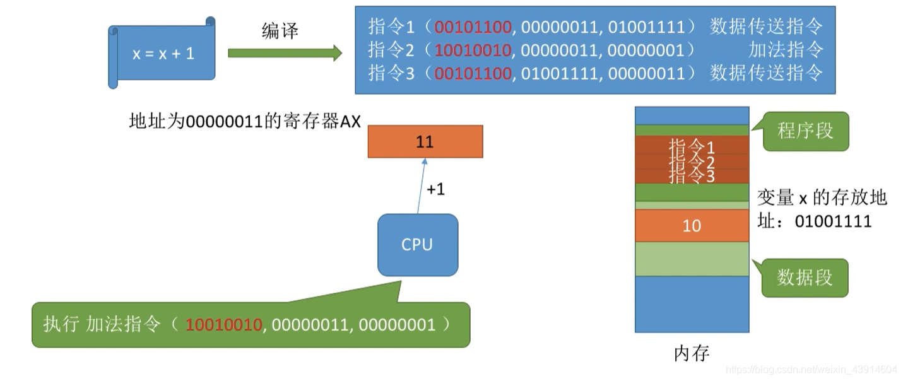
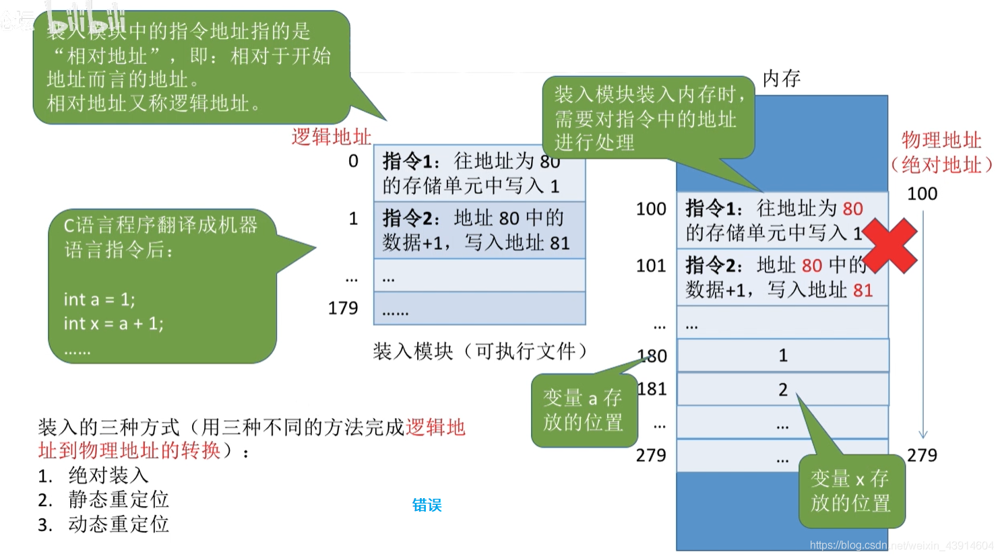
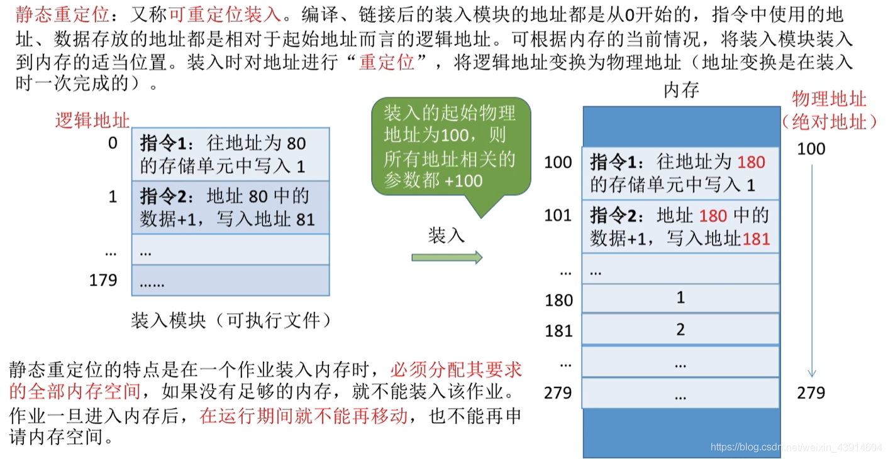
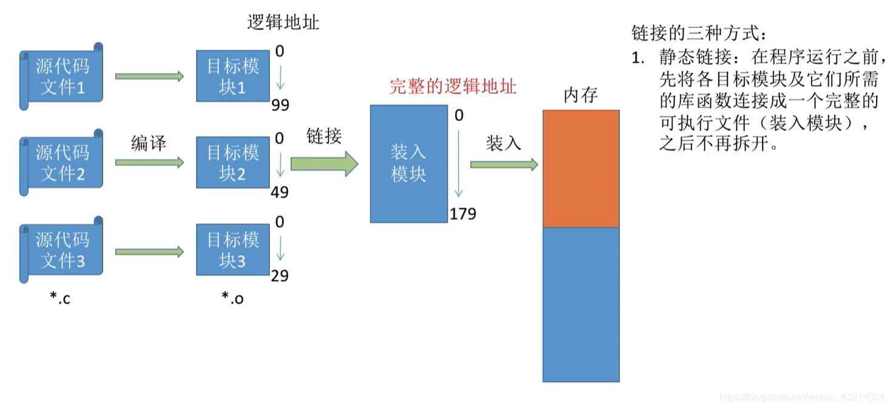

# (200条消息) 3.1.1 什么是内存？进程的基本原理，深入指令理解其过程_BitHachi的博客-CSDN博客

### 文章目录

*   *   [0.思维导图](#0_3)
    *   [1.什么是内存？有何作用？](#1_5)
    *   *   [（1）存储单元](#1_7)
        *   [（2）几个常用数量单位&内存地址](#2_10)
    *   [2.进程运行的基本原理](#2_12)
    *   *   [（1）指令的工作原理---操作码+若干参数（可能包含地址参数）](#1_13)
        *   [（2）逻辑地址（相对地址）vs物理地址（绝对地址）](#2vs_19)
        *   [（3）从写程序到程序运行---编译、链接、装入](#3_21)
        *   [（4）装入模块装入内存](#4_23)
        *   [（5）装入的三种方式](#5_27)
        *   *   [①绝对装入](#_28)
            *   [②静态重定位](#_30)
            *   [③ 动态重定位](#__32)
        *   [（6）链接的三种方式](#6_36)
        *   *   [① 静态链接](#__37)
            *   [②装入时动态链接](#_39)
            *   [③运行时动态链接](#_41)

* * *

## 0.思维导图

## 1.什么是内存？有何作用？

### （1）[存储单元](https://so.csdn.net/so/search?q=%E5%AD%98%E5%82%A8%E5%8D%95%E5%85%83&spm=1001.2101.3001.7020)

*   关于存储单元有关内容在我写的组成原理笔记中有提到：[存储单元](https://blog.csdn.net/weixin_43914604/article/details/104099953)  
    

### （2）几个常用数量单位&内存地址

## 2.进程运行的基本原理

### （1）指令的工作原理—操作码+若干参数（可能包含地址参数）

*   从X=X+1大致看一下指令的执行过程  
      
      
      
    

### （2）[逻辑地址](https://so.csdn.net/so/search?q=%E9%80%BB%E8%BE%91%E5%9C%B0%E5%9D%80&spm=1001.2101.3001.7020)（相对地址）vs物理地址（绝对地址）

### （3）从写程序到程序运行—编译、链接、装入

### （4）装入模块装入内存

**不修改装入模块中的指令地址就直接装入内存的话：**  
  

### （5）装入的三种方式

#### ①绝对装入

#### ②静态重定位

#### ③ 动态重定位

  
  

### （6）链接的三种方式

#### ① 静态链接

#### ②装入时动态链接

#### ③运行时动态链接

