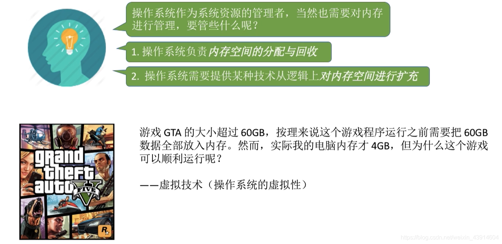
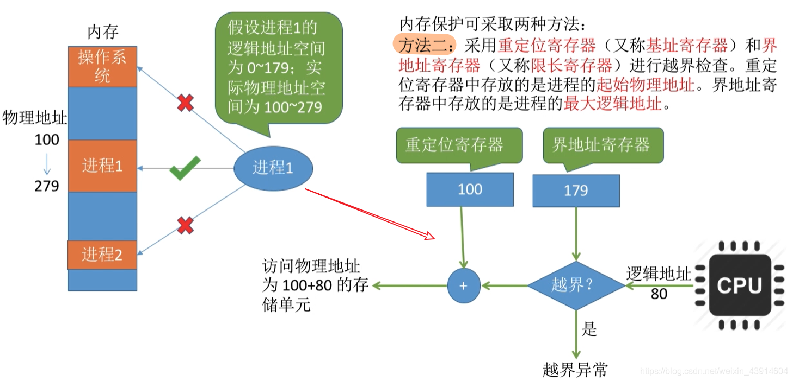

# (200条消息) 3.1.2 操作系统内存管理管些什么？_BitHachi的博客-CSDN博客_内存管理管的是什么

### 文章目录

*   *   [0.思维导图](#0_3)
    *   [1.内存空间的分配与回收](#1_5)
    *   [2.内存空间的扩展（实现虚拟性）](#2_7)
    *   [3.地址转换](#3_9)
    *   *   [三种方式](#_11)
    *   [4.内存保护](#4_13)
    *   *   [两种方式](#_15)

* * *

## 0.思维导图

## 1.内存空间的分配与回收

## 2.内存空间的扩展（实现虚拟性）

## 3.[地址转换](https://so.csdn.net/so/search?q=%E5%9C%B0%E5%9D%80%E8%BD%AC%E6%8D%A2&spm=1001.2101.3001.7020)

### 三种方式

## 4.内存保护

### 两种方式

  
