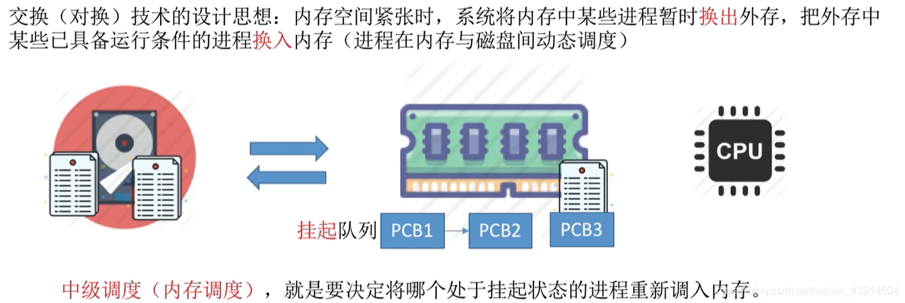
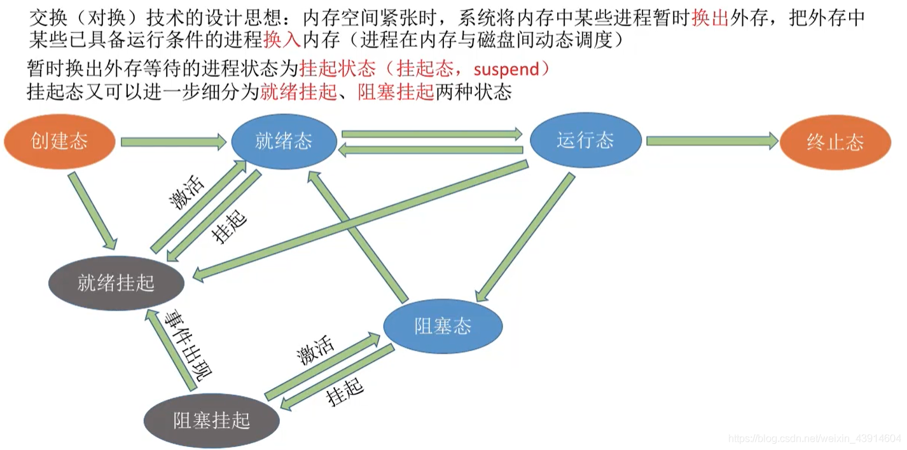

# (200条消息) 3.1.3 操作系统覆盖技术与交换技术的思想_BitHachi的博客-CSDN博客

### 文章目录

*   *   [0.思维导图](#0_3)
    *   [1.覆盖技术](#1_6)
    *   [3.交换技术](#3_10)

* * *

## 0.思维导图

  

## 1.覆盖技术

  

## 3.交换技术

*   回忆复习一下进程调度  
      
    