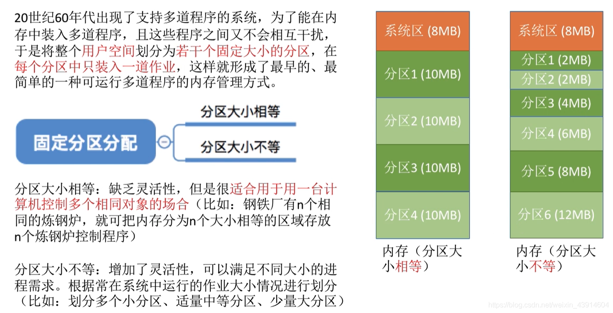
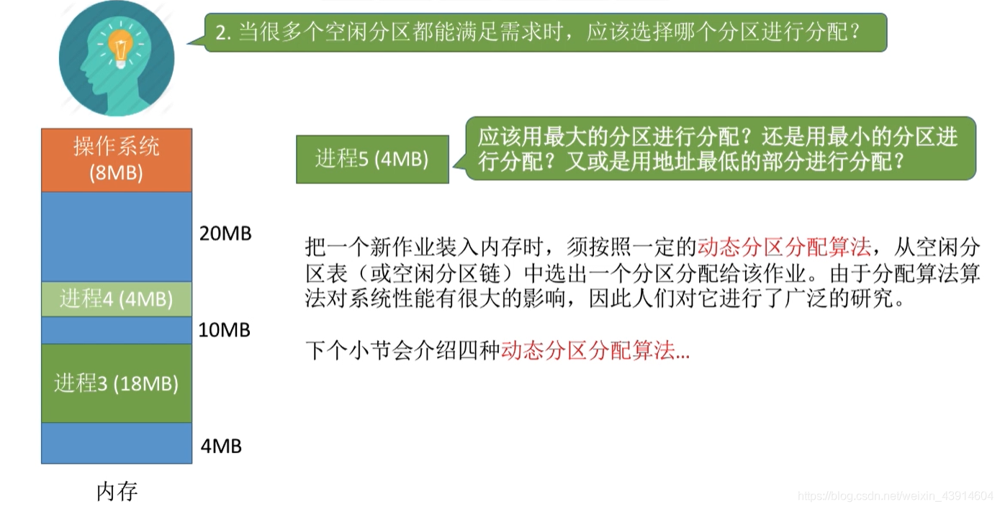
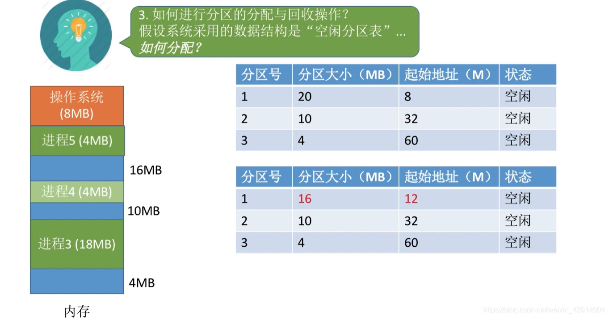
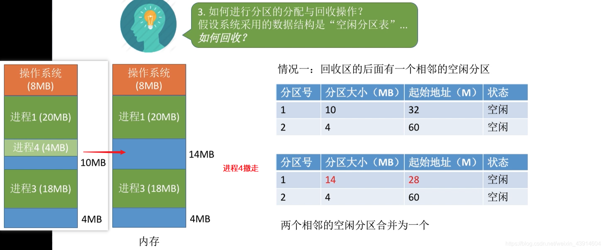

# (200条消息) 3.1.4 操作系统之内存的分配与回收_BitHachi的博客-CSDN博客

### 文章目录

*   *   [0.思维导图](#0_3)
    *   [1.单一连续分配](#1_6)
    *   [2.固定分区分配](#2_8)
    *   *   [（1）分区说明表](#1_10)
    *   [3.动态分区分配（可变分区分配）](#3_13)
    *   *   [（1）系统要用怎样的数据结构记录内存的使用情况呢？](#1_18)
        *   [（2）当多个空闲分区都能满足要求时，应该选择哪个分区进行分配？](#2_20)
        *   [（3）如何进行分区的分配和回收操作？](#3_22)
    *   [4.内部碎片与外部碎片](#4_32)

* * *

## 0.思维导图

  

## 1.单一连续分配

## 2.固定分区分配

### （1）分区说明表

## 3.动态分区分配（可变分区分配）

  
  
  

### （1）系统要用怎样的[数据结构](https://so.csdn.net/so/search?q=%E6%95%B0%E6%8D%AE%E7%BB%93%E6%9E%84&spm=1001.2101.3001.7020)记录内存的使用情况呢？

### （2）当多个空闲分区都能满足要求时，应该选择哪个分区进行分配？

### （3）如何进行分区的分配和回收操作？

**如何分配？**  
  
  
  
**如何回收？**  
  
  
  

## 4.内部碎片与外部碎片

  
