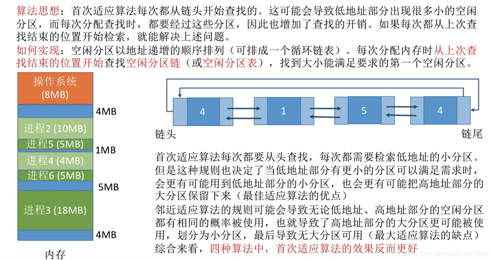

# (200条消息) 3.1.5 操作系统之动态分区分配的四种算法（首次适应算法、最佳适应算法、最坏适应算法、临近适应算法）_BitHachi的博客-CSDN博客_最佳适应算法和最坏适应算法

### 文章目录

*   *   [0.思维导图](#0_3)
    *   [1.首次适应算法](#1_8)
    *   [2.最佳适应算法](#2_12)
    *   [3.最坏（大）适应算法](#3_17)
    *   [4.临近适应算法](#4_22)
    *   [5.四种算法归纳比较](#5_29)

* * *

## 0.思维导图

*   本篇文章是对上一篇文章[内存的分配与回收](https://blog.csdn.net/weixin_43914604/article/details/105714392)提到的`动态分区分配算法`的补充

## 1.首次适应算法

  
  

## 2.[最佳适应算法](https://so.csdn.net/so/search?q=%E6%9C%80%E4%BD%B3%E9%80%82%E5%BA%94%E7%AE%97%E6%B3%95&spm=1001.2101.3001.7020)

  
  

## 3.最坏（大）适应算法

  
  
  

## 4.临近适应算法

  
  
  
  

## 5.四种算法归纳比较

