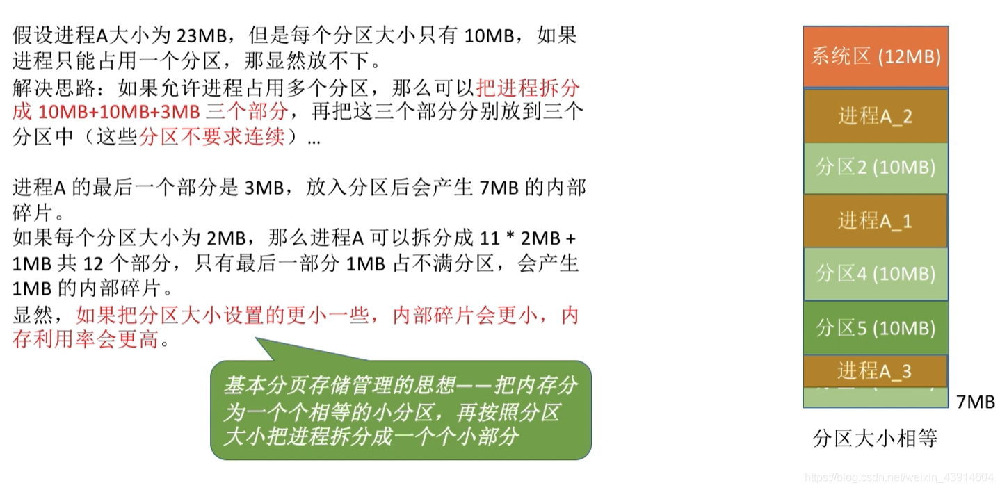
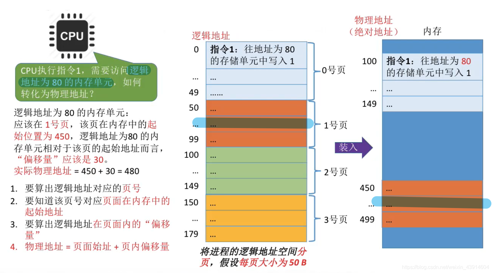

# (200条消息) 3.1.6 OS之分页存储（页号、页偏移量等）_BitHachi的博客-CSDN博客_页号和页内偏移量

### 文章目录

*   [0.思维导图](#0_3)
*   [1.为什么学习分页存储？](#1_7)
*   [2.基本分页存储管理的思想](#2_9)
*   [3.分页存储管理的重要概念](#3_12)
*   [4.如何实现地址的转换](#4_14)
*   *   [如何计算页号和页偏移量](#_19)
    *   [分页存储的逻辑结构](#_25)
    *   [如何知道页面在内存中的起始地址？](#_27)

* * *

# 0.思维导图

# 1.为什么学习分页存储？

# 2.基本分页存储管理的思想

# 3.分页存储管理的重要概念

# 4.如何实现地址的转换

  

## 如何计算页号和页偏移量

  
**为什么页面大小一般设为2的整数次幂？**  
  

## 分页存储的逻辑结构

## 如何知道页面在[内存](https://so.csdn.net/so/search?q=%E5%86%85%E5%AD%98&spm=1001.2101.3001.7020)中的起始地址？

*   这里引入一个新的概念：`页表`  
      
    

参考：《王道操作系统》