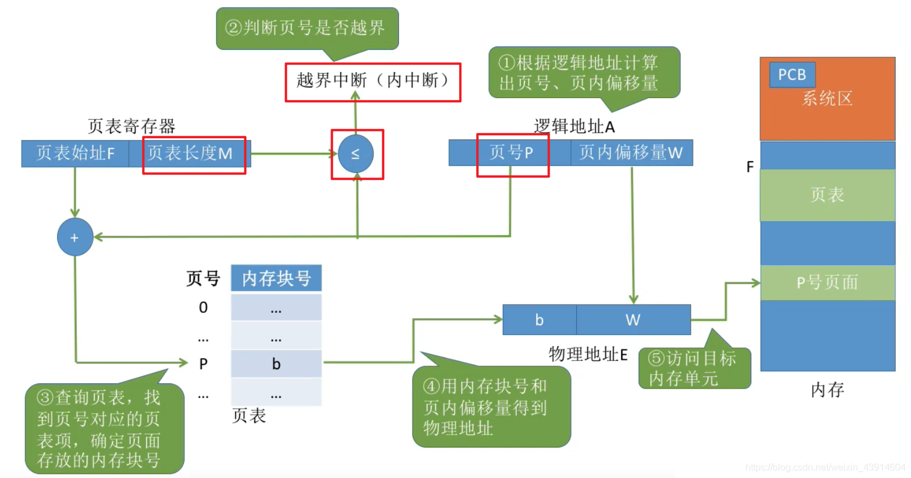

# (200条消息) 3.1.7 OS之分页存储管理的基本地址变换结构_BitHachi的博客-CSDN博客

### 文章目录

*   *   [0.思维导图](#0_3)
*   [1.页表寄存器](#1_7)
*   *   [地址变换过程](#_9)
*   [2.对页表项大小的进一步讨论](#2_16)

* * *

## 0.思维导图

# 1.[页表](https://so.csdn.net/so/search?q=%E9%A1%B5%E8%A1%A8&spm=1001.2101.3001.7020)寄存器

## 地址变换过程

  
  
**一道例题加深印象：**  

# 2.对页表项大小的进一步讨论

  
参考：《王道操作系统》