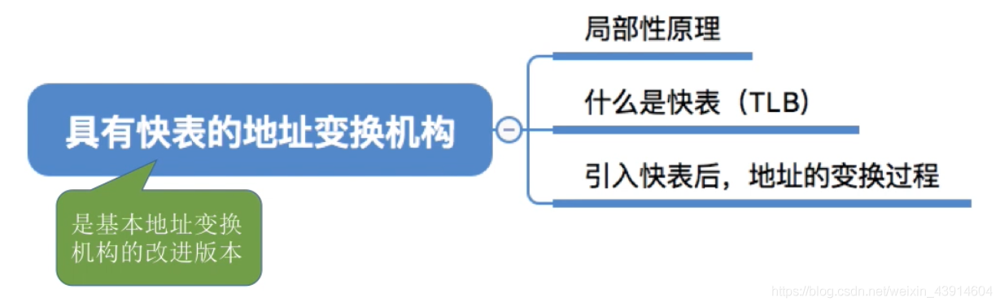
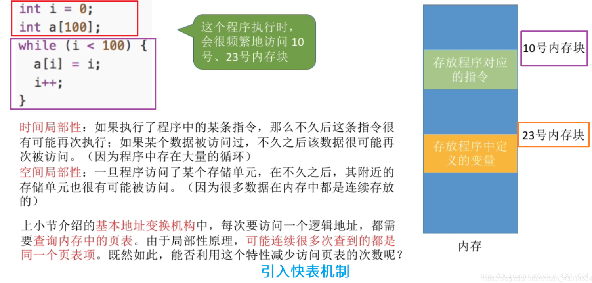
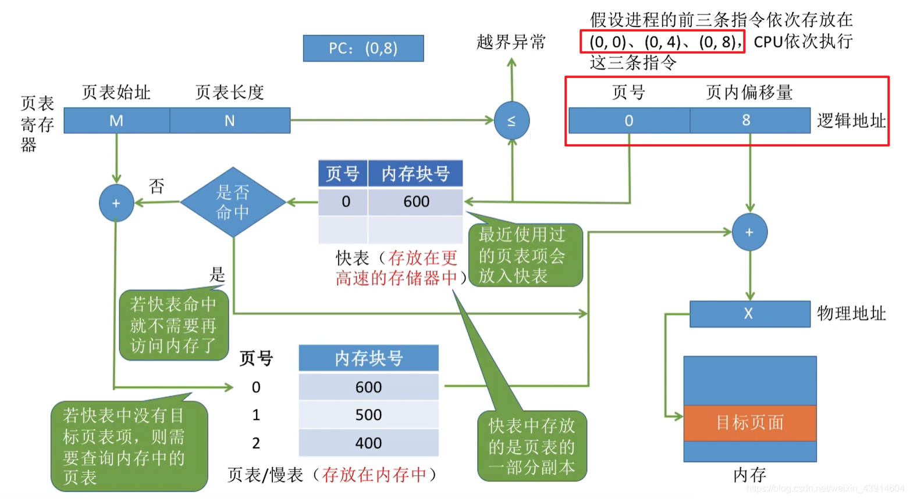

# (200条消息) 3.1.8 OS之快表的地址变换结构_BitHachi的博客-CSDN博客

### 文章目录

*   [0.思维导图](#0_3)
*   [1.局部性原理引入快表机制](#1_7)
*   [2.快表（TLB）](#2TLB_11)
*   *   [一个例图了解基于快表的地址变换结构](#_13)
*   [3.基本地址变换与快表地址变换的比较](#3_17)

* * *

# 0.思维导图

*   上一篇文章学习了[分页存储管理的基本地址变换结构](https://blog.csdn.net/weixin_43914604/article/details/105909842),这一篇文章是对基本地址变换结构的改进版。  
    

# 1.局部性原理引入快表机制

# 2.快表（TLB）

## 一个例图了解基于快表的地址变换结构

  
**引入快表后，地址变换的过程的文字描述：**  

# 3.基本地址变换与快表地址变换的比较

参考：《王道操作系统》