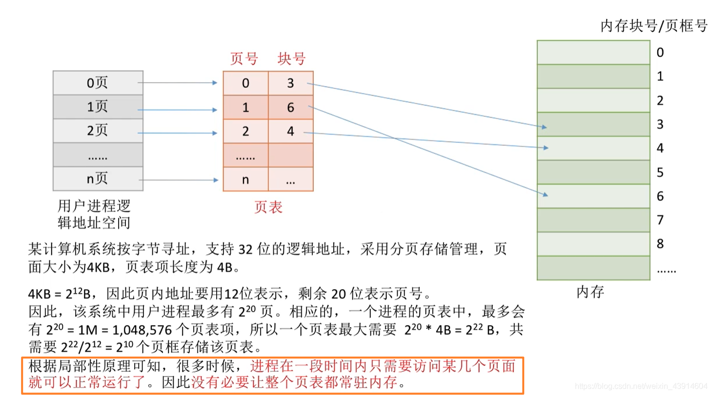

# (200条消息) 3.1.9 OS之二级页表的原理和地址结构_BitHachi的博客-CSDN博客

### 文章目录

*   [0.思维导图](#0_3)
*   [1.为什么引入二级页表？](#1_5)
*   [2.二级页表的原理和地址结构](#2_13)
*   [3.如何实现二级页表的地址变换？](#3_18)
*   [4.几个小细节](#4_22)

* * *

# 0.思维导图

# 1.为什么引入二级[页表](https://so.csdn.net/so/search?q=%E9%A1%B5%E8%A1%A8&spm=1001.2101.3001.7020)？

**因为单级页表存在一些问题，所以引入二级页表和多级页表，有两个问题：**

  
  
**上面提到了这两个问题，那么总结一下，并提出解决思想，引入二级页表的概念。**  

# 2.二级页表的原理和地址结构

*   对页表再次分组  
    
*   二级页表的地址结构及对应关系  
    

# 3.如何实现二级页表的地址变换？

  
**上面的部分我们解决了问题一，接下来是问题二，这里简单叙述一下，后面的文章会继续深入剖析。**  

# 4.几个小细节

  
参考：《王道操作系统》