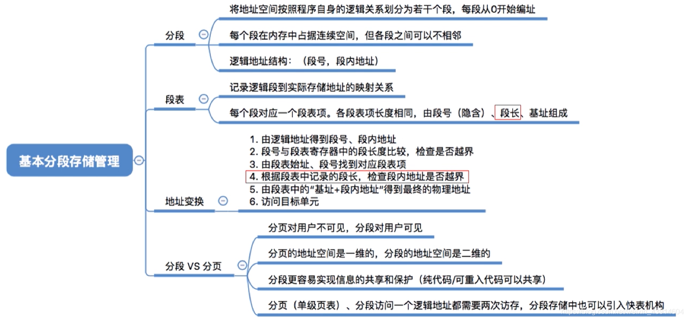
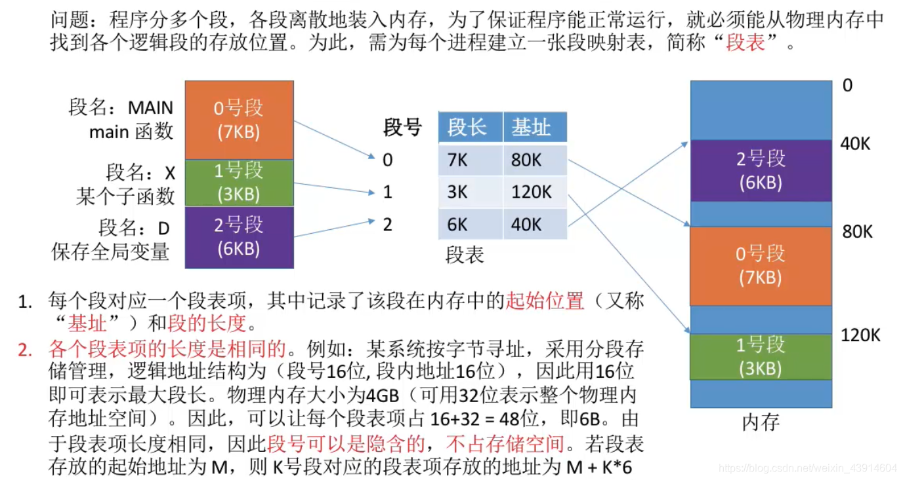
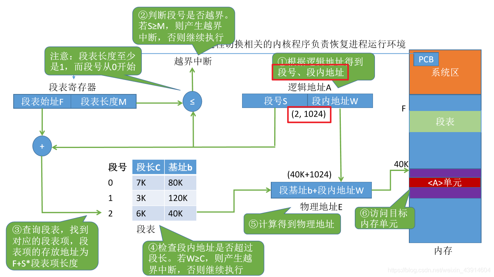
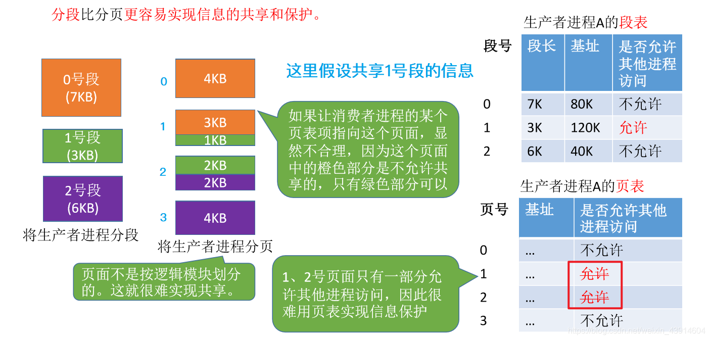

# (200条消息) 3.1.10 OS之基本分段存储管理（段表、地址变换、信息共享）_BitHachi的博客-CSDN博客_段表地址变换

### 文章目录

*   [0.思维导图](#0_3)
*   [1.什么是分段？](#1_7)
*   *   [分段的逻辑地址结构](#_9)
*   [2.段表](#2_11)
*   [3.地址变换](#3_13)
*   [4.分段、分页管理的对比](#4_17)
*   *   [分段实现信息共享共享](#_21)
    *   [为什么分页不方便实现信息共享和保护？](#_23)

* * *

# 0.思维导图

# 1.什么是分段？

## 分段的[逻辑地址](https://so.csdn.net/so/search?q=%E9%80%BB%E8%BE%91%E5%9C%B0%E5%9D%80&spm=1001.2101.3001.7020)结构

# 2.段表

# 3.地址变换

# 4.分段、分页管理的对比

  

## 分段实现信息共享共享

## 为什么分页不方便实现信息共享和保护？

  
参考：《王道操作系统》