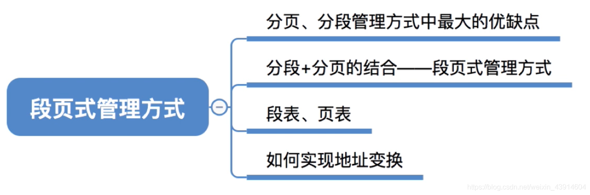
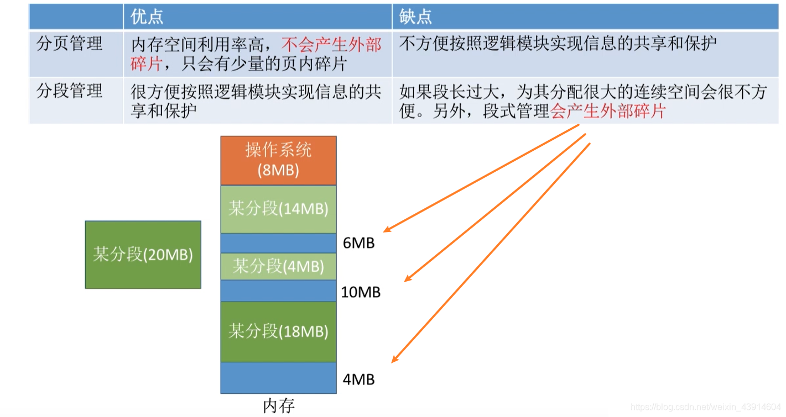
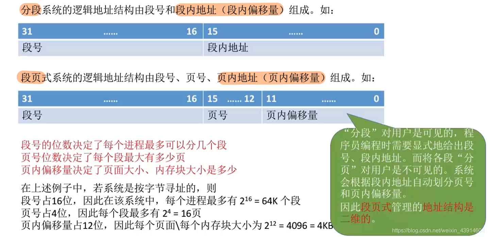
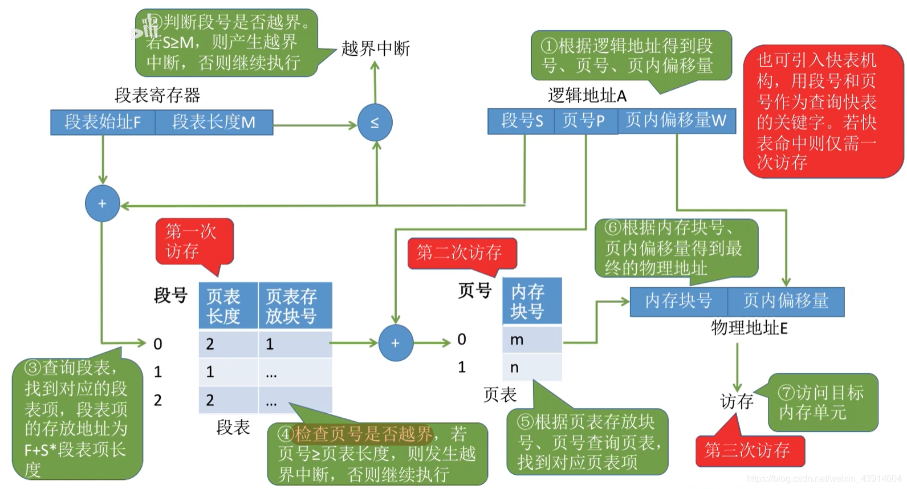

# (200条消息) 3.1.11 OS之段页式存储管理（段表、页表、地址转换、）_BitHachi的博客-CSDN博客

### 文章目录

*   [0.思维导图](#0_2)
*   [1.分页、分段的优缺点分析](#1_6)
*   [2.分段+分页=段页式管理](#2_9)
*   *   [段页式管理的逻辑地址结构](#_11)
    *   [段页式存储的段表、页表](#_13)
*   [3.段页式管理的地址转换过程](#3_15)

* * *

# 0.思维导图

  

# 1.分页、分段的优缺点分析

  

# 2.分段+分页=段页式管理

## 段页式管理的[逻辑地址](https://so.csdn.net/so/search?q=%E9%80%BB%E8%BE%91%E5%9C%B0%E5%9D%80&spm=1001.2101.3001.7020)结构

## 段页式存储的段表、页表

# 3.段页式管理的[地址转换](https://so.csdn.net/so/search?q=%E5%9C%B0%E5%9D%80%E8%BD%AC%E6%8D%A2&spm=1001.2101.3001.7020)过程

参考：《王道操作系统》