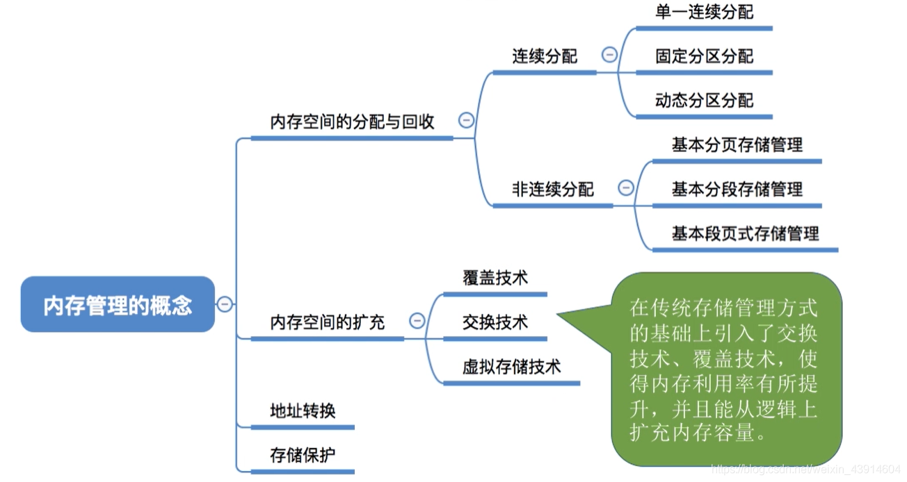
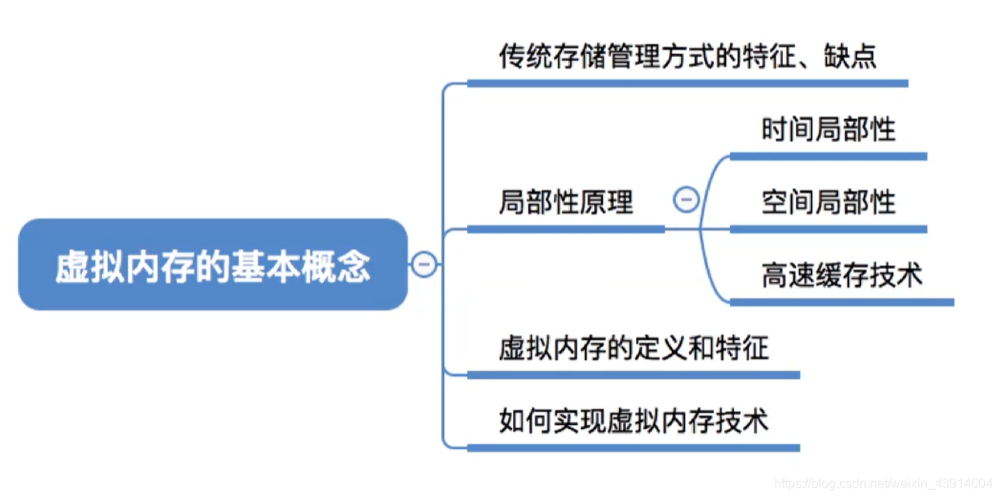
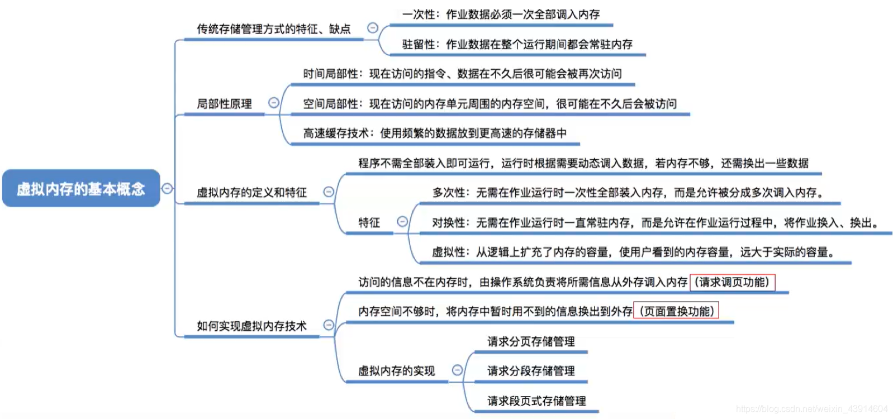
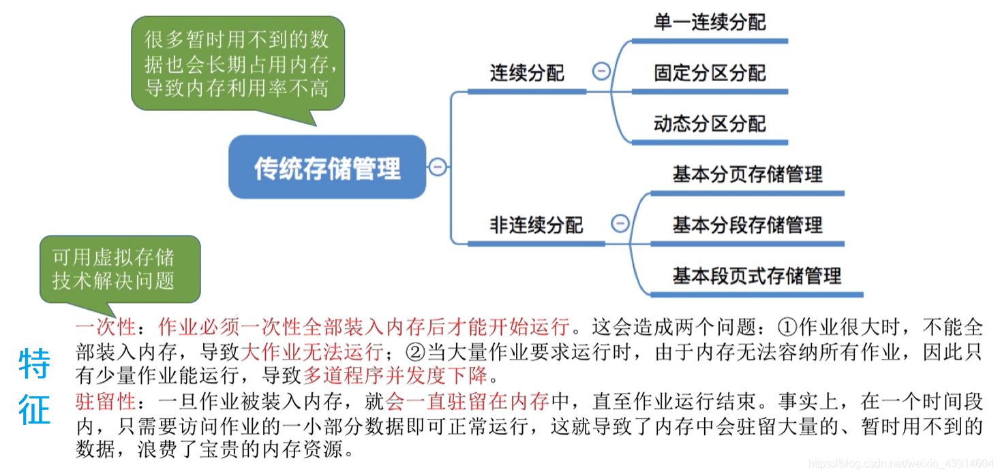

# (200条消息) 3.2.1 OS之虚拟内存的基本概念（局部性原理、高速缓存、虚拟内存的实现）_BitHachi的博客-CSDN博客

### 文章目录

*   [0.思维导图](#0_3)
*   [1.传统存储管理的特征、缺点](#1_8)
*   [2.局部性原理](#2_11)
*   [3.虚拟内存的定义和特征](#3_13)
*   [4.如何实现虚拟内存技术](#4_16)

* * *

# 0.思维导图

  
  

# 1.传统存储管理的特征、缺点

# 2.局部性原理

# 3.[虚拟内存](https://so.csdn.net/so/search?q=%E8%99%9A%E6%8B%9F%E5%86%85%E5%AD%98&spm=1001.2101.3001.7020)的定义和特征

  

# 4.如何实现虚拟内存技术

