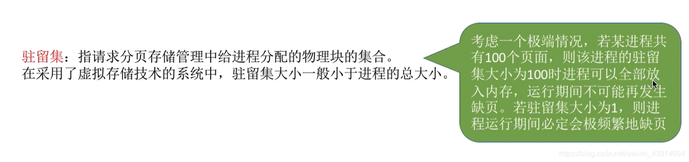
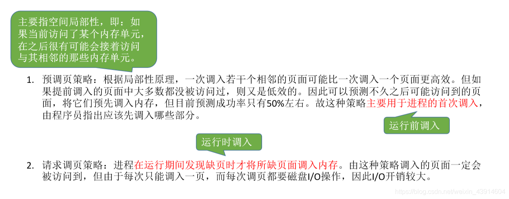
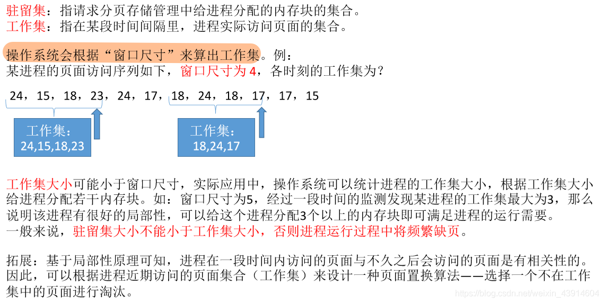

# (200条消息) 3.2.4 OS之页面分配策略（驻留集、页面分配、置换策略、抖动现象、工作集）_BitHachi的博客-CSDN博客

### 文章目录

*   [0.思维导图](#0_2)
*   [1.驻留集](#1_6)
*   [2.页面分配、置换策略](#2_8)
*   *   [固定分配局部置换、可变分配局部置换、可变分配全局置换](#_10)
*   [3.何时调入页面？](#3_14)
*   [4.从何处调页？](#4_16)
*   [5.抖动（颠簸）现象](#5_20)
*   [6.工作集](#6_22)

* * *

# 0.思维导图

# 1.驻留集

# 2.页面分配、置换策略

## 固定分配局部置换、可变分配局部置换、可变分配全局置换

  

# 3.何时调入页面？

# 4.从何处调页？

  
  

# 5.抖动（颠簸）现象

# 6.工作集

