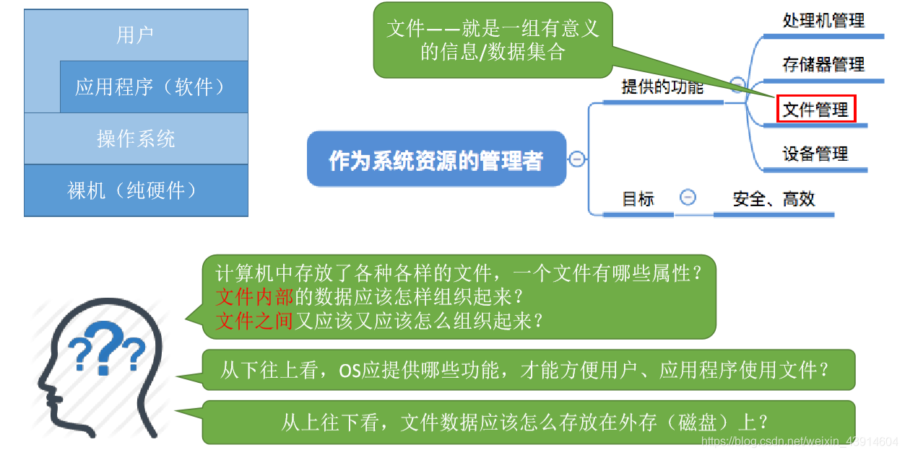
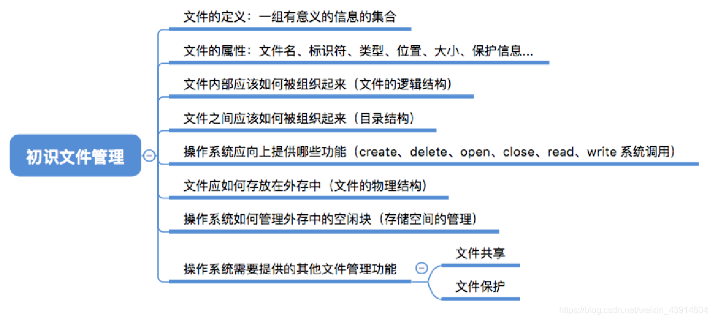
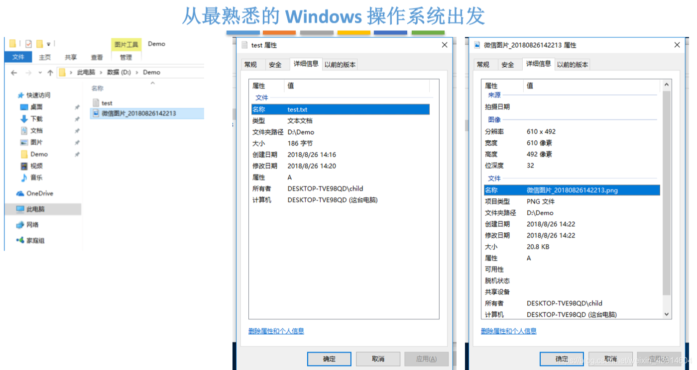
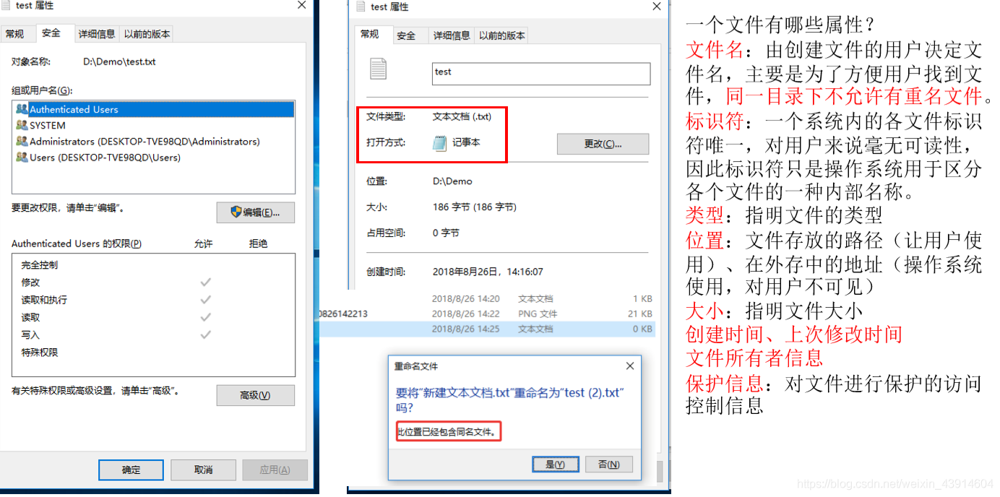
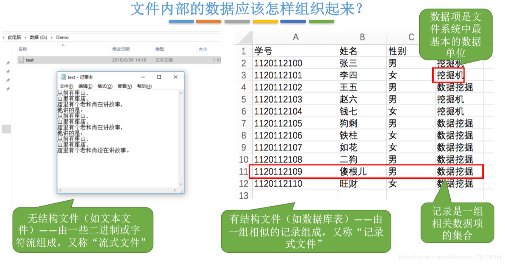
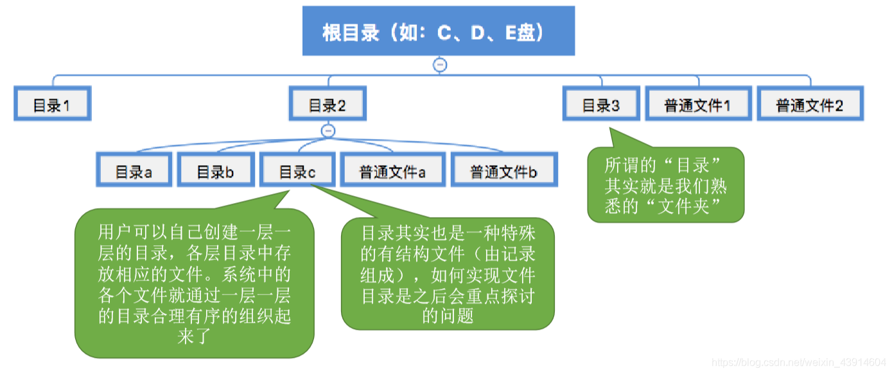
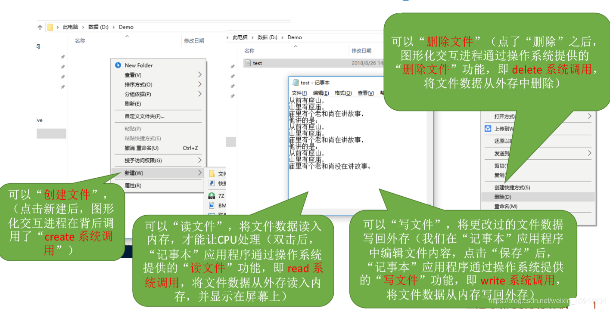
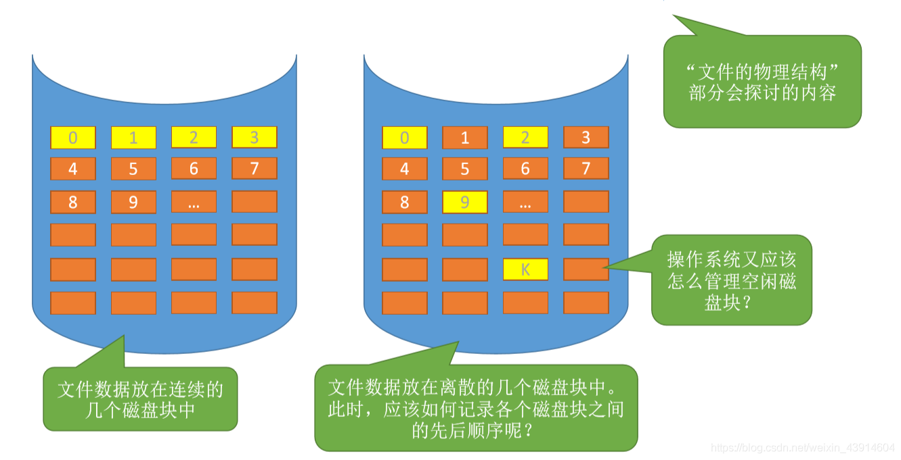

# (201条消息) 4.1.1 OS之初识文件管理概念和功能_BitHachi的博客-CSDN博客

### 文章目录

*   [0.思维导图](#0_3)
*   [1.文件的属性](#1_6)
*   [2.文件内部的数据如何组织起来？](#2_10)
*   [3.文件之间应该如何组织起来？](#3_13)
*   [4.操作系统应该向上提供哪些功能？](#4_15)
*   [5.从上往下看，文件应该如何存放在外存？](#5_18)
*   [6.其他需要由操作系统实现的文件管理功能](#6_22)

* * *

# 0.思维导图

  

# 1.文件的属性

  

# 2.文件内部的数据如何组织起来？

  

# 3.文件之间应该如何组织起来？

# 4.操作系统应该向上提供哪些功能？

  

# 5.从上往下看，文件应该如何存放在外存？

  

# 6.其他需要由操作系统实现的文件管理功能

  
参考：《王道操作系统》