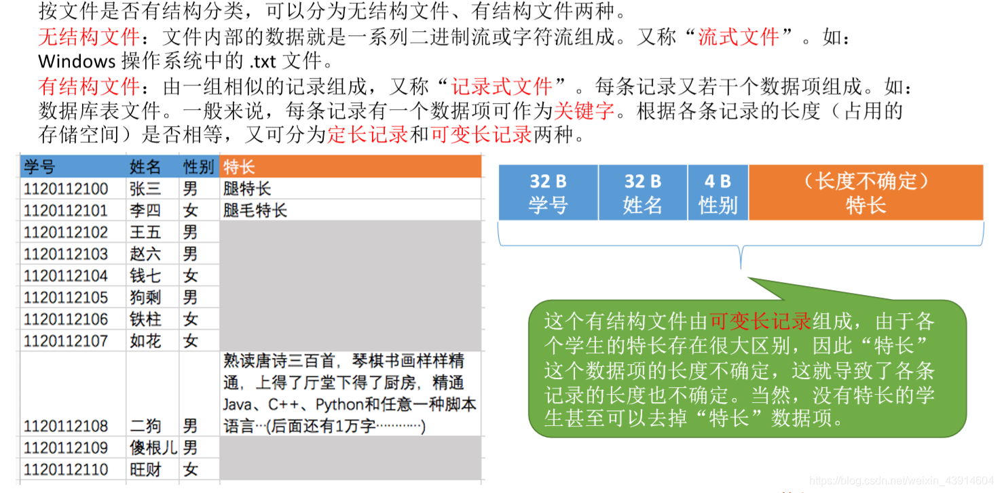
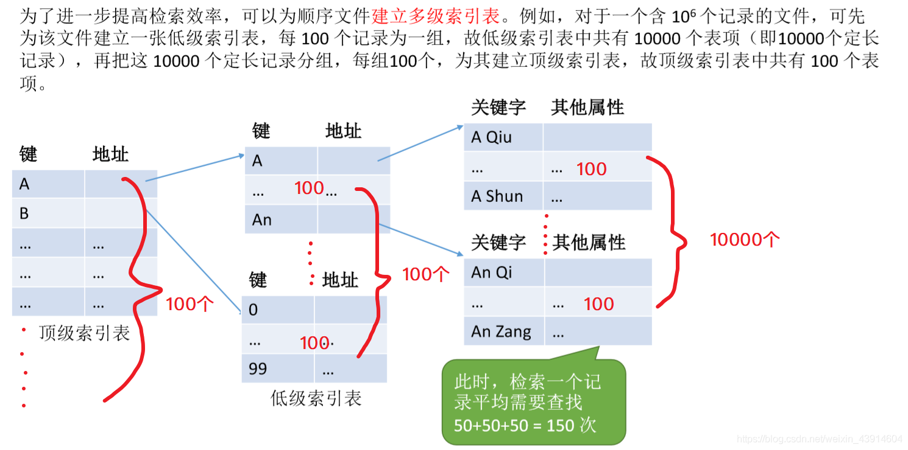

# (201条消息) 4.1.2 OS之文件逻辑结构（顺序文件、索引文件、索引顺序文件、多级索引顺序文件）关于数据库的索引如聚簇索引可以看一下索引文件例题的解析，感觉还是可以收获到东西的_BitHachi的博客-CSDN博客_索引文件和索引顺序文件有什么区别

### 文章目录

*   [0.思维导图](#0_3)
*   [1.无结构文件](#1_6)
*   [2.有结构文件](#2_8)
*   *   [有结构文件的逻辑结构](#_15)
    *   [顺序文件](#_17)
    *   [索引文件](#_20)
    *   [索引顺序文件](#_23)
    *   [多级索引顺序文件](#_27)

* * *

# 0.思维导图

  

# 1.无结构文件

# 2.有结构文件

  
**定长记录：**  
  
**不定长记录：**  

## 有结构文件的逻辑结构

## 顺序文件

  

## 索引文件

*   不经意间让我想起了数据库的索引，聚簇索引和唯一索引等，有了更进一步的理解，而且知道了它的时间空间效率。  
    

## 索引顺序文件

  
**索引顺序文件的效率分析：**  

## 多级索引顺序文件

参考：《王道操作系统》

文章知识点与官方知识档案匹配，可进一步学习相关知识

[MySQL入门技能树](https://edu.csdn.net/skill/mysql/)[首页](https://edu.csdn.net/skill/mysql/)[概览](https://edu.csdn.net/skill/mysql/)24252 人正在系统学习中