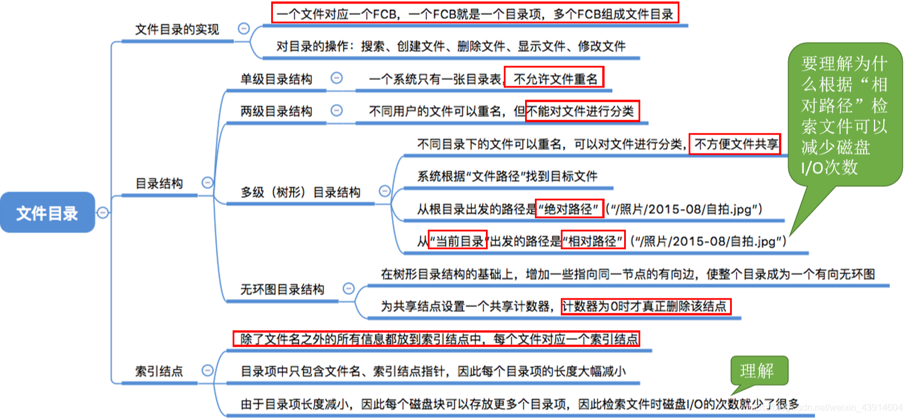
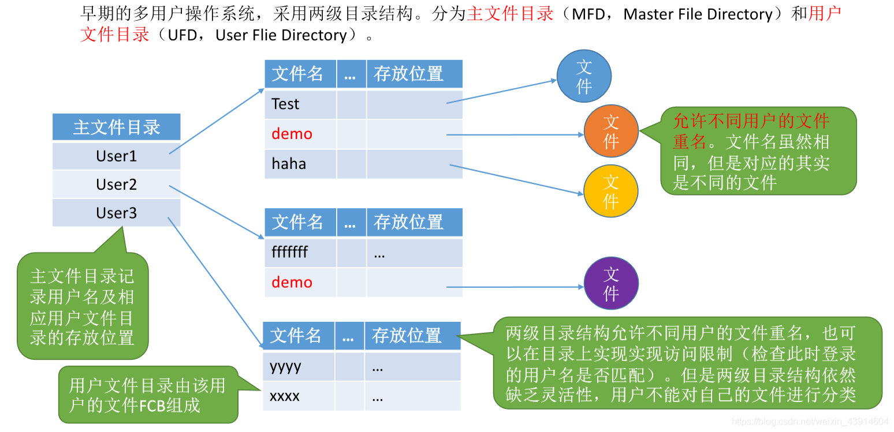
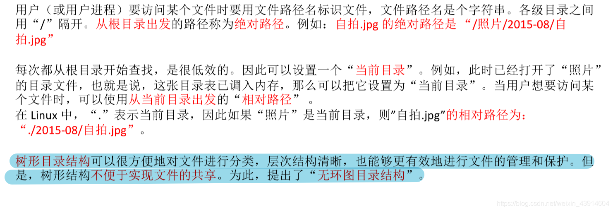

# (201条消息) 4.1.3 OS之文件目录目录结构（单级-两级-多级-无环图）、索引节点FCB瘦身_BitHachi的博客-CSDN博客

### 文章目录

*   [0.思维导图](#0_3)
*   [1.文件控制块](#1_6)
*   *   [对目录的操作](#_9)
*   [2.单级目录结构](#2_11)
*   [3.两级目录结构](#3_14)
*   [4.多级目录结构(树形目录结构)](#4_17)
*   [5.无环图目录结构](#5_24)
*   [6.索引节点(FCB的改进)瘦身](#6FCB_28)

* * *

# 0.思维导图

  

# 1.文件控制块

  

## 对目录的操作

# 2.单级目录结构

# 3.两级目录结构

# 4.多级目录结构(树形目录结构)

  
  
**无环图目录结构解决文件共享**  

# 5.无环图目录结构

  

# 6.索引节点(FCB的改进)瘦身

  
  
参考：《王道操作系统》