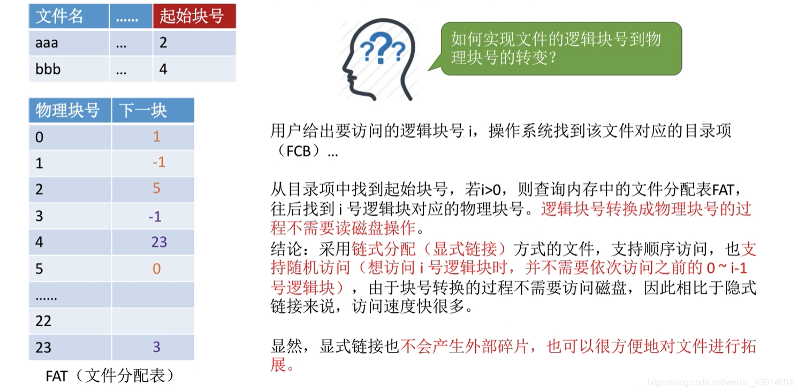
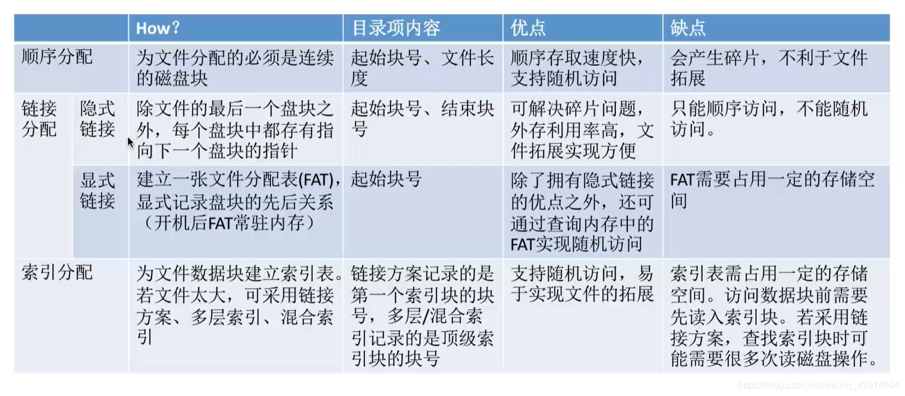

# (201条消息) 4.1.4 OS之文件的物理结构(连续分配、链接分配[隐式-显式]、索引分配[链接方案-多层索引-混合索引])_BitHachi的博客-CSDN博客

### 文章目录

*   [0.思维导图](#0_3)
*   [1.文件块、磁盘块](#1_6)
*   [2.连续分配](#2_9)
*   [3.链接分配](#3_19)
*   *   [隐式链接](#_23)
    *   [显式链接](#_26)
    *   [链接分配总结](#_29)
*   [4.索引分配](#4_32)
*   *   [链接方案](#_38)
    *   [多层索引](#_40)
    *   [混合索引](#_43)
    *   [索引分配总结](#_45)
*   [5.文件物理结构分配总结](#5_48)

* * *

# 0.思维导图

  

# 1.文件块、磁盘块

  

# 2.连续分配

**连续分配优点：**  
  
  
**连续分配缺点：**

  
  

# 3.链接分配

## 隐式链接

  

## 显式链接

  

## 链接分配总结

# 4.[索引](https://so.csdn.net/so/search?q=%E7%B4%A2%E5%BC%95&spm=1001.2101.3001.7020)分配

  
**如何实现逻辑块号到物理块号的转换？**  
  
**数据太大，一个索引表装不下那么多的映射怎么办？**  

## 链接方案

## 多层索引

  

## 混合索引

## 索引分配总结

# 5.文件物理结构分配总结

**参考：《王道操作系统》**