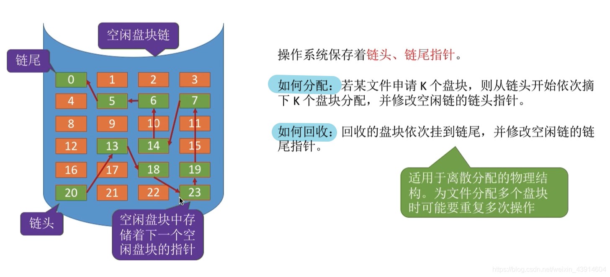

# (201条消息) 4.1.5 OS之文件管理空闲磁盘块的几种算法(空闲表法、空闲链表法、位示图法、成组链接法)_BitHachi的博客-CSDN博客_空闲链表法

### 文章目录

*   [0.思维导图](#0_3)
*   [1.存储空间的划分与初始化](#1_9)
*   [2.空闲表法](#2_11)
*   [3.空闲链表法](#3_19)
*   *   [空闲盘块链](#_21)
    *   [空闲盘区链](#_23)
*   [4.位示图法](#4_26)
*   [5.成组链接法](#5_31)

* * *

# 0.思维导图

  
  

# 1.存储空间的划分与初始化

# 2.空闲表法

**如何分配？**  

  
**如何回收？**  
  

# 3.空闲[链表](https://so.csdn.net/so/search?q=%E9%93%BE%E8%A1%A8&spm=1001.2101.3001.7020)法

## 空闲盘块链

## 空闲盘区链

# 4.[位示图](https://so.csdn.net/so/search?q=%E4%BD%8D%E7%A4%BA%E5%9B%BE&spm=1001.2101.3001.7020)法

  
**如何分配与回收？**

# 5.成组链接法

  
**超级块的作用**  
  
**如何分配？**  
**需要1个空闲磁盘块**  
  
  
**需要100个空心啊磁盘块**  
  
  
**如何回收？**  
  
  
**第二种情况，第一组已满**  
  
  
**参考：《王道操作系统》**

文章知识点与官方知识档案匹配，可进一步学习相关知识

[算法技能树](https://edu.csdn.net/skill/algorithm/)[首页](https://edu.csdn.net/skill/algorithm/)[概览](https://edu.csdn.net/skill/algorithm/)28864 人正在系统学习中