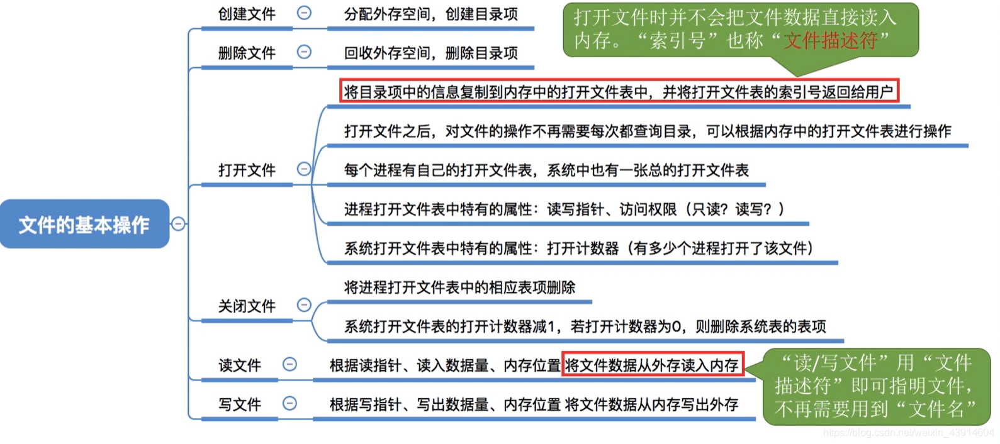
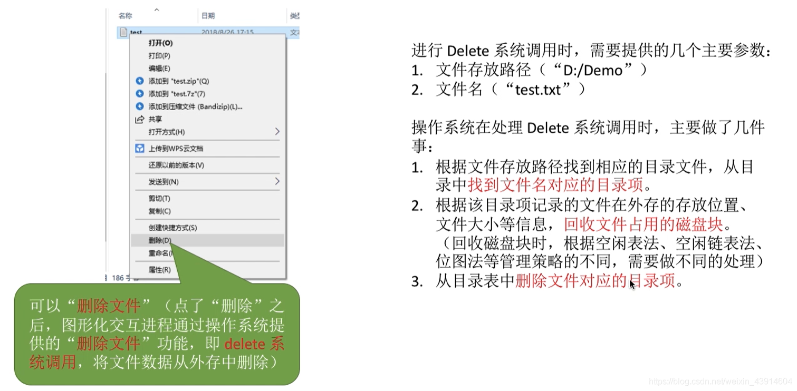
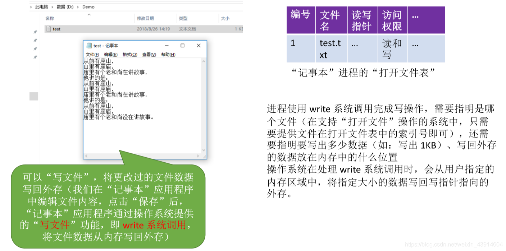

# (201条消息) 4.1.6 OS之文件的基本操作原理(创建、删除、打开、关闭、读-写)_BitHachi的博客-CSDN博客

### 文章目录

*   [0.思维导图](#0_3)
*   [1.创建文件](#1_6)
*   [2.删除文件](#2_8)
*   [3.打开文件](#3_10)
*   [4.关闭文件](#4_15)
*   [5.读文件](#5_17)
*   [6.写文件](#6_20)

* * *

# 0.思维导图

  

# 1.创建文件

# 2.删除文件

# 3.打开文件

  
**打开文件表有两种：**  

# 4.关闭文件

# 5.读文件

# 6.写文件

  
**参考：《王道操作系统》**