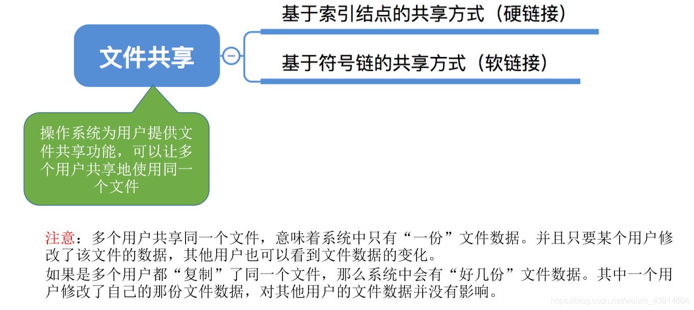
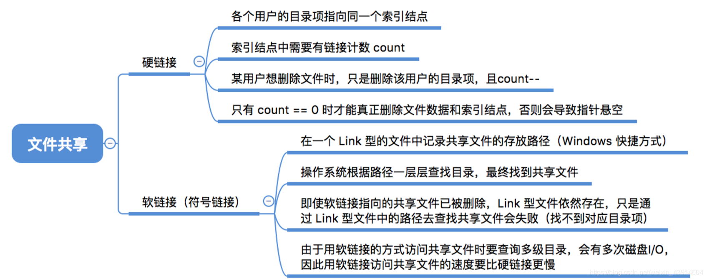
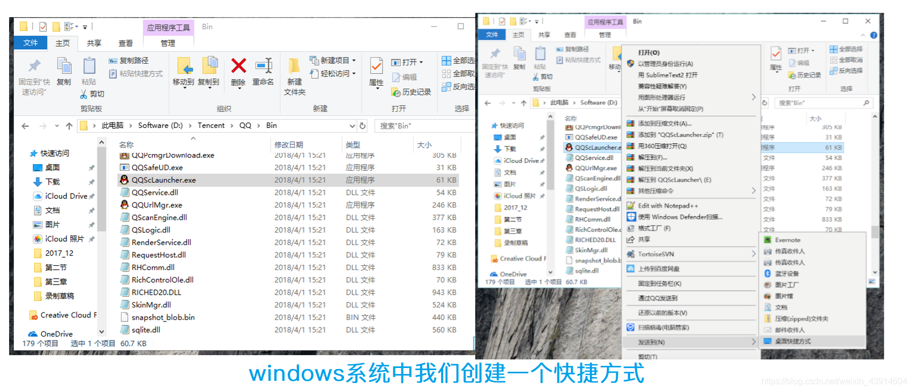
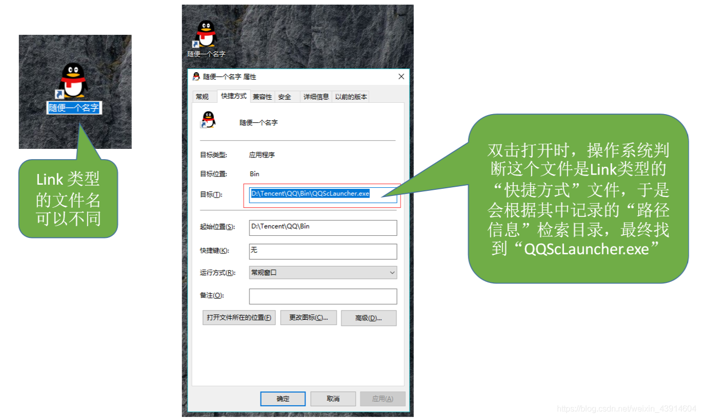
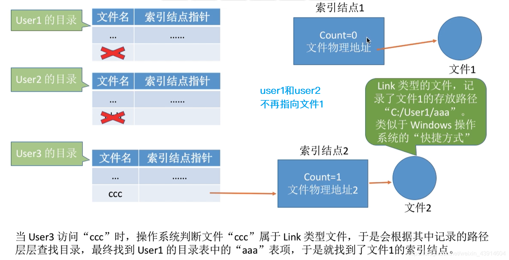
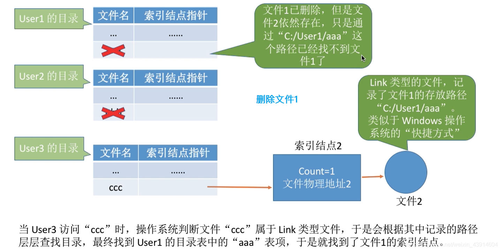
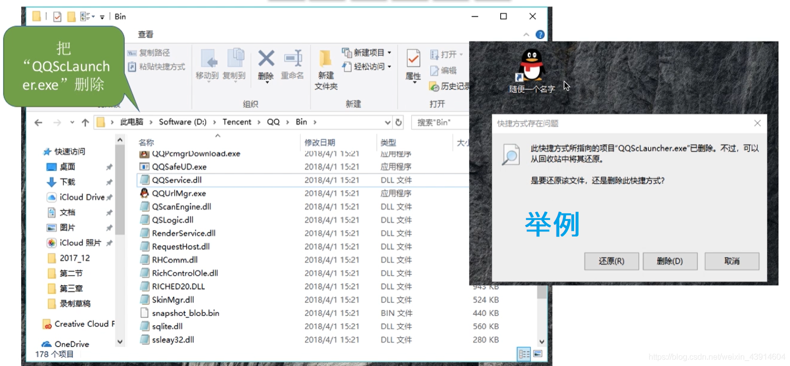

# (201条消息) 4.1.7 OS之文件共享（索引节点-硬链接、符号链接-软链接）_BitHachi的博客-CSDN博客

### 文章目录

*   [0.思维导图](#0_3)
*   [1.基于索引结点的共享方式（硬链接）](#1_6)
*   [2.基于符号链的共享方式（软链接）](#2_9)

* * *

# 0.思维导图

  

# 1.基于索引结点的共享方式（硬链接）

# 2.基于符号链的共享方式（软链接）

  
**例子**  
  

**共享的文件不存在时**  
  
  
  
**参考：《王道操作系统》**