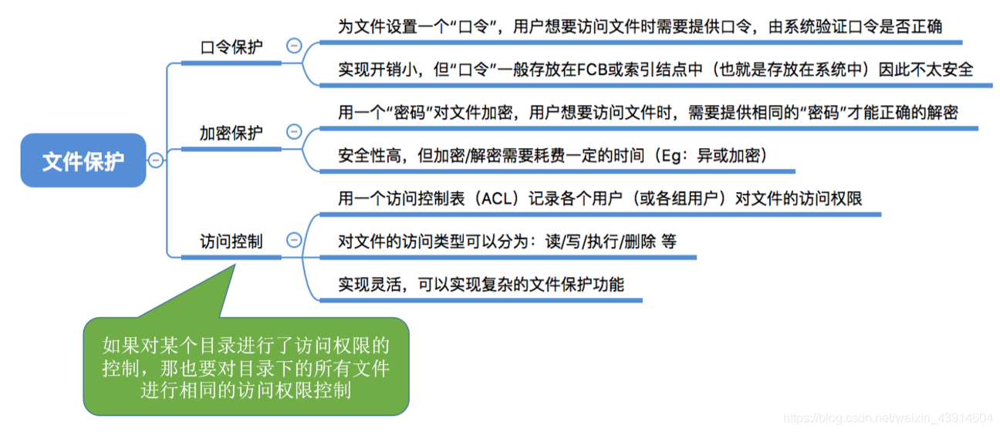
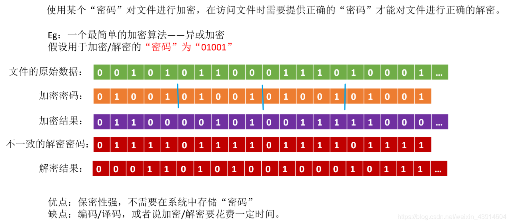
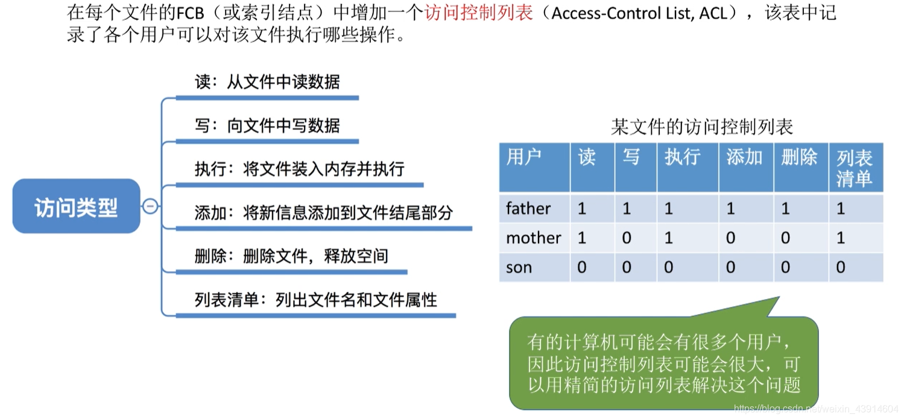
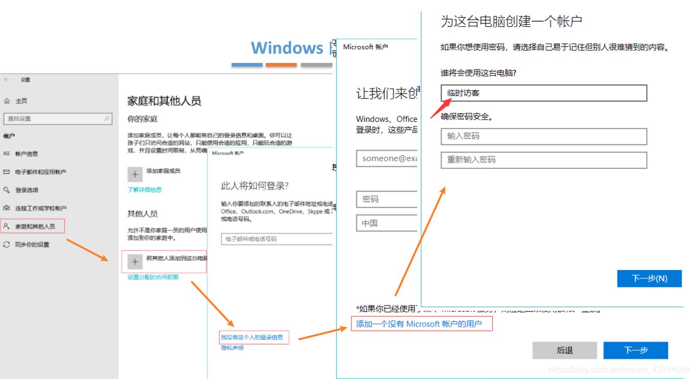
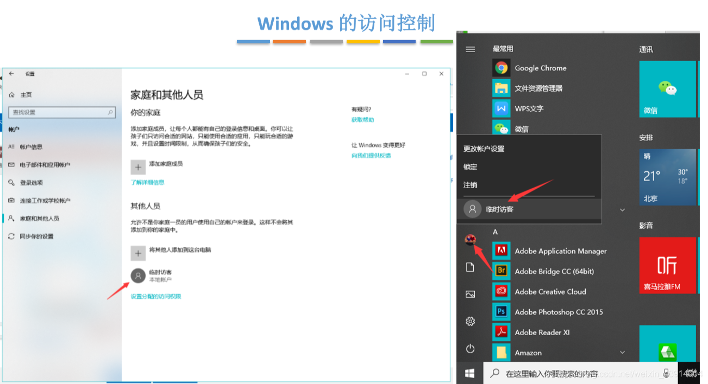
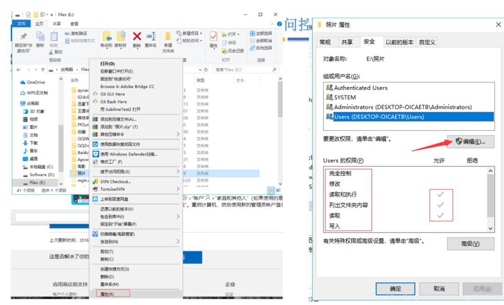
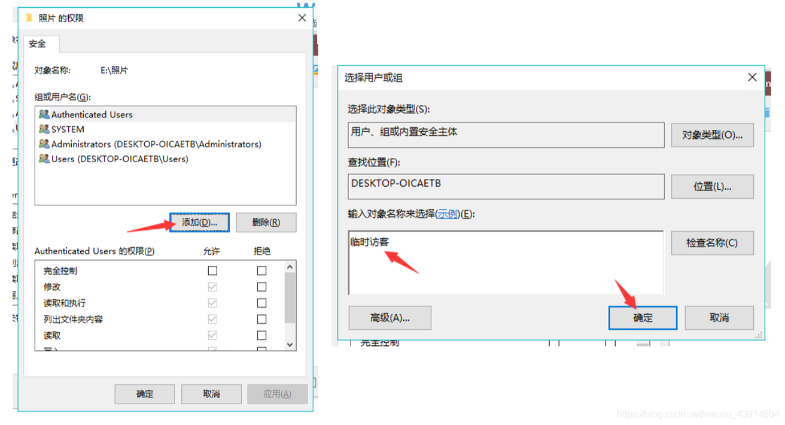
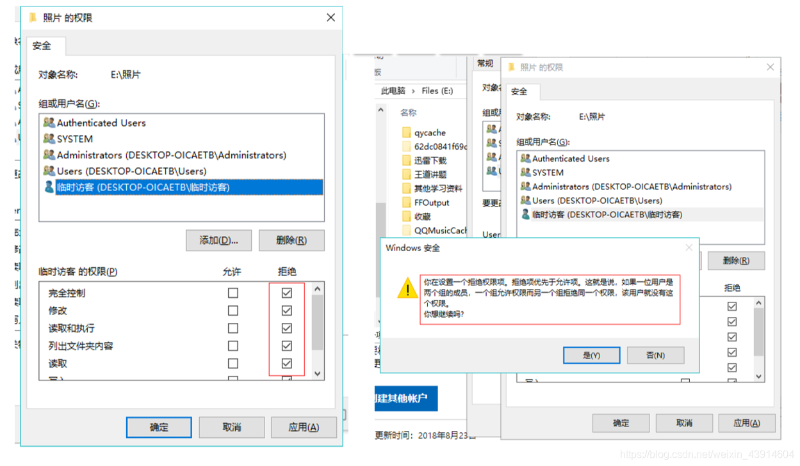

# (201条消息) 4.1.8 OS之文件保护（口令保护、加密保护、访问控制）_BitHachi的博客-CSDN博客

### 文章目录

*   [0.思维导图](#0_3)
*   [1.口令保护](#1_6)
*   [2.加密保护](#2_9)
*   [3.访问控制](#3_11)
*   *   [windows的访问控制](#windows_14)

* * *

# 0.思维导图

# 1.口令保护

# 2.[加密](https://so.csdn.net/so/search?q=%E5%8A%A0%E5%AF%86&spm=1001.2101.3001.7020)保护

# 3.访问控制

  

## windows的访问控制

  
  
  
  
  
**参考：《王道操作系统》**