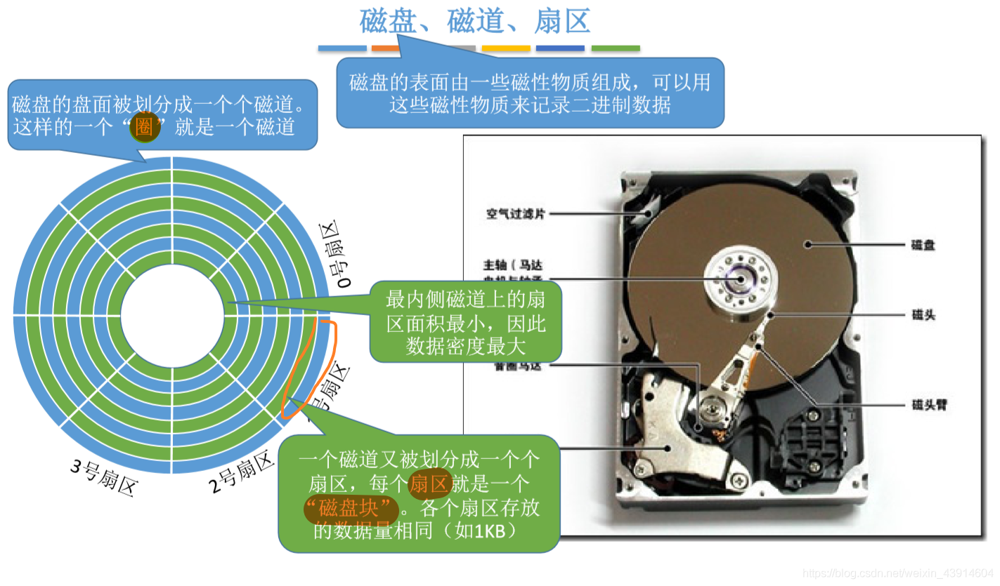
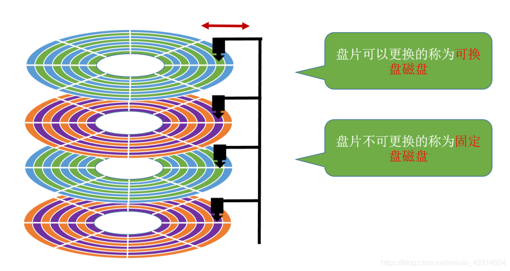

# (201条消息) 4.2.1 OS之磁盘的结构（磁盘、磁道、扇区、盘面、柱面、磁头）_BitHachi的博客-CSDN博客

### 文章目录

*   [0.思维导图](#0_3)
*   [1.磁盘、磁道、扇区](#1_5)
*   [2.如何在磁盘中读/写数据](#2_7)
*   [3.盘面、柱面](#3_9)
*   [4.磁盘的分类](#4_11)
*   *   [按磁头是否可移动分类](#_12)
    *   [按盘片是否可更换分类](#_15)

* * *

# 0.思维导图

# 1.磁盘、磁道、扇区

# 2.如何在磁盘中读/写数据

# 3.盘面、柱面

# 4.磁盘的分类

## 按磁头是否可移动分类

## 按盘片是否可更换分类

  
**参考：《王道操作系统》**