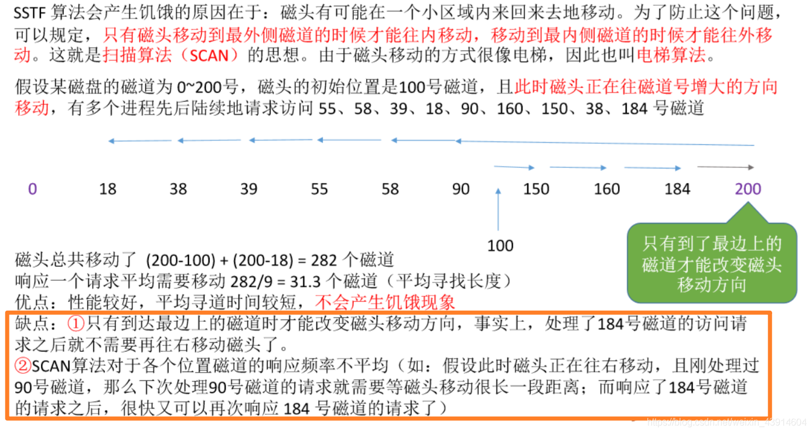
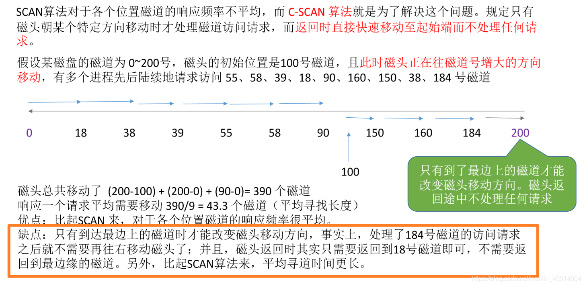
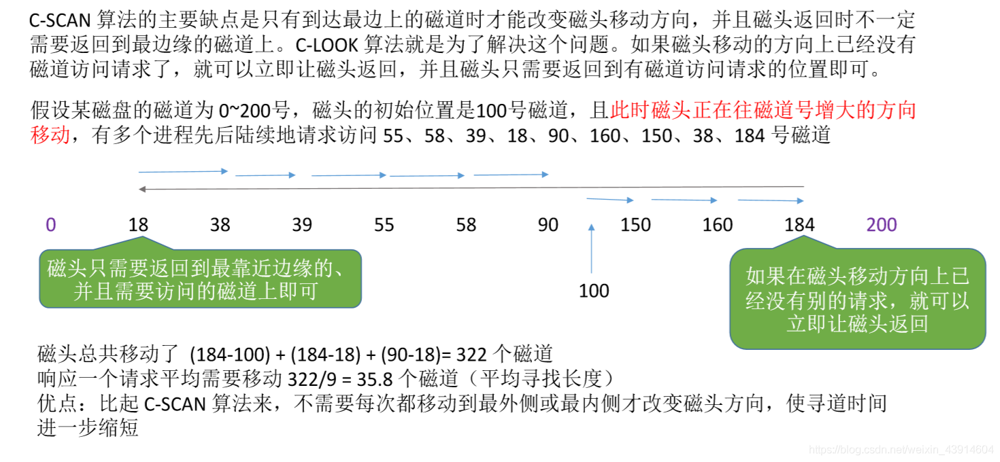

# (201条消息) 4.2.2 OS之磁盘调度算法（FCFS、SSTF、SCAN、LOOK、S-SCAN、C-LOOK）_BitHachi的博客-CSDN博客_look算法

### 文章目录

*   [0.思维导图](#0_3)
*   [1.一次磁盘读/写操作需要的时间](#1_6)
*   [2.先来先服务(FCFS)](#2FCFS_12)
*   [3.最短寻找时间优先算法（SSTF）](#3SSTF_16)
*   [4.扫描算法（SCAN）](#4SCAN_19)
*   [5.LOOK算法](#5LOOK_21)
*   [6.循环扫描算法（S-SCAN）](#6SSCAN_23)
*   [7.C-LOOK算法](#7CLOOK_25)

* * *

# 0.思维导图

  

# 1.一次磁盘读/写操作需要的时间

  

# 2.先来先服务(FCFS)

# 3.最短寻找时间优先算法（SSTF）

# 4.扫描算法（SCAN）

# 5.LOOK算法

# 6.循环扫描算法（S-SCAN）

# 7.C-LOOK算法

  
**参考：《王道操作系统》**

文章知识点与官方知识档案匹配，可进一步学习相关知识

[算法技能树](https://edu.csdn.net/skill/algorithm/)[首页](https://edu.csdn.net/skill/algorithm/)[概览](https://edu.csdn.net/skill/algorithm/)28854 人正在系统学习中