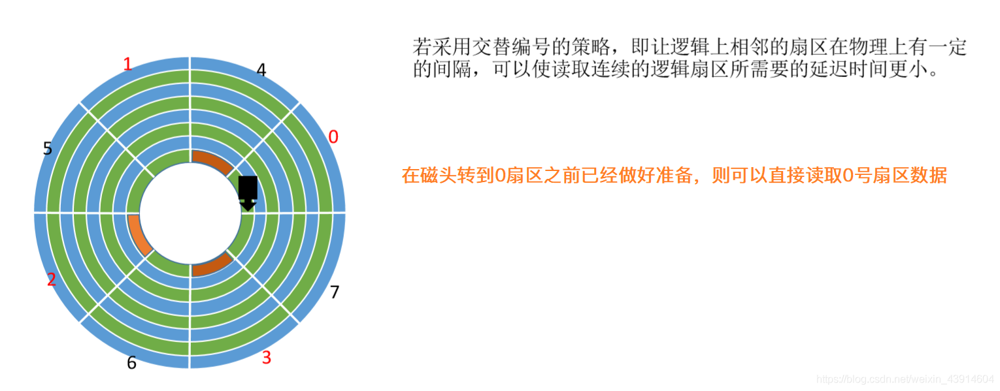
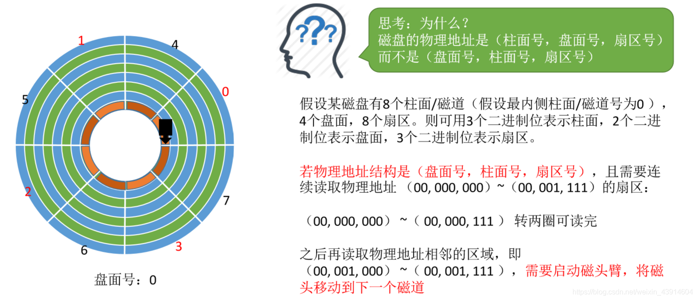
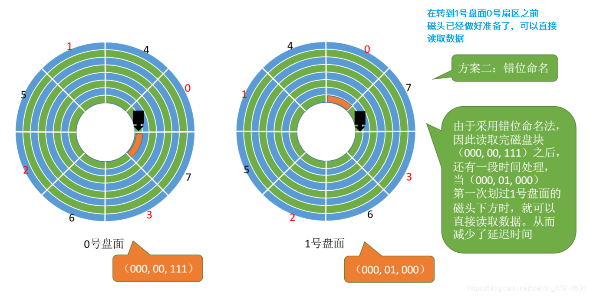

# (201条消息) 4.2.3 OS之减少磁盘延迟时间的方法（交替编号、错位命名）_BitHachi的博客-CSDN博客

### 文章目录

*   [0.思维导图](#0_2)
*   [1.前情回顾](#1_4)
*   [2.交替编号](#2_6)
*   [3.磁盘地址结构的设计](#3_8)
*   [4.错位命名](#4_12)

# 0.思维导图

# 1.前情回顾

# 2.交替编号

# 3.磁盘地址结构的设计

  
  

# 4.错位命名

  

**参考：《王道操作系统》**