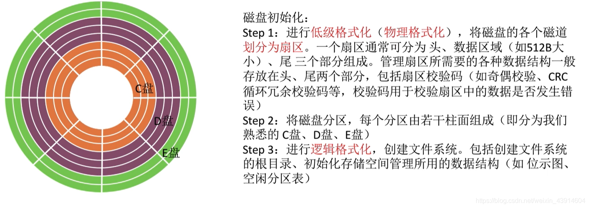

# (201条消息) 4.2.4 OS之磁盘管理（磁盘初始化、引导块、坏块的管理）_BitHachi的博客-CSDN博客

### 文章目录

*   [0.思维导图](#0_3)
*   [1.磁盘初始化](#1_6)
*   [2.引导块](#2_9)
*   [3.坏块的管理](#3_12)

* * *

# 0.思维导图

# 1.磁盘初始化

# 2.引导块

  

# 3.坏块的管理

**参考:《王道操作系统》**