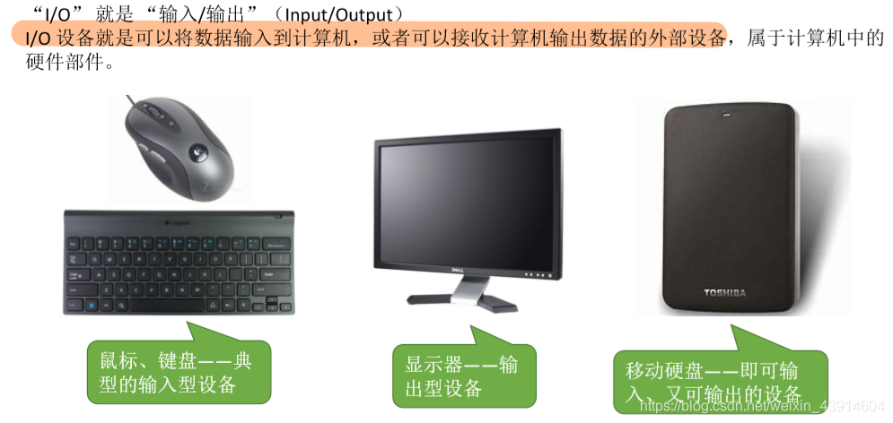
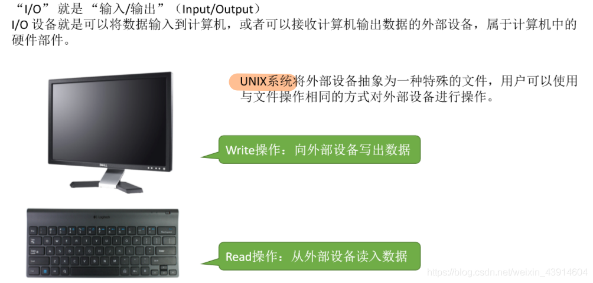

# (201条消息) 5.1.1 什么是I/O设备？有几类I/O设备？_BitHachi的博客-CSDN博客

### 文章目录

*   [0.思维导图](#0_3)
*   [1.什么是I/O设备？](#1IO_5)
*   [2.I/O设备的分类](#2IO_10)
*   *   [（1）按使用特性分类](#1_11)
    *   [（2）按传输速率分类](#2_14)
    *   [（3）按信息交换单位分类](#3_16)

* * *

# 0.思维导图

# 1.什么是I/O设备？

# 2.I/O设备的分类

## （1）按使用特性分类

## （2）按传输速率分类

## （3）按信息交换单位分类

  
参考：《王道操作系统》