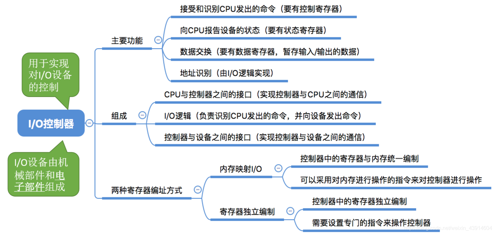
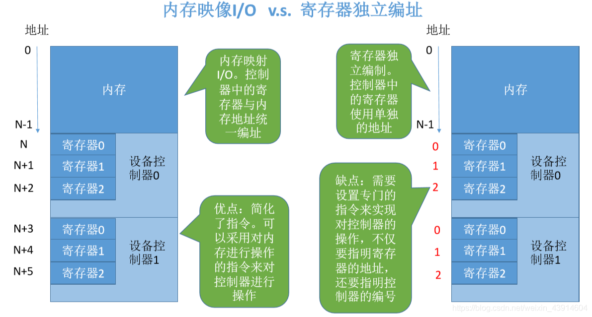

# (201条消息) 5.1.2 操作系统控制I/O设备的I/O控制器_BitHachi的博客-CSDN博客

### 文章目录

*   [0.思维导图](#0_1)
*   [1.I/O设备的组成](#1IO_4)
*   *   [（1）机械部件](#1_7)
    *   [（2）电子部件---I/O控制器的功能](#2IO_9)
*   [2.I/O控制器的组成](#2IO_12)
*   [3.I/O控制器的两种寄存器编址方式](#3IO_16)
*   *   [内存映像---独立编址](#_17)

# 0.思维导图

# 1.I/O设备的组成

## （1）机械部件

## （2）电子部件—I/O控制器的功能

# 2.I/O控制器的组成

  
**注意：**  

# 3.I/O控制器的两种[寄存器](https://so.csdn.net/so/search?q=%E5%AF%84%E5%AD%98%E5%99%A8&spm=1001.2101.3001.7020)编址方式

## [内存](https://so.csdn.net/so/search?q=%E5%86%85%E5%AD%98&spm=1001.2101.3001.7020)映像—独立编址

  
参考《王道操作系统》