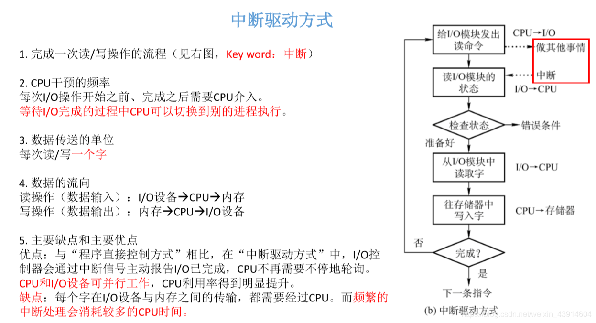

# (201条消息) 5.1.3 OS控制I/O设备的几种方式？(程序直接控制方式、中断驱动方式、DMA、通道控制)_BitHachi的博客-CSDN博客

### 文章目录

*   [0.思维导图](#0_3)
*   [1.程序直接控制方式](#1_5)
*   [2.中断驱动方式](#2_13)
*   [3.DMA方式](#3DMA_21)
*   [4.通道控制方式](#4_31)
*   [5.四种方式总结一下](#5_37)

* * *

# 0.思维导图

# 1.程序直接控制方式

**key word : 轮询**

*   完成一次读/写操作的流程图(以读操作为例)  
      
    **下面以C语言代码和流程图来剖析，程序直接控制方式**  
      
    **分析一下在思维导图中提到的几个问题：**  
    

# 2.[中断](https://so.csdn.net/so/search?q=%E4%B8%AD%E6%96%AD&spm=1001.2101.3001.7020)驱动方式

*   由于`程序直接控制方式`CPU利用率低，忙等，所以提出了中断驱动方式。

  
**分析一下在思维导图中提到的几个问题：**

# 3.[DMA](https://so.csdn.net/so/search?q=DMA&spm=1001.2101.3001.7020)方式

*   虽然`中断驱动方式解决了程序直接控制方式`的问题，但是每一次只能读/写一个字，导致CPU频繁切换，耗费了很多时间。于是人们又发明了DMA方式。

  
**DMA控制器：**  
  
**分析一下在思维导图中提到的几个问题：**  

# 4.[通道](https://so.csdn.net/so/search?q=%E9%80%9A%E9%81%93&spm=1001.2101.3001.7020)控制方式

*   通道控制方式是为了解决DMA方式连续存储的问题

  
**分析一下在思维导图中提到的几个问题：**  

# 5.四种方式总结一下

  
参考：《王道操作系统》